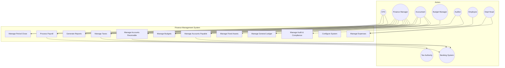
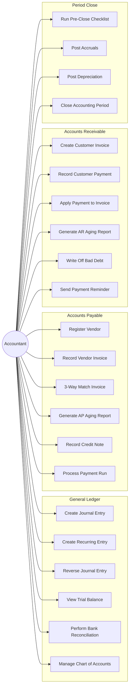
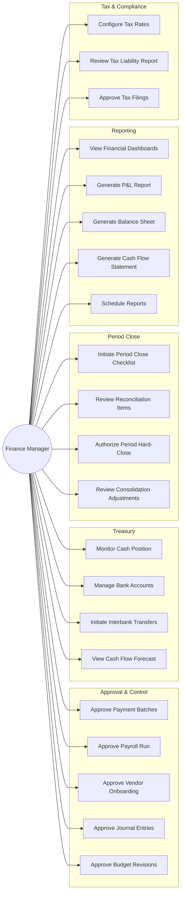
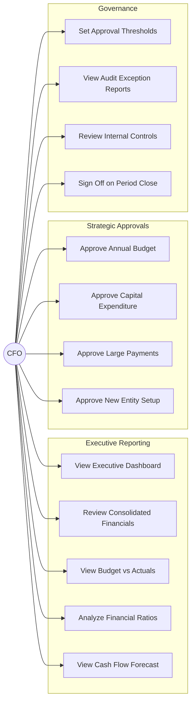
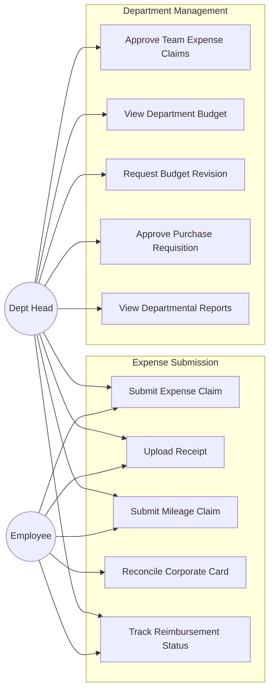
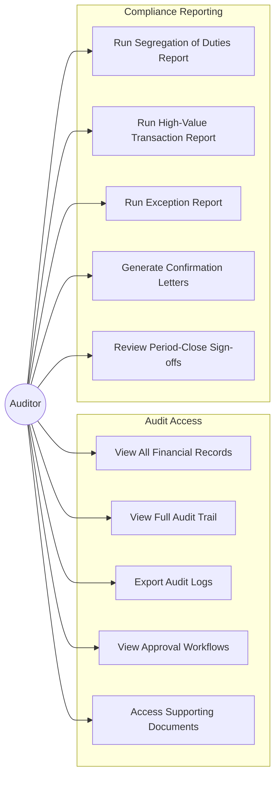
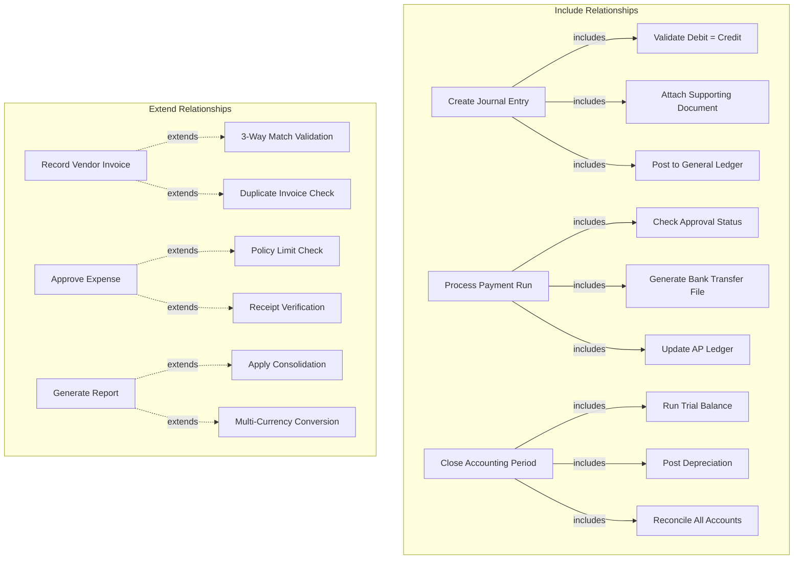

# Use Case Diagram

## Overview
This document contains use case diagrams for all major actors in the Finance Management System.

---

## Complete System Use Case Diagram

---

## Accountant Use Cases

---

## Finance Manager Use Cases

---

## CFO Use Cases

---

## Employee & Department Head Use Cases

---

## Auditor Use Cases

---

## Use Case Relationships

