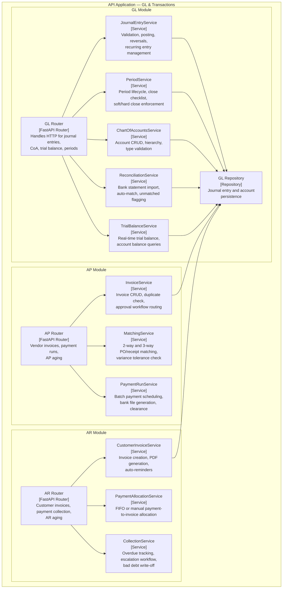
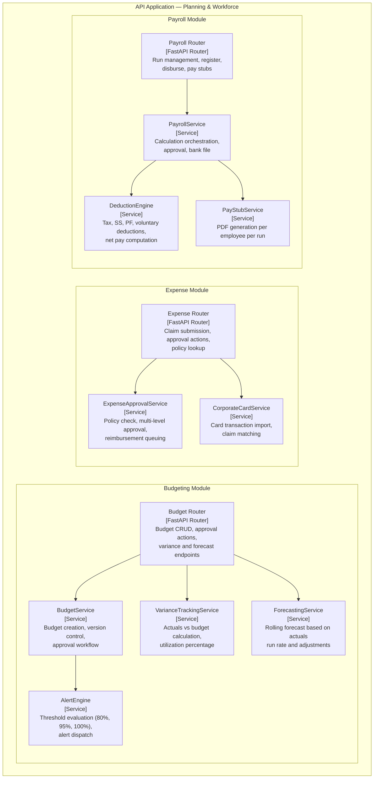
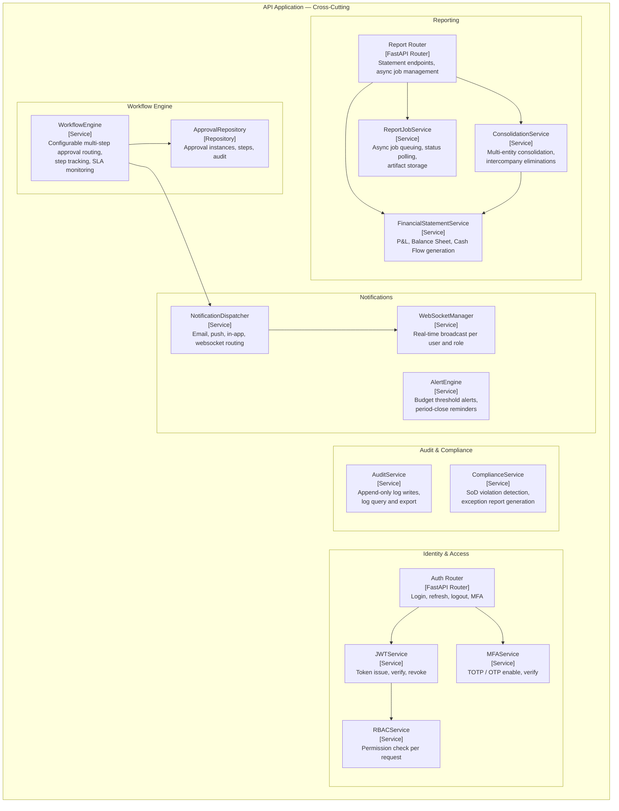

# C4 Component Diagram

## Overview
C4 Level 3 component diagrams showing the internal structure of the Finance Management System's major containers.

---

## GL and Transaction Processing Components

---

## Planning and Workforce Components

---

## Cross-Cutting Infrastructure Components

