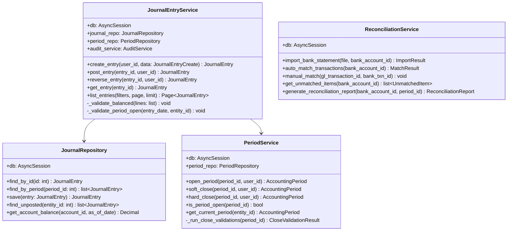
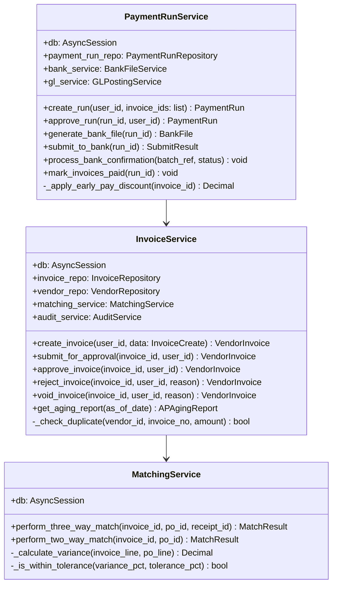
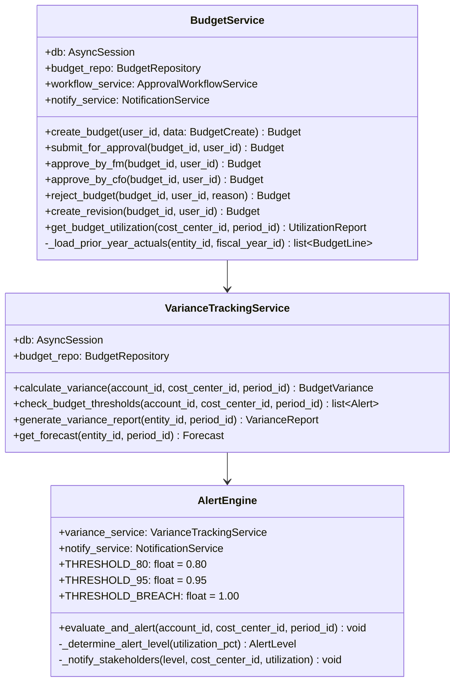
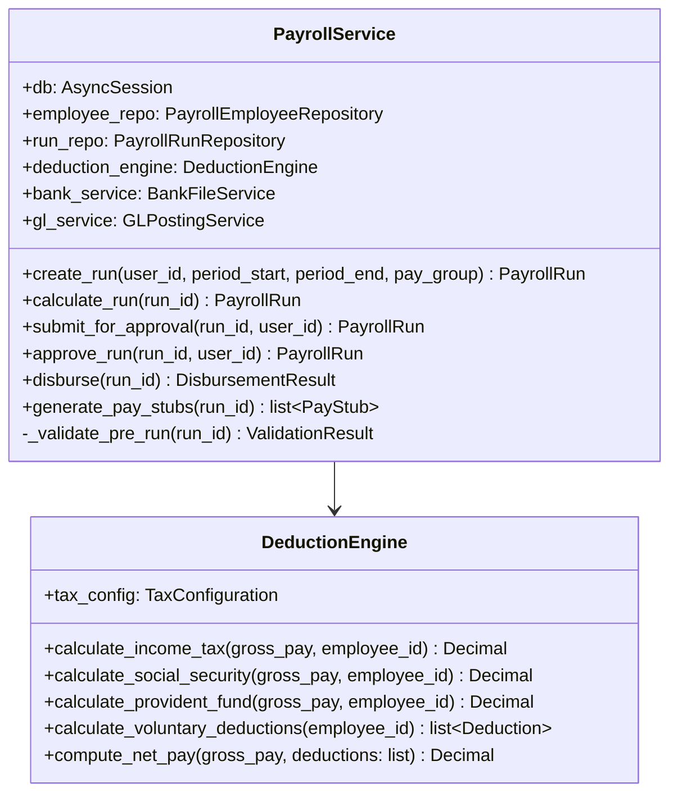
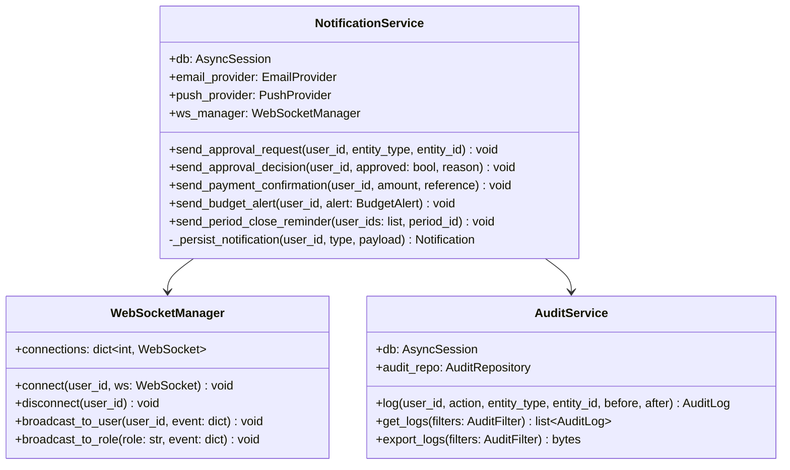

# Class Diagrams

## Overview
Detailed class structures with attributes and methods for the core Finance Management System domain.

---

## General Ledger Classes

---

## Accounts Payable Classes

---

## Budgeting Classes

---

## Payroll Classes

---

## Notification and Audit Classes

