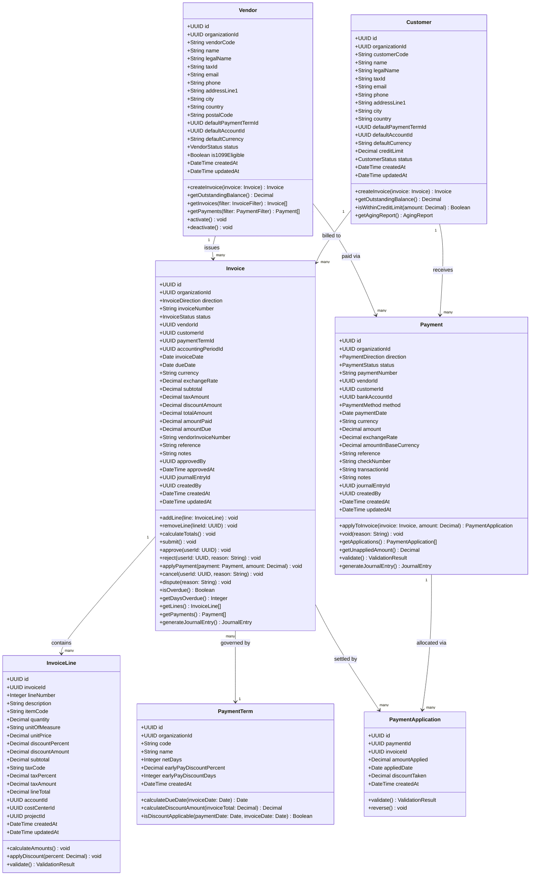
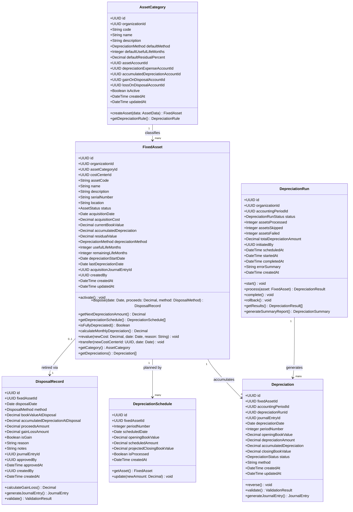

# Class Diagrams

## Overview

Detailed UML class diagrams for the Finance Management System domain aggregates. Each diagram covers a specific bounded context within the finance domain, showing all entity attributes (with types and access modifiers) and method signatures (with return types and parameters). Diagrams are organised by aggregate root.

---

## 1. Journal / Ledger Aggregate

The general ledger aggregate is the system of record for all financial activity. It models the fiscal structure, chart of accounts, and double-entry journal entries that underpin all financial reporting and period-end processes.

```mermaid
classDiagram
    direction TB

    class Organization {
        +UUID id
        +String name
        +String legalName
        +String taxId
        +String baseCurrency
        +String country
        +OrganizationStatus status
        +DateTime createdAt
        +DateTime updatedAt
        +createFiscalYear(name: String, start: Date, end: Date) FiscalYear
        +getActiveFiscalYear() FiscalYear
        +getChartOfAccounts() ChartOfAccounts
        +validateBaseCurrency(code: String) Boolean
    }

    class FiscalYear {
        +UUID id
        +UUID organizationId
        +String name
        +Date startDate
        +Date endDate
        +FiscalYearStatus status
        +UUID closedBy
        +DateTime closedAt
        +DateTime createdAt
        +DateTime updatedAt
        +openPeriod(periodNumber: Integer) AccountingPeriod
        +close(userId: UUID) void
        +isOpen() Boolean
        +getPeriods() AccountingPeriod[]
        +getCurrentPeriod() AccountingPeriod
        +getNetIncome() Decimal
    }

    class AccountingPeriod {
        +UUID id
        +UUID fiscalYearId
        +UUID organizationId
        +Integer periodNumber
        +String name
        +Date startDate
        +Date endDate
        +PeriodStatus status
        +UUID softClosedBy
        +DateTime softClosedAt
        +UUID hardClosedBy
        +DateTime hardClosedAt
        +DateTime createdAt
        +DateTime updatedAt
        +open() void
        +softClose(userId: UUID) void
        +hardClose(userId: UUID) void
        +reopen(userId: UUID, reason: String) void
        +isPostable() Boolean
        +isSoftClosed() Boolean
        +isHardClosed() Boolean
        +getJournalEntries() JournalEntry[]
    }

    class ChartOfAccounts {
        +UUID id
        +UUID organizationId
        +String name
        +String description
        +Boolean isDefault
        +DateTime createdAt
        +DateTime updatedAt
        +addAccount(account: Account) Account
        +findByCode(code: String) Account
        +getAccountTree() AccountNode[]
        +getAccountsByType(type: AccountType) Account[]
        +validateStructure() ValidationResult
        +importAccounts(accounts: Account[]) ImportResult
    }

    class Account {
        +UUID id
        +UUID chartOfAccountsId
        +UUID organizationId
        +UUID parentAccountId
        +String code
        +String name
        +String description
        +AccountType type
        +AccountSubType subType
        +NormalBalance normalBalance
        +String currency
        +Boolean isSummary
        +Boolean allowDirectPosting
        +Boolean isActive
        +Boolean isSystemAccount
        +Integer level
        +DateTime createdAt
        +DateTime updatedAt
        +getBalance(asOf: Date) Decimal
        +getBalanceForPeriod(period: AccountingPeriod) Decimal
        +getChildren() Account[]
        +hasChildren() Boolean
        +validate() ValidationResult
        +deactivate() void
    }

    class JournalEntry {
        +UUID id
        +UUID organizationId
        +UUID fiscalYearId
        +UUID accountingPeriodId
        +String entryNumber
        +JournalEntryType type
        +JournalEntryStatus status
        +Date transactionDate
        +String reference
        +String description
        +String sourceName
        +UUID sourceId
        +String currency
        +Decimal exchangeRate
        +UUID createdBy
        +UUID approvedBy
        +DateTime approvedAt
        +UUID postedBy
        +DateTime postedAt
        +UUID reversedBy
        +DateTime reversedAt
        +UUID reversalOf
        +String rejectionReason
        +DateTime createdAt
        +DateTime updatedAt
        +addLine(line: JournalLine) void
        +removeLine(lineId: UUID) void
        +validate() ValidationResult
        +isBalanced() Boolean
        +getTotalDebits() Decimal
        +getTotalCredits() Decimal
        +submit() void
        +approve(userId: UUID) void
        +reject(userId: UUID, reason: String) void
        +post(userId: UUID) void
        +reverse(userId: UUID, date: Date, reason: String) JournalEntry
        +getLines() JournalLine[]
        +clone() JournalEntry
        +generateEntryNumber() String
    }

    class JournalLine {
        +UUID id
        +UUID journalEntryId
        +UUID accountId
        +UUID costCenterId
        +UUID projectId
        +Integer lineNumber
        +String description
        +DebitCredit debitCredit
        +Decimal amount
        +String currency
        +Decimal exchangeRate
        +Decimal amountInBaseCurrency
        +String taxCode
        +Decimal taxAmount
        +String reference
        +DateTime createdAt
        +DateTime updatedAt
        +getAccount() Account
        +getCostCenter() CostCenter
        +getProject() Project
        +isDebit() Boolean
        +isCredit() Boolean
        +validate() ValidationResult
        +toBaseCurrency() Decimal
    }

    class LedgerBalance {
        +UUID id
        +UUID organizationId
        +UUID accountId
        +UUID accountingPeriodId
        +UUID fiscalYearId
        +Decimal openingBalance
        +Decimal totalDebits
        +Decimal totalCredits
        +Decimal closingBalance
        +String currency
        +DateTime lastUpdatedAt
        +DateTime createdAt
        +addDebit(amount: Decimal) void
        +addCredit(amount: Decimal) void
        +recalculate() void
        +getNetMovement() Decimal
        +getAccount() Account
        +getPeriod() AccountingPeriod
        +lock() void
    }

    Organization "1" --> "many" FiscalYear : owns
    FiscalYear "1" --> "many" AccountingPeriod : partitioned into
    Organization "1" --> "1" ChartOfAccounts : maintains
    ChartOfAccounts "1" --> "many" Account : defines
    Account "0..1" --> "many" Account : parent of
    AccountingPeriod "1" --> "many" JournalEntry : contains
    JournalEntry "1" --> "2..*" JournalLine : comprises
    JournalLine "many" --> "1" Account : debits or credits
    AccountingPeriod "1" --> "many" LedgerBalance : accumulates
    Account "1" --> "many" LedgerBalance : tracked by
```

---

## 2. AP / AR Aggregate

The AP/AR aggregate manages vendor payables, customer receivables, invoice processing, and payment application. It generates journal entries that are posted to the general ledger.

---

## 3. Budget Aggregate

The budget aggregate manages financial planning, cost centre allocations, and budget-vs-actual variance tracking across fiscal periods.

```mermaid
classDiagram
    direction TB

    class CostCenter {
        +UUID id
        +UUID organizationId
        +String code
        +String name
        +String description
        +UUID parentCostCenterId
        +UUID managerId
        +CostCenterType type
        +Boolean isActive
        +DateTime createdAt
        +DateTime updatedAt
        +getChildren() CostCenter[]
        +getBudget(fiscalYearId: UUID) Budget
        +getActualSpend(periodId: UUID) Decimal
        +getVariance(periodId: UUID) Decimal
        +getHierarchyPath() String
    }

    class Project {
        +UUID id
        +UUID organizationId
        +UUID costCenterId
        +String projectCode
        +String name
        +String description
        +ProjectStatus status
        +UUID managerId
        +Date startDate
        +Date endDate
        +Decimal approvedBudget
        +Decimal spentToDate
        +DateTime createdAt
        +DateTime updatedAt
        +getBudgetUtilization() Decimal
        +isOverBudget() Boolean
        +close() void
        +activate() void
    }

    class Budget {
        +UUID id
        +UUID organizationId
        +UUID fiscalYearId
        +UUID costCenterId
        +UUID projectId
        +String budgetCode
        +String name
        +BudgetType type
        +BudgetStatus status
        +String currency
        +Decimal totalAmount
        +Decimal totalActual
        +Decimal totalVariance
        +Integer version
        +UUID submittedBy
        +DateTime submittedAt
        +UUID approvedBy
        +DateTime approvedAt
        +String approvalNotes
        +UUID createdBy
        +DateTime createdAt
        +DateTime updatedAt
        +addLine(line: BudgetLine) void
        +removeLine(lineId: UUID) void
        +recalculateTotal() void
        +submit(userId: UUID) void
        +approve(userId: UUID, notes: String) void
        +reject(userId: UUID, reason: String) void
        +requestRevision(userId: UUID, reason: String) void
        +activate() void
        +close() void
        +getLines() BudgetLine[]
        +getRevisions() BudgetRevision[]
        +getActualVsBudget() BudgetVarianceReport
        +checkOverrun(accountId: UUID, amount: Decimal) OverrunResult
        +createRevision(reason: String) BudgetRevision
    }

    class BudgetLine {
        +UUID id
        +UUID budgetId
        +UUID accountId
        +UUID costCenterId
        +UUID projectId
        +Integer periodNumber
        +String description
        +String category
        +Decimal budgetedAmount
        +Decimal actualAmount
        +Decimal committedAmount
        +Decimal variance
        +Decimal variancePercent
        +String currency
        +DateTime createdAt
        +DateTime updatedAt
        +updateActual(amount: Decimal) void
        +updateCommitted(amount: Decimal) void
        +calculateVariance() void
        +isOverBudget() Boolean
        +getAvailableBalance() Decimal
        +getEncumberedBalance() Decimal
    }

    class BudgetRevision {
        +UUID id
        +UUID budgetId
        +Integer revisionNumber
        +String reason
        +RevisionType type
        +Decimal previousTotalAmount
        +Decimal revisedTotalAmount
        +Decimal deltaAmount
        +BudgetRevisionStatus status
        +UUID requestedBy
        +DateTime requestedAt
        +UUID approvedBy
        +DateTime approvedAt
        +String approvalNotes
        +DateTime createdAt
        +getChangedLines() BudgetLineChange[]
        +approve(userId: UUID, notes: String) void
        +reject(userId: UUID, reason: String) void
        +apply() void
        +validate() ValidationResult
    }

    class BudgetTransfer {
        +UUID id
        +UUID organizationId
        +UUID sourceBudgetLineId
        +UUID targetBudgetLineId
        +Decimal amount
        +String reason
        +BudgetTransferStatus status
        +UUID requestedBy
        +DateTime requestedAt
        +UUID approvedBy
        +DateTime approvedAt
        +DateTime createdAt
        +approve(userId: UUID) void
        +execute() void
        +validate() ValidationResult
    }

    CostCenter "0..1" --> "many" CostCenter : hierarchical parent
    CostCenter "1" --> "many" Budget : plans for
    Project "0..1" --> "many" Budget : scopes
    Budget "1" --> "many" BudgetLine : detailed by
    Budget "1" --> "many" BudgetRevision : modified by
    BudgetRevision "1" --> "many" BudgetTransfer : executes
```

---

## 4. Fixed Asset Aggregate

The fixed asset aggregate handles the full lifecycle of capital assets from acquisition through disposal, including scheduled depreciation and gain/loss calculations.

---

## 5. Supporting Enumerations

```mermaid
classDiagram
    class AccountType {
        <<enumeration>>
        ASSET
        LIABILITY
        EQUITY
        REVENUE
        EXPENSE
        CONTRA_ASSET
        CONTRA_REVENUE
    }

    class JournalEntryStatus {
        <<enumeration>>
        DRAFT
        PENDING_APPROVAL
        APPROVED
        POSTED
        REVERSED
        REJECTED
    }

    class PeriodStatus {
        <<enumeration>>
        FUTURE
        OPEN
        SOFT_CLOSED
        HARD_CLOSED
        REOPENED
    }

    class InvoiceStatus {
        <<enumeration>>
        DRAFT
        SUBMITTED
        APPROVED
        PARTIALLY_PAID
        PAID
        CANCELLED
        DISPUTED
    }

    class BudgetStatus {
        <<enumeration>>
        DRAFT
        SUBMITTED
        UNDER_REVIEW
        APPROVED
        ACTIVE
        REVISION_REQUESTED
        CLOSED
    }

    class AssetStatus {
        <<enumeration>>
        PROPOSED
        ACTIVE
        PARTIALLY_DEPRECIATED
        FULLY_DEPRECIATED
        DISPOSED
    }

    class DepreciationMethod {
        <<enumeration>>
        STRAIGHT_LINE
        DECLINING_BALANCE
        DOUBLE_DECLINING_BALANCE
        SUM_OF_YEARS_DIGITS
        UNITS_OF_PRODUCTION
    }

    class PaymentMethod {
        <<enumeration>>
        ACH
        WIRE
        CHECK
        CREDIT_CARD
        CASH
        DIRECT_DEBIT
        DIGITAL_WALLET
    }
```

