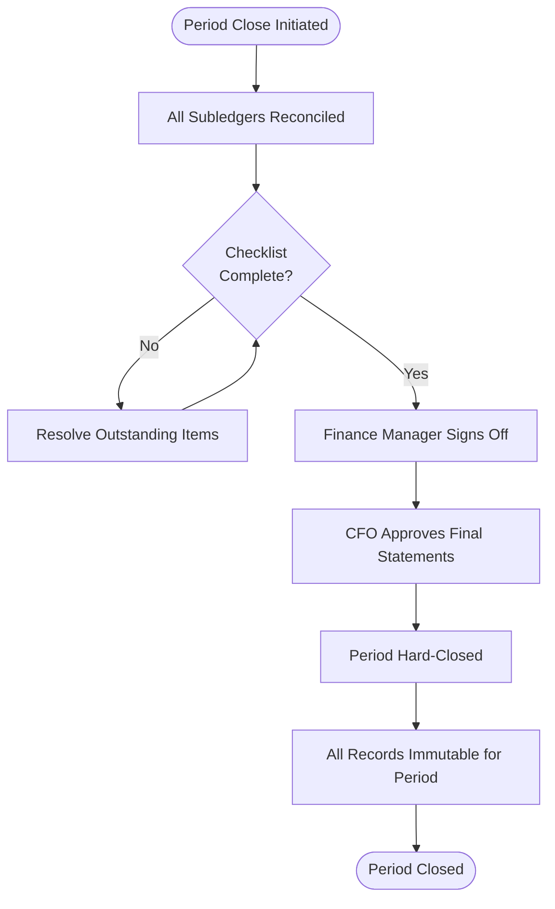

# Compliance Framework

## Overview
This document describes the audit, regulatory compliance, and internal control framework for the Finance Management System. Finance systems operate in a highly regulated environment and must meet strict requirements for data integrity, segregation of duties, and audit traceability.

---

## Regulatory Standards Addressed

| Standard | Applicability | Key Requirements |
|----------|--------------|-----------------|
| **GAAP / IFRS** | Financial reporting accuracy | Double-entry bookkeeping, period-end close, matching principle |
| **SOX (Sarbanes-Oxley)** | Public companies | Internal controls over financial reporting, audit trails, segregation of duties |
| **SOC 2 Type II** | SaaS deployment | Security, availability, confidentiality of financial data |
| **PCI-DSS** | Payment processing | Card data security, access logging, encryption |
| **GDPR / PDPA** | Employee and customer data | Data minimization, right to erasure, consent tracking |
| **GST / VAT / TDS** | Tax compliance | Correct tax application, e-filing, withholding certificates |
| **AML (Anti-Money Laundering)** | Banking integrations | Transaction monitoring hooks, suspicious activity flagging |

---

## Audit Trail Design

### Append-Only Audit Log
Every mutation in the system (create, update, delete) generates an immutable audit log entry with:

| Field | Description |
|-------|-------------|
| `user_id` | The authenticated user who performed the action |
| `action` | CREATE, UPDATE, DELETE, APPROVE, REJECT, POST, REVERSE |
| `entity_type` | The object type (JOURNAL_ENTRY, INVOICE, BUDGET, etc.) |
| `entity_id` | The internal ID of the affected record |
| `before_value_json` | State of the record before the change (null for CREATE) |
| `after_value_json` | State of the record after the change (null for DELETE) |
| `ip_address` | Client IP address |
| `created_at` | UTC timestamp of the action |

### Audit Log Security Controls
- The application database user has INSERT-only access to `audit_logs`; no UPDATE or DELETE is permitted at the DB level
- Audit log table is backed up to a separate encrypted archive daily
- Audit logs are retained for a minimum of 7 years per financial record-keeping regulations
- Log export is available in CSV and JSON formats for auditor access

---

## Segregation of Duties (SoD) Controls

SoD prevents any single user from having end-to-end control over a financial process. The system enforces the following incompatible role combinations:

| Process | Creator Role | Approver Role | Payer Role |
|---------|-------------|--------------|------------|
| Vendor Invoice | Accountant | Finance Manager | Finance Manager (different step) |
| Customer Invoice | Accountant | (auto-approved) | Accountant records payment |
| Payment Run | Accountant | Finance Manager | Finance Manager (bank submission) |
| Payroll | Accountant | Finance Manager | Finance Manager (bank file) |
| Expense Claim | Employee | Department Head | Finance Manager |
| Journal Entry | Accountant | Finance Manager (high-value) | N/A |
| Budget | Budget Manager | Finance Manager, CFO | N/A |

### SoD Violation Detection
- At role assignment, the system checks if the new role creates a SoD conflict with existing roles for that user
- A nightly batch job scans for any existing SoD violations and generates an exception report for the CFO
- Auditors can run the SoD exception report on demand via `/api/v1/compliance/sod-violations`

---

## Internal Controls

### High-Value Transaction Dual Control
Transactions above configurable thresholds require a second approver:

| Transaction Type | Standard Threshold | CFO Threshold |
|-----------------|-------------------|--------------|
| Vendor Payment | $10,000 | $100,000 |
| Journal Entry | $50,000 | $500,000 |
| Expense Claim | $2,500 | N/A |
| Payroll Variance | 5% from prior period | N/A |

Thresholds are configurable by CFO and stored in the `approval_thresholds` configuration table.

### Period-End Controls

### Reconciliation Controls
- All GL control accounts (AP, AR, Payroll, Fixed Assets) must be reconciled before a period can be soft-closed
- Bank reconciliation must be signed off by an accountant with Finance Manager review
- Unreconciled items older than 30 days generate automatic escalation alerts

---

## Data Protection Controls

### Field-Level Encryption
Sensitive fields are encrypted using AES-256 before storage:

| Field | Table | Reason |
|-------|-------|--------|
| `bank_account_number` | `payroll_employees` | PII / financial |
| `bank_routing_number` | `payroll_employees` | PII / financial |
| `tax_id` | `vendors`, `customers`, `payroll_employees` | PII |
| `bank_account_number` | `vendors` | Financial |

### Data Retention and Archiving
- Financial transactions are retained for a minimum of 7 years
- Documents (invoices, receipts, reports) are retained for 7 years in object storage
- Employee payroll data is retained for 7 years post-employment
- After the retention period, data is archived or anonymized per the data retention policy

### Access Controls
- All API endpoints validate JWT and enforce RBAC per-request
- Auditor role grants read-only access to all financial data; no write permissions
- IP allowlisting is enforced for production API access from external clients
- MFA is required for Finance Manager and CFO accounts

---

## Compliance Reporting Endpoints

| Endpoint | Description | Authorized Roles |
|----------|-------------|-----------------|
| `GET /api/v1/compliance/audit-trail` | Query audit logs with filters | Auditor, CFO |
| `GET /api/v1/compliance/sod-violations` | Segregation of duties exception report | Auditor, CFO |
| `GET /api/v1/compliance/high-value-transactions` | Transactions above threshold | Auditor, CFO, FM |
| `GET /api/v1/compliance/approval-history/{entity_type}/{id}` | Full approval chain for any entity | Auditor, FM, CFO |
| `GET /api/v1/compliance/period-close-history` | Sign-off records for all periods | Auditor, CFO |
| `POST /api/v1/compliance/audit-log-export` | Export audit logs for external audit | Auditor |

---

## Penetration Testing and Security Review Checklist

| Area | Control | Verification |
|------|---------|-------------|
| Authentication | JWT with short expiry + refresh tokens | Automated test: expired token returns 401 |
| Authorization | RBAC enforcement on every endpoint | Role matrix integration tests |
| Audit log integrity | Append-only audit store | DB-level INSERT-only permission verified |
| Encryption at rest | AES-256 for sensitive fields | Field-level decryption test |
| Encryption in transit | TLS 1.3 for all external connections | Certificate and protocol version verified |
| SQL injection | Parameterized queries via ORM | DAST scanner run pre-deployment |
| CSRF protection | SameSite cookies and CSRF tokens | Browser-based test |
| Input validation | Pydantic v2 models on all inputs | Fuzz testing on API endpoints |
| Secrets management | Credentials in AWS Secrets Manager | No hardcoded secrets in codebase |

## Implementation-Ready Finance Control Expansion

### 1) Accounting Rule Assumptions (Detailed)
- Ledger model is strictly double-entry with balanced journal headers and line-level dimensional tagging (entity, cost-center, project, product, counterparty).
- Posting policies are versioned and time-effective; historical transactions are evaluated against the rule version active at transaction time.
- Currency handling requires transaction currency, functional currency, and optional reporting currency; FX revaluation and realized/unrealized gains are separated.
- Materiality thresholds are explicit and configurable; below-threshold variances may auto-resolve only when policy explicitly allows.

### 2) Transaction Invariants and Data Contracts
- Every command/event must include `transaction_id`, `idempotency_key`, `source_system`, `event_time_utc`, `actor_id/service_principal`, and `policy_version`.
- Mutations affecting posted books are append-only. Corrections use reversal + adjustment entries with causal linkage to original posting IDs.
- Period invariant checks: no unapproved journals in closing period, all sub-ledger control accounts reconciled, and close checklist fully attested.
- Referential invariants: every ledger line links to a provenance artifact (invoice/payment/payroll/expense/asset/tax document).

### 3) Reconciliation and Close Strategy
- Continuous reconciliation cadence:
  - **T+0/T+1** operational reconciliation (gateway, bank, processor, payroll outputs).
  - **Daily** sub-ledger to GL tie-out.
  - **Monthly/Quarterly** close certification with controller sign-off.
- Exception taxonomy is mandatory: timing mismatch, mapping/config error, duplicate, missing source event, external counterparty variance, FX rounding.
- Close blockers are machine-detectable and surfaced on a close dashboard with ownership, ETA, and escalation policy.

### 4) Failure Handling and Operational Recovery
- Posting pipeline uses outbox/inbox patterns with deterministic retries and dead-letter quarantine for non-retriable payloads.
- Duplicate delivery and partial failure scenarios must be proven safe through idempotency and compensating accounting entries.
- Incident runbooks require: containment decision, scope quantification, replay/rebuild method, reconciliation rerun, and financial controller approval.
- Recovery drills must be executed periodically with evidence retained for audit.

### 5) Regulatory / Compliance / Audit Expectations
- Controls must support segregation of duties, least privilege, and end-to-end tamper-evident audit trails.
- Retention strategy must satisfy jurisdictional requirements for financial records, tax documents, and payroll artifacts.
- Sensitive data handling includes classification, masking/tokenization for non-production, and secure export controls.
- Every policy override (manual journal, reopened period, emergency access) requires reason code, approver, and expiration window.

### 6) Data Lineage & Traceability (Requirements → Implementation)
- Maintain an explicit traceability matrix for this artifact (`detailed-design/compliance-framework.md`):
  - `Requirement ID` → `Business Rule / Event` → `Design Element` (API/schema/diagram component) → `Code Module` → `Test Evidence` → `Control Owner`.
- Lineage metadata minimums: source event ID, transformation ID/version, posting rule version, reconciliation batch ID, and report consumption path.
- Any change touching accounting semantics must include impact analysis across upstream requirements and downstream close/compliance reports.
- Documentation updates are blocking for release when they alter financial behavior, posting logic, or reconciliation outcomes.

### 7) Phase-Specific Implementation Readiness
- Specify schema-level constraints: unique idempotency keys, check constraints for debit/credit signs, immutable posting rows, FK coverage.
- Define API contracts for posting/approval/reconciliation including error codes, retry semantics, and deterministic conflict handling.
- Include state-transition guards for approval and period-close flows to prevent illegal transitions.

### 8) Implementation Checklist for `compliance framework`
- [ ] Control objectives and success/failure criteria are explicit and testable.
- [ ] Data contracts include mandatory identifiers, timestamps, and provenance fields.
- [ ] Reconciliation logic defines cadence, tolerances, ownership, and escalation.
- [ ] Operational runbooks cover retries, replay, backfill, and close re-certification.
- [ ] Compliance evidence artifacts are named, retained, and linked to control owners.

