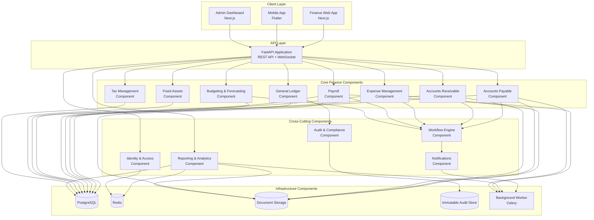
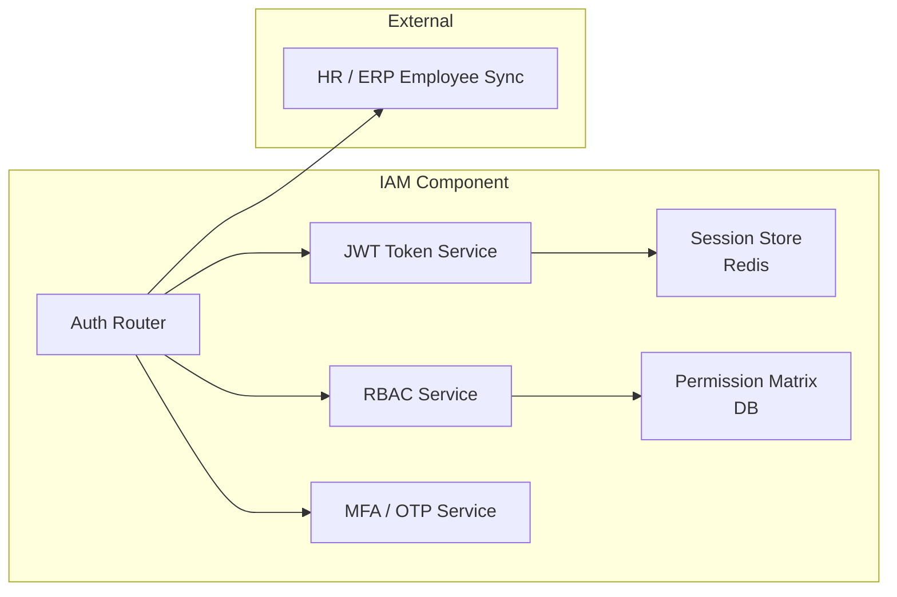
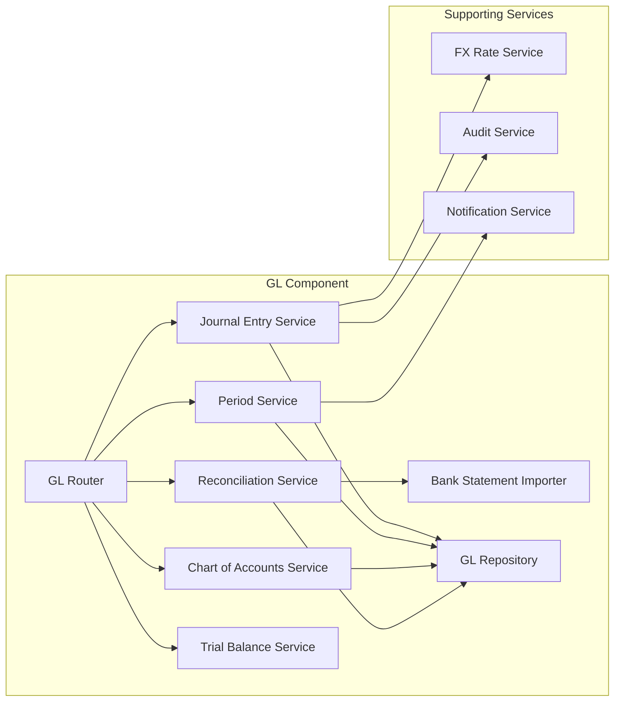
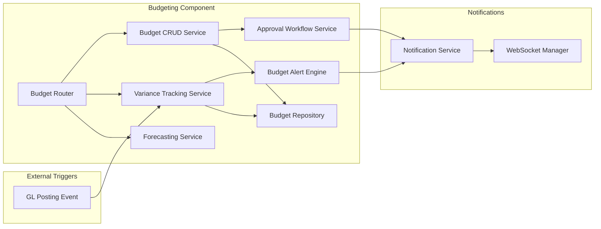
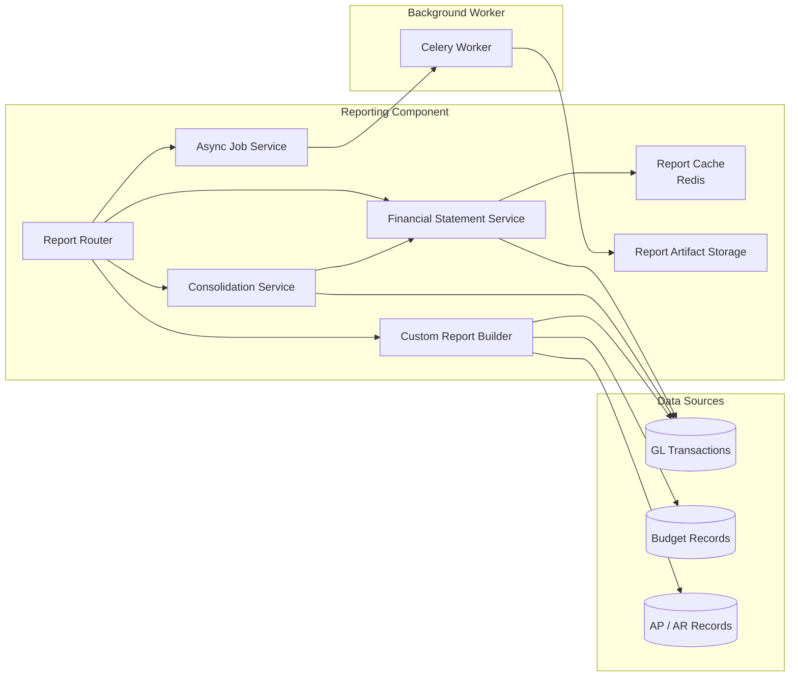

# Component Diagrams

## Overview
Component-level architecture diagrams showing how the Finance Management System is structured internally.

---

## System Component Overview

---

## Identity & Access Component

---

## General Ledger Component

---

## Budgeting & Variance Component

---

## Reporting & Analytics Component

