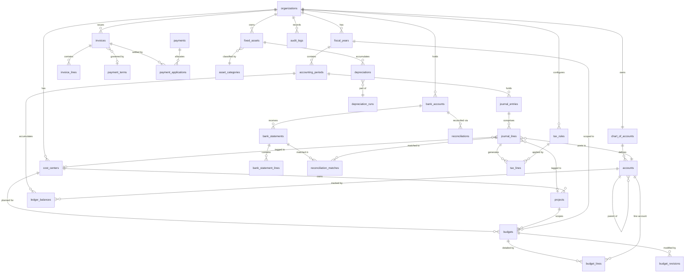

# ERD / Database Schema

## Overview

Complete entity-relationship diagram and SQL DDL for the Finance Management System. All monetary columns use `DECIMAL(19,4)` to support values up to 999 trillion with four decimal places of precision. Primary keys are UUID v4. All tables include `created_at` and `updated_at` audit timestamps. Currency codes conform to ISO 4217.

---

## Entity-Relationship Diagram



---

## SQL DDL

### organizations

```sql
CREATE TABLE organizations (
    id                UUID            PRIMARY KEY DEFAULT gen_random_uuid(),
    name              VARCHAR(255)    NOT NULL,
    legal_name        VARCHAR(255)    NOT NULL,
    tax_id            VARCHAR(100),
    base_currency     CHAR(3)         NOT NULL,
    country           CHAR(2)         NOT NULL,
    status            VARCHAR(20)     NOT NULL DEFAULT 'ACTIVE'
                          CHECK (status IN ('ACTIVE','INACTIVE','SUSPENDED')),
    created_at        TIMESTAMPTZ     NOT NULL DEFAULT NOW(),
    updated_at        TIMESTAMPTZ     NOT NULL DEFAULT NOW()
);
```

### fiscal_years

```sql
CREATE TABLE fiscal_years (
    id                UUID            PRIMARY KEY DEFAULT gen_random_uuid(),
    organization_id   UUID            NOT NULL REFERENCES organizations(id),
    name              VARCHAR(100)    NOT NULL,
    start_date        DATE            NOT NULL,
    end_date          DATE            NOT NULL,
    status            VARCHAR(20)     NOT NULL DEFAULT 'OPEN'
                          CHECK (status IN ('OPEN','CLOSED')),
    closed_by         UUID,
    closed_at         TIMESTAMPTZ,
    created_at        TIMESTAMPTZ     NOT NULL DEFAULT NOW(),
    updated_at        TIMESTAMPTZ     NOT NULL DEFAULT NOW(),
    CONSTRAINT fy_date_order CHECK (end_date > start_date),
    CONSTRAINT fy_unique_name UNIQUE (organization_id, name)
);

CREATE INDEX idx_fiscal_years_org ON fiscal_years(organization_id);
```

### accounting_periods

```sql
CREATE TABLE accounting_periods (
    id                UUID            PRIMARY KEY DEFAULT gen_random_uuid(),
    fiscal_year_id    UUID            NOT NULL REFERENCES fiscal_years(id),
    organization_id   UUID            NOT NULL REFERENCES organizations(id),
    period_number     SMALLINT        NOT NULL,
    name              VARCHAR(100)    NOT NULL,
    start_date        DATE            NOT NULL,
    end_date          DATE            NOT NULL,
    status            VARCHAR(20)     NOT NULL DEFAULT 'FUTURE'
                          CHECK (status IN ('FUTURE','OPEN','SOFT_CLOSED','HARD_CLOSED','REOPENED')),
    soft_closed_by    UUID,
    soft_closed_at    TIMESTAMPTZ,
    hard_closed_by    UUID,
    hard_closed_at    TIMESTAMPTZ,
    created_at        TIMESTAMPTZ     NOT NULL DEFAULT NOW(),
    updated_at        TIMESTAMPTZ     NOT NULL DEFAULT NOW(),
    CONSTRAINT ap_date_order CHECK (end_date > start_date),
    CONSTRAINT ap_unique_period UNIQUE (fiscal_year_id, period_number)
);

CREATE INDEX idx_accounting_periods_fy   ON accounting_periods(fiscal_year_id);
CREATE INDEX idx_accounting_periods_org  ON accounting_periods(organization_id);
CREATE INDEX idx_accounting_periods_date ON accounting_periods(start_date, end_date);
```

### chart_of_accounts

```sql
CREATE TABLE chart_of_accounts (
    id                UUID            PRIMARY KEY DEFAULT gen_random_uuid(),
    organization_id   UUID            NOT NULL REFERENCES organizations(id),
    name              VARCHAR(255)    NOT NULL,
    description       TEXT,
    is_default        BOOLEAN         NOT NULL DEFAULT FALSE,
    created_at        TIMESTAMPTZ     NOT NULL DEFAULT NOW(),
    updated_at        TIMESTAMPTZ     NOT NULL DEFAULT NOW(),
    CONSTRAINT coa_unique_org UNIQUE (organization_id, name)
);
```

### accounts

```sql
CREATE TABLE accounts (
    id                    UUID            PRIMARY KEY DEFAULT gen_random_uuid(),
    chart_of_accounts_id  UUID            NOT NULL REFERENCES chart_of_accounts(id),
    organization_id       UUID            NOT NULL REFERENCES organizations(id),
    parent_account_id     UUID            REFERENCES accounts(id),
    code                  VARCHAR(50)     NOT NULL,
    name                  VARCHAR(255)    NOT NULL,
    description           TEXT,
    type                  VARCHAR(30)     NOT NULL
                              CHECK (type IN ('ASSET','LIABILITY','EQUITY','REVENUE','EXPENSE',
                                             'CONTRA_ASSET','CONTRA_REVENUE')),
    sub_type              VARCHAR(50),
    normal_balance        CHAR(6)         NOT NULL CHECK (normal_balance IN ('DEBIT','CREDIT')),
    currency              CHAR(3)         NOT NULL DEFAULT 'USD',
    is_summary            BOOLEAN         NOT NULL DEFAULT FALSE,
    allow_direct_posting  BOOLEAN         NOT NULL DEFAULT TRUE,
    is_active             BOOLEAN         NOT NULL DEFAULT TRUE,
    is_system_account     BOOLEAN         NOT NULL DEFAULT FALSE,
    level                 SMALLINT        NOT NULL DEFAULT 1,
    created_at            TIMESTAMPTZ     NOT NULL DEFAULT NOW(),
    updated_at            TIMESTAMPTZ     NOT NULL DEFAULT NOW(),
    CONSTRAINT acc_unique_code UNIQUE (chart_of_accounts_id, code)
);

CREATE INDEX idx_accounts_coa    ON accounts(chart_of_accounts_id);
CREATE INDEX idx_accounts_org    ON accounts(organization_id);
CREATE INDEX idx_accounts_parent ON accounts(parent_account_id);
CREATE INDEX idx_accounts_type   ON accounts(type);
```

### journal_entries

```sql
CREATE TABLE journal_entries (
    id                    UUID            PRIMARY KEY DEFAULT gen_random_uuid(),
    organization_id       UUID            NOT NULL REFERENCES organizations(id),
    fiscal_year_id        UUID            NOT NULL REFERENCES fiscal_years(id),
    accounting_period_id  UUID            NOT NULL REFERENCES accounting_periods(id),
    entry_number          VARCHAR(50)     NOT NULL,
    type                  VARCHAR(30)     NOT NULL
                              CHECK (type IN ('STANDARD','ADJUSTING','REVERSING','CLOSING',
                                             'OPENING','SYSTEM')),
    status                VARCHAR(20)     NOT NULL DEFAULT 'DRAFT'
                              CHECK (status IN ('DRAFT','PENDING_APPROVAL','APPROVED',
                                               'POSTED','REVERSED','REJECTED')),
    transaction_date      DATE            NOT NULL,
    reference             VARCHAR(255),
    description           TEXT            NOT NULL,
    source_name           VARCHAR(100),
    source_id             UUID,
    currency              CHAR(3)         NOT NULL,
    exchange_rate         DECIMAL(19,10)  NOT NULL DEFAULT 1.0,
    created_by            UUID            NOT NULL,
    approved_by           UUID,
    approved_at           TIMESTAMPTZ,
    posted_by             UUID,
    posted_at             TIMESTAMPTZ,
    reversed_by           UUID,
    reversed_at           TIMESTAMPTZ,
    reversal_of           UUID            REFERENCES journal_entries(id),
    rejection_reason      TEXT,
    created_at            TIMESTAMPTZ     NOT NULL DEFAULT NOW(),
    updated_at            TIMESTAMPTZ     NOT NULL DEFAULT NOW(),
    CONSTRAINT je_unique_number UNIQUE (organization_id, entry_number)
);

CREATE INDEX idx_journal_entries_org    ON journal_entries(organization_id);
CREATE INDEX idx_journal_entries_period ON journal_entries(accounting_period_id);
CREATE INDEX idx_journal_entries_date   ON journal_entries(transaction_date);
CREATE INDEX idx_journal_entries_status ON journal_entries(status);
CREATE INDEX idx_journal_entries_source ON journal_entries(source_name, source_id);
```

### journal_lines

```sql
CREATE TABLE journal_lines (
    id                    UUID            PRIMARY KEY DEFAULT gen_random_uuid(),
    journal_entry_id      UUID            NOT NULL REFERENCES journal_entries(id) ON DELETE CASCADE,
    account_id            UUID            NOT NULL REFERENCES accounts(id),
    cost_center_id        UUID            REFERENCES cost_centers(id),
    project_id            UUID            REFERENCES projects(id),
    line_number           SMALLINT        NOT NULL,
    description           TEXT,
    debit_credit          CHAR(6)         NOT NULL CHECK (debit_credit IN ('DEBIT','CREDIT')),
    amount                DECIMAL(19,4)   NOT NULL CHECK (amount > 0),
    currency              CHAR(3)         NOT NULL,
    exchange_rate         DECIMAL(19,10)  NOT NULL DEFAULT 1.0,
    amount_base_currency  DECIMAL(19,4)   NOT NULL,
    tax_code              VARCHAR(50),
    tax_amount            DECIMAL(19,4)   NOT NULL DEFAULT 0,
    reference             VARCHAR(255),
    created_at            TIMESTAMPTZ     NOT NULL DEFAULT NOW(),
    updated_at            TIMESTAMPTZ     NOT NULL DEFAULT NOW()
);

CREATE INDEX idx_journal_lines_entry       ON journal_lines(journal_entry_id);
CREATE INDEX idx_journal_lines_account     ON journal_lines(account_id);
CREATE INDEX idx_journal_lines_cost_center ON journal_lines(cost_center_id);
CREATE INDEX idx_journal_lines_project     ON journal_lines(project_id);
```

### ledger_balances

```sql
CREATE TABLE ledger_balances (
    id                    UUID            PRIMARY KEY DEFAULT gen_random_uuid(),
    organization_id       UUID            NOT NULL REFERENCES organizations(id),
    account_id            UUID            NOT NULL REFERENCES accounts(id),
    accounting_period_id  UUID            NOT NULL REFERENCES accounting_periods(id),
    fiscal_year_id        UUID            NOT NULL REFERENCES fiscal_years(id),
    opening_balance       DECIMAL(19,4)   NOT NULL DEFAULT 0,
    total_debits          DECIMAL(19,4)   NOT NULL DEFAULT 0,
    total_credits         DECIMAL(19,4)   NOT NULL DEFAULT 0,
    closing_balance       DECIMAL(19,4)   NOT NULL DEFAULT 0,
    currency              CHAR(3)         NOT NULL,
    last_updated_at       TIMESTAMPTZ     NOT NULL DEFAULT NOW(),
    created_at            TIMESTAMPTZ     NOT NULL DEFAULT NOW(),
    CONSTRAINT lb_unique UNIQUE (account_id, accounting_period_id)
);

CREATE INDEX idx_ledger_balances_account ON ledger_balances(account_id);
CREATE INDEX idx_ledger_balances_period  ON ledger_balances(accounting_period_id);
CREATE INDEX idx_ledger_balances_org     ON ledger_balances(organization_id);
```

### cost_centers

```sql
CREATE TABLE cost_centers (
    id                    UUID            PRIMARY KEY DEFAULT gen_random_uuid(),
    organization_id       UUID            NOT NULL REFERENCES organizations(id),
    parent_cost_center_id UUID            REFERENCES cost_centers(id),
    code                  VARCHAR(50)     NOT NULL,
    name                  VARCHAR(255)    NOT NULL,
    description           TEXT,
    manager_id            UUID,
    type                  VARCHAR(30)     NOT NULL DEFAULT 'STANDARD',
    is_active             BOOLEAN         NOT NULL DEFAULT TRUE,
    created_at            TIMESTAMPTZ     NOT NULL DEFAULT NOW(),
    updated_at            TIMESTAMPTZ     NOT NULL DEFAULT NOW(),
    CONSTRAINT cc_unique_code UNIQUE (organization_id, code)
);

CREATE INDEX idx_cost_centers_org    ON cost_centers(organization_id);
CREATE INDEX idx_cost_centers_parent ON cost_centers(parent_cost_center_id);
```

### projects

```sql
CREATE TABLE projects (
    id                UUID            PRIMARY KEY DEFAULT gen_random_uuid(),
    organization_id   UUID            NOT NULL REFERENCES organizations(id),
    cost_center_id    UUID            REFERENCES cost_centers(id),
    project_code      VARCHAR(50)     NOT NULL,
    name              VARCHAR(255)    NOT NULL,
    description       TEXT,
    status            VARCHAR(20)     NOT NULL DEFAULT 'ACTIVE'
                          CHECK (status IN ('ACTIVE','CLOSED','ON_HOLD')),
    manager_id        UUID,
    start_date        DATE,
    end_date          DATE,
    approved_budget   DECIMAL(19,4)   NOT NULL DEFAULT 0,
    spent_to_date     DECIMAL(19,4)   NOT NULL DEFAULT 0,
    created_at        TIMESTAMPTZ     NOT NULL DEFAULT NOW(),
    updated_at        TIMESTAMPTZ     NOT NULL DEFAULT NOW(),
    CONSTRAINT proj_unique_code UNIQUE (organization_id, project_code)
);
```

### budgets

```sql
CREATE TABLE budgets (
    id                UUID            PRIMARY KEY DEFAULT gen_random_uuid(),
    organization_id   UUID            NOT NULL REFERENCES organizations(id),
    fiscal_year_id    UUID            NOT NULL REFERENCES fiscal_years(id),
    cost_center_id    UUID            REFERENCES cost_centers(id),
    project_id        UUID            REFERENCES projects(id),
    budget_code       VARCHAR(50)     NOT NULL,
    name              VARCHAR(255)    NOT NULL,
    type              VARCHAR(20)     NOT NULL DEFAULT 'OPERATIONAL'
                          CHECK (type IN ('OPERATIONAL','CAPITAL','PROJECT')),
    status            VARCHAR(30)     NOT NULL DEFAULT 'DRAFT'
                          CHECK (status IN ('DRAFT','SUBMITTED','UNDER_REVIEW','APPROVED',
                                           'ACTIVE','REVISION_REQUESTED','CLOSED')),
    currency          CHAR(3)         NOT NULL,
    total_amount      DECIMAL(19,4)   NOT NULL DEFAULT 0,
    total_actual      DECIMAL(19,4)   NOT NULL DEFAULT 0,
    total_variance    DECIMAL(19,4)   NOT NULL DEFAULT 0,
    version           SMALLINT        NOT NULL DEFAULT 1,
    submitted_by      UUID,
    submitted_at      TIMESTAMPTZ,
    approved_by       UUID,
    approved_at       TIMESTAMPTZ,
    approval_notes    TEXT,
    created_by        UUID            NOT NULL,
    created_at        TIMESTAMPTZ     NOT NULL DEFAULT NOW(),
    updated_at        TIMESTAMPTZ     NOT NULL DEFAULT NOW(),
    CONSTRAINT budget_unique_code UNIQUE (organization_id, budget_code, version)
);

CREATE INDEX idx_budgets_org        ON budgets(organization_id);
CREATE INDEX idx_budgets_fiscal_yr  ON budgets(fiscal_year_id);
CREATE INDEX idx_budgets_cost_center ON budgets(cost_center_id);
```

### budget_lines

```sql
CREATE TABLE budget_lines (
    id                UUID            PRIMARY KEY DEFAULT gen_random_uuid(),
    budget_id         UUID            NOT NULL REFERENCES budgets(id) ON DELETE CASCADE,
    account_id        UUID            NOT NULL REFERENCES accounts(id),
    cost_center_id    UUID            REFERENCES cost_centers(id),
    project_id        UUID            REFERENCES projects(id),
    period_number     SMALLINT,
    description       TEXT,
    category          VARCHAR(100),
    budgeted_amount   DECIMAL(19,4)   NOT NULL DEFAULT 0,
    actual_amount     DECIMAL(19,4)   NOT NULL DEFAULT 0,
    committed_amount  DECIMAL(19,4)   NOT NULL DEFAULT 0,
    variance          DECIMAL(19,4)   NOT NULL DEFAULT 0,
    variance_percent  DECIMAL(10,4)   NOT NULL DEFAULT 0,
    currency          CHAR(3)         NOT NULL,
    created_at        TIMESTAMPTZ     NOT NULL DEFAULT NOW(),
    updated_at        TIMESTAMPTZ     NOT NULL DEFAULT NOW()
);

CREATE INDEX idx_budget_lines_budget  ON budget_lines(budget_id);
CREATE INDEX idx_budget_lines_account ON budget_lines(account_id);
```

### budget_revisions

```sql
CREATE TABLE budget_revisions (
    id                    UUID            PRIMARY KEY DEFAULT gen_random_uuid(),
    budget_id             UUID            NOT NULL REFERENCES budgets(id),
    revision_number       SMALLINT        NOT NULL,
    reason                TEXT            NOT NULL,
    type                  VARCHAR(30)     NOT NULL
                              CHECK (type IN ('REALLOCATION','INCREASE','DECREASE','EMERGENCY')),
    previous_total_amount DECIMAL(19,4)   NOT NULL,
    revised_total_amount  DECIMAL(19,4)   NOT NULL,
    delta_amount          DECIMAL(19,4)   NOT NULL,
    status                VARCHAR(20)     NOT NULL DEFAULT 'PENDING'
                              CHECK (status IN ('PENDING','APPROVED','REJECTED')),
    requested_by          UUID            NOT NULL,
    requested_at          TIMESTAMPTZ     NOT NULL DEFAULT NOW(),
    approved_by           UUID,
    approved_at           TIMESTAMPTZ,
    approval_notes        TEXT,
    created_at            TIMESTAMPTZ     NOT NULL DEFAULT NOW()
);

CREATE INDEX idx_budget_revisions_budget ON budget_revisions(budget_id);
```

### invoices

```sql
CREATE TABLE invoices (
    id                    UUID            PRIMARY KEY DEFAULT gen_random_uuid(),
    organization_id       UUID            NOT NULL REFERENCES organizations(id),
    direction             VARCHAR(10)     NOT NULL CHECK (direction IN ('PAYABLE','RECEIVABLE')),
    invoice_number        VARCHAR(100)    NOT NULL,
    status                VARCHAR(20)     NOT NULL DEFAULT 'DRAFT'
                              CHECK (status IN ('DRAFT','SUBMITTED','APPROVED','PARTIALLY_PAID',
                                               'PAID','CANCELLED','DISPUTED')),
    vendor_id             UUID,
    customer_id           UUID,
    payment_term_id       UUID,
    accounting_period_id  UUID            REFERENCES accounting_periods(id),
    invoice_date          DATE            NOT NULL,
    due_date              DATE            NOT NULL,
    currency              CHAR(3)         NOT NULL,
    exchange_rate         DECIMAL(19,10)  NOT NULL DEFAULT 1.0,
    subtotal              DECIMAL(19,4)   NOT NULL DEFAULT 0,
    tax_amount            DECIMAL(19,4)   NOT NULL DEFAULT 0,
    discount_amount       DECIMAL(19,4)   NOT NULL DEFAULT 0,
    total_amount          DECIMAL(19,4)   NOT NULL DEFAULT 0,
    amount_paid           DECIMAL(19,4)   NOT NULL DEFAULT 0,
    amount_due            DECIMAL(19,4)   NOT NULL DEFAULT 0,
    vendor_invoice_number VARCHAR(100),
    reference             VARCHAR(255),
    notes                 TEXT,
    approved_by           UUID,
    approved_at           TIMESTAMPTZ,
    journal_entry_id      UUID            REFERENCES journal_entries(id),
    created_by            UUID            NOT NULL,
    created_at            TIMESTAMPTZ     NOT NULL DEFAULT NOW(),
    updated_at            TIMESTAMPTZ     NOT NULL DEFAULT NOW(),
    CONSTRAINT inv_unique_number UNIQUE (organization_id, invoice_number)
);

CREATE INDEX idx_invoices_org      ON invoices(organization_id);
CREATE INDEX idx_invoices_vendor   ON invoices(vendor_id);
CREATE INDEX idx_invoices_customer ON invoices(customer_id);
CREATE INDEX idx_invoices_status   ON invoices(status);
CREATE INDEX idx_invoices_due_date ON invoices(due_date);
```

### invoice_lines

```sql
CREATE TABLE invoice_lines (
    id               UUID            PRIMARY KEY DEFAULT gen_random_uuid(),
    invoice_id       UUID            NOT NULL REFERENCES invoices(id) ON DELETE CASCADE,
    account_id       UUID            NOT NULL REFERENCES accounts(id),
    cost_center_id   UUID            REFERENCES cost_centers(id),
    project_id       UUID            REFERENCES projects(id),
    line_number      SMALLINT        NOT NULL,
    description      TEXT            NOT NULL,
    item_code        VARCHAR(100),
    quantity         DECIMAL(19,4)   NOT NULL DEFAULT 1,
    unit_of_measure  VARCHAR(20),
    unit_price       DECIMAL(19,4)   NOT NULL,
    discount_percent DECIMAL(10,4)   NOT NULL DEFAULT 0,
    discount_amount  DECIMAL(19,4)   NOT NULL DEFAULT 0,
    subtotal         DECIMAL(19,4)   NOT NULL,
    tax_code         VARCHAR(50),
    tax_percent      DECIMAL(10,4)   NOT NULL DEFAULT 0,
    tax_amount       DECIMAL(19,4)   NOT NULL DEFAULT 0,
    line_total       DECIMAL(19,4)   NOT NULL,
    created_at       TIMESTAMPTZ     NOT NULL DEFAULT NOW(),
    updated_at       TIMESTAMPTZ     NOT NULL DEFAULT NOW()
);

CREATE INDEX idx_invoice_lines_invoice ON invoice_lines(invoice_id);
```

### payments

```sql
CREATE TABLE payments (
    id                    UUID            PRIMARY KEY DEFAULT gen_random_uuid(),
    organization_id       UUID            NOT NULL REFERENCES organizations(id),
    direction             VARCHAR(10)     NOT NULL CHECK (direction IN ('OUTBOUND','INBOUND')),
    status                VARCHAR(20)     NOT NULL DEFAULT 'PENDING'
                              CHECK (status IN ('PENDING','COMPLETED','FAILED','VOIDED')),
    payment_number        VARCHAR(100)    NOT NULL,
    vendor_id             UUID,
    customer_id           UUID,
    bank_account_id       UUID,
    method                VARCHAR(30)     NOT NULL
                              CHECK (method IN ('ACH','WIRE','CHECK','CREDIT_CARD',
                                               'CASH','DIRECT_DEBIT','DIGITAL_WALLET')),
    payment_date          DATE            NOT NULL,
    currency              CHAR(3)         NOT NULL,
    amount                DECIMAL(19,4)   NOT NULL CHECK (amount > 0),
    exchange_rate         DECIMAL(19,10)  NOT NULL DEFAULT 1.0,
    amount_base_currency  DECIMAL(19,4)   NOT NULL,
    reference             VARCHAR(255),
    check_number          VARCHAR(50),
    transaction_id        VARCHAR(255),
    notes                 TEXT,
    journal_entry_id      UUID            REFERENCES journal_entries(id),
    created_by            UUID            NOT NULL,
    created_at            TIMESTAMPTZ     NOT NULL DEFAULT NOW(),
    updated_at            TIMESTAMPTZ     NOT NULL DEFAULT NOW(),
    CONSTRAINT pay_unique_number UNIQUE (organization_id, payment_number)
);

CREATE INDEX idx_payments_org         ON payments(organization_id);
CREATE INDEX idx_payments_vendor      ON payments(vendor_id);
CREATE INDEX idx_payments_date        ON payments(payment_date);
CREATE INDEX idx_payments_bank_acct   ON payments(bank_account_id);
```

### payment_applications

```sql
CREATE TABLE payment_applications (
    id               UUID            PRIMARY KEY DEFAULT gen_random_uuid(),
    payment_id       UUID            NOT NULL REFERENCES payments(id),
    invoice_id       UUID            NOT NULL REFERENCES invoices(id),
    amount_applied   DECIMAL(19,4)   NOT NULL CHECK (amount_applied > 0),
    applied_date     DATE            NOT NULL,
    discount_taken   DECIMAL(19,4)   NOT NULL DEFAULT 0,
    created_at       TIMESTAMPTZ     NOT NULL DEFAULT NOW(),
    CONSTRAINT pa_unique UNIQUE (payment_id, invoice_id)
);

CREATE INDEX idx_payment_apps_payment ON payment_applications(payment_id);
CREATE INDEX idx_payment_apps_invoice ON payment_applications(invoice_id);
```

### bank_accounts

```sql
CREATE TABLE bank_accounts (
    id                UUID            PRIMARY KEY DEFAULT gen_random_uuid(),
    organization_id   UUID            NOT NULL REFERENCES organizations(id),
    account_number    VARCHAR(50)     NOT NULL,
    routing_number    VARCHAR(20),
    bank_name         VARCHAR(255)    NOT NULL,
    account_name      VARCHAR(255)    NOT NULL,
    currency          CHAR(3)         NOT NULL,
    gl_account_id     UUID            REFERENCES accounts(id),
    is_active         BOOLEAN         NOT NULL DEFAULT TRUE,
    last_reconciled   DATE,
    created_at        TIMESTAMPTZ     NOT NULL DEFAULT NOW(),
    updated_at        TIMESTAMPTZ     NOT NULL DEFAULT NOW()
);
```

### bank_statements

```sql
CREATE TABLE bank_statements (
    id                UUID            PRIMARY KEY DEFAULT gen_random_uuid(),
    bank_account_id   UUID            NOT NULL REFERENCES bank_accounts(id),
    statement_date    DATE            NOT NULL,
    opening_balance   DECIMAL(19,4)   NOT NULL,
    closing_balance   DECIMAL(19,4)   NOT NULL,
    currency          CHAR(3)         NOT NULL,
    line_count        INTEGER         NOT NULL DEFAULT 0,
    imported_by       UUID            NOT NULL,
    imported_at       TIMESTAMPTZ     NOT NULL DEFAULT NOW(),
    created_at        TIMESTAMPTZ     NOT NULL DEFAULT NOW(),
    CONSTRAINT bs_unique UNIQUE (bank_account_id, statement_date)
);
```

### bank_statement_lines

```sql
CREATE TABLE bank_statement_lines (
    id               UUID            PRIMARY KEY DEFAULT gen_random_uuid(),
    statement_id     UUID            NOT NULL REFERENCES bank_statements(id) ON DELETE CASCADE,
    transaction_date DATE            NOT NULL,
    value_date       DATE,
    description      TEXT            NOT NULL,
    reference        VARCHAR(255),
    amount           DECIMAL(19,4)   NOT NULL,
    debit_credit     CHAR(6)         NOT NULL CHECK (debit_credit IN ('DEBIT','CREDIT')),
    balance          DECIMAL(19,4),
    is_matched       BOOLEAN         NOT NULL DEFAULT FALSE,
    created_at       TIMESTAMPTZ     NOT NULL DEFAULT NOW()
);

CREATE INDEX idx_bsl_statement ON bank_statement_lines(statement_id);
CREATE INDEX idx_bsl_matched   ON bank_statement_lines(is_matched);
```

### reconciliations

```sql
CREATE TABLE reconciliations (
    id                UUID            PRIMARY KEY DEFAULT gen_random_uuid(),
    bank_account_id   UUID            NOT NULL REFERENCES bank_accounts(id),
    statement_id      UUID            NOT NULL REFERENCES bank_statements(id),
    status            VARCHAR(20)     NOT NULL DEFAULT 'INITIATED'
                          CHECK (status IN ('INITIATED','IN_PROGRESS','PARTIALLY_MATCHED',
                                           'PENDING_REVIEW','COMPLETED','DISPUTED')),
    matched_count     INTEGER         NOT NULL DEFAULT 0,
    unmatched_count   INTEGER         NOT NULL DEFAULT 0,
    difference_amount DECIMAL(19,4)   NOT NULL DEFAULT 0,
    initiated_by      UUID            NOT NULL,
    completed_by      UUID,
    completed_at      TIMESTAMPTZ,
    created_at        TIMESTAMPTZ     NOT NULL DEFAULT NOW(),
    updated_at        TIMESTAMPTZ     NOT NULL DEFAULT NOW()
);
```

### reconciliation_matches

```sql
CREATE TABLE reconciliation_matches (
    id                    UUID            PRIMARY KEY DEFAULT gen_random_uuid(),
    reconciliation_id     UUID            NOT NULL REFERENCES reconciliations(id),
    statement_line_id     UUID            NOT NULL REFERENCES bank_statement_lines(id),
    journal_line_id       UUID            NOT NULL REFERENCES journal_lines(id),
    match_type            VARCHAR(20)     NOT NULL CHECK (match_type IN ('EXACT','FUZZY','MANUAL')),
    confidence_score      DECIMAL(5,4),
    matched_by            UUID,
    matched_at            TIMESTAMPTZ     NOT NULL DEFAULT NOW(),
    created_at            TIMESTAMPTZ     NOT NULL DEFAULT NOW()
);
```

### tax_rules

```sql
CREATE TABLE tax_rules (
    id                UUID            PRIMARY KEY DEFAULT gen_random_uuid(),
    organization_id   UUID            NOT NULL REFERENCES organizations(id),
    code              VARCHAR(50)     NOT NULL,
    name              VARCHAR(255)    NOT NULL,
    description       TEXT,
    tax_type          VARCHAR(30)     NOT NULL CHECK (tax_type IN ('VAT','GST','SALES_TAX','WHT','OTHER')),
    rate              DECIMAL(10,4)   NOT NULL,
    jurisdiction      VARCHAR(100),
    applies_to        VARCHAR(20)     NOT NULL DEFAULT 'BOTH'
                          CHECK (applies_to IN ('PAYABLE','RECEIVABLE','BOTH')),
    gl_account_id     UUID            REFERENCES accounts(id),
    is_active         BOOLEAN         NOT NULL DEFAULT TRUE,
    effective_from    DATE            NOT NULL,
    effective_to      DATE,
    created_at        TIMESTAMPTZ     NOT NULL DEFAULT NOW(),
    updated_at        TIMESTAMPTZ     NOT NULL DEFAULT NOW(),
    CONSTRAINT tr_unique_code UNIQUE (organization_id, code)
);
```

### tax_lines

```sql
CREATE TABLE tax_lines (
    id                UUID            PRIMARY KEY DEFAULT gen_random_uuid(),
    journal_line_id   UUID            NOT NULL REFERENCES journal_lines(id),
    tax_rule_id       UUID            NOT NULL REFERENCES tax_rules(id),
    taxable_amount    DECIMAL(19,4)   NOT NULL,
    tax_rate          DECIMAL(10,4)   NOT NULL,
    tax_amount        DECIMAL(19,4)   NOT NULL,
    currency          CHAR(3)         NOT NULL,
    tax_period        DATE            NOT NULL,
    created_at        TIMESTAMPTZ     NOT NULL DEFAULT NOW()
);

CREATE INDEX idx_tax_lines_journal_line ON tax_lines(journal_line_id);
CREATE INDEX idx_tax_lines_period       ON tax_lines(tax_period);
```

### fixed_assets

```sql
CREATE TABLE fixed_assets (
    id                            UUID            PRIMARY KEY DEFAULT gen_random_uuid(),
    organization_id               UUID            NOT NULL REFERENCES organizations(id),
    asset_category_id             UUID            NOT NULL REFERENCES asset_categories(id),
    cost_center_id                UUID            REFERENCES cost_centers(id),
    asset_code                    VARCHAR(50)     NOT NULL,
    name                          VARCHAR(255)    NOT NULL,
    description                   TEXT,
    serial_number                 VARCHAR(255),
    location                      VARCHAR(255),
    status                        VARCHAR(30)     NOT NULL DEFAULT 'PROPOSED'
                                      CHECK (status IN ('PROPOSED','ACTIVE','PARTIALLY_DEPRECIATED',
                                                       'FULLY_DEPRECIATED','DISPOSED')),
    acquisition_date              DATE            NOT NULL,
    disposal_date                 DATE,
    acquisition_cost              DECIMAL(19,4)   NOT NULL CHECK (acquisition_cost > 0),
    current_book_value            DECIMAL(19,4)   NOT NULL,
    accumulated_depreciation      DECIMAL(19,4)   NOT NULL DEFAULT 0,
    residual_value                DECIMAL(19,4)   NOT NULL DEFAULT 0,
    depreciation_method           VARCHAR(30)     NOT NULL DEFAULT 'STRAIGHT_LINE'
                                      CHECK (depreciation_method IN ('STRAIGHT_LINE','DECLINING_BALANCE',
                                                                     'DOUBLE_DECLINING_BALANCE',
                                                                     'SUM_OF_YEARS_DIGITS',
                                                                     'UNITS_OF_PRODUCTION')),
    useful_life_months            SMALLINT        NOT NULL,
    remaining_life_months         SMALLINT        NOT NULL,
    depreciation_start_date       DATE,
    last_depreciation_date        DATE,
    acquisition_journal_entry_id  UUID            REFERENCES journal_entries(id),
    created_by                    UUID            NOT NULL,
    created_at                    TIMESTAMPTZ     NOT NULL DEFAULT NOW(),
    updated_at                    TIMESTAMPTZ     NOT NULL DEFAULT NOW(),
    CONSTRAINT fa_unique_code UNIQUE (organization_id, asset_code)
);

CREATE INDEX idx_fixed_assets_org      ON fixed_assets(organization_id);
CREATE INDEX idx_fixed_assets_category ON fixed_assets(asset_category_id);
CREATE INDEX idx_fixed_assets_status   ON fixed_assets(status);
```

### asset_categories

```sql
CREATE TABLE asset_categories (
    id                                  UUID            PRIMARY KEY DEFAULT gen_random_uuid(),
    organization_id                     UUID            NOT NULL REFERENCES organizations(id),
    code                                VARCHAR(50)     NOT NULL,
    name                                VARCHAR(255)    NOT NULL,
    description                         TEXT,
    default_depreciation_method         VARCHAR(30)     NOT NULL DEFAULT 'STRAIGHT_LINE',
    default_useful_life_months          SMALLINT        NOT NULL,
    default_residual_percent            DECIMAL(10,4)   NOT NULL DEFAULT 0,
    asset_account_id                    UUID            REFERENCES accounts(id),
    depreciation_expense_account_id     UUID            REFERENCES accounts(id),
    accumulated_depreciation_account_id UUID            REFERENCES accounts(id),
    gain_on_disposal_account_id         UUID            REFERENCES accounts(id),
    loss_on_disposal_account_id         UUID            REFERENCES accounts(id),
    is_active                           BOOLEAN         NOT NULL DEFAULT TRUE,
    created_at                          TIMESTAMPTZ     NOT NULL DEFAULT NOW(),
    updated_at                          TIMESTAMPTZ     NOT NULL DEFAULT NOW(),
    CONSTRAINT ac_unique_code UNIQUE (organization_id, code)
);
```

### depreciations

```sql
CREATE TABLE depreciations (
    id                        UUID            PRIMARY KEY DEFAULT gen_random_uuid(),
    fixed_asset_id            UUID            NOT NULL REFERENCES fixed_assets(id),
    accounting_period_id      UUID            NOT NULL REFERENCES accounting_periods(id),
    depreciation_run_id       UUID            NOT NULL REFERENCES depreciation_runs(id),
    journal_entry_id          UUID            REFERENCES journal_entries(id),
    depreciation_date         DATE            NOT NULL,
    period_number             SMALLINT        NOT NULL,
    opening_book_value        DECIMAL(19,4)   NOT NULL,
    depreciation_amount       DECIMAL(19,4)   NOT NULL CHECK (depreciation_amount >= 0),
    accumulated_depreciation  DECIMAL(19,4)   NOT NULL,
    closing_book_value        DECIMAL(19,4)   NOT NULL,
    method                    VARCHAR(30)     NOT NULL,
    status                    VARCHAR(20)     NOT NULL DEFAULT 'POSTED'
                                  CHECK (status IN ('POSTED','REVERSED')),
    created_at                TIMESTAMPTZ     NOT NULL DEFAULT NOW(),
    updated_at                TIMESTAMPTZ     NOT NULL DEFAULT NOW(),
    CONSTRAINT dep_unique UNIQUE (fixed_asset_id, accounting_period_id)
);

CREATE INDEX idx_depreciations_asset  ON depreciations(fixed_asset_id);
CREATE INDEX idx_depreciations_period ON depreciations(accounting_period_id);
CREATE INDEX idx_depreciations_run    ON depreciations(depreciation_run_id);
```

### depreciation_runs

```sql
CREATE TABLE depreciation_runs (
    id                        UUID            PRIMARY KEY DEFAULT gen_random_uuid(),
    organization_id           UUID            NOT NULL REFERENCES organizations(id),
    accounting_period_id      UUID            NOT NULL REFERENCES accounting_periods(id),
    status                    VARCHAR(20)     NOT NULL DEFAULT 'STARTED'
                                  CHECK (status IN ('STARTED','RUNNING','COMPLETED','FAILED','ROLLED_BACK')),
    assets_processed          INTEGER         NOT NULL DEFAULT 0,
    assets_skipped            INTEGER         NOT NULL DEFAULT 0,
    assets_failed             INTEGER         NOT NULL DEFAULT 0,
    total_depreciation_amount DECIMAL(19,4)   NOT NULL DEFAULT 0,
    initiated_by              UUID            NOT NULL,
    scheduled_at              TIMESTAMPTZ,
    started_at                TIMESTAMPTZ     NOT NULL DEFAULT NOW(),
    completed_at              TIMESTAMPTZ,
    error_summary             TEXT,
    created_at                TIMESTAMPTZ     NOT NULL DEFAULT NOW()
);
```

### audit_logs

```sql
CREATE TABLE audit_logs (
    id             UUID            PRIMARY KEY DEFAULT gen_random_uuid(),
    organization_id UUID           NOT NULL REFERENCES organizations(id),
    entity_type    VARCHAR(100)    NOT NULL,
    entity_id      UUID            NOT NULL,
    action         VARCHAR(20)     NOT NULL CHECK (action IN ('CREATE','UPDATE','DELETE','VIEW')),
    old_values     JSONB,
    new_values     JSONB,
    changed_fields TEXT[],
    performed_by   UUID            NOT NULL,
    performed_at   TIMESTAMPTZ     NOT NULL DEFAULT NOW(),
    ip_address     INET,
    user_agent     TEXT,
    request_id     UUID
);

CREATE INDEX idx_audit_logs_entity ON audit_logs(entity_type, entity_id);
CREATE INDEX idx_audit_logs_user   ON audit_logs(performed_by);
CREATE INDEX idx_audit_logs_time   ON audit_logs(performed_at);
```
