# ERD / Database Schema

## Overview
This ERD reflects the full database schema for the Finance Management System. Public API IDs are encoded hashids; the ERD below shows persisted domain entities and relationships.

---

## Core Finance ERD

```mermaid
erDiagram
    users {
        int id PK
        varchar email
        varchar full_name
        varchar hashed_password
        boolean mfa_enabled
        boolean mfa_verified
        datetime created_at
        datetime updated_at
    }

    roles {
        int id PK
        varchar name
        varchar description
        json permissions_json
        datetime created_at
    }

    user_roles {
        int id PK
        int user_id FK
        int role_id FK
        int assigned_by_user_id FK
        datetime assigned_at
    }

    entities {
        int id PK
        varchar entity_code
        varchar legal_name
        varchar tax_id
        varchar functional_currency
        varchar country_code
        boolean is_active
    }

    fiscal_years {
        int id PK
        int entity_id FK
        varchar name
        date start_date
        date end_date
        varchar status
    }

    accounting_periods {
        int id PK
        int fiscal_year_id FK
        varchar period_name
        date start_date
        date end_date
        varchar status
        int closed_by_user_id FK
        datetime closed_at
    }

    chart_of_accounts {
        int id PK
        int entity_id FK
        varchar account_code
        varchar account_name
        varchar account_type
        int parent_id FK
        int level
        boolean is_active
        boolean allow_direct_posting
        varchar currency_code
    }

    journal_entries {
        int id PK
        int entity_id FK
        int period_id FK
        varchar entry_number
        date entry_date
        varchar reference
        text description
        varchar status
        boolean is_recurring
        boolean is_reversal
        int reversed_entry_id FK
        int prepared_by_user_id FK
        int approved_by_user_id FK
        datetime created_at
        datetime posted_at
    }

    journal_lines {
        int id PK
        int journal_entry_id FK
        int account_id FK
        int cost_center_id FK
        varchar description
        decimal debit_amount
        decimal credit_amount
        varchar currency_code
        decimal exchange_rate
    }

    journal_attachments {
        int id PK
        int journal_entry_id FK
        varchar file_name
        varchar file_url
        varchar file_type
        int uploaded_by_user_id FK
        datetime uploaded_at
    }

    cost_centers {
        int id PK
        int entity_id FK
        varchar code
        varchar name
        int department_id FK
        int manager_user_id FK
        boolean is_active
    }

    vendors {
        int id PK
        int entity_id FK
        varchar vendor_code
        varchar legal_name
        varchar tax_id
        varchar payment_terms
        varchar currency_code
        varchar status
        boolean is_1099_vendor
        int ap_account_id FK
        datetime approved_at
    }

    vendor_invoices {
        int id PK
        int vendor_id FK
        int entity_id FK
        int period_id FK
        int purchase_order_id FK
        varchar invoice_number
        date invoice_date
        date due_date
        decimal subtotal
        decimal tax_amount
        decimal total_amount
        decimal amount_paid
        varchar currency_code
        decimal exchange_rate
        varchar status
        varchar match_type
        int created_by_user_id FK
        int approved_by_user_id FK
        datetime created_at
        datetime approved_at
    }

    vendor_invoice_lines {
        int id PK
        int vendor_invoice_id FK
        int account_id FK
        int cost_center_id FK
        varchar description
        decimal quantity
        decimal unit_price
        decimal line_amount
        decimal tax_amount
    }

    payment_runs {
        int id PK
        int entity_id FK
        varchar run_reference
        date payment_date
        varchar payment_method
        decimal total_amount
        varchar status
        varchar bank_file_reference
        int created_by_user_id FK
        int approved_by_user_id FK
        datetime created_at
        datetime approved_at
        datetime submitted_at
    }

    payment_run_items {
        int id PK
        int payment_run_id FK
        int vendor_invoice_id FK
        decimal payment_amount
        decimal discount_taken
        varchar status
    }

    customers {
        int id PK
        int entity_id FK
        varchar customer_code
        varchar legal_name
        varchar tax_id
        varchar payment_terms
        decimal credit_limit
        varchar currency_code
        int ar_account_id FK
        varchar status
    }

    customer_invoices {
        int id PK
        int customer_id FK
        int entity_id FK
        int period_id FK
        varchar invoice_number
        date invoice_date
        date due_date
        decimal subtotal
        decimal tax_amount
        decimal total_amount
        decimal amount_paid
        decimal balance_due
        varchar currency_code
        varchar status
        int created_by_user_id FK
        datetime created_at
        datetime sent_at
    }

    customer_invoice_lines {
        int id PK
        int customer_invoice_id FK
        int account_id FK
        varchar description
        decimal quantity
        decimal unit_price
        decimal line_amount
        decimal tax_amount
    }

    customer_payments {
        int id PK
        int customer_id FK
        int entity_id FK
        date payment_date
        decimal amount
        varchar payment_method
        varchar reference
        varchar currency_code
        decimal exchange_rate
        varchar status
        int recorded_by_user_id FK
        datetime created_at
    }

    payment_allocations {
        int id PK
        int customer_payment_id FK
        int customer_invoice_id FK
        decimal amount_applied
        datetime created_at
    }

    budgets {
        int id PK
        int entity_id FK
        int fiscal_year_id FK
        varchar budget_name
        varchar status
        int version
        int submitted_by_user_id FK
        int fm_approved_by_user_id FK
        int cfo_approved_by_user_id FK
        datetime created_at
        datetime approved_at
    }

    budget_lines {
        int id PK
        int budget_id FK
        int account_id FK
        int cost_center_id FK
        int period_id FK
        decimal amount
        text notes
    }

    budget_variances {
        int id PK
        int budget_line_id FK
        decimal budget_amount
        decimal actual_amount
        decimal variance_amount
        decimal variance_pct
        date as_of_date
    }

    expense_claims {
        int id PK
        int user_id FK
        int entity_id FK
        varchar claim_number
        varchar title
        date period_start
        date period_end
        decimal total_amount
        varchar status
        int dept_approved_by_user_id FK
        int fm_approved_by_user_id FK
        datetime submitted_at
        datetime approved_at
        datetime paid_at
    }

    expense_items {
        int id PK
        int expense_claim_id FK
        int account_id FK
        int cost_center_id FK
        date expense_date
        varchar category
        varchar description
        decimal amount
        varchar currency_code
        varchar receipt_url
        boolean policy_flag
        text policy_note
    }

    payroll_employees {
        int id PK
        int user_id FK
        int entity_id FK
        varchar employee_code
        varchar full_name
        varchar pay_type
        decimal base_salary
        varchar currency_code
        varchar bank_account_number
        varchar bank_routing_number
        varchar tax_id
        boolean is_active
    }

    payroll_runs {
        int id PK
        int entity_id FK
        varchar run_reference
        date period_start
        date period_end
        varchar pay_schedule
        varchar status
        decimal total_gross
        decimal total_deductions
        decimal total_net
        int created_by_user_id FK
        int approved_by_user_id FK
        datetime created_at
        datetime approved_at
        datetime disbursed_at
    }

    payroll_entries {
        int id PK
        int payroll_run_id FK
        int payroll_employee_id FK
        decimal gross_pay
        decimal income_tax
        decimal social_security
        decimal provident_fund
        decimal other_deductions
        decimal net_pay
        varchar status
    }

    fixed_assets {
        int id PK
        int entity_id FK
        int asset_category_id FK
        int cost_center_id FK
        varchar asset_number
        varchar asset_name
        date acquisition_date
        decimal acquisition_cost
        decimal residual_value
        int useful_life_months
        varchar depreciation_method
        decimal accumulated_depreciation
        decimal net_book_value
        varchar status
    }

    asset_depreciation_entries {
        int id PK
        int asset_id FK
        int period_id FK
        int journal_entry_id FK
        decimal depreciation_amount
        datetime posted_at
    }

    asset_categories {
        int id PK
        varchar name
        int default_useful_life_months
        varchar default_depreciation_method
        int asset_account_id FK
        int accumulated_depr_account_id FK
        int depr_expense_account_id FK
    }

    tax_rates {
        int id PK
        int entity_id FK
        varchar tax_name
        varchar tax_type
        varchar jurisdiction
        decimal rate_pct
        date effective_from
        date effective_to
        boolean is_active
    }

    tax_transactions {
        int id PK
        int entity_id FK
        int source_entity_id FK
        varchar source_type
        int tax_rate_id FK
        decimal taxable_amount
        decimal tax_amount
        date transaction_date
        int period_id FK
    }

    notifications {
        int id PK
        int user_id FK
        varchar event_type
        varchar title
        text body
        boolean is_read
        json payload_json
        datetime created_at
    }

    audit_logs {
        int id PK
        int user_id FK
        varchar action
        varchar entity_type
        int entity_id
        json before_value_json
        json after_value_json
        varchar ip_address
        datetime created_at
    }

    bank_accounts {
        int id PK
        int entity_id FK
        int gl_account_id FK
        varchar bank_name
        varchar account_number
        varchar currency_code
        varchar account_type
        boolean is_active
    }

    bank_statement_lines {
        int id PK
        int bank_account_id FK
        date transaction_date
        varchar description
        decimal amount
        varchar transaction_type
        varchar bank_reference
        int matched_journal_line_id FK
        varchar match_status
    }

    report_jobs {
        int id PK
        int entity_id FK
        varchar report_type
        varchar status
        json filters_json
        varchar artifact_url
        int requested_by_user_id FK
        datetime created_at
        datetime completed_at
    }

    users ||--o{ user_roles : has
    roles ||--o{ user_roles : assigned_via
    entities ||--o{ fiscal_years : has
    fiscal_years ||--o{ accounting_periods : contains
    entities ||--o{ chart_of_accounts : defines
    chart_of_accounts ||--o{ chart_of_accounts : parent_of
    accounting_periods ||--o{ journal_entries : contains
    journal_entries ||--o{ journal_lines : has
    journal_entries ||--o{ journal_attachments : has
    chart_of_accounts ||--o{ journal_lines : receives
    entities ||--o{ vendors : has
    vendors ||--o{ vendor_invoices : bills
    vendor_invoices ||--o{ vendor_invoice_lines : contains
    payment_runs ||--o{ payment_run_items : contains
    payment_run_items ||--o{ vendor_invoices : pays
    entities ||--o{ customers : has
    customers ||--o{ customer_invoices : receives
    customer_invoices ||--o{ customer_invoice_lines : contains
    customers ||--o{ customer_payments : makes
    customer_payments ||--o{ payment_allocations : allocates
    payment_allocations ||--o{ customer_invoices : applied_against
    entities ||--o{ budgets : has
    budgets ||--o{ budget_lines : contains
    budget_lines ||--o{ budget_variances : tracks
    users ||--o{ expense_claims : submits
    expense_claims ||--o{ expense_items : contains
    entities ||--o{ payroll_employees : employs
    payroll_runs ||--o{ payroll_entries : contains
    payroll_entries ||--o{ payroll_employees : for
    entities ||--o{ fixed_assets : owns
    fixed_assets ||--o{ asset_depreciation_entries : has
    fixed_assets ||--o{ asset_categories : classified_as
    entities ||--o{ bank_accounts : maintains
    bank_accounts ||--o{ bank_statement_lines : has
    users ||--o{ notifications : receives
    users ||--o{ audit_logs : generates
```

---

## Key Design Notes

### Append-Only Audit Log
`audit_logs` is written to by all mutating operations and stores `before_value_json` and `after_value_json` snapshots. This table must be configured with a write-only role for the application user to prevent tampering.

### Multi-Entity Support
All major transaction tables include `entity_id` to support multi-entity organizations with separate legal books while sharing a single system deployment.

### Subledger-to-GL Integration
AP, AR, Payroll, Expense, and Fixed Asset modules each generate automatic `journal_entries` records. Subledger records reference those journal entries to maintain the audit linkage.

### Budget Variance Materialization
`budget_variances` stores calculated variance snapshots to support fast dashboard queries without recomputing actuals at query time. These are refreshed after every relevant GL posting.

### Bank Reconciliation
`bank_statement_lines` stores imported bank transactions and the `matched_journal_line_id` link to the corresponding GL journal line after reconciliation. `match_status` tracks whether each bank line is auto-matched, manually matched, or unmatched.
