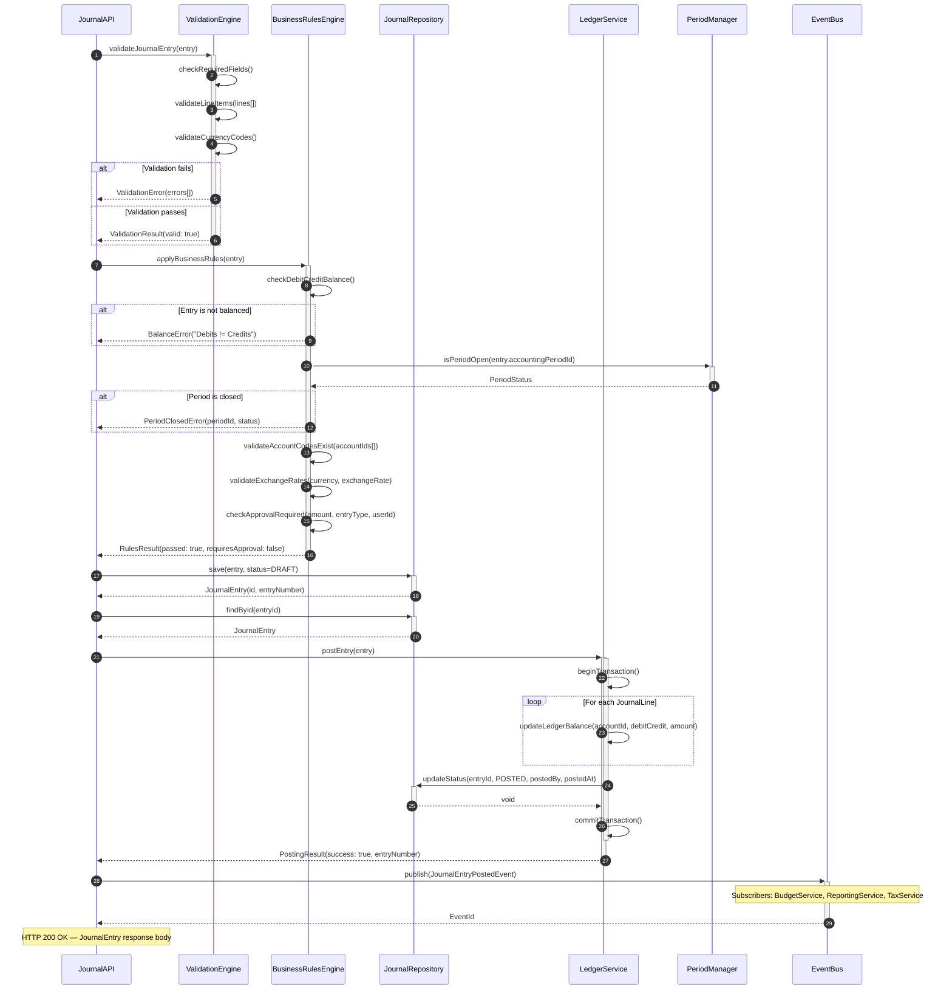
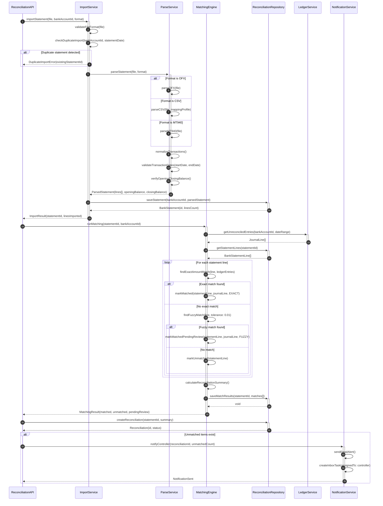
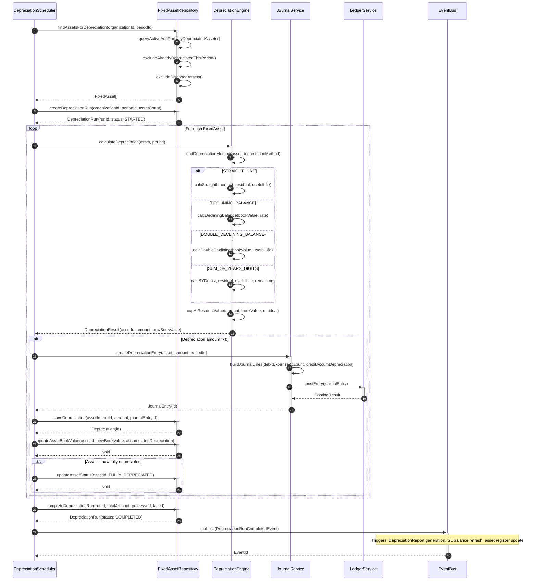

# Sequence Diagrams

## Overview

Internal component interaction sequence diagrams for key workflows in the Finance Management System. All diagrams model the flow between services, repositories, and infrastructure components. Error paths and compensating actions are shown for each critical workflow.

---

## 1. Post Journal Entry

Posts a validated journal entry to the general ledger. Includes field validation, debit/credit balance check, period-open guard, optional approval routing, and event publication for downstream consumers.



---

## 2. Accounting Period Close

Executes the accounting period-end close sequence. Validates sub-ledger reconciliation, runs checklist items, collects CFO approval, locks the period, and publishes the close event to trigger downstream reporting.

```mermaid
sequenceDiagram
    autonumber
    participant CLOSE as PeriodCloseService
    participant CHECK as ChecklistValidator
    participant SUB as SubLedgerReconciler
    participant LEDGER as LedgerService
    participant PERIOD as PeriodManager
    participant APPROVAL as ApprovalService
    participant EVT as EventBus

    CLOSE->>+CHECK: runPreCloseChecklist(periodId)
    activate CHECK
    CHECK->>CHECK: verifyAllJournalsPosted()
    CHECK->>CHECK: verifyBankReconciliationsComplete()
    CHECK->>CHECK: verifyFixedAssetDepreciationRun()
    CHECK->>CHECK: verifyARAgingReviewed()
    CHECK->>CHECK: verifyAPAgingReviewed()
    CHECK->>CHECK: verifyIntercompanyEliminations()

    alt Checklist items incomplete
        CHECK-->>CLOSE: ChecklistError(failedItems[])
        Note over CLOSE: Process halted; controller notified
    else All items complete
        CHECK-->>-CLOSE: ChecklistResult(allPassed: true)
    end

    CLOSE->>+SUB: reconcileSubLedgers(periodId)
    activate SUB
    SUB->>SUB: reconcileAccountsPayable()
    SUB->>SUB: reconcileAccountsReceivable()
    SUB->>SUB: reconcileFixedAssets()
    SUB->>SUB: reconcilePayroll()

    alt Reconciliation differences found
        SUB-->>CLOSE: ReconciliationError(differences[])
        Note over CLOSE: Out-of-balance items must be cleared before close
    else Clean reconciliation
        SUB-->>-CLOSE: ReconciliationResult(differences: 0)
    end

    CLOSE->>+LEDGER: generateTrialBalance(periodId)
    LEDGER->>LEDGER: aggregateAllAccountBalances()
    LEDGER->>LEDGER: verifyDebitCreditEquality()

    alt Trial balance out of balance
        LEDGER-->>CLOSE: TrialBalanceError(debitTotal, creditTotal, delta)
    else Balanced
        LEDGER-->>-CLOSE: TrialBalance(debitTotal, creditTotal)
    end

    CLOSE->>+APPROVAL: requestCloseApproval(periodId, trialBalance)
    APPROVAL->>APPROVAL: notifyController()
    APPROVAL->>APPROVAL: notifyCFO()
    APPROVAL->>APPROVAL: awaitApprovals(timeout: 48h)

    alt Approval rejected
        APPROVAL-->>CLOSE: ApprovalRejected(reason, rejectedBy)
        CLOSE->>CLOSE: logRejection(periodId, reason)
    else Approved
        APPROVAL-->>-CLOSE: ApprovalGranted(approvedBy, approvedAt)
    end

    CLOSE->>+PERIOD: softClose(periodId, approvedBy)
    PERIOD->>PERIOD: setStatus(SOFT_CLOSED)
    PERIOD->>PERIOD: recordCloseTimestamp()
    PERIOD-->>-CLOSE: PeriodClosed(status: SOFT_CLOSED)

    Note over CLOSE: Hard close follows after external audit sign-off

    CLOSE->>+LEDGER: finalizeBalances(periodId)
    LEDGER->>LEDGER: lockLedgerBalances(periodId)
    LEDGER->>LEDGER: propagateOpeningBalances(nextPeriodId)
    LEDGER-->>-CLOSE: BalancesFinalized

    CLOSE->>+EVT: publish(PeriodClosedEvent)
    Note over EVT: Triggers: ReportGeneration, TaxReturn, BudgetVarianceReport
    EVT-->>-CLOSE: EventId
```

---

## 3. Bank Statement Reconciliation

Imports a bank statement file, runs the matching engine against unreconciled ledger entries, and creates reconciliation records. Unmatched items are flagged for manual review.



---

## 4. Budget Overrun Check

Validates whether a requested expense exceeds the available budget before allowing journal entry posting. Routes to an approval workflow when a soft-override policy is configured.

```mermaid
sequenceDiagram
    autonumber
    participant EXPENSE as ExpenseService
    participant BUDGET as BudgetService
    participant APPROVAL as ApprovalWorkflow
    participant JOURNAL as JournalService
    participant EVT as EventBus

    EXPENSE->>+BUDGET: checkBudgetAvailability(costCenterId, accountId, amount, periodId)
    activate BUDGET
    BUDGET->>BUDGET: findActiveBudgetLine(costCenterId, accountId, periodId)

    alt No active budget found
        BUDGET-->>EXPENSE: BudgetCheckResult(status: NO_BUDGET)
        Note over EXPENSE: Org policy determines: allow or block
    end

    BUDGET->>BUDGET: calculateCommittedAmount(costCenterId, accountId, periodId)
    BUDGET->>BUDGET: calculateActualAmount(costCenterId, accountId, periodId)
    BUDGET->>BUDGET: computeAvailableBalance(budgeted - actual - committed)
    BUDGET-->>-EXPENSE: BudgetCheckResult(available, budgeted, actual, committed, utilizationPct)

    alt Available balance >= requested amount
        EXPENSE->>EXPENSE: proceedWithExpense()
        EXPENSE->>+JOURNAL: createAndPostJournalEntry(expenseData)
        JOURNAL-->>-EXPENSE: JournalEntry(id)
        EXPENSE->>+BUDGET: updateCommitted(budgetLineId, amount)
        BUDGET-->>-EXPENSE: void

    else Budget overrun detected
        EXPENSE->>EXPENSE: evaluateOverrunPolicy(orgId, costCenterId)

        alt Policy is HARD_BLOCK
            EXPENSE-->>EXPENSE: BudgetOverrunError(shortfall, budgetLineId)
            Note over EXPENSE: Transaction rejected; user notified

        else Policy is SOFT_OVERRIDE
            EXPENSE->>+APPROVAL: initiateOverrunApproval(costCenterId, accountId, amount, shortfall)
            APPROVAL->>APPROVAL: identifyApprovers(costCenterId, overrunAmount)
            APPROVAL->>APPROVAL: createApprovalTask(approvers[], expenseDetails)
            APPROVAL->>APPROVAL: notifyApprovers()
            APPROVAL-->>-EXPENSE: ApprovalRequest(id, status: PENDING)

            Note over EXPENSE, APPROVAL: Async: approval decision delivered via webhook

            alt Approval granted
                APPROVAL->>+JOURNAL: createAndPostJournalEntry(expenseData, overrideApprovalId)
                JOURNAL-->>-APPROVAL: JournalEntry(id)
                APPROVAL->>+BUDGET: recordOverrun(budgetLineId, amount, approvalId)
                BUDGET-->>-APPROVAL: void
                APPROVAL->>+EVT: publish(BudgetOverrunApprovedEvent)
                EVT-->>-APPROVAL: EventId
            else Approval rejected
                APPROVAL->>+EVT: publish(BudgetOverrunRejectedEvent)
                EVT-->>-APPROVAL: EventId
            end
        end
    end
```

---

## 5. Fixed Asset Depreciation Run

Executes the monthly depreciation batch for all active assets in an accounting period. Calculates depreciation per method, generates journal entries, updates asset book values, and marks fully depreciated assets.


