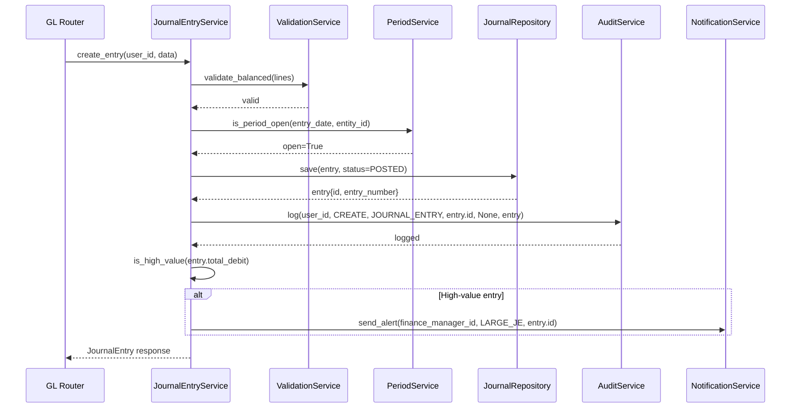
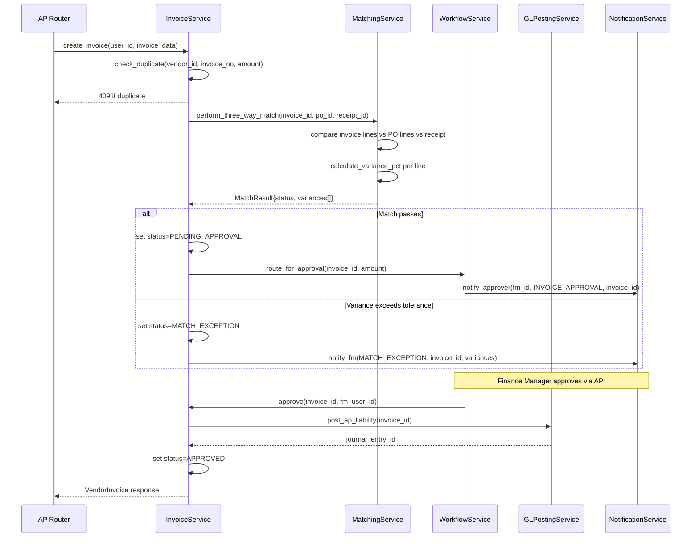
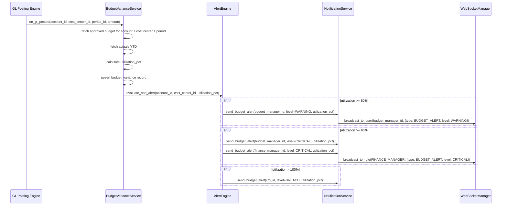
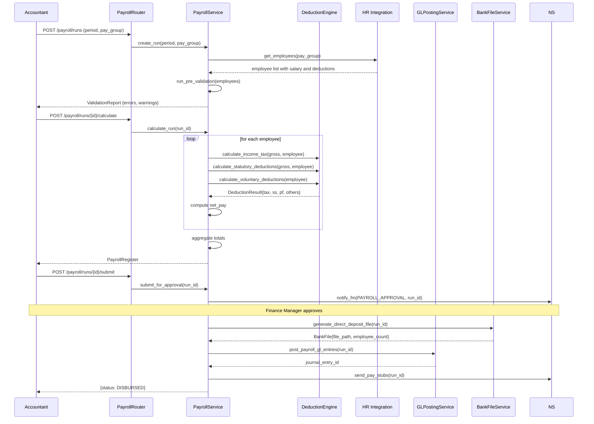
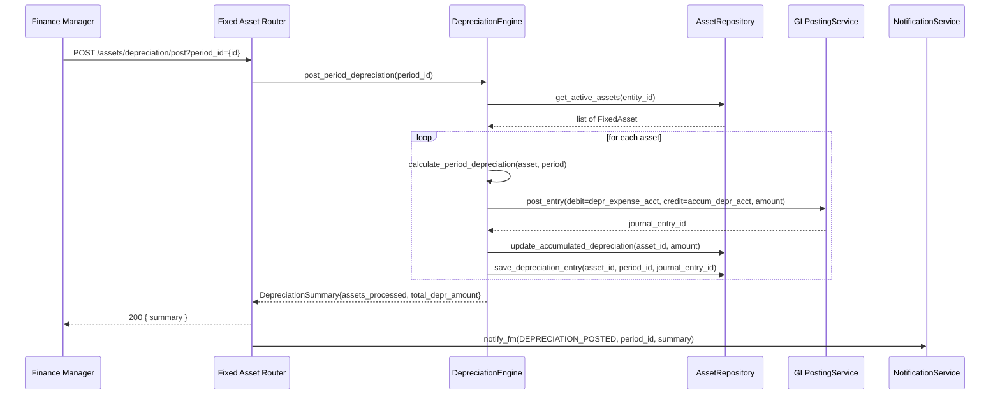

# Sequence Diagrams

## Overview
Internal component interaction sequence diagrams for key workflows in the Finance Management System.

---

## Journal Entry Creation and GL Posting

---

## 3-Way Invoice Match and Approval

---

## Budget Variance Alert on GL Posting

---

## Payroll Run: Calculate and Approve

---

## Fixed Asset Depreciation Posting at Period Close

