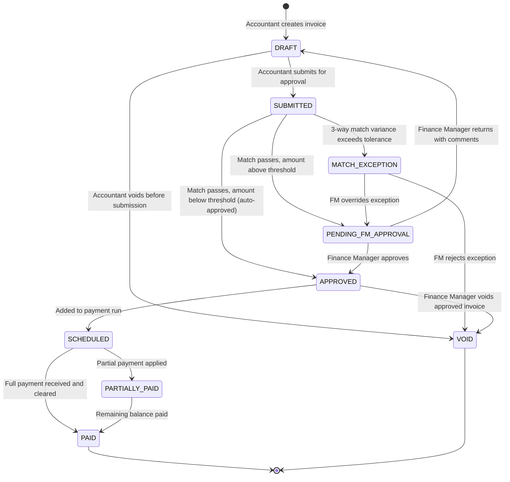
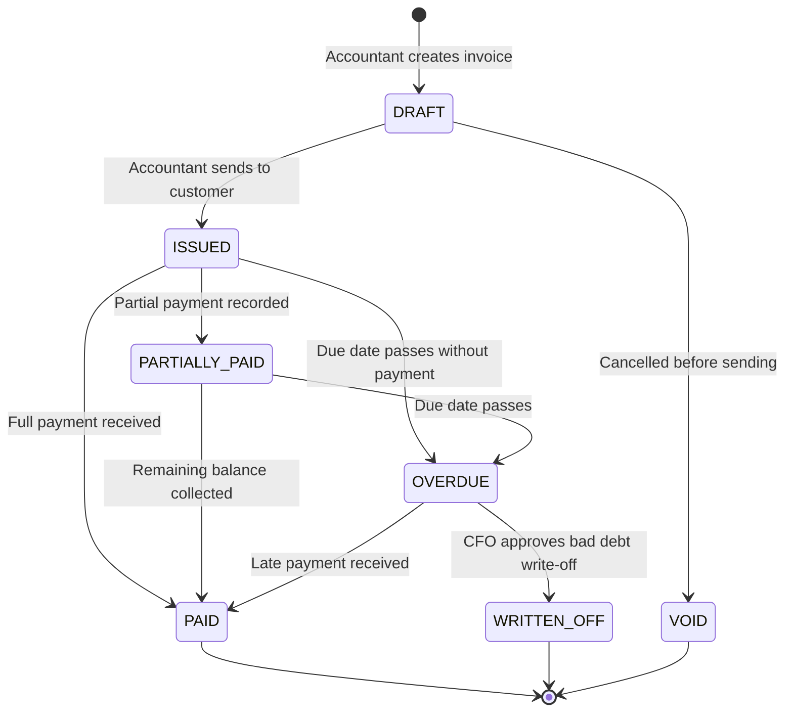
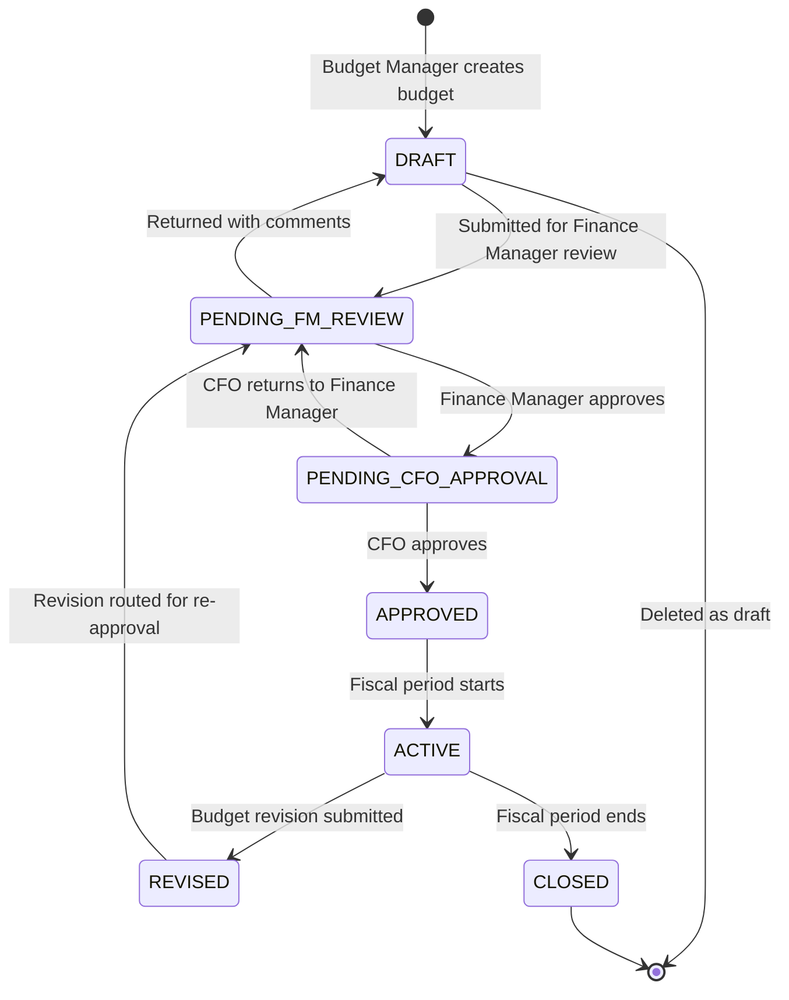
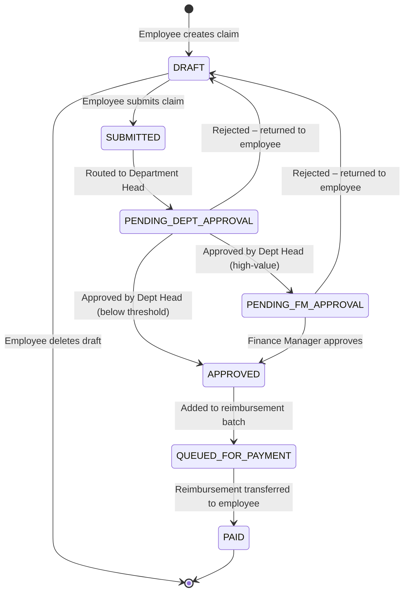
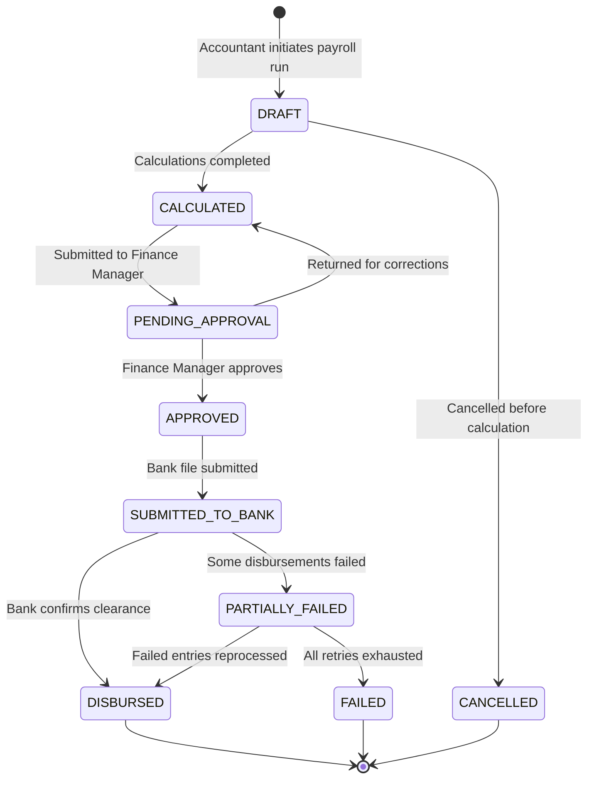
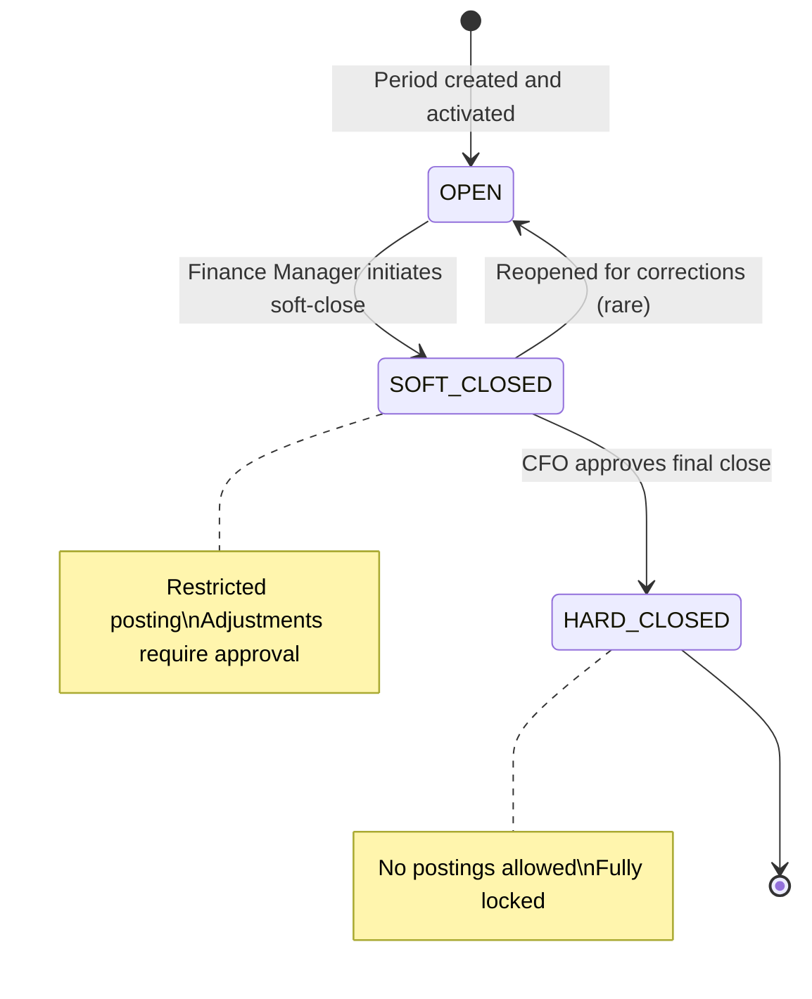
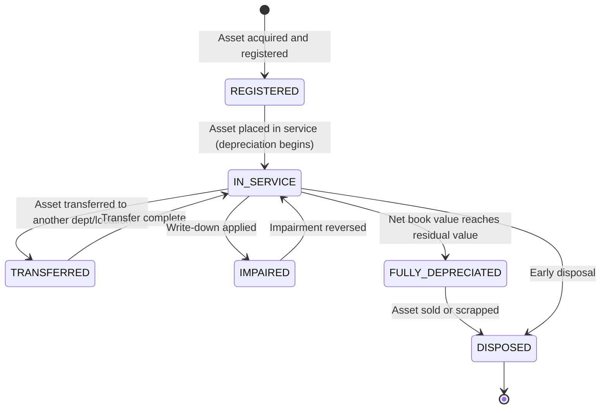
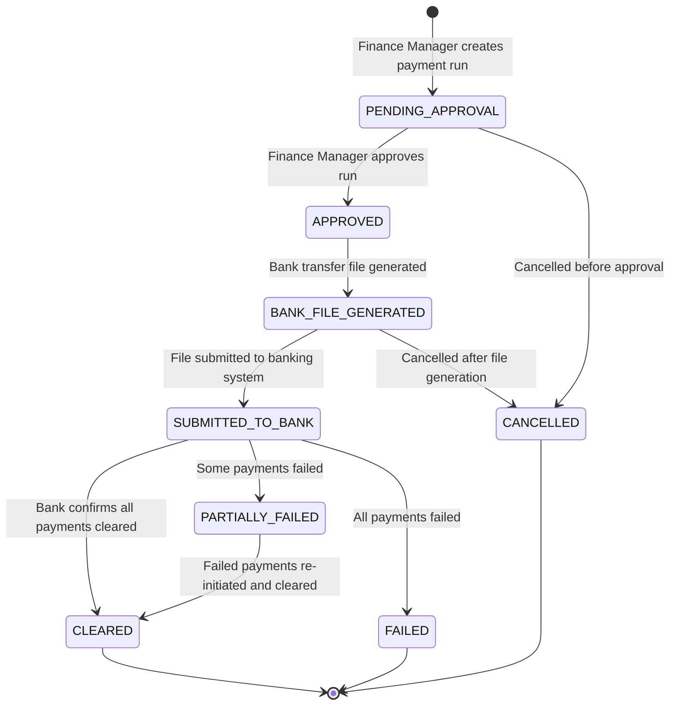

# State Machine Diagrams

## Overview
Entity state transition diagrams for the key financial documents and workflows in the Finance Management System.

---

## Vendor Invoice State Machine

---

## Customer Invoice State Machine

---

## Budget State Machine

---

## Expense Claim State Machine

---

## Payroll Run State Machine

---

## Accounting Period State Machine

---

## Fixed Asset State Machine

---

## Payment Run State Machine

