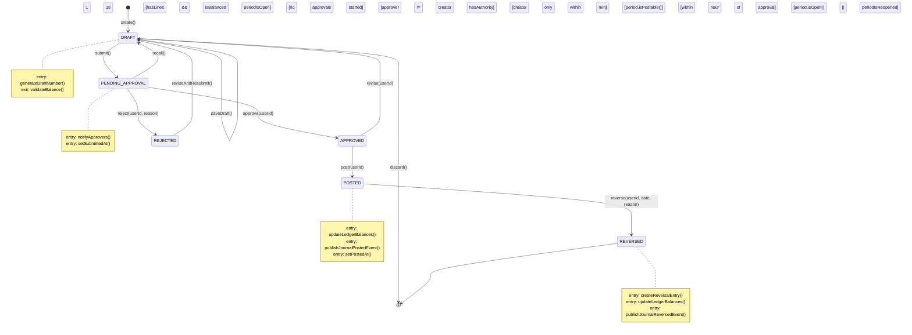
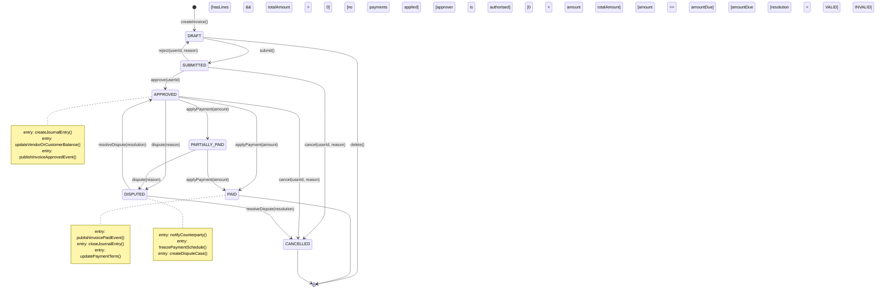
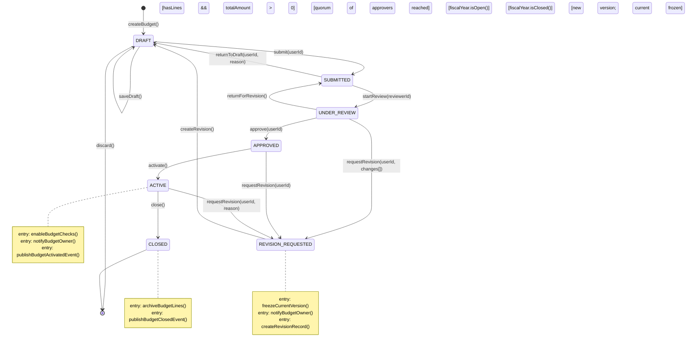
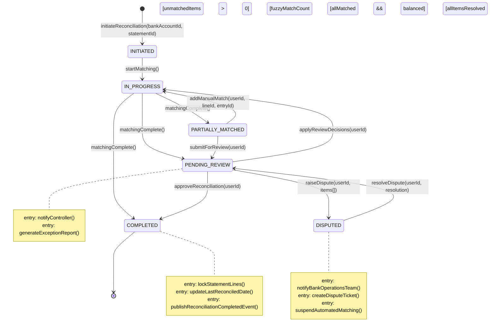

# State Machine Diagrams

## Overview

State transition diagrams for key financial domain objects in the Finance Management System. Each diagram shows valid states, transitions with trigger conditions and guards, entry/exit actions, and terminal states. Diagrams use `stateDiagram-v2` notation.

---

## 1. JournalEntry State Machine

A journal entry moves from composition through approval and posting. Once posted it is immutable; reversal creates a new offsetting entry rather than modifying the original.



**State Reference**

| State | Description |
|---|---|
| DRAFT | Entry is being composed; lines can be added or removed freely |
| PENDING_APPROVAL | Submitted for workflow approval; entry is read-only |
| APPROVED | Approved by an authorised reviewer; awaiting the posting window |
| POSTED | Permanently posted to the general ledger; fully immutable |
| REVERSED | A reversal entry has been created; this entry is effectively voided |
| REJECTED | Rejected by approver; returned to DRAFT with a mandatory reason |

---

## 2. AccountingPeriod State Machine

An accounting period progresses through a controlled close sequence. Re-opening a hard-closed period requires board-level approval and creates an immutable audit trail entry.

```mermaid
stateDiagram-v2
    [*] --> FUTURE : createPeriod()

    FUTURE --> OPEN : open()
[currentDate >= period.startDate]

    OPEN --> SOFT_CLOSED : softClose(userId)
[checklistComplete && approvalGranted]
    OPEN --> OPEN : postJournalEntry()

    SOFT_CLOSED --> HARD_CLOSED : hardClose(userId)
[auditSignOff && allAdjustmentsPosted]
    SOFT_CLOSED --> REOPENED : reopen(userId, reason)
[requires CFO approval]

    HARD_CLOSED --> REOPENED : reopen(userId, reason)
[requires board approval + audit entry]

    REOPENED --> SOFT_CLOSED : softClose(userId)
[adjustments posted && re-approved]
    REOPENED --> HARD_CLOSED : hardClose(userId)

    note right of OPEN
        entry: setOpenedAt()
        entry: propagateOpeningBalances()
        exit: runPreCloseChecklist()
    end note

    note right of SOFT_CLOSED
        entry: lockNonAdjustingEntries()
        entry: notifyControllers()
        entry: publishPeriodSoftClosedEvent()
    end note

    note right of HARD_CLOSED
        entry: lockAllEntries()
        entry: archiveLedgerBalances()
        entry: publishPeriodHardClosedEvent()
    end note

    note right of REOPENED
        entry: createAuditLogEntry(reason, approvedBy)
        entry: notifyAuditTeam()
        entry: publishPeriodReopenedEvent()
    end note
```

---

## 3. Invoice State Machine

Invoices flow from creation through approval to payment settlement. Disputes can interrupt the payment flow and require explicit resolution before the invoice proceeds.



---

## 4. Budget State Machine

A budget is drafted, reviewed, approved, and activated for spend control. Mid-year revisions create a new version while the current version remains active until the revision is approved.



---

## 5. BankReconciliation State Machine

A bank reconciliation progresses from statement import through automated matching to human review and final completion. Disputes freeze the reconciliation until the bank resolves the discrepancy.



---

## 6. FixedAsset State Machine

A fixed asset moves from capital proposal through active depreciation to eventual disposal. Each state transition generates a corresponding journal entry to maintain ledger accuracy.

```mermaid
stateDiagram-v2
    [*] --> PROPOSED : proposeAsset(assetData)

    PROPOSED --> ACTIVE : approve(userId)
[capitalised in acquisition journal]
    PROPOSED --> [*] : reject(userId, reason)

    ACTIVE --> PARTIALLY_DEPRECIATED : runDepreciation()
[0 < accumulatedDepr < cost - residual]
    ACTIVE --> DISPOSED : dispose(date, proceeds, method)
[prior to depreciation start]

    PARTIALLY_DEPRECIATED --> FULLY_DEPRECIATED : runDepreciation()
[bookValue == residualValue]
    PARTIALLY_DEPRECIATED --> DISPOSED : dispose(date, proceeds, method)

    FULLY_DEPRECIATED --> DISPOSED : dispose(date, proceeds, method)

    DISPOSED --> [*]

    note right of ACTIVE
        entry: generateAssetCode()
        entry: createAcquisitionJournalEntry()
        entry: buildDepreciationSchedule()
        entry: publishAssetActivatedEvent()
    end note

    note right of PARTIALLY_DEPRECIATED
        entry: updateBookValue()
        entry: postDepreciationJournalEntry()
        entry: updateRemainingLifeMonths()
    end note

    note right of FULLY_DEPRECIATED
        entry: setBookValueToResidualValue()
        entry: stopDepreciationSchedule()
        entry: notifyAssetManager()
    end note

    note right of DISPOSED
        entry: calculateGainLoss()
        entry: createDisposalJournalEntry()
        entry: derecogniseFromAssetRegister()
        entry: publishAssetDisposedEvent()
    end note
```
