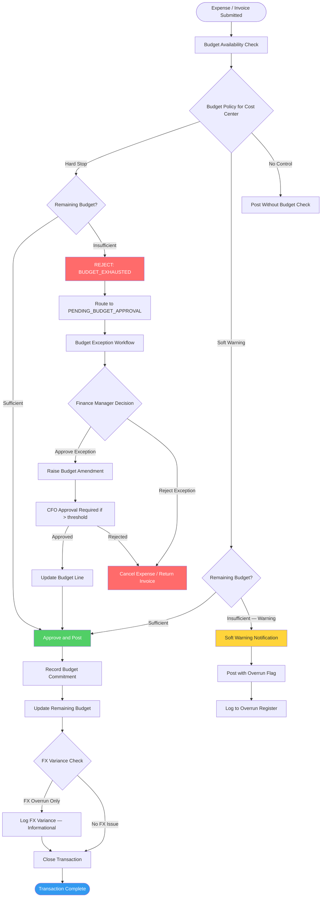

# Budgeting and Forecast Variance — Edge Cases

Edge cases for the Budget Control, Commitment Accounting, and Forecast subsystems.
Budget integrity failures range from unauthorized overspend to silent carryforward errors
that corrupt the opening position for the entire fiscal year.

---

## EC-BUD-01: Expense Posting When Budget Line Is Exhausted

**ID:** EC-BUD-01
**Title:** AP invoice posted against a cost center with zero remaining budget
**Description:** Cost center CC-402 (Marketing) has a Q3 budget of $80,000. By mid-August,
$80,000 has been fully consumed. A vendor invoice for $5,200 arrives and the AP clerk attempts
to code it to CC-402. The system must enforce the budget control policy — which is configured
as a "hard stop" for this cost center — and prevent the posting.
**Trigger Condition:** `POST /invoices` where `cost_center_id = CC-402` and
`remaining_budget(CC-402, current_period) = 0`.
**Expected System Behavior:** The invoice cannot be saved in `APPROVED` status. The system
returns HTTP 422 with error code `BUDGET_EXHAUSTED` including: cost center name, budget
amount, amount consumed to date, and the policy (hard stop vs. soft warning). The invoice
is saved as `PENDING_BUDGET_APPROVAL` and routed to the Finance Manager for exception
approval with a budget overrun justification workflow.
**Detection Signal:** Budget control engine logs `BUDGET_EXHAUSTED` event with cost center,
invoice ID, amount, and requestor. Budget dashboard shows CC-402 at 100% utilization.
Alert sent to cost center owner and Finance Manager.
**Recovery / Mitigation:** Finance Manager reviews the business case. If approved, a budget
amendment is raised to increase the CC-402 Q3 allocation by the required amount with CFO
approval. If rejected, the invoice is re-coded to a different cost center or returned to
the vendor. Retrospective: review whether budget was set correctly at the start of the period.
**Risk Level:** High

---

## EC-BUD-02: Budget Revision Requested After Period Close

**ID:** EC-BUD-02
**Title:** Budget amendment submitted for a period that has already been hard-closed
**Description:** A department head submits a budget revision to increase CC-210's Q2 budget
by $30,000 after the Q2 period has been hard-closed and Q2 financials have been distributed.
Allowing a retroactive budget revision would misrepresent the variance analysis for Q2 and
invalidate the board-approved budget that formed the basis of the distributed reports.
**Trigger Condition:** `POST /budget/revisions` with `effective_period = Q2-2024` when
`periods WHERE id = Q2-2024 AND status = 'HARD_CLOSED'`.
**Expected System Behavior:** The budget revision API rejects the request with HTTP 422,
error code `BUDGET_REVISION_CLOSED_PERIOD`. The error message states: "Budget revisions
cannot be applied to a hard-closed period. Submit a revision for the current open period
(Q3-2024) and note the retroactive intent in the justification field." The system logs the
rejected revision attempt with actor ID for audit.
**Detection Signal:** Rejected revision logged to `budget_revision_audit_log` with status
`REJECTED_CLOSED_PERIOD`. Alert sent to Finance Manager if revision amount exceeds materiality.
**Recovery / Mitigation:** Redirect the budget revision to the current open period. The
controller adds a narrative note in the budget commentary explaining the prior-period context.
For variance reporting, include a "prior-period adjustment" footnote in the management accounts.
**Risk Level:** Medium

---

## EC-BUD-03: Cost Center Deleted While Active Budget Lines Exist

**ID:** EC-BUD-03
**Title:** Cost center deactivation orphans budget lines and blocks expense posting
**Description:** IT Operations deactivates cost center CC-310 (Infrastructure) as part of a
reorganization. The HR system propagates the deactivation to Finance. However, CC-310 has
$420,000 in active budget lines for FY-2024 and 12 open purchase orders coded to it.
Attempting to post invoices against those POs fails because the cost center no longer exists.
**Trigger Condition:** `cost_center.status` is set to `INACTIVE` while
`budget_lines WHERE cost_center_id = CC-310 AND period_year = current_year AND amount > 0`.
**Expected System Behavior:** The cost center deactivation API must validate that no active
budget lines, open purchase orders, or unposted invoices reference the cost center before
allowing deactivation. If blockers exist, deactivation returns HTTP 422 with
`COST_CENTER_HAS_ACTIVE_COMMITMENTS` and a list of blocking items. The system requires the
requesting team to re-code all active items to the successor cost center before deactivation.
**Detection Signal:** Deactivation API returns 422. Blocker list surfaced with PO numbers,
invoice IDs, and budget line IDs. Notification to Finance Manager and department head.
**Recovery / Mitigation:** Re-code all open POs and budget lines to the successor cost center
(e.g., CC-311) via a bulk re-coding workflow requiring Finance Manager approval. Re-run
budget commitment reports after re-coding to confirm zero balance on CC-310. Then proceed
with deactivation.
**Risk Level:** High

---

## EC-BUD-04: Currency Fluctuation Causes Budget Overrun in Functional Currency

**ID:** EC-BUD-04
**Title:** Approved EUR budget overspent in USD functional currency due to FX movement
**Description:** A European project has a board-approved budget of €500,000 (converted to
$545,000 at the budget rate of 1.09). By Q3, the EUR/USD spot rate rises to 1.18. The project
has only spent €470,000 (within the EUR budget), but in functional currency (USD) the spend
is $554,600 — $9,600 over the USD budget threshold. The FX overrun is not the department's
fault but must still be reported and managed.
**Trigger Condition:** FX revaluation of committed/actual spend in functional currency
exceeds the budget amount that was locked at the original budget FX rate.
**Expected System Behavior:** The budget control engine must distinguish between `OPERATING_OVERRUN`
(overspend in transaction currency) and `FX_OVERRUN` (overrun purely due to rate movement).
FX overruns generate an informational alert and add the item to the "FX Variance Review"
report but do not trigger the hard-stop budget control. The controller reviews FX variances
monthly and approves adjustments or hedging actions.
**Detection Signal:** Budget FX variance report shows `functional_currency_spend >
budgeted_functional_amount` for currency-exposed cost centers. Monthly alert to Controller.
**Recovery / Mitigation:** Controller decides: (1) adjust the functional-currency budget to
reflect current rates, (2) initiate FX hedging for the remaining commitment, or (3) accept
the FX loss and adjust the forecast. Document the decision in the budget narrative.
**Risk Level:** Medium

---

## EC-BUD-05: Budget Approval Rejected but Expense Already Committed

**ID:** EC-BUD-05
**Title:** Purchase order commitment recorded before budget approval workflow completes
**Description:** A PO for $85,000 is raised. The system records a budget commitment for
$85,000 immediately on PO creation (before the budget approval workflow completes). The
budget approver then rejects the budget exception request. The PO is cancelled, but the
commitment encumbrance is not released, leaving a phantom $85,000 commitment that overstates
consumed budget and understates available budget.
**Trigger Condition:** A PO commitment is recorded to `budget_commitments` before the
associated budget approval workflow reaches `APPROVED` status, and the PO is subsequently
cancelled or rejected.
**Expected System Behavior:** Budget commitments must only be recorded after the PO reaches
`APPROVED` status and the budget check passes. On PO cancellation, the system must
immediately release the commitment encumbrance in the same transaction. A post-cancellation
reconciliation job verifies that `SUM(commitments) = SUM(active_approved_pos)` daily.
**Detection Signal:** Budget commitment reconciliation job: `sum(budget_commitments) !=
sum(active_po_amounts)`. Delta alert if non-zero. Stale commitment age > 2 days generates P3 alert.
**Recovery / Mitigation:** Run the commitment reconciliation repair job to identify and
release orphaned commitments. Validate the corrected available budget for affected cost
centers. Reprocess any purchases that were incorrectly blocked by the phantom overrun.
**Risk Level:** High

---

## EC-BUD-06: Negative Budget Line from Incorrect Revision

**ID:** EC-BUD-06
**Title:** Budget revision reduces line below zero, creating a negative approved budget
**Description:** A budget analyst submits a revision to reduce CC-501's travel budget by
$15,000. The current budget line is $12,000. The revision is approved without validation,
resulting in a budget line of -$3,000. Any subsequent expense posting for travel at CC-501
immediately shows a 100%+ overrun, even for a $1 expense, triggering false budget control alerts.
**Trigger Condition:** `budget_revision.delta` is negative and
`ABS(delta) > current_budget_line_amount`, resulting in `new_amount < 0`.
**Expected System Behavior:** The budget revision engine must validate that
`current_amount + delta >= 0`. A revision that would result in a negative budget line is
rejected with HTTP 422, error code `REVISION_WOULD_CREATE_NEGATIVE_BUDGET`. If a zero budget
is intended (line elimination), the revision must explicitly set the `amount = 0` with reason
code `BUDGET_LINE_ELIMINATED`.
**Detection Signal:** Database constraint: `CHECK (budget_line_amount >= 0)`. Any bypass of
this constraint generates a P1 data integrity alert.
**Recovery / Mitigation:** Identify and correct negative budget lines via an adjustment
revision. Re-run budget utilization reports for affected cost centers. Enforce the
non-negative constraint at both API validation and database constraint levels.
**Risk Level:** Medium

---

## EC-BUD-07: Budget Carryforward Calculation Error at Fiscal Year Boundary

**ID:** EC-BUD-07
**Title:** Unspent budget from FY-2023 not correctly carried forward to FY-2024
**Description:** The fiscal year-end carryforward job is configured to carry forward 50% of
unspent capital budget lines. Due to a bug in the carryforward calculation, the job uses
`actual_spend` instead of `budget_amount - actual_spend` as the carry-forward base.
For a cost center with $100,000 budget and $60,000 spent, the carried forward amount is
$30,000 (50% of $60,000) instead of the correct $20,000 (50% of $40,000 unspent).
**Trigger Condition:** Fiscal year-end carryforward job computes `carryforward = actual_spend * rate`
instead of `carryforward = (budget_amount - actual_spend) * rate`.
**Expected System Behavior:** The carryforward formula must be: `carryforward =
MAX(0, (budget_amount - actual_spend) * carryforward_rate)`. The carryforward job produces
a detailed reconciliation report showing, for each cost center: prior-year budget, spend,
unspent amount, carryforward rate, and carryforward amount. The Controller reviews this
report before opening balances are loaded into FY-2024.
**Detection Signal:** Year-end budget reconciliation report shows total carryforward
amounts that do not equal `sum(unspent_budget * configured_rate)` across all eligible lines.
**Recovery / Mitigation:** Correct the carryforward formula. Re-run the carryforward job
in a staging environment. The Controller reviews the corrected carryforward amounts against
the original calculation, approves the delta adjustment, and posts correcting budget entries
to FY-2024 opening balances.
**Risk Level:** High

---

## EC-BUD-08: Concurrent Budget Revision Submissions Creating Conflict

**ID:** EC-BUD-08
**Title:** Two finance analysts submit competing budget revisions for the same line simultaneously
**Description:** Analyst A submits a revision to increase CC-201 marketing budget by $20,000.
Analyst B simultaneously submits a revision to decrease the same line by $10,000. Both read
the current budget of $100,000. Without concurrency control, Analyst A's revision writes
$120,000 and Analyst B's revision writes $90,000. The last writer wins, and one revision is
silently lost. The Controller approves both revisions but only one takes effect.
**Trigger Condition:** Two `POST /budget/revisions` requests for the same `budget_line_id`
are processed concurrently without a row-level lock or optimistic concurrency check.
**Expected System Behavior:** The budget revision engine must use optimistic locking with a
`version` field on `budget_lines`. Each revision request includes the `version` it read.
On commit, if the stored version has advanced, the second writer receives HTTP 409
`BUDGET_LINE_VERSION_CONFLICT` and is asked to re-read and resubmit. The audit log records
both attempts and the resolution.
**Detection Signal:** HTTP 409 responses on budget revision endpoints. Budget revision
conflict metric: `budget_revision_conflicts_per_day`. Alert if conflicts exceed 5/day.
**Recovery / Mitigation:** The rejected revision submitter re-reads the current budget line
state (which now includes the first revision) and resubmits against the updated version.
Both revisions are eventually applied sequentially. The budget line audit trail shows both
revision events with their submitters.
**Risk Level:** Medium

---

## EC-BUD-09: Budget Line Allocated to Deleted Project or Cost Center

**ID:** EC-BUD-09
**Title:** Budget lines reference a project ID that has been archived, breaking utilization reporting
**Description:** Project PRJ-2024-007 is archived mid-year after early completion. Budget
lines totaling $180,000 were allocated to this project. After archival, the budget utilization
report cannot resolve the project name and displays `[UNKNOWN PROJECT]` for 12 budget lines,
making it impossible to understand $180,000 of budget allocation in board reports.
**Trigger Condition:** A project or cost center is archived/deleted while `budget_lines WHERE
project_id = PRJ-2024-007 AND fiscal_year = current_year` exist with non-zero amounts.
**Expected System Behavior:** Projects and cost centers must not be hard-deleted while active
budget lines reference them. Archival is permitted but the `project_id` foreign key must
remain resolvable (soft-delete with `status=ARCHIVED`). Budget reports must display archived
project names with an `[ARCHIVED]` suffix for transparency.
**Detection Signal:** Budget utilization report contains `[UNKNOWN PROJECT]` or null values.
Alert: `orphaned_budget_lines > 0` after any project/cost center archival operation.
**Recovery / Mitigation:** Restore the project reference to soft-deleted status. Re-code
active budget lines to the appropriate successor project. Update the archival workflow to
block hard-deletion of any entity referenced by active financial records.
**Risk Level:** Medium

---

## EC-BUD-10: Forecast Variance Exceeds Materiality Threshold Without Alert

**ID:** EC-BUD-10
**Title:** Monthly forecast vs. actuals variance exceeds 10% threshold but no alert fires
**Description:** The November forecast for total operating expenses is $2,400,000. Actual
expenses come in at $2,760,000 — a $360,000 (15%) unfavorable variance. The variance alert
rule was configured with a fixed dollar threshold of $500,000 rather than a percentage-based
threshold, so no alert fires. The Finance team does not discover the material variance until
the board meeting, causing a credibility issue.
**Trigger Condition:** Forecast variance alert rule uses an absolute dollar threshold that
is set above the actual variance amount, even though the variance is material as a percentage.
**Expected System Behavior:** Variance alert rules must support both absolute dollar
thresholds AND percentage-based thresholds. Alerts fire when either condition is met:
`ABS(forecast - actual) > absolute_threshold OR ABS(forecast - actual) / forecast > pct_threshold`.
Default thresholds: $50,000 absolute or 5% relative (whichever is lower). The alert is sent
to the FP&A team with a breakdown by cost center showing the top 5 drivers.
**Detection Signal:** Variance alert metric: `forecast_actual_variance_pct > configured_pct_threshold`.
This metric must be monitored independently of the alert configuration to detect misconfiguration.
**Recovery / Mitigation:** Reconfigure the variance alert rules to use the dual threshold
model. Back-test the rule against the past 12 months of data to validate it would have fired
correctly. For the current period, produce a variance analysis memo for the board explaining
the drivers of the $360,000 overrun.
**Risk Level:** High

---

## Budget Overrun Handling Flow

- Invalid or stale upstream state transitions
- Concurrency collisions and duplicate processing
- Missing enrichment data at decision points
- User-initiated cancellation during in-flight operations

## Detection
- Domain validation errors with structured reason codes
- Latency/error-rate anomalies on critical endpoints
- Data consistency checks and reconciliation deltas

## Recovery
- Idempotent retries with bounded backoff
- Compensation workflows for partial completion
- Operator runbook with manual override controls

## Implementation-Ready Finance Control Expansion

### 1) Accounting Rule Assumptions (Detailed)
- Ledger model is strictly double-entry with balanced journal headers and line-level dimensional tagging (entity, cost-center, project, product, counterparty).
- Posting policies are versioned and time-effective; historical transactions are evaluated against the rule version active at transaction time.
- Currency handling requires transaction currency, functional currency, and optional reporting currency; FX revaluation and realized/unrealized gains are separated.
- Materiality thresholds are explicit and configurable; below-threshold variances may auto-resolve only when policy explicitly allows.

### 2) Transaction Invariants and Data Contracts
- Every command/event must include `transaction_id`, `idempotency_key`, `source_system`, `event_time_utc`, `actor_id/service_principal`, and `policy_version`.
- Mutations affecting posted books are append-only. Corrections use reversal + adjustment entries with causal linkage to original posting IDs.
- Period invariant checks: no unapproved journals in closing period, all sub-ledger control accounts reconciled, and close checklist fully attested.
- Referential invariants: every ledger line links to a provenance artifact (invoice/payment/payroll/expense/asset/tax document).

### 3) Reconciliation and Close Strategy
- Continuous reconciliation cadence:
  - **T+0/T+1** operational reconciliation (gateway, bank, processor, payroll outputs).
  - **Daily** sub-ledger to GL tie-out.
  - **Monthly/Quarterly** close certification with controller sign-off.
- Exception taxonomy is mandatory: timing mismatch, mapping/config error, duplicate, missing source event, external counterparty variance, FX rounding.
- Close blockers are machine-detectable and surfaced on a close dashboard with ownership, ETA, and escalation policy.

### 4) Failure Handling and Operational Recovery
- Posting pipeline uses outbox/inbox patterns with deterministic retries and dead-letter quarantine for non-retriable payloads.
- Duplicate delivery and partial failure scenarios must be proven safe through idempotency and compensating accounting entries.
- Incident runbooks require: containment decision, scope quantification, replay/rebuild method, reconciliation rerun, and financial controller approval.
- Recovery drills must be executed periodically with evidence retained for audit.

### 5) Regulatory / Compliance / Audit Expectations
- Controls must support segregation of duties, least privilege, and end-to-end tamper-evident audit trails.
- Retention strategy must satisfy jurisdictional requirements for financial records, tax documents, and payroll artifacts.
- Sensitive data handling includes classification, masking/tokenization for non-production, and secure export controls.
- Every policy override (manual journal, reopened period, emergency access) requires reason code, approver, and expiration window.

### 6) Data Lineage & Traceability (Requirements → Implementation)
- Maintain an explicit traceability matrix for this artifact (`edge-cases/budgeting-and-forecast-variance.md`):
  - `Requirement ID` → `Business Rule / Event` → `Design Element` (API/schema/diagram component) → `Code Module` → `Test Evidence` → `Control Owner`.
- Lineage metadata minimums: source event ID, transformation ID/version, posting rule version, reconciliation batch ID, and report consumption path.
- Any change touching accounting semantics must include impact analysis across upstream requirements and downstream close/compliance reports.
- Documentation updates are blocking for release when they alter financial behavior, posting logic, or reconciliation outcomes.

### 7) Phase-Specific Implementation Readiness
- Enumerate non-happy paths with trigger, detection signal, blast radius, temporary containment, and permanent fix.
- Include deterministic replay policy (ordering, dedupe, windowing) for out-of-order and late-arriving events.
- For manual interventions, require maker-checker approvals and post-action reconciliation evidence.

### 8) Implementation Checklist for `budgeting and forecast variance`
- [ ] Control objectives and success/failure criteria are explicit and testable.
- [ ] Data contracts include mandatory identifiers, timestamps, and provenance fields.
- [ ] Reconciliation logic defines cadence, tolerances, ownership, and escalation.
- [ ] Operational runbooks cover retries, replay, backfill, and close re-certification.
- [ ] Compliance evidence artifacts are named, retained, and linked to control owners.

