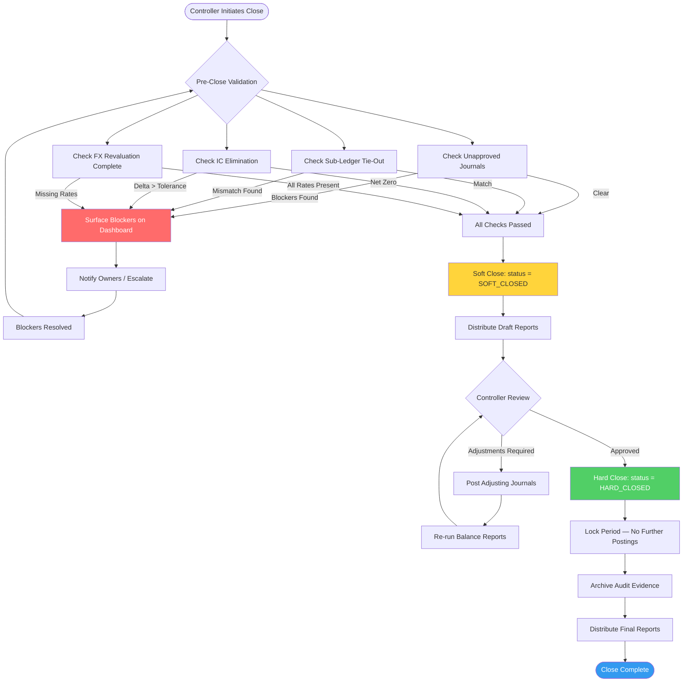

# Ledger Consistency and Period Close — Edge Cases

Edge cases for the General Ledger, Journal Engine, and Period Management subsystems.
These scenarios represent the highest-risk failure modes in the Finance system: an undetected
ledger inconsistency can propagate silently into statutory financial statements.

---

## EC-LCD-01: Concurrent Journal Posts to Same Period Causing Balance Conflicts

**ID:** EC-LCD-01
**Title:** Concurrent journal posts cause debit/credit imbalance in period aggregate
**Description:** Two batch processes simultaneously post journals to the same accounting period
and cost-center combination. Both read the current period balance, compute their delta, and
write back. The second write overwrites the first, causing the period aggregate to reflect
only one of the two postings — a silent balance understatement.
**Trigger Condition:** Two `POST /journals` requests with identical `period_id` and
`cost_center_id` execute within the same database transaction window without row-level locking.
**Expected System Behavior:** The ledger service must acquire an optimistic lock (version
token) on the period-cost-center aggregate row before writing. On conflict, the second writer
receives HTTP 409 and retries with exponential backoff. The final aggregate reflects both
postings atomically.
**Detection Signal:** Period balance reconciliation job reports `sum(journal_lines.amount) !=
period_aggregate.balance`. Alert threshold: any non-zero delta triggers P1.
**Recovery / Mitigation:** Re-run the period balance recalculation job against the raw journal
lines table as the source of truth. Apply pessimistic locking (`SELECT FOR UPDATE`) on
period aggregate rows in high-contention windows (month-end batch). Add a daily reconciliation
assertion: `SUM(debit_lines) - SUM(credit_lines) = 0` per period per entity.
**Risk Level:** Critical

---

## EC-LCD-02: Partial Failure During Multi-Line Journal Entry Posting

**ID:** EC-LCD-02
**Title:** Partial journal write leaves ledger in unbalanced state
**Description:** A journal entry with 8 lines (4 debits, 4 credits) begins posting. The
database write succeeds for lines 1–6, then the application node crashes. Lines 7–8 are never
written. The journal header shows `status=POSTING` indefinitely, and the period reflects a
DR/CR imbalance equal to the value of the missing lines.
**Trigger Condition:** Application crash, OOM kill, or network partition occurs mid-way
through a multi-statement journal line insert batch outside a single database transaction.
**Expected System Behavior:** All journal lines for a single journal header must be wrapped
in a single ACID database transaction. On failure, the entire transaction rolls back. The
journal header reverts to `status=DRAFT`. The idempotency key remains reserved so the
originating system can safely re-submit.
**Detection Signal:** Monitoring query: `SELECT * FROM journal_headers WHERE status =
'POSTING' AND updated_at < NOW() - INTERVAL '5 minutes'`. Any result is a P1 alert.
**Recovery / Mitigation:** Invoke the journal reconciliation repair job: it identifies headers
stuck in `POSTING`, validates whether lines are complete, rolls back incomplete ones, and
republishes the original command from the outbox for replay. Confirm balance invariant
(`DR = CR`) after repair before marking period healthy.
**Risk Level:** Critical

---

## EC-LCD-03: Period Close Attempted While Unapproved Journals Exist

**ID:** EC-LCD-03
**Title:** Soft close blocked by journals in PENDING_APPROVAL status
**Description:** The Controller initiates the month-end soft close. The close job queries
the period for blocking conditions and finds 14 journal entries in `PENDING_APPROVAL`. The
system must not allow the period to transition to `SOFT_CLOSED` while material unapproved
journals exist, as their outcome is unknown and the period balance is therefore indeterminate.
**Trigger Condition:** `POST /periods/{id}/close` is called when
`COUNT(journals WHERE period_id = id AND status = 'PENDING_APPROVAL') > 0`.
**Expected System Behavior:** The close API returns HTTP 422 with error code
`CLOSE_BLOCKED_UNAPPROVED_JOURNALS` and a payload listing each blocking journal ID, its
amount, owner, and days pending. The period status does not change. The close checklist
dashboard surfaces the blockers with escalation owners.
**Detection Signal:** Close attempt returns 422. The close dashboard shows red status on the
"Unapproved Journals" checklist item with count and aging. Slack alert sent to journal owners.
**Recovery / Mitigation:** Approvers review and approve or reject all pending journals.
Journals pending > 5 days auto-escalate to the Finance Manager. After all journals reach
terminal status (`POSTED` or `REJECTED`), re-attempt close. Auto-rejection policy for
immaterial journals (< materiality threshold) may be configured to unblock close.
**Risk Level:** High

---

## EC-LCD-04: Reopening a Hard-Closed Period After Reports Are Distributed

**ID:** EC-LCD-04
**Title:** Hard-closed period reopen invalidates already-distributed statutory reports
**Description:** A period is hard-closed and the quarterly P&L has been distributed to
the board and filed with regulators. A discovered posting error prompts a request to reopen
the period to post a correcting journal. Reopening and reposting would silently change the
numbers underlying the distributed report without issuing a formal amendment.
**Trigger Condition:** `POST /periods/{id}/reopen` is called on a period with
`close_type=HARD_CLOSE` and `distributed_reports` list is non-empty.
**Expected System Behavior:** The API rejects the reopen with HTTP 422, error code
`HARD_CLOSE_PERIOD_REOPEN_REQUIRES_AMENDMENT`. The system requires an explicit amendment
workflow: the Controller must acknowledge which distributed reports will be superseded,
provide a reason code from the approved taxonomy (e.g., `MATERIAL_ERROR_CORRECTION`),
obtain CFO counter-approval, and the system creates an audit event with full linkage.
**Detection Signal:** Reopen attempt on hard-closed period generates a SOX control alert
with severity HIGH, logged to the immutable audit stream with actor, timestamp, and reason.
**Recovery / Mitigation:** Use a prior-period adjustment journal posted to the current open
period (standard GAAP/IFRS treatment) rather than reopening. If reopen is unavoidable,
execute the amendment workflow, reissue corrected reports with clear "AMENDED" watermarks,
and notify all original report recipients.
**Risk Level:** Critical

---

## EC-LCD-05: Sub-Ledger Control Account Balance Mismatch at Close

**ID:** EC-LCD-05
**Title:** AP sub-ledger balance does not tie to GL control account at period close
**Description:** The Accounts Payable sub-ledger reports a total outstanding balance of
$4,820,315.00. The GL control account 2000 (Accounts Payable) shows $4,803,892.00 — a
$16,423 discrepancy. The mismatch is caused by a direct journal entry posted to account 2000
that bypassed the AP sub-ledger module, violating the cardinal rule that control accounts
must only be posted through their sub-ledger.
**Trigger Condition:** A journal line targets a control account (flagged as
`is_control_account=true`) directly rather than via the sub-ledger transaction engine.
**Expected System Behavior:** The journal engine must reject any journal line that credits or
debits a control account directly. Error: `DIRECT_POSTING_TO_CONTROL_ACCOUNT_PROHIBITED`.
If an existing mismatch is detected at close, the close job blocks with error code
`SUBLEDGER_CONTROL_MISMATCH` and surfaces the delta, the offending journal IDs, and the
reconciling items.
**Detection Signal:** Daily sub-ledger to GL tie-out job raises alert: `subledger_balance !=
gl_control_account_balance`. Delta metric published to monitoring dashboard.
**Recovery / Mitigation:** Identify the direct journal(s) that caused the bypass. Reverse
them and re-post through the correct AP/AR module so the sub-ledger is updated. Enforce
control account protection at the GL validation layer to prevent recurrence.
**Risk Level:** Critical

---

## EC-LCD-06: Intercompany Elimination Mismatch Blocking Consolidated Close

**ID:** EC-LCD-06
**Title:** IC receivable in entity A does not match IC payable in entity B
**Description:** During consolidated close, the intercompany elimination job attempts to
eliminate the $2.1M intercompany receivable in Entity A against the $2.1M intercompany
payable in Entity B. Due to a currency revaluation applied only in Entity A, the functional-
currency amounts differ by $8,400. The elimination job cannot net to zero and blocks the
consolidated close.
**Trigger Condition:** `ABS(ic_receivable_functional - ic_payable_functional) > elimination_tolerance`
during the intercompany elimination run. Default tolerance is $0 for material balances.
**Expected System Behavior:** The elimination job halts for the affected entity pair, records
the mismatch in the IC discrepancy register, and assigns ownership to the intercompany
accounting team. The consolidated close proceeds for all other entity pairs. The close
dashboard shows the blocking IC mismatch with amount, currency, and both entity contacts.
**Detection Signal:** IC elimination job log: `ELIMINATION_MISMATCH entity_pair=A-B
delta=8400 currency=USD`. Metric `ic_elimination_open_discrepancies > 0` triggers P2 alert.
**Recovery / Mitigation:** Post a reconciling FX adjustment journal in Entity B to align
functional-currency amounts. Re-run the elimination job for the affected entity pair. For
recurring mismatches, standardize revaluation timing across all intercompany entities and
enforce a matched-pair posting rule at the IC transaction level.
**Risk Level:** High

---

## EC-LCD-07: Journal Reversal Requested After Period Is Closed

**ID:** EC-LCD-07
**Title:** Automatic reversal target period is closed, orphaning the reversal
**Description:** A journal entry posted on 31-Mar with `auto_reverse=true` is scheduled to
reverse on 01-Apr. If the April period is in `PRE_CLOSE` or `SOFT_CLOSED` status when the
reversal job runs, the reversal cannot be posted, leaving the original journal unreversed
and distorting the April opening balance.
**Trigger Condition:** The daily reversal job attempts to post a reversal journal to a period
with status `PRE_CLOSE`, `SOFT_CLOSED`, or `HARD_CLOSED`.
**Expected System Behavior:** The reversal job must check the target period status before
posting. If the target period is closed, the job quarantines the reversal in a `BLOCKED_REVERSAL`
queue, generates a P2 alert, and does not post silently. The Controller is notified to either
open the next available period or approve a manual reversal into the current open period.
**Detection Signal:** `blocked_reversal_queue.size > 0` metric alert. Daily report:
"Pending Auto-Reversals" showing journal ID, original amount, and blocked target period.
**Recovery / Mitigation:** Controller approves posting the reversal into the earliest open
period, with a note referencing the original journal. Update the auto-reversal job to
validate target period status before scheduling, and alert 3 days in advance when a
reversal target period is approaching a close event.
**Risk Level:** High

---

## EC-LCD-08: Ledger Balance Calculation Overflow on Very Large Amounts

**ID:** EC-LCD-08
**Title:** Numeric overflow on cumulative ledger balance for high-volume entity
**Description:** A high-volume entity processes $50B+ annually. The cumulative GL account
balance column defined as `DECIMAL(18,2)` can hold a maximum of $9,999,999,999,999,999.99.
After several years of accumulation, an annual close triggers a balance roll-forward that
exceeds this limit, causing a database arithmetic overflow error and a failed close job.
**Trigger Condition:** `annual_balance_rollforward` job computes `opening_balance +
period_net_movement` where the result exceeds the column precision limit.
**Expected System Behavior:** The system must use `DECIMAL(28,6)` (or equivalent) for all
monetary balance columns and validate precision requirements at schema design time.
The rollforward job must validate that no intermediate calculation exceeds safe bounds
before committing, and raise an error if detected rather than silently truncating.
**Detection Signal:** Database exception: `Arithmetic overflow error converting DECIMAL`.
Pre-close validation job reports `balance_overflow_risk` for accounts where
`ABS(balance) > 0.9 * MAX_DECIMAL_VALUE`.
**Recovery / Mitigation:** Migrate balance columns to `DECIMAL(28,6)`. Run a schema
migration with zero-downtime strategy (expand-contract pattern). Backfill existing data.
Validate the rollforward job against all accounts before the next close window.
**Risk Level:** High

---

## EC-LCD-09: Duplicate Journal Entry from Idempotency Key Collision

**ID:** EC-LCD-09
**Title:** Two distinct journals share an idempotency key, causing one to be silently dropped
**Description:** System A posts a journal with `idempotency_key=INV-2024-08801-POST`. Due
to a bug in the key generation logic, System B also generates the same idempotency key for
a different invoice. The second POST is treated as a duplicate and returns the first
journal's ID, causing System B's transaction to never enter the ledger.
**Trigger Condition:** Two structurally different journal commands produce the same
`idempotency_key` value due to a hash collision or non-unique key construction formula.
**Expected System Behavior:** Idempotency keys must be globally unique and constructed from
a combination of: `source_system_id + transaction_id + transaction_type + period_id`. The
system must validate that when an idempotency key already exists, the payload hash of the
new request matches the stored payload hash. On mismatch, the system must return HTTP 409
with `IDEMPOTENCY_KEY_CONFLICT` and reject the second submission.
**Detection Signal:** HTTP 409 responses with `IDEMPOTENCY_KEY_CONFLICT` error code on
journal posts. Missing journal alert from the source system's outbox reconciliation.
**Recovery / Mitigation:** Fix the idempotency key generation to include a content hash of
the journal payload. Audit the past 90 days of idempotency key collisions via the conflict
log. For each confirmed collision, determine whether a journal was silently dropped and
post the missing entry with Controller approval.
**Risk Level:** Critical

---

## EC-LCD-10: FX Revaluation Fails Due to Missing Exchange Rate for Obscure Currency

**ID:** EC-LCD-10
**Title:** Period-end FX revaluation blocked by missing rate for minority currency
**Description:** The period-end FX revaluation job processes 47 currencies. For `MZN`
(Mozambican Metical), no rate exists in the exchange rate table for the revaluation date
because the rate provider does not publish MZN/USD daily. The revaluation job fails entirely
rather than processing the 46 successful currencies, blocking period close.
**Trigger Condition:** `FX_REVALUATION_JOB` queries `exchange_rates WHERE currency_pair =
'MZN/USD' AND rate_date = period_end_date` and returns zero rows.
**Expected System Behavior:** The revaluation job must operate on a per-currency basis.
Missing rates for individual currencies must not abort the entire job. For missing rates,
the job: (1) records the currency in `fx_revaluation_exceptions`, (2) uses the most recent
available rate with a staleness warning if within configured tolerance (e.g., 5 business days),
(3) raises a P2 alert for Controller review. The job completes for all other currencies.
**Detection Signal:** `fx_revaluation_exceptions` table has non-zero rows after job completion.
Alert: "FX revaluation incomplete — N currencies require manual rate entry."
**Recovery / Mitigation:** Controller manually enters the MZN/USD rate from a secondary
source (central bank or Bloomberg fallback) into the exchange rate table. The revaluation
job is re-run for the affected currency only. If the exposure is immaterial (below threshold),
the Controller may approve using the prior-period rate with disclosure.
**Risk Level:** High

---

## Period Close Safeguard Pipeline

- Invalid or stale upstream state transitions
- Concurrency collisions and duplicate processing
- Missing enrichment data at decision points
- User-initiated cancellation during in-flight operations

## Detection
- Domain validation errors with structured reason codes
- Latency/error-rate anomalies on critical endpoints
- Data consistency checks and reconciliation deltas

## Recovery
- Idempotent retries with bounded backoff
- Compensation workflows for partial completion
- Operator runbook with manual override controls

## Implementation-Ready Finance Control Expansion

### 1) Accounting Rule Assumptions (Detailed)
- Ledger model is strictly double-entry with balanced journal headers and line-level dimensional tagging (entity, cost-center, project, product, counterparty).
- Posting policies are versioned and time-effective; historical transactions are evaluated against the rule version active at transaction time.
- Currency handling requires transaction currency, functional currency, and optional reporting currency; FX revaluation and realized/unrealized gains are separated.
- Materiality thresholds are explicit and configurable; below-threshold variances may auto-resolve only when policy explicitly allows.

### 2) Transaction Invariants and Data Contracts
- Every command/event must include `transaction_id`, `idempotency_key`, `source_system`, `event_time_utc`, `actor_id/service_principal`, and `policy_version`.
- Mutations affecting posted books are append-only. Corrections use reversal + adjustment entries with causal linkage to original posting IDs.
- Period invariant checks: no unapproved journals in closing period, all sub-ledger control accounts reconciled, and close checklist fully attested.
- Referential invariants: every ledger line links to a provenance artifact (invoice/payment/payroll/expense/asset/tax document).

### 3) Reconciliation and Close Strategy
- Continuous reconciliation cadence:
  - **T+0/T+1** operational reconciliation (gateway, bank, processor, payroll outputs).
  - **Daily** sub-ledger to GL tie-out.
  - **Monthly/Quarterly** close certification with controller sign-off.
- Exception taxonomy is mandatory: timing mismatch, mapping/config error, duplicate, missing source event, external counterparty variance, FX rounding.
- Close blockers are machine-detectable and surfaced on a close dashboard with ownership, ETA, and escalation policy.

### 4) Failure Handling and Operational Recovery
- Posting pipeline uses outbox/inbox patterns with deterministic retries and dead-letter quarantine for non-retriable payloads.
- Duplicate delivery and partial failure scenarios must be proven safe through idempotency and compensating accounting entries.
- Incident runbooks require: containment decision, scope quantification, replay/rebuild method, reconciliation rerun, and financial controller approval.
- Recovery drills must be executed periodically with evidence retained for audit.

### 5) Regulatory / Compliance / Audit Expectations
- Controls must support segregation of duties, least privilege, and end-to-end tamper-evident audit trails.
- Retention strategy must satisfy jurisdictional requirements for financial records, tax documents, and payroll artifacts.
- Sensitive data handling includes classification, masking/tokenization for non-production, and secure export controls.
- Every policy override (manual journal, reopened period, emergency access) requires reason code, approver, and expiration window.

### 6) Data Lineage & Traceability (Requirements → Implementation)
- Maintain an explicit traceability matrix for this artifact (`edge-cases/ledger-consistency-and-close.md`):
  - `Requirement ID` → `Business Rule / Event` → `Design Element` (API/schema/diagram component) → `Code Module` → `Test Evidence` → `Control Owner`.
- Lineage metadata minimums: source event ID, transformation ID/version, posting rule version, reconciliation batch ID, and report consumption path.
- Any change touching accounting semantics must include impact analysis across upstream requirements and downstream close/compliance reports.
- Documentation updates are blocking for release when they alter financial behavior, posting logic, or reconciliation outcomes.

### 7) Phase-Specific Implementation Readiness
- Enumerate non-happy paths with trigger, detection signal, blast radius, temporary containment, and permanent fix.
- Include deterministic replay policy (ordering, dedupe, windowing) for out-of-order and late-arriving events.
- For manual interventions, require maker-checker approvals and post-action reconciliation evidence.

### 8) Implementation Checklist for `ledger consistency and close`
- [ ] Control objectives and success/failure criteria are explicit and testable.
- [ ] Data contracts include mandatory identifiers, timestamps, and provenance fields.
- [ ] Reconciliation logic defines cadence, tolerances, ownership, and escalation.
- [ ] Operational runbooks cover retries, replay, backfill, and close re-certification.
- [ ] Compliance evidence artifacts are named, retained, and linked to control owners.

