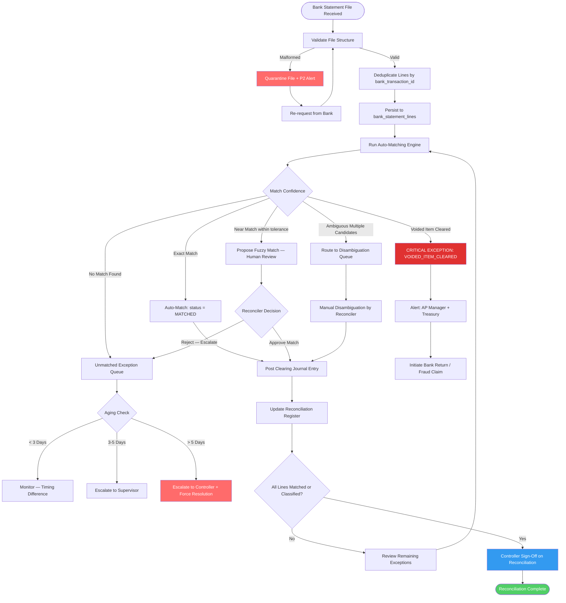

# Bank Reconciliation and Payment Settlement — Edge Cases

Edge cases for the Bank Reconciliation, Accounts Payable, and Accounts Receivable subsystems.
Unresolved reconciliation exceptions directly impact cash reporting accuracy, regulatory
filings, and payment settlement integrity.

---

## EC-REC-01: Bank Statement Import with Duplicate Transaction Lines

**ID:** EC-REC-01
**Title:** Duplicate lines in imported bank statement cause double-counting of cash
**Description:** A BAI2 bank statement file contains 320 transaction records. Due to a
transmission error, records 180–210 appear twice in the file. The import process ingests all
342 lines without deduplication, crediting the cash account twice for 30 transactions. The
resulting bank statement balance in the system is $148,230 higher than the actual bank balance.
**Trigger Condition:** The bank statement import job processes a file where `bank_transaction_id`
values appear more than once across the set of lines being ingested for a given account/date range.
**Expected System Behavior:** The import parser must deduplicate lines on `bank_transaction_id`
(or the combination of `value_date + amount + description` where no ID is present) before
writing to `bank_statement_lines`. Duplicates are logged to `import_exceptions` with reason
`DUPLICATE_LINE`. The import summary report shows deduplication count. No duplicate lines
reach the reconciliation matching engine.
**Detection Signal:** Import exception report shows `duplicate_count > 0`. Post-import check:
`SELECT bank_transaction_id, COUNT(*) FROM bank_statement_lines GROUP BY bank_transaction_id
HAVING COUNT(*) > 1` returns rows.
**Recovery / Mitigation:** Re-import the corrected file with the `deduplicate=true` flag.
If duplicates were already matched against GL entries, run the unmatched-duplicate removal
job and validate that cash account balance equals the bank statement closing balance.
**Risk Level:** Critical

---

## EC-REC-02: Amount Mismatch Due to Bank Fees Deducted from Payment

**ID:** EC-REC-02
**Title:** Wire transfer bank charges cause payment amount to differ from issued amount
**Description:** A $50,000 vendor payment is issued. The correspondent bank deducts a $35
wire transfer fee, so the bank statement shows a credit of $49,965 to the vendor's account.
The reconciliation engine cannot automatically match the $50,000 GL payment entry to the
$49,965 bank statement line, leaving both as unmatched exceptions.
**Trigger Condition:** Bank statement line amount differs from the GL payment amount by a
value that falls within a configurable bank-fee tolerance range (default: $0.01–$500).
**Expected System Behavior:** The matching engine applies a "near-match" rule: when the
absolute difference between a GL payment and a bank statement debit is within the configured
bank-fee tolerance, the system proposes a fuzzy match with confidence score and the
unmatched delta as a suggested bank-charge journal entry. A human reviewer approves the
proposed match and the system auto-posts the bank-charge entry to the designated expense account.
**Detection Signal:** Fuzzy match queue contains items. Metric: `pending_fuzzy_matches > 0`
triggers daily digest to reconciliation team. Aging alert if items remain unreviewed > 3 days.
**Recovery / Mitigation:** Configure bank-fee tolerance per bank account. Train reconciliation
staff to review the fuzzy match queue daily. Post the bank-charge difference to account 6500
(Bank Charges) via the system-generated journal. Update vendor payment instructions to specify
`OUR` (charges borne by sender) to prevent recurrence.
**Risk Level:** High

---

## EC-REC-03: Date Mismatch — Payment Posted Friday, Bank Clears Monday

**ID:** EC-REC-03
**Title:** Cut-off timing difference causes payment to remain unmatched across month-end
**Description:** A $250,000 ACH payment is posted in the GL on Friday 28-Mar (end of Q1).
The ACH network processes it over the weekend and the bank statement reflects the debit on
Monday 31-Mar (still Q1) or Tuesday 01-Apr (Q2). If the bank statement date is 01-Apr, the
payment is a Q1 GL entry with no Q1 bank statement match — a classic period cut-off difference
that must not be treated as an unreconciled exception.
**Trigger Condition:** GL payment date and bank statement value date differ by 1–3 calendar
days, spanning a period boundary.
**Expected System Behavior:** The reconciliation engine classifies such items as `TIMING_DIFFERENCE`
rather than `UNMATCHED_EXCEPTION`. Items in this category are automatically resolved when the
corresponding bank statement line arrives in a subsequent import. A "30-day outstanding items"
schedule is maintained for audit purposes showing all timing differences with their expected
clearance dates.
**Detection Signal:** `timing_difference_items` count in reconciliation dashboard. Alert if
any timing-difference item is older than 5 business days without a corresponding bank line.
**Recovery / Mitigation:** Configure the matching engine's date tolerance window (default:
±3 business days). For month-end, the Controller reviews the outstanding items schedule and
confirms all items are genuine timing differences before signing off on the bank reconciliation.
**Risk Level:** Medium

---

## EC-REC-04: Multi-Currency Bank Account with Wrong Exchange Rate Applied

**ID:** EC-REC-04
**Title:** Incorrect FX rate on import converts EUR bank statement to wrong USD equivalent
**Description:** The company holds a EUR bank account. The bank statement import applies the
exchange rate from the import timestamp (real-time rate) rather than the transaction value
date rate, which the company's accounting policy requires. A €100,000 credit posted on
01-Mar at 1.0850 EUR/USD is imported at the 15-Mar spot rate of 1.0920, creating a $700
overstatement in the GL cash balance and an FX difference that cannot be explained.
**Trigger Condition:** Bank statement import uses `import_timestamp` exchange rate rather
than `value_date` exchange rate for foreign-currency-denominated accounts.
**Expected System Behavior:** The import engine must fetch the exchange rate as of the
transaction `value_date` from the exchange rate table. If no exact rate exists for the
value date, apply the immediately prior business day rate and flag with
`RATE_DATE_APPROXIMATED`. The rate source, rate date, and rate value must be stored on each
imported bank statement line for audit traceability.
**Detection Signal:** FX reconciliation report shows unexplained FX variance on the cash
account that does not correspond to any revaluation journal. Alert on `cash_fx_variance > threshold`.
**Recovery / Mitigation:** Re-import the affected statement lines with the correct value-date
rates. Post an FX adjustment journal to correct the GL balance. Enforce value-date rate
lookup in the import service and add a validation step that cross-checks imported amounts
against the exchange rate table before committing.
**Risk Level:** High

---

## EC-REC-05: Partial Payment Matching to Invoice

**ID:** EC-REC-05
**Title:** Customer remits 90% of invoice; system cannot auto-match to full invoice amount
**Description:** Customer remits $45,000 against a $50,000 invoice, with no remittance advice
explaining the $5,000 short-pay. The auto-matching engine finds the invoice but cannot post
a full settlement because the amounts do not match. The invoice remains open for $50,000, and
the $45,000 receipt sits unallocated in the unapplied cash suspense account.
**Trigger Condition:** Incoming payment amount is between 50% and 99.9% of the open invoice
amount and no credit memo exists to explain the difference.
**Expected System Behavior:** The engine proposes a partial application: apply $45,000 to
the invoice (leaving $5,000 open), move the $5,000 difference to a `DISPUTED_BALANCE` sub-
status, and notify the AR team. The system must not leave cash in a suspense account beyond
the configured aging threshold (default: 5 business days). A dispute workflow is initiated
with the customer for the $5,000.
**Detection Signal:** `unapplied_cash_suspense.balance > 0` metric. Report: "Cash Receipts
Unallocated > 3 Days" surfaced in AR aging dashboard. Alert if suspense balance > materiality.
**Recovery / Mitigation:** AR team investigates the short-pay reason: deduction, dispute,
or error. Apply cash to the invoice with partial allocation. Create a credit memo if the
short-pay is authorized, or initiate collections for the balance. Clear the suspense account
to zero before period close.
**Risk Level:** High

---

## EC-REC-06: Bank Statement Import File Corrupted (Malformed BAI2)

**ID:** EC-REC-06
**Title:** Malformed BAI2 file causes import to fail silently, leaving reconciliation incomplete
**Description:** The bank's SFTP server delivers a BAI2 file where record type `16`
(transaction detail) contains a line truncated mid-field due to a network transmission error.
The import parser encounters the malformed record, logs a warning, and skips the remaining
lines. The import job completes with a success status, but 47 transactions from the last
two days of the month are missing from the system, creating an artificial reconciliation gap.
**Trigger Condition:** BAI2 parser encounters a malformed record (wrong field count,
non-numeric amount, or invalid date format) and continues processing rather than failing.
**Expected System Behavior:** The import job must validate the entire file structure before
committing any lines. Specifically: (1) verify record counts against the file trailer, (2)
verify that the sum of transaction amounts equals the account control totals in the BAI2
`88` record, (3) on any structural error, fail the entire import, quarantine the file, and
raise a P2 alert. No partial imports.
**Detection Signal:** Import validation error: `BAI2_CONTROL_TOTAL_MISMATCH` or
`RECORD_COUNT_MISMATCH`. Post-import check: imported line count vs. BAI2 trailer record count.
**Recovery / Mitigation:** Contact the bank to re-deliver the complete, uncorrupted file.
Re-run the import against the corrected file. If re-delivery takes > 4 hours during the
reconciliation window, request a CSV backup export from online banking for manual validation.
**Risk Level:** High

---

## EC-REC-07: Voided Payment Re-Appears on Bank Statement

**ID:** EC-REC-07
**Title:** Voided check cashed by payee after void; bank statement shows debit with no GL entry
**Description:** Check #4821 for $12,000 was voided in the system on 05-Oct. The payee
presented the physical check on 18-Oct and the bank paid it. The October bank statement shows
a debit of $12,000 that has no corresponding GL payment entry (the GL entry was reversed when
voided). The reconciliation engine shows this as an unexplained bank debit.
**Trigger Condition:** A bank statement debit line references an internal check number that
exists in the system with `status=VOIDED`.
**Expected System Behavior:** The reconciliation engine must flag any bank statement line
that matches a voided payment reference with the exception code `VOIDED_ITEM_CLEARED_AT_BANK`.
This is a critical financial control exception, not a routine timing difference. An immediate
alert is sent to the AP Manager and Treasury team. The bank is contacted to initiate a return
or investigation. No auto-matching is performed.
**Detection Signal:** Matching engine exception: `VOIDED_ITEM_CLEARED_AT_BANK`. The item
appears on the "Outstanding Control Exceptions" report in the reconciliation dashboard.
Notification sent to AP Manager and Treasury within 15 minutes of detection.
**Recovery / Mitigation:** Contact the bank's fraud/operations team to return the funds or
open an unauthorized debit claim. If the bank cannot reverse, post a manual journal:
DR Fraud Loss / DR Recovery Receivable, CR Cash. Escalate to Controller. Issue a stop payment
on all remaining voided checks. Review void procedures to ensure physical check destruction.
**Risk Level:** Critical

---

## EC-REC-08: Two Identical Transactions in Same Period Requiring Manual Disambiguation

**ID:** EC-REC-08
**Title:** Two legitimate identical-amount payments to same vendor in same week cannot be auto-matched
**Description:** Vendor ABC is paid $8,500 on 12-Nov and again on 15-Nov (two separate
invoices). The bank statement shows two debits of $8,500 with the same payee name and no
distinguishing reference. The auto-matching engine has two GL payment entries and two bank
lines, all with the same amount and payee, and cannot determine which GL entry corresponds
to which bank line.
**Trigger Condition:** Matching engine finds `N > 1` candidate GL entries and `N > 1` bank
statement lines for the same payee and amount within the matching date window.
**Expected System Behavior:** The engine must not arbitrarily assign matches when ambiguous.
It must route all ambiguous items to the "Manual Disambiguation" queue, presenting the
reconciler with the full set of candidates sorted by date proximity. The reconciler selects
the correct pairing. The system records the reconciler's selection with a timestamp and
user ID for audit purposes.
**Detection Signal:** Metric: `manual_disambiguation_queue.count > 0`. Daily digest sent
to reconciliation team. Alert if items age beyond 3 business days.
**Recovery / Mitigation:** Reconciler reviews the dates and any available remittance
references to match each payment to its invoice. Enforce unique payment reference numbers
on all outbound payments (e.g., include invoice ID in the bank reference field) to prevent
recurrence.
**Risk Level:** Medium

---

## EC-REC-09: Reconciliation Gap After System Outage and Bank Statement Replay

**ID:** EC-REC-09
**Title:** System outage during reconciliation window causes statement lines to be replayed out of order
**Description:** A 4-hour system outage occurs during the bank statement import window on
the last business day of the month. When the system recovers, the automatic import job
re-runs and reimports the full month's statement. Because the daily import for 29-Oct had
already run successfully before the outage, the 29-Oct lines are now duplicated in the
system from the full-month re-import.
**Trigger Condition:** Full statement re-import executed after a partial import had already
succeeded for a subset of the statement period.
**Expected System Behavior:** The import engine must implement idempotent line ingestion.
Each bank statement line is identified by the composite key `(account_id, value_date,
bank_transaction_id)`. On re-import, existing lines are skipped (not duplicated) and the
import summary shows `lines_skipped_already_imported` count. No duplicates reach the
matching engine.
**Detection Signal:** Import summary report shows `lines_skipped_already_imported > 0`
after the replay, confirming idempotency worked. Post-import reconciliation check confirms
no duplicate `bank_transaction_id` values exist.
**Recovery / Mitigation:** If duplicates did reach the system before idempotency was
enforced, run the duplicate-detection and removal script, validate cash account balance,
and re-run the reconciliation matching job for the affected date range.
**Risk Level:** High

---

## EC-REC-10: Statement Line Matched to Wrong Invoice Due to Reference Collision

**ID:** EC-REC-10
**Title:** Two invoices share a reference number; bank payment matched to the wrong one
**Description:** Invoice INV-4401 (Customer A, $22,000) and Invoice INV-4401 (Customer B,
$22,000) were created by two different AR clerks using a non-globally-unique numbering scheme.
Customer B pays $22,000 and quotes reference INV-4401. The matching engine settles Customer
A's invoice instead, leaving Customer B's invoice open and Customer A with an incorrect
zero balance.
**Trigger Condition:** Payment reference number used by the matching engine is not globally
unique across all customers or entities.
**Expected System Behavior:** Invoice numbers must be globally unique at the entity level,
enforced by a database unique constraint on `(entity_id, invoice_number)`. If a reference
collision is detected at match time (same reference, multiple candidate invoices), the
payment is routed to the manual disambiguation queue rather than auto-matched.
**Detection Signal:** AR aging report shows an invoice settled with a recent date while
customer account shows a different invoice still open for the same amount. AR team receives
alert: `REFERENCE_COLLISION_ON_MATCH`.
**Recovery / Mitigation:** Reverse the incorrect settlement. Apply the payment to the correct
invoice (Customer B). Collect from Customer A through normal AR processes. Enforce globally
unique invoice numbering (UUID or entity-prefixed sequential number). Audit last 90 days
for any reference collisions that may have resulted in incorrect settlements.
**Risk Level:** Critical

---

## Bank Reconciliation Exception Handling Flow

- Invalid or stale upstream state transitions
- Concurrency collisions and duplicate processing
- Missing enrichment data at decision points
- User-initiated cancellation during in-flight operations

## Detection
- Domain validation errors with structured reason codes
- Latency/error-rate anomalies on critical endpoints
- Data consistency checks and reconciliation deltas

## Recovery
- Idempotent retries with bounded backoff
- Compensation workflows for partial completion
- Operator runbook with manual override controls

## Implementation-Ready Finance Control Expansion

### 1) Accounting Rule Assumptions (Detailed)
- Ledger model is strictly double-entry with balanced journal headers and line-level dimensional tagging (entity, cost-center, project, product, counterparty).
- Posting policies are versioned and time-effective; historical transactions are evaluated against the rule version active at transaction time.
- Currency handling requires transaction currency, functional currency, and optional reporting currency; FX revaluation and realized/unrealized gains are separated.
- Materiality thresholds are explicit and configurable; below-threshold variances may auto-resolve only when policy explicitly allows.

### 2) Transaction Invariants and Data Contracts
- Every command/event must include `transaction_id`, `idempotency_key`, `source_system`, `event_time_utc`, `actor_id/service_principal`, and `policy_version`.
- Mutations affecting posted books are append-only. Corrections use reversal + adjustment entries with causal linkage to original posting IDs.
- Period invariant checks: no unapproved journals in closing period, all sub-ledger control accounts reconciled, and close checklist fully attested.
- Referential invariants: every ledger line links to a provenance artifact (invoice/payment/payroll/expense/asset/tax document).

### 3) Reconciliation and Close Strategy
- Continuous reconciliation cadence:
  - **T+0/T+1** operational reconciliation (gateway, bank, processor, payroll outputs).
  - **Daily** sub-ledger to GL tie-out.
  - **Monthly/Quarterly** close certification with controller sign-off.
- Exception taxonomy is mandatory: timing mismatch, mapping/config error, duplicate, missing source event, external counterparty variance, FX rounding.
- Close blockers are machine-detectable and surfaced on a close dashboard with ownership, ETA, and escalation policy.

### 4) Failure Handling and Operational Recovery
- Posting pipeline uses outbox/inbox patterns with deterministic retries and dead-letter quarantine for non-retriable payloads.
- Duplicate delivery and partial failure scenarios must be proven safe through idempotency and compensating accounting entries.
- Incident runbooks require: containment decision, scope quantification, replay/rebuild method, reconciliation rerun, and financial controller approval.
- Recovery drills must be executed periodically with evidence retained for audit.

### 5) Regulatory / Compliance / Audit Expectations
- Controls must support segregation of duties, least privilege, and end-to-end tamper-evident audit trails.
- Retention strategy must satisfy jurisdictional requirements for financial records, tax documents, and payroll artifacts.
- Sensitive data handling includes classification, masking/tokenization for non-production, and secure export controls.
- Every policy override (manual journal, reopened period, emergency access) requires reason code, approver, and expiration window.

### 6) Data Lineage & Traceability (Requirements → Implementation)
- Maintain an explicit traceability matrix for this artifact (`edge-cases/reconciliation-and-settlement.md`):
  - `Requirement ID` → `Business Rule / Event` → `Design Element` (API/schema/diagram component) → `Code Module` → `Test Evidence` → `Control Owner`.
- Lineage metadata minimums: source event ID, transformation ID/version, posting rule version, reconciliation batch ID, and report consumption path.
- Any change touching accounting semantics must include impact analysis across upstream requirements and downstream close/compliance reports.
- Documentation updates are blocking for release when they alter financial behavior, posting logic, or reconciliation outcomes.

### 7) Phase-Specific Implementation Readiness
- Enumerate non-happy paths with trigger, detection signal, blast radius, temporary containment, and permanent fix.
- Include deterministic replay policy (ordering, dedupe, windowing) for out-of-order and late-arriving events.
- For manual interventions, require maker-checker approvals and post-action reconciliation evidence.

### 8) Implementation Checklist for `reconciliation and settlement`
- [ ] Control objectives and success/failure criteria are explicit and testable.
- [ ] Data contracts include mandatory identifiers, timestamps, and provenance fields.
- [ ] Reconciliation logic defines cadence, tolerances, ownership, and escalation.
- [ ] Operational runbooks cover retries, replay, backfill, and close re-certification.
- [ ] Compliance evidence artifacts are named, retained, and linked to control owners.

