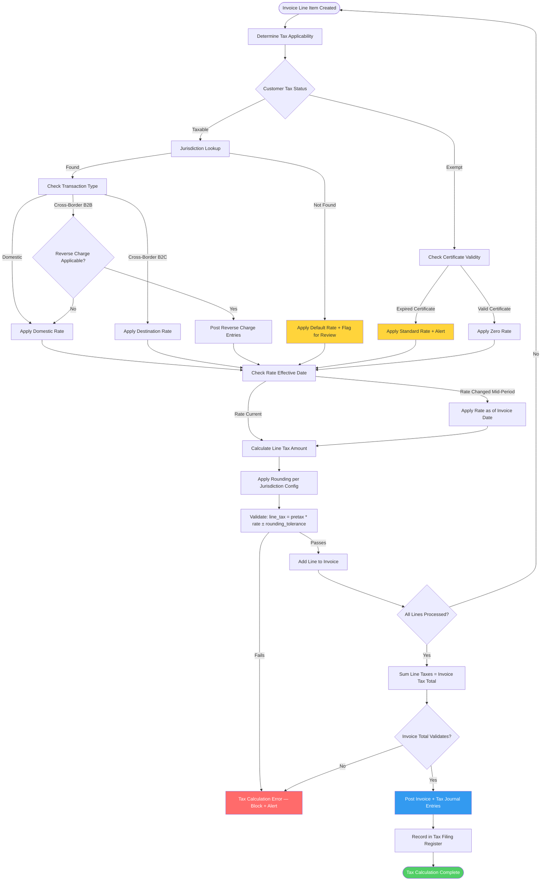

# Tax and Jurisdiction Rules — Edge Cases

Edge cases for the Tax Engine, VAT/GST calculation, withholding tax, and tax filing subsystems.
Tax errors can result in regulatory penalties, interest charges, and reputational damage.
Under GAAP and IFRS, material tax misstatements require restatement of filed returns.

---

## EC-TAX-01: Invoice Spans Multiple Tax Jurisdictions

**ID:** EC-TAX-01
**Title:** Interstate US sale triggers nexus in multiple states with different rates
**Description:** A company sells software licenses to a customer in Texas ($5,000) and
hardware shipped to their California office ($3,000) on a single invoice. Texas applies
8.25% sales tax to software; California applies 7.25% to hardware but exempts SaaS. The
invoice tax engine applies a single blended rate of 7.75% (headquarters state default)
to the full $8,000, producing a $60 tax error and filing obligation in the wrong jurisdiction.
**Trigger Condition:** A single invoice contains line items with different `ship_to_state`
values, or a line item has a `product_type` that triggers jurisdiction-specific rules.
**Expected System Behavior:** The tax engine must apply a per-line-item jurisdiction lookup.
Each line item computes tax independently using: `(ship_to_address, product_tax_category,
customer_exemption_status, transaction_date)`. The invoice tax total is the sum of per-line
taxes. The tax breakdown on the invoice shows each jurisdiction separately for filing purposes.
**Detection Signal:** Tax jurisdiction engine logs `MULTI_JURISDICTION_INVOICE` for audit.
Tax filing reconciliation: line-item tax amounts must sum to invoice total tax.
Alert if `per_line_tax_sum != invoice_tax_total`.
**Recovery / Mitigation:** Re-calculate tax for all multi-jurisdiction invoices in the
current period using the corrected per-line engine. Issue amended invoices to customers
where the tax amount changed. File amended returns in affected states with interest, if applicable.
Engage a tax advisor for nexus analysis to determine all states where the company has
filing obligations.
**Risk Level:** Critical

---

## EC-TAX-02: Tax Rate Change Mid-Period Affecting Open Invoices

**ID:** EC-TAX-02
**Title:** VAT rate increases from 20% to 23% on 01-Oct; invoices with wrong rate already issued
**Description:** A government VAT rate change takes effect on 01-Oct. The tax rate table is
updated at 09:00 on 01-Oct. However, 47 invoices were created between midnight and 09:00 on
01-Oct using the old 20% rate. These invoices are legally required to show 23% VAT for
supply dates on or after 01-Oct. The company has under-collected VAT by 3% on these invoices.
**Trigger Condition:** Invoices are created in the window between the legal effective date
of a tax rate change and the timestamp when the rate table is updated in the system.
**Expected System Behavior:** Tax rate changes must be scheduled in the system in advance
with an `effective_from` date. The tax engine must apply the rate whose `effective_from <=
invoice_date` rather than the rate loaded at invoice creation time. This makes tax rate
transitions instantaneous at midnight on the effective date, eliminating the timing gap.
**Detection Signal:** Tax rate audit report: any invoice dated on or after `effective_from`
of a new rate that was calculated at the old rate. Alert fires when such invoices are detected.
**Recovery / Mitigation:** Identify all affected invoices using the audit report. Issue credit
notes and replacement invoices at the correct 23% rate. Collect the additional 3% VAT from
customers or absorb it if contractually required. File a supplementary VAT return for the
difference. Pre-schedule future rate changes at least 30 days in advance.
**Risk Level:** Critical

---

## EC-TAX-03: Reverse Charge VAT Not Applied on B2B Cross-Border Transaction

**ID:** EC-TAX-03
**Title:** UK company purchases services from German supplier without applying reverse charge
**Description:** A UK-registered company receives a €15,000 consulting invoice from a German
supplier. Under UK VAT rules post-Brexit, the UK company must self-account for VAT under the
reverse charge mechanism (account for output VAT and reclaim as input VAT in the same return).
The AP system posts the invoice without the reverse charge journal entries because the German
supplier's VAT registration was not checked and the service type was not flagged as in-scope.
**Trigger Condition:** An AP invoice is received from a non-UK supplier, service type is
in-scope for reverse charge (e.g., professional services, digital services), and the supplier
is flagged as non-domestic, but reverse charge flag is `false` on the transaction.
**Expected System Behavior:** The tax engine must evaluate reverse charge applicability based
on: (1) supplier country code, (2) customer VAT registration status, (3) service type
classification against the reverse charge schedule. If applicable, the system must post two
journal lines: DR Input VAT (reclaimable), CR Output VAT (owed) — both for the same amount —
and flag the invoice line `reverse_charge_applied=true`.
**Detection Signal:** VAT return reconciliation: any invoice from a non-domestic supplier
for in-scope services where `reverse_charge_applied = false`. Alert triggers VAT compliance review.
**Recovery / Mitigation:** Post the missing reverse charge adjustment journals for the
affected period. Include the corrected amounts in the next VAT return or submit a voluntary
disclosure if the next return is already filed. Implement mandatory reverse charge flag
review for all cross-border supplier invoices.
**Risk Level:** Critical

---

## EC-TAX-04: Tax Exemption Certificate Expired but Still Applied

**ID:** EC-TAX-04
**Title:** Expired customer exemption certificate results in zero-tax invoices on taxable sales
**Description:** Non-profit organization NPO-Sunrise holds a state sales tax exemption
certificate that expired on 30-Jun-2024. The certificate record in the system was not marked
expired, and the customer master still shows `tax_exempt=true`. Invoices issued from 01-Jul
onwards charge no sales tax. The company is liable to remit the uncollected tax from its own
funds once the error is discovered in a tax audit.
**Trigger Condition:** An invoice is generated for a customer with `tax_exempt=true` but
whose exemption certificate `expiry_date < invoice_date`.
**Expected System Behavior:** Before applying a tax exemption, the tax engine must validate
`certificate_expiry_date >= invoice_date`. If the certificate is expired, the exemption is
not applied and the transaction is taxed at the standard rate. A warning is displayed: "Tax
exemption for [customer] expired on [date]. Certificate renewal required." The customer
master is flagged for certificate renewal follow-up.
**Detection Signal:** Daily certificate expiry scan: `SELECT * FROM tax_exemptions WHERE
expiry_date < CURRENT_DATE AND status = 'ACTIVE'`. Alert to AR and Tax teams. Zero-tax
invoice created after exemption expiry generates a P2 alert.
**Recovery / Mitigation:** Contact the customer for a renewed exemption certificate. If
unavailable, issue amended invoices for the period with the applicable tax amount added.
Collect the tax from the customer or absorb it. File a corrected tax return. Implement
automated certificate expiry notifications 60 days before expiry.
**Risk Level:** Critical

---

## EC-TAX-05: Rounding Discrepancy in VAT Calculation (Inclusive vs. Exclusive)

**ID:** EC-TAX-05
**Title:** VAT rounding on invoice total differs from sum of line-level rounding
**Description:** An invoice has 100 line items, each priced at $9.99 with 20% VAT. Line-level
VAT per item: $9.99 × 0.20 = $1.998, rounded to $2.00 per line = $200.00 total VAT.
Header-level calculation: $999.00 × 0.20 = $199.80 total VAT. The difference of $0.20 causes
a VAT return reconciliation failure. The tax authority expects consistent calculation methodology
declared in the company's VAT registration.
**Trigger Condition:** Invoice tax is calculated as both `SUM(round(line_amount * rate))` and
`round(SUM(line_amount) * rate)` in different parts of the system, producing different totals.
**Expected System Behavior:** The tax rounding methodology must be configured once and
applied uniformly: either half-up rounding at line level (most common) or at header level,
consistent with the jurisdiction's published guidance. The configuration is stored in
`tax_jurisdiction_config.rounding_method` and cannot be overridden per transaction.
The invoice validation job asserts `invoice.tax_total == SUM(line.tax_amount)`.
**Detection Signal:** Invoice validation: `invoice.tax_total != SUM(line_items.tax_amount)`.
Any invoice failing this assertion is blocked from posting. Metric: `tax_rounding_exceptions_per_day`.
**Recovery / Mitigation:** Standardize on line-level rounding for all jurisdictions (industry
standard). Re-process any invoices with inconsistent tax totals. For filed VAT returns where
the rounding method differed, assess whether a VAT adjustment is needed.
**Risk Level:** Medium

---

## EC-TAX-06: Tax Jurisdiction Lookup Fails for Unrecognized Country Code

**ID:** EC-TAX-06
**Title:** Invoice creation fails when ship-to country is a newly admitted ISO territory
**Description:** A sale is made to a customer in a territory that recently received a new
ISO 3166-1 alpha-2 country code (e.g., `XK` for Kosovo, added in 2010 but slow to propagate).
The tax jurisdiction lookup table does not contain an entry for `XK`. The tax engine throws
an unhandled exception, causing the entire invoice creation to fail with a 500 error.
**Trigger Condition:** `tax_jurisdiction_lookup(country_code = 'XK')` returns zero rows
and the engine does not have a fallback strategy.
**Expected System Behavior:** The tax engine must implement a graceful fallback for unknown
country codes: (1) apply a default "zero-rated / outside scope" tax treatment, (2) flag
the invoice with `TAX_JURISDICTION_UNKNOWN` for mandatory manual review before posting,
(3) raise a P3 alert to the Tax team to add the missing jurisdiction configuration.
The invoice must not be blocked from creation by a missing tax rule.
**Detection Signal:** Alert: `TAX_JURISDICTION_UNKNOWN` invoice flag. Tax configuration
gap report: country codes appearing in transactions but absent from `tax_jurisdictions` table.
**Recovery / Mitigation:** Tax team adds the missing jurisdiction with the correct rate and
effective date. Re-process flagged invoices. Subscribe to ISO 3166 update notifications to
proactively add new country codes before transactions occur.
**Risk Level:** High

---

## EC-TAX-07: Double Taxation — Tax Applied at Both Line and Header Level

**ID:** EC-TAX-07
**Title:** Tax calculated at line level and again at header level results in 2x tax on invoice
**Description:** A misconfiguration in the tax engine enables both `line_level_tax=true` and
`header_level_tax=true` for a specific invoice type. The resulting invoice charges tax twice:
once per line and once on the aggregate, doubling the effective tax rate from 10% to 20%.
The customer pays the invoice and the company remits both amounts to the tax authority, but
the customer's overpayment creates a liability and audit exposure.
**Trigger Condition:** `invoice_type_config WHERE line_level_tax = true AND header_level_tax = true`.
**Expected System Behavior:** The tax configuration schema must enforce mutual exclusivity:
`CHECK (NOT (line_level_tax = true AND header_level_tax = true))`. The tax engine must
validate this constraint before applying tax to any invoice. The UI must prevent configuration
of mutually exclusive settings.
**Detection Signal:** Invoice tax validation: `tax_total / pretax_total > max_effective_rate_threshold`.
Alert fires when effective tax rate on any invoice exceeds 1.5× the expected jurisdiction rate.
**Recovery / Mitigation:** Identify all double-taxed invoices via the effective-rate anomaly
report. Issue credit notes to affected customers for the duplicated tax amount. File VAT/GST
adjustments with the tax authority for over-remitted amounts. Fix the configuration and
add the mutual-exclusivity constraint.
**Risk Level:** Critical

---

## EC-TAX-08: Withholding Tax Calculation Error for Non-Resident Vendor

**ID:** EC-TAX-08
**Title:** Wrong WHT rate applied to non-resident consultant — treaty rate used without valid certificate
**Description:** A non-resident consultant from India is paid $20,000. The system applies
the India-US tax treaty rate of 15% WHT instead of the domestic rate of 30%, because the
vendor master has `treaty_eligible=true`. However, the vendor's treaty eligibility certificate
(Form W-8BEN) expired 18 months ago and was not renewed. The IRS holds the payor liable
for the full 30% WHT on all payments during the period of the expired certificate.
**Trigger Condition:** WHT calculation applies treaty rate when `vendor.treaty_certificate_expiry
< payment_date` and `vendor.treaty_eligible = true`.
**Expected System Behavior:** Before applying a treaty WHT rate, the tax engine must validate
that the treaty certificate is current: `treaty_certificate_expiry >= payment_date`. If
expired, the domestic WHT rate (30%) is applied and a P2 alert is sent to the Tax team with
the vendor name, expiry date, and payment amount. The payment is not blocked, but the
withholding is calculated correctly.
**Detection Signal:** WHT certificate expiry scan: `WHERE treaty_certificate_expiry < CURRENT_DATE
AND treaty_eligible = true`. Alert 60 days before expiry, again at 30 days, and on any
payment to an expired-certificate vendor.
**Recovery / Mitigation:** Obtain a renewed W-8BEN from the vendor. Calculate the WHT
shortfall for all payments made during the expired certificate period. File corrected 1042-S
forms and remit the additional WHT to the IRS with interest. Implement automated certificate
renewal reminders.
**Risk Level:** Critical

---

## EC-TAX-09: Tax Filing Deadline Missed Due to System Unavailability

**ID:** EC-TAX-09
**Title:** Monthly VAT return cannot be filed because the reporting service is down on the deadline
**Description:** The monthly VAT return for the UK is due by the 7th of the following month.
On the morning of the 7th, the reporting service is undergoing emergency maintenance. The
Finance team cannot generate the VAT return report or submit it to HMRC's Making Tax Digital
(MTD) API. HMRC's deadline passes at midnight. Late filing penalties begin from the day after
the missed deadline.
**Trigger Condition:** `TAX_FILING_SERVICE` is unavailable within the 72-hour window preceding
a regulatory filing deadline.
**Expected System Behavior:** Tax filing deadlines must be in the system calendar with
automated reminders at T-7 days and T-1 day. The system must pre-generate and stage all
required filing data by T-3 days so that a service outage on the deadline day does not block
filing. The staged filing package must be downloadable for manual submission as a fallback.
**Detection Signal:** Service health monitor: `TAX_FILING_SERVICE unhealthy` within T-3 days
of any filing deadline triggers P1 escalation. Filing deadline countdown visible on Finance dashboard.
**Recovery / Mitigation:** Download the pre-staged filing package and submit manually via
HMRC's online portal. Document the technical outage for any penalty appeal process. Restore
the service and confirm subsequent automated submissions are operational. Review the
pre-staging schedule and extend the pre-generation window to T-5 days.
**Risk Level:** Critical

---

## EC-TAX-10: Amended Tax Return Required After Audit Finding

**ID:** EC-TAX-10
**Title:** Tax authority audit identifies understated revenue requiring amended return and back payment
**Description:** A tax authority audit of FY-2022 identifies $180,000 of revenue that was
incorrectly deferred and not included in the FY-2022 tax return. The company must file an
amended return, pay the additional tax of $54,000 (30% rate), and pay interest accrued from
the original filing date. The Finance system must support the amended return workflow and
record the back-payment liability correctly.
**Trigger Condition:** Tax authority issues an audit assessment requiring an amended return
for a prior period. The Finance team initiates the `CREATE_AMENDED_RETURN` workflow.
**Expected System Behavior:** The system must provide an amendment workflow that: (1) imports
the audit adjustment into the affected prior period as a `TAX_AUDIT_ADJUSTMENT` journal type,
(2) recalculates the tax liability for the amended period, (3) records the additional tax
payable and interest accrual as separate liability lines, (4) generates the amended return
report in the required jurisdiction format, (5) maintains a full audit trail linking the
amendment to the audit reference number.
**Detection Signal:** `amended_return_workflow_initiated` event logged to audit stream.
New liability entries created in `tax_liabilities` with `origin=AUDIT_ASSESSMENT`.
Alert to CFO and external auditors.
**Recovery / Mitigation:** File the amended return within the authority's prescribed deadline
(typically 30–90 days after audit assessment). Pay the assessed tax and interest. Engage
external tax counsel to review all positions in the current open year. Review revenue
recognition policies for consistency with the amended position going forward.
**Risk Level:** Critical

---

## Tax Calculation Validation Flow

- Invalid or stale upstream state transitions
- Concurrency collisions and duplicate processing
- Missing enrichment data at decision points
- User-initiated cancellation during in-flight operations

## Detection
- Domain validation errors with structured reason codes
- Latency/error-rate anomalies on critical endpoints
- Data consistency checks and reconciliation deltas

## Recovery
- Idempotent retries with bounded backoff
- Compensation workflows for partial completion
- Operator runbook with manual override controls

## Implementation-Ready Finance Control Expansion

### 1) Accounting Rule Assumptions (Detailed)
- Ledger model is strictly double-entry with balanced journal headers and line-level dimensional tagging (entity, cost-center, project, product, counterparty).
- Posting policies are versioned and time-effective; historical transactions are evaluated against the rule version active at transaction time.
- Currency handling requires transaction currency, functional currency, and optional reporting currency; FX revaluation and realized/unrealized gains are separated.
- Materiality thresholds are explicit and configurable; below-threshold variances may auto-resolve only when policy explicitly allows.

### 2) Transaction Invariants and Data Contracts
- Every command/event must include `transaction_id`, `idempotency_key`, `source_system`, `event_time_utc`, `actor_id/service_principal`, and `policy_version`.
- Mutations affecting posted books are append-only. Corrections use reversal + adjustment entries with causal linkage to original posting IDs.
- Period invariant checks: no unapproved journals in closing period, all sub-ledger control accounts reconciled, and close checklist fully attested.
- Referential invariants: every ledger line links to a provenance artifact (invoice/payment/payroll/expense/asset/tax document).

### 3) Reconciliation and Close Strategy
- Continuous reconciliation cadence:
  - **T+0/T+1** operational reconciliation (gateway, bank, processor, payroll outputs).
  - **Daily** sub-ledger to GL tie-out.
  - **Monthly/Quarterly** close certification with controller sign-off.
- Exception taxonomy is mandatory: timing mismatch, mapping/config error, duplicate, missing source event, external counterparty variance, FX rounding.
- Close blockers are machine-detectable and surfaced on a close dashboard with ownership, ETA, and escalation policy.

### 4) Failure Handling and Operational Recovery
- Posting pipeline uses outbox/inbox patterns with deterministic retries and dead-letter quarantine for non-retriable payloads.
- Duplicate delivery and partial failure scenarios must be proven safe through idempotency and compensating accounting entries.
- Incident runbooks require: containment decision, scope quantification, replay/rebuild method, reconciliation rerun, and financial controller approval.
- Recovery drills must be executed periodically with evidence retained for audit.

### 5) Regulatory / Compliance / Audit Expectations
- Controls must support segregation of duties, least privilege, and end-to-end tamper-evident audit trails.
- Retention strategy must satisfy jurisdictional requirements for financial records, tax documents, and payroll artifacts.
- Sensitive data handling includes classification, masking/tokenization for non-production, and secure export controls.
- Every policy override (manual journal, reopened period, emergency access) requires reason code, approver, and expiration window.

### 6) Data Lineage & Traceability (Requirements → Implementation)
- Maintain an explicit traceability matrix for this artifact (`edge-cases/tax-and-jurisdiction-rules.md`):
  - `Requirement ID` → `Business Rule / Event` → `Design Element` (API/schema/diagram component) → `Code Module` → `Test Evidence` → `Control Owner`.
- Lineage metadata minimums: source event ID, transformation ID/version, posting rule version, reconciliation batch ID, and report consumption path.
- Any change touching accounting semantics must include impact analysis across upstream requirements and downstream close/compliance reports.
- Documentation updates are blocking for release when they alter financial behavior, posting logic, or reconciliation outcomes.

### 7) Phase-Specific Implementation Readiness
- Enumerate non-happy paths with trigger, detection signal, blast radius, temporary containment, and permanent fix.
- Include deterministic replay policy (ordering, dedupe, windowing) for out-of-order and late-arriving events.
- For manual interventions, require maker-checker approvals and post-action reconciliation evidence.

### 8) Implementation Checklist for `tax and jurisdiction rules`
- [ ] Control objectives and success/failure criteria are explicit and testable.
- [ ] Data contracts include mandatory identifiers, timestamps, and provenance fields.
- [ ] Reconciliation logic defines cadence, tolerances, ownership, and escalation.
- [ ] Operational runbooks cover retries, replay, backfill, and close re-certification.
- [ ] Compliance evidence artifacts are named, retained, and linked to control owners.

