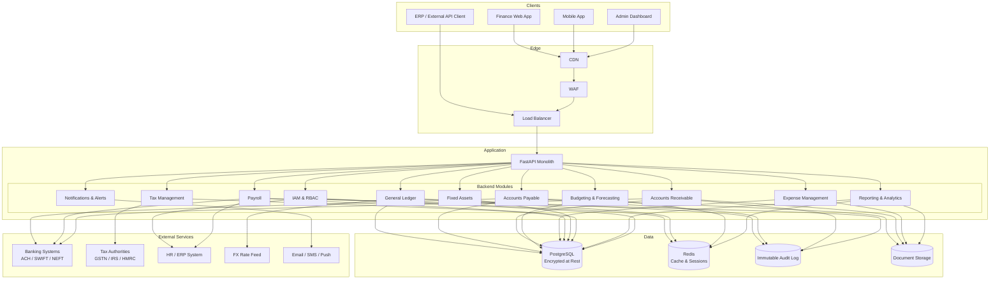
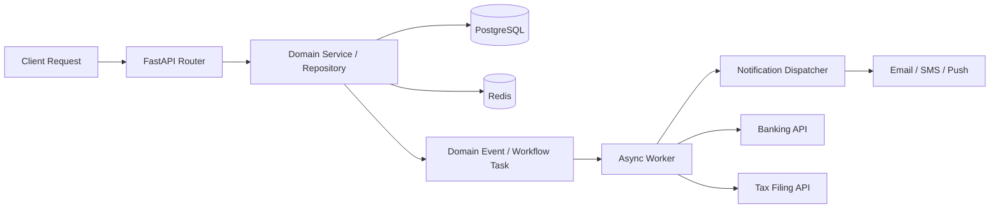

# High-Level Architecture Diagram

## Overview
This document describes the high-level architecture of the Finance Management System as a FastAPI monolith with domain modules, shared persistence, async workflow processing, and external banking/tax/ERP integrations.

---

## System Architecture Overview

---

## Runtime Interaction Model

---

## Key Backend Responsibilities

| Module | Main Responsibilities |
|--------|-----------------------|
| IAM | JWT auth, RBAC, MFA, audit logging, ERP employee sync |
| General Ledger | Journal entries, CoA management, trial balance, bank reconciliation, period management |
| Accounts Payable | Vendor master, invoice recording, 3-way match, payment runs, AP aging |
| Accounts Receivable | Customer master, invoicing, payment collection, AR aging, collections |
| Budgeting & Forecasting | Budget creation, approval workflows, variance tracking, rolling forecasts, alerts |
| Expense Management | Expense submission, approval workflows, corporate card reconciliation, reimbursements |
| Payroll | Payroll run processing, statutory deductions, pay stubs, bank file generation, tax remittance |
| Fixed Assets | Asset registration, depreciation scheduling, asset lifecycle, disposal |
| Tax Management | Tax configuration, auto-calculation, e-filing, TDS/WHT management |
| Reporting & Analytics | Financial statements, management reports, consolidation, custom report builder |
| Notifications | Approval alerts, budget threshold notifications, payment confirmations, period-close reminders |

---

## Current Architectural Constraints

- The system is designed as a single FastAPI monolith to reduce operational complexity during initial deployment.
- The audit log module writes to an append-only store to prevent tampering.
- All financial calculations (tax, depreciation, payroll deductions) are performed server-side.
- FX rate feeds are polled daily and cached in Redis for intra-day use.
- External bank file submission is handled asynchronously via background workers to avoid blocking API responses.
- Report generation for large datasets is queued as background jobs with status polling and email delivery.
