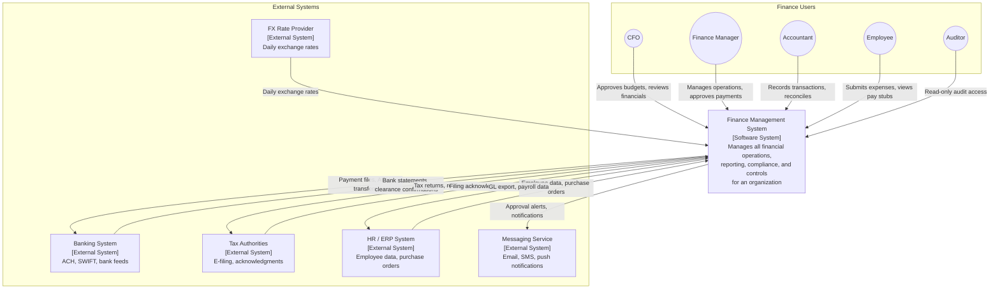
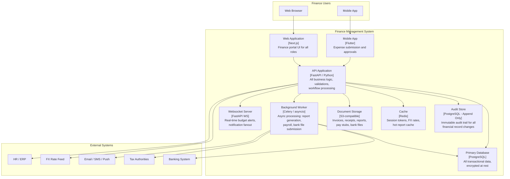
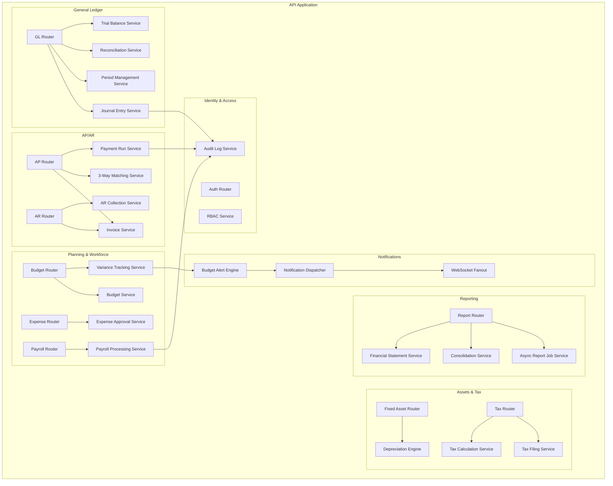

# C4 Diagrams

## Overview
C4 model diagrams for the Finance Management System at Context, Container, and Component levels.

---

## Level 1: System Context Diagram

---

## Level 2: Container Diagram

---

## Level 3: Component Diagram — Core Finance Components

