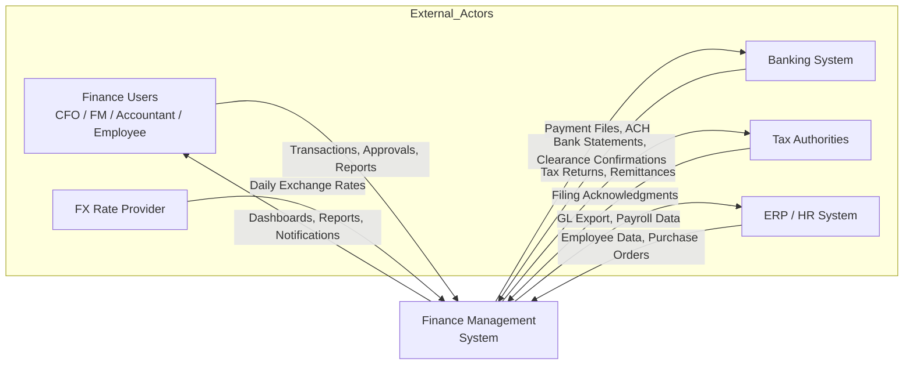
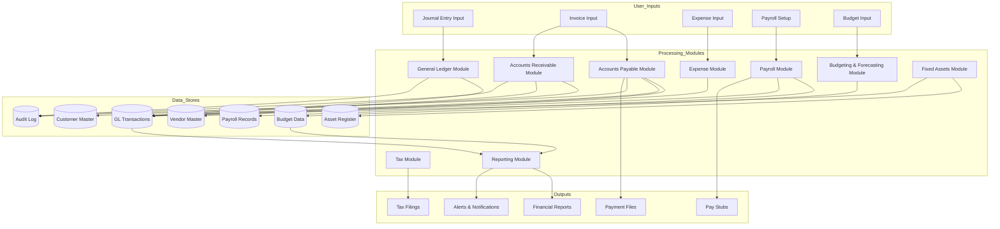
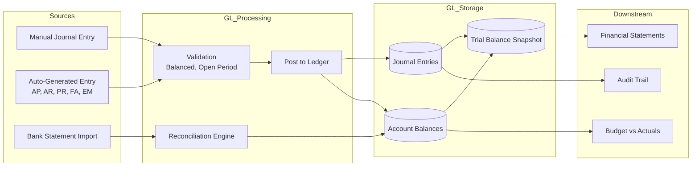
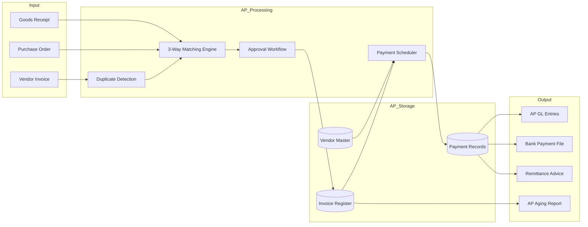
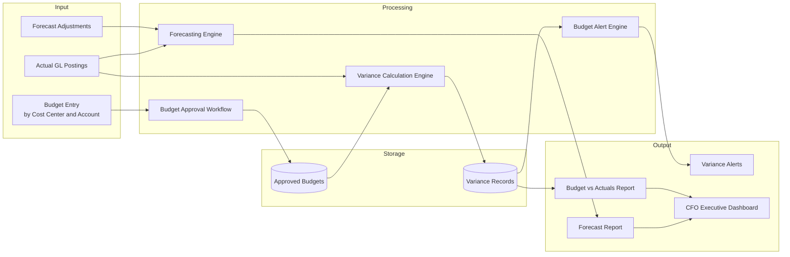

# Data Flow Diagrams

## Overview
This document shows how data moves through the Finance Management System at different levels of abstraction.

---

## Level 0: System Context DFD

---

## Level 1: Major Subsystem DFD

---

## Level 2: General Ledger Data Flow

---

## Level 2: Accounts Payable Data Flow

---

## Level 2: Budgeting and Variance Tracking Data Flow

