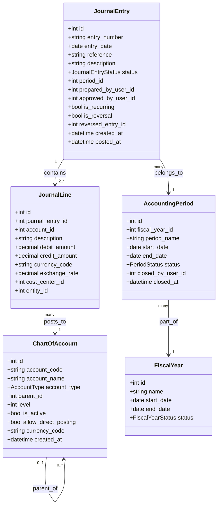
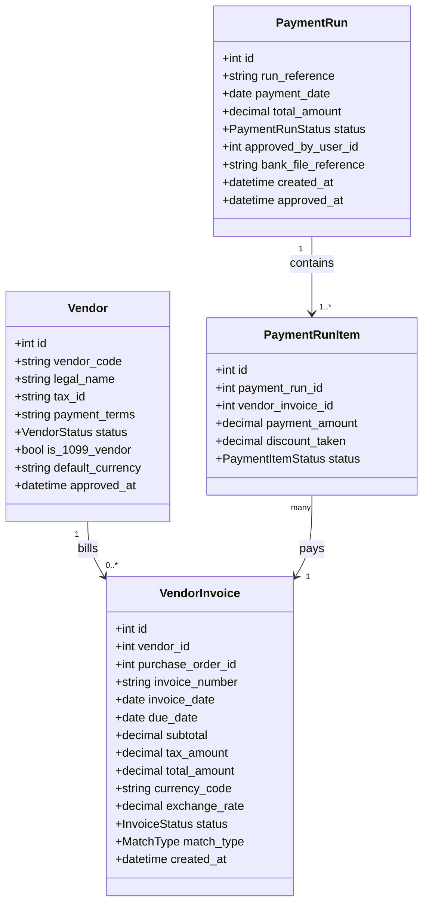
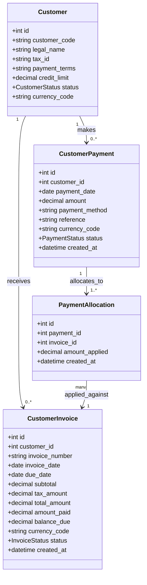
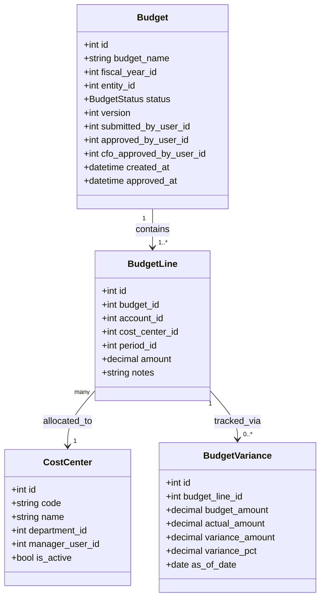
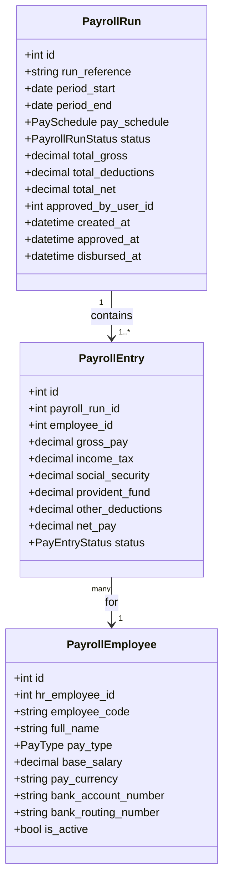
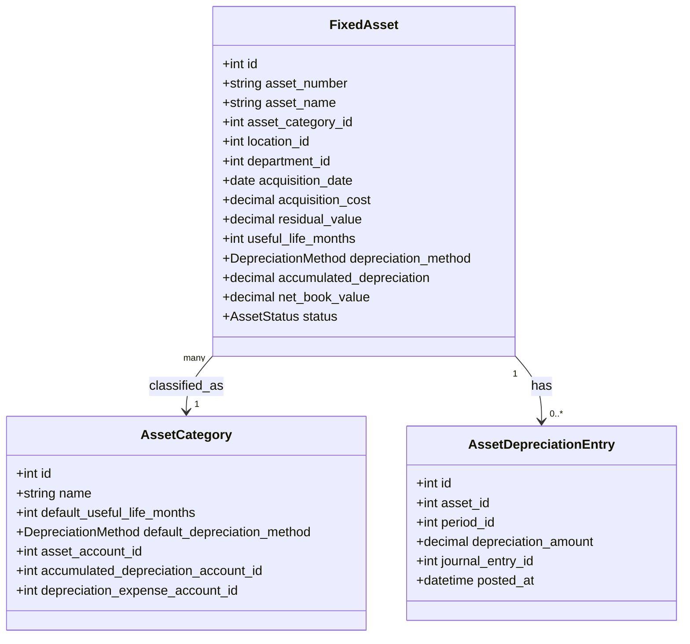
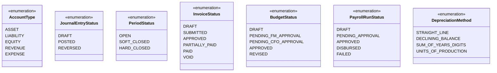

# Domain Model

## Overview
This document defines the key entities, their attributes, and relationships that form the core of the Finance Management System.

---

## General Ledger Domain

---

## Accounts Payable Domain

---

## Accounts Receivable Domain

---

## Budgeting Domain

---

## Payroll Domain

---

## Fixed Assets Domain

---

## Enumeration Types

