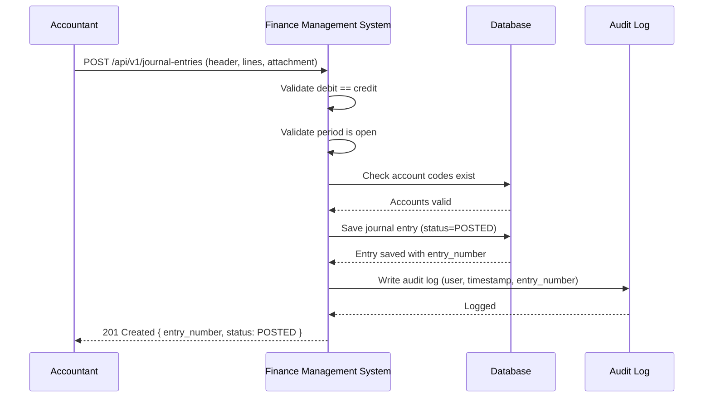
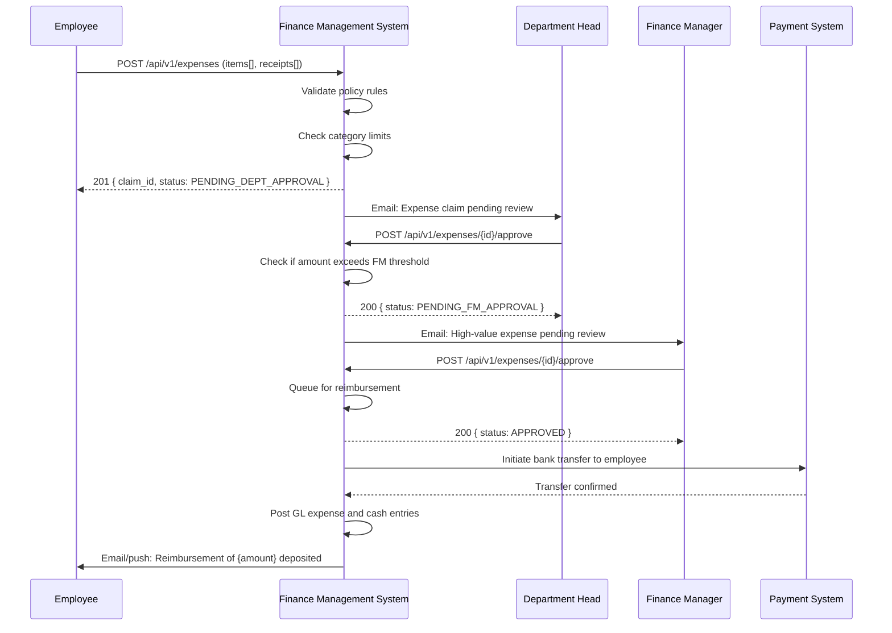
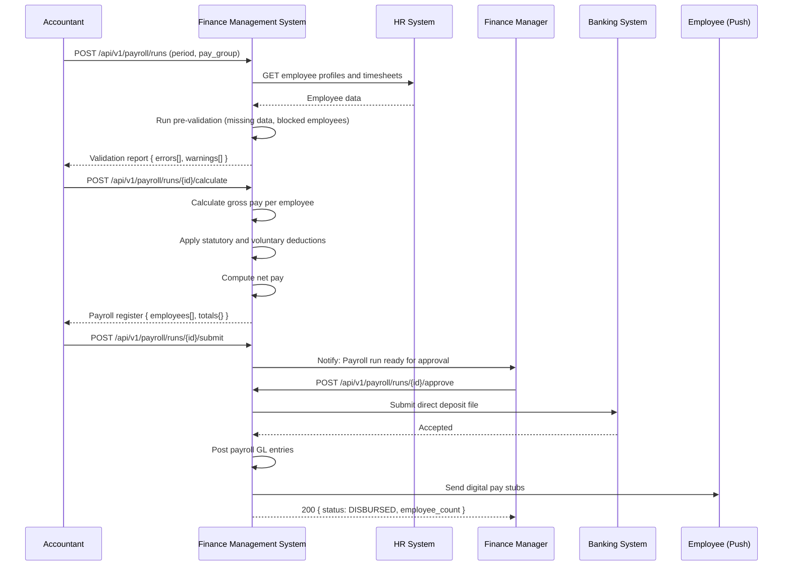
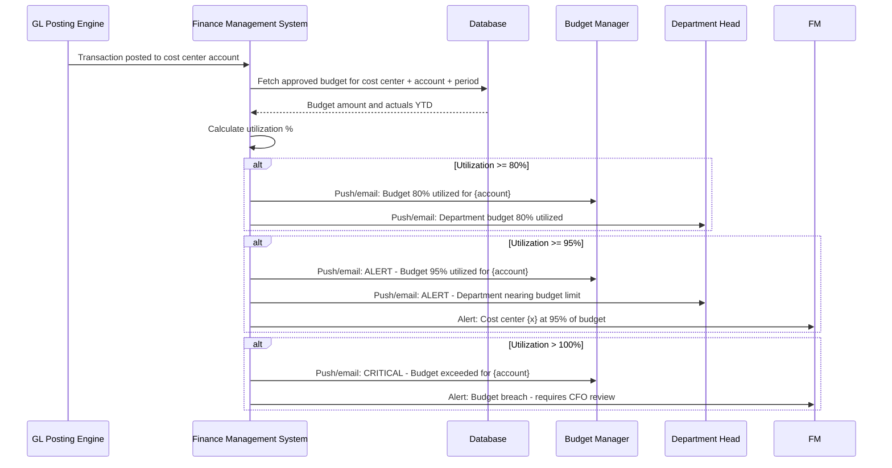
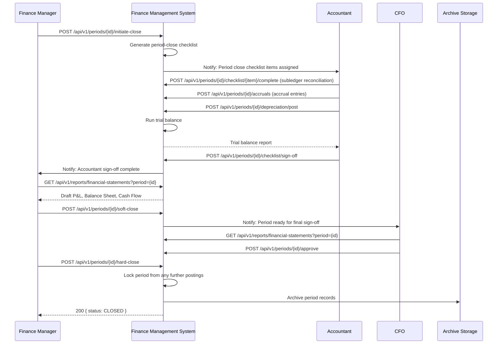

# System Sequence Diagrams

## Overview
System-level black-box interaction sequences showing how actors interact with the Finance Management System and how it interacts with external systems.

---

## Create and Post Journal Entry

---

## Process Vendor Payment Run

```mermaid
sequenceDiagram
    participant FM as Finance Manager
    participant FMS as Finance Management System
    participant DB as Database
    participant BANK as Banking System
    participant VENDOR as Vendor (Email)

    FM->>FMS: GET /api/v1/ap/invoices?status=approved&due_before=X
    FMS-->>FM: List of payable invoices

    FM->>FMS: POST /api/v1/ap/payment-runs (invoice_ids[])
    FMS->>FMS: Validate all invoices are approved
    FMS->>FMS: Calculate total and check cash availability
    FMS->>DB: Save payment run (status=PENDING_APPROVAL)
    FMS-->>FM: 201 { run_id, total_amount, invoice_count }

    FM->>FMS: POST /api/v1/ap/payment-runs/{run_id}/approve
    FMS->>FMS: Apply early-payment discounts if eligible
    FMS->>DB: Update run status=APPROVED
    FMS->>BANK: Submit ACH/wire file
    BANK-->>FMS: 200 { batch_ref, status: ACCEPTED }

    FMS->>DB: Update run status=SUBMITTED
    BANK->>FMS: Webhook: payment_cleared (batch_ref)
    FMS->>DB: Mark invoices as PAID
    FMS->>DB: Post GL payment entries
    FMS->>VENDOR: Send remittance advice emails
    FMS-->>FM: Notification: Payment run completed
```

---

## Employee Expense Claim Approval

---

## Payroll Run Processing

---

## Budget Variance Alert

---

## Period Close Sequence

