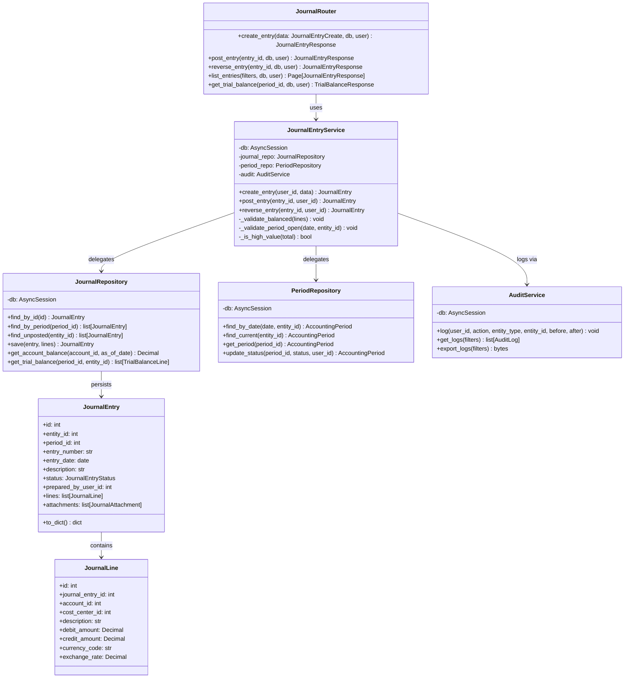
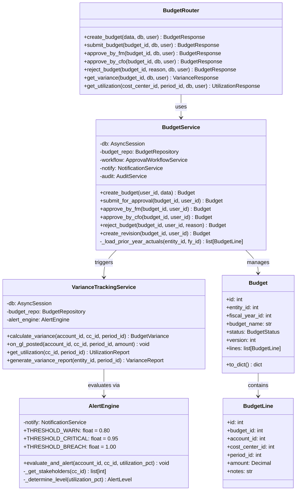
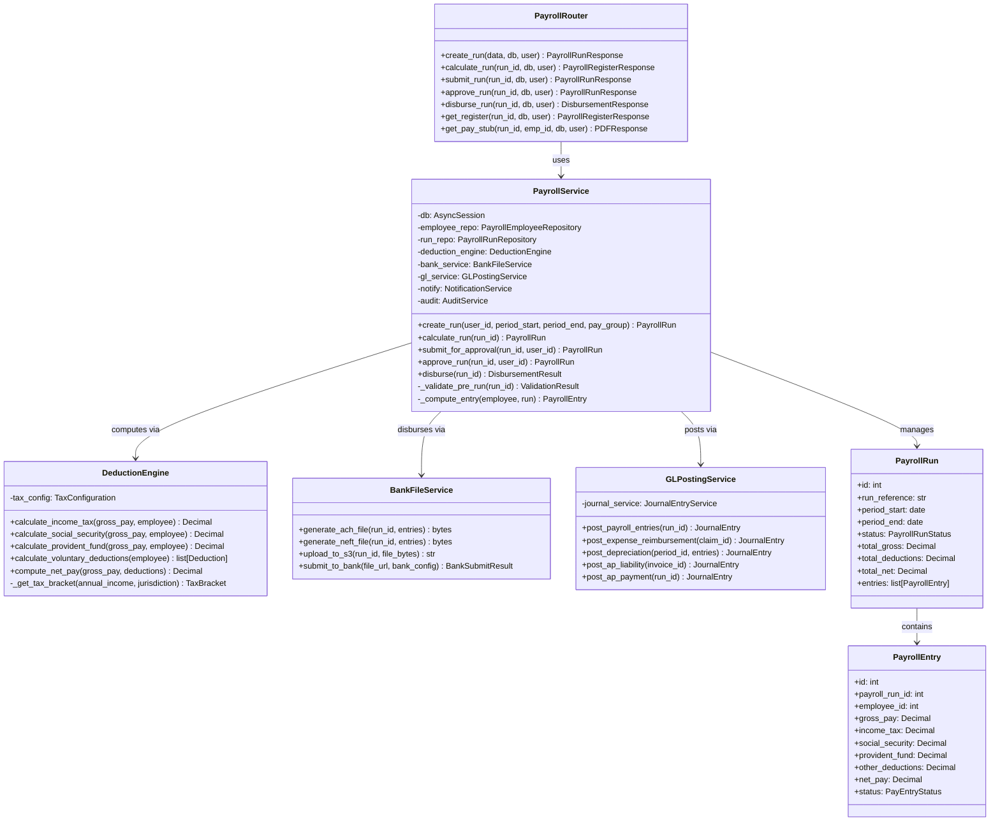

# C4 Code Diagram

## Overview
Class-level C4 diagrams showing the internal structure of key service modules in the Finance Management System.

---

## Journal Entry Service Code Diagram

---

## Budget Service Code Diagram

---

## Payroll Service Code Diagram

