# Implementation Guidelines

## Overview

Comprehensive implementation standards and engineering practices for the Finance Management System. Financial software demands exceptional correctness: a single bug in monetary arithmetic, a missed audit event, or a broken idempotency key can cause regulatory violations and irreversible balance corruption. Every guideline here exists because financial software fails in costly, hard-to-detect ways when these practices are absent.

---

## Technology Choices and Rationale

| Concern | Technology | Rationale |
|---------|-----------|-----------|
| Transactional database | PostgreSQL 15 | ACID guarantees, advisory locks, row-level security, pgaudit, JSONB for metadata, native DECIMAL type |
| Event streaming | Apache Kafka (MSK) | At-least-once delivery, consumer group replay, log compaction for snapshots, exactly-once semantics via transactions |
| Cache | Redis 7 (ElastiCache) | FX rate cache, idempotency key store, distributed lock (Redlock), session token storage |
| Orchestration | Kubernetes (EKS) | Pod disruption budgets, rolling deploys with health gating, IRSA for per-pod AWS credentials |
| API framework | FastAPI | Async-first, Pydantic v2 validation, OpenAPI schema generation, dependency injection |
| ORM | SQLAlchemy 2.x async | Unit-of-work pattern, connection pooling, read/write session splitting |
| Event outbox | PostgreSQL outbox table | Transactional consistency between DB write and Kafka produce; no dual-write race condition |
| Secret management | AWS Secrets Manager | Automatic rotation, no secrets in environment variables or ConfigMaps |
| Encryption | AWS KMS (CMK) | Envelope encryption for financial data at rest; key per data classification |

---

## Project Structure

```
/services
├── ledger-service/
│   ├── src/
│   │   ├── domain/
│   │   │   ├── models/          # Aggregate roots, entities, value objects
│   │   │   │   ├── account.py
│   │   │   │   ├── journal_entry.py
│   │   │   │   └── ledger_period.py
│   │   │   ├── events/          # Domain events (Pydantic schemas)
│   │   │   │   ├── journal_posted.py
│   │   │   │   └── period_closed.py
│   │   │   └── services/        # Domain services (pure logic, no I/O)
│   │   │       ├── double_entry_validator.py
│   │   │       └── posting_engine.py
│   │   ├── application/
│   │   │   ├── commands/        # CQRS write-side command handlers
│   │   │   │   ├── post_journal_entry.py
│   │   │   │   └── close_period.py
│   │   │   └── queries/         # CQRS read-side query handlers
│   │   │       ├── get_trial_balance.py
│   │   │       └── get_account_activity.py
│   │   ├── infrastructure/
│   │   │   ├── db/
│   │   │   │   ├── models.py    # SQLAlchemy ORM models
│   │   │   │   ├── repositories.py
│   │   │   │   └── outbox.py    # Outbox table + relay
│   │   │   ├── kafka/
│   │   │   │   ├── producer.py
│   │   │   │   └── consumer.py
│   │   │   └── cache/
│   │   │       └── fx_rate_cache.py
│   │   └── api/
│   │       ├── routers/
│   │       │   ├── journal.py
│   │       │   ├── accounts.py
│   │       │   └── periods.py
│   │       ├── deps.py          # DB session, auth, RBAC, idempotency
│   │       └── schemas/         # Pydantic request/response schemas
│   ├── tests/
│   │   ├── unit/
│   │   ├── integration/
│   │   └── contract/
│   ├── migrations/              # Alembic migration scripts
│   ├── Dockerfile
│   └── pyproject.toml
├── journal-service/             # Same structure
├── ap-service/
├── ar-service/
├── budget-service/
├── reconciliation-service/
├── fixed-asset-service/
├── tax-service/
├── currency-service/
├── reporting-service/
├── audit-service/
└── period-service/
```

---

## Coding Standards

### Monetary Value Handling

**Rule: Never use `float` or `double` for money. Always use `DECIMAL(19,4)` in PostgreSQL and `Decimal` in Python.**

```python
# CORRECT
from decimal import Decimal, ROUND_HALF_UP

amount: Decimal = Decimal("1234.5678")
rounded = amount.quantize(Decimal("0.01"), rounding=ROUND_HALF_UP)

# WRONG — precision loss
amount: float = 1234.5678  # PROHIBITED in financial calculations
```

```sql
-- CORRECT — PostgreSQL schema
amount          NUMERIC(19, 4)  NOT NULL,
exchange_rate   NUMERIC(19, 10) NOT NULL DEFAULT 1.0000000000,
-- WRONG
amount          FLOAT           -- PROHIBITED
amount          DOUBLE PRECISION -- PROHIBITED
```

SQLAlchemy mapping:
```python
from sqlalchemy import Numeric
amount = mapped_column(Numeric(19, 4), nullable=False)
```

### Double-Entry Accounting Enforcement

Every `JournalEntry` must satisfy the invariant: `SUM(debit_amount) == SUM(credit_amount)` before any write to the database.

```python
def validate_balanced(lines: list[JournalLine]) -> None:
    total_debit  = sum(l.debit_amount  for l in lines)
    total_credit = sum(l.credit_amount for l in lines)
    if total_debit != total_credit:
        raise UnbalancedJournalError(
            f"Journal is unbalanced: debits={total_debit}, credits={total_credit}"
        )
    if len(lines) < 2:
        raise InsufficientLinesError("Journal entry requires at least 2 lines")
```

Validation must run in the domain service **and** be enforced by a database check constraint:
```sql
ALTER TABLE journal_entries
  ADD CONSTRAINT chk_journal_balanced
  CHECK (
    (SELECT COALESCE(SUM(debit_amount), 0) FROM journal_lines jl WHERE jl.journal_entry_id = id) =
    (SELECT COALESCE(SUM(credit_amount), 0) FROM journal_lines jl WHERE jl.journal_entry_id = id)
  );
```

### Idempotency Implementation

All state-changing endpoints accept an `Idempotency-Key` header. The key is stored in Redis with a TTL of 24 hours. If a duplicate request arrives within the TTL window, the original response is returned without re-executing the command.

```python
async def idempotency_guard(
    idempotency_key: str,
    redis: Redis,
    execute: Callable,
) -> Any:
    cache_key = f"idempotency:{idempotency_key}"
    cached = await redis.get(cache_key)
    if cached:
        return json.loads(cached)   # Replay stored response

    result = await execute()
    await redis.set(cache_key, json.dumps(result), ex=86400)  # 24h TTL
    return result
```

For Kafka consumers, idempotency is enforced at the database level using a unique constraint on `(source_event_id, source_system)`:
```sql
CREATE UNIQUE INDEX CONCURRENTLY uq_journal_source_event
    ON journal_entries (source_event_id, source_system)
    WHERE source_event_id IS NOT NULL;
```

### Outbox Pattern (Transactional Event Publishing)

Never produce to Kafka inside a database transaction. Use the outbox pattern:

```python
async def post_journal_entry(cmd: PostJournalCommand, db: AsyncSession) -> JournalEntry:
    async with db.begin():
        entry = await journal_repo.save(db, entry)
        # Write outbox record in same transaction — atomically
        await outbox_repo.insert(db, OutboxEvent(
            event_type="journal.posted",
            aggregate_id=str(entry.id),
            payload=JournalPostedEvent.from_entry(entry).model_dump_json(),
        ))
    # Outbox relay (separate process) reads outbox table and produces to Kafka
    return entry
```

The outbox relay polls the `outbox_events` table every 500ms, publishes to Kafka, then marks events as `published`. Failures are retried with exponential backoff; non-retriable payloads move to a dead-letter table after 5 attempts.

---

## Database Transaction Management

```python
# Unit of work — always explicit transaction scope
async with db.begin():
    # All reads and writes participate in this transaction
    entry = await repo.find_for_update(entry_id)   # SELECT ... FOR UPDATE
    entry.post()
    await repo.save(entry)
    # Transaction commits here; rolls back on any exception

# Read-only queries always use the read replica session
async def get_trial_balance(period_id: int, db_read: AsyncSession) -> TrialBalance:
    ...
```

- Use `SELECT ... FOR UPDATE` when checking-then-updating financial balances.
- Set `statement_timeout = 30s` for all application connections; reports use a separate pool with `statement_timeout = 300s`.
- Never hold a transaction open while calling external APIs or waiting for user input.

---

## Event Sourcing for Audit Trail

The `audit_events` table is the system of record for all mutations to financial data. It is append-only; no application role has `UPDATE` or `DELETE` on this table.

```sql
CREATE TABLE audit_events (
    id              BIGSERIAL PRIMARY KEY,
    event_id        UUID        NOT NULL UNIQUE DEFAULT gen_random_uuid(),
    event_time_utc  TIMESTAMPTZ NOT NULL DEFAULT NOW(),
    actor_id        UUID        NOT NULL,
    actor_type      TEXT        NOT NULL,  -- 'user' | 'service' | 'system'
    action          TEXT        NOT NULL,  -- 'journal.post' | 'period.close' | ...
    entity_type     TEXT        NOT NULL,
    entity_id       TEXT        NOT NULL,
    before_state    JSONB,
    after_state     JSONB       NOT NULL,
    ip_address      INET,
    request_id      UUID,
    idempotency_key TEXT,
    policy_version  TEXT        NOT NULL
);
-- No DELETE, No UPDATE — enforced by DB role
REVOKE UPDATE, DELETE ON audit_events FROM finance_app_role;
```

---

## CQRS — Command/Query Responsibility Segregation

```
Write path: Command → CommandHandler → Domain Service → Repository (primary RDS) → Outbox
Read path:  Query  → QueryHandler  → Read Model     → Repository (read replica RDS or Redis cache)
```

- Commands mutate state and emit domain events via outbox.
- Queries are read-only, routed to read replicas, and may be cached in Redis.
- Command handlers return only the minimum information needed (the aggregate ID and status). Full details require a subsequent query.

---

## API Versioning Strategy

- All APIs are versioned by URL path: `/api/v1/`, `/api/v2/`
- A version is maintained for a minimum of 12 months after a new version is released.
- Breaking changes (removing fields, changing semantics, renaming) always increment the major version.
- Non-breaking additions (new optional fields, new endpoints) are added to the current version.
- The `Deprecation` and `Sunset` HTTP headers are set on deprecated endpoints.

```python
# Router structure
router_v1 = APIRouter(prefix="/api/v1")
router_v2 = APIRouter(prefix="/api/v2")
app.include_router(router_v1)
app.include_router(router_v2)
```

---

## Error Handling Standards

```python
# Domain errors — map to 4xx
class UnbalancedJournalError(DomainError):        # → 422
class PeriodClosedError(DomainError):             # → 409
class DuplicateIdempotencyKeyError(DomainError):  # → 200 (return cached response)
class InsufficientFundsError(DomainError):        # → 422
class UnauthorizedApproverError(DomainError):     # → 403

# Infrastructure errors — map to 5xx; always retry-safe
class DatabaseConnectionError(InfrastructureError):  # → 503
class KafkaProducerError(InfrastructureError):       # → 503

# Response envelope — consistent across all services
{
    "error": {
        "code": "PERIOD_CLOSED",
        "message": "Accounting period 2024-03 is closed. Use a reversal entry.",
        "request_id": "req-abc123",
        "timestamp": "2024-03-15T10:30:00Z"
    }
}
```

---

## Security Implementation

### RBAC (Role-Based Access Control)

| Role | Permissions |
|------|-------------|
| `accountant` | Read + create draft journals, invoices, expenses |
| `finance_manager` | Accountant + approve journals, AP runs, budgets |
| `cfo` | Finance Manager + final budget/payroll approval, period close |
| `controller` | Read-only + period close certification, reconciliation sign-off |
| `auditor` | Read-only access to all data + audit log export |
| `admin` | User provisioning only — no access to financial data |

All permissions are enforced server-side in the dependency injection layer:
```python
async def require_role(required: Role, user: CurrentUser = Depends(get_current_user)):
    if required not in user.roles:
        raise HTTPException(status_code=403, detail="Insufficient permissions")
```

### JWT Token Configuration
- Access token TTL: 15 minutes
- Refresh token TTL: 8 hours (rotated on use)
- Algorithm: RS256 (asymmetric — private key in Secrets Manager, public key cached in pod)
- Claims: `sub`, `roles`, `entity_id`, `iat`, `exp`, `jti` (for revocation)

### Field-Level Encryption

Bank account numbers and tax identifiers are encrypted at the application layer before storage, in addition to database-level KMS encryption:

```python
from cryptography.fernet import Fernet

def encrypt_sensitive(value: str, key: bytes) -> str:
    return Fernet(key).encrypt(value.encode()).decode()

def decrypt_sensitive(encrypted: str, key: bytes) -> str:
    return Fernet(key).decrypt(encrypted.encode()).decode()
```

The encryption key is fetched from Secrets Manager at startup and rotated every 90 days.

---

## Performance Optimization

### Caching Strategy

| Data | Cache Location | TTL | Invalidation |
|------|---------------|-----|--------------|
| FX exchange rates | Redis | 1 hour | Daily cron refresh |
| Chart of Accounts | Redis | 5 minutes | Evict on CoA update |
| Trial balance | Redis | 30 seconds | Evict on journal post |
| User session / JWT | Redis | 15 minutes | Evict on logout |
| Report status | Redis | Until completion | Evict on report ready |
| Period status | Redis | 5 minutes | Evict on period change |

### Query Optimization

- All foreign key columns have indexes.
- Partial indexes on `status = 'pending'` columns for queue-style queries.
- Covering indexes for trial balance and aging report queries.
- `EXPLAIN ANALYZE` required in pull request for any new query touching tables with > 100k rows.
- Reporting queries always target the read replica via the read-only SQLAlchemy session.

```sql
-- Example covering index for AP aging
CREATE INDEX CONCURRENTLY idx_invoices_aging
    ON ap_invoices (vendor_id, due_date, status)
    INCLUDE (amount_due, currency_code)
    WHERE status IN ('APPROVED', 'PARTIAL');
```

---

## Testing Strategy

### Testing Pyramid

```
E2E Tests (5%)              — Playwright, full browser flows, staging env
Contract Tests (10%)        — Pact broker, service interface contracts
Integration Tests (35%)     — Testcontainers (real PostgreSQL + Redis), pytest-asyncio
Unit Tests (50%)            — Pure domain logic, no I/O, pytest
```

### Coverage Requirements

| Layer | Minimum Coverage |
|-------|-----------------|
| Domain services (posting, validation) | 95% |
| Application command / query handlers | 85% |
| API routers | 80% |
| Infrastructure repositories | 75% |

### Key Test Patterns

```python
# Unit test — double-entry validation (no database)
def test_unbalanced_journal_raises():
    lines = [
        JournalLine(account_id=1, debit_amount=Decimal("100.00"), credit_amount=Decimal("0")),
        JournalLine(account_id=2, debit_amount=Decimal("0"), credit_amount=Decimal("99.99")),
    ]
    with pytest.raises(UnbalancedJournalError):
        validate_balanced(lines)

# Integration test — outbox relay publishes to Kafka
async def test_post_journal_publishes_event(db, kafka_consumer):
    cmd = PostJournalCommand(lines=[...], idempotency_key="test-key-001")
    entry = await post_journal_handler.handle(cmd, db)
    message = await kafka_consumer.poll(timeout=5.0)
    assert message.topic == "journal.posted"
    assert json.loads(message.value)["journal_entry_id"] == str(entry.id)
```

---

## Development Workflow

```mermaid
flowchart LR
    subgraph "Development"
        Feature["Feature Branch\nfrom main"]
        LocalTest["Local Tests\npytest · docker-compose"]
        PR["Pull Request\n→ main"]
    end

    subgraph "CI Gate (Required to Merge)"
        Lint["Lint + Type Check\nruff · mypy\nMust pass"]
        UnitCI["Unit Tests\nCoverage ≥ 80%\nMust pass"]
        IntCI["Integration Tests\nTestcontainers\nMust pass"]
        SAST["SAST\nSemgrep · Bandit\nNo HIGH findings"]
        ContractCI["Contract Tests\nPact broker\nMust pass"]
    end

    subgraph "Deploy Pipeline"
        Dev["Deploy to dev\nAuto on merge"]
        StageDeploy["Deploy to staging\nManual promotion"]
        StagePerfTest["Load Test\nk6 · P99 ≤ 500ms"]
        ProdApproval["Production Approval\n2 engineers sign off"]
        ProdDeploy["Deploy to prod\nRolling update"]
        ProdSmoke["Smoke Tests\nCanary endpoints"]
    end

    Feature --> LocalTest --> PR
    PR --> Lint --> UnitCI --> IntCI --> SAST --> ContractCI
    ContractCI -->|"Merge"| Dev --> StageDeploy --> StagePerfTest
    StagePerfTest --> ProdApproval --> ProdDeploy --> ProdSmoke
```



---

## Operational Runbooks

### Runbook: Monthly Period Close

1. **Pre-close checks** (T-3 days): Verify all sub-ledger control accounts are reconciled. Run `period-service reconciliation-check --period YYYY-MM`. All exceptions must have owner-assigned tickets.
2. **Soft close** (Last day of month, 17:00 local): Set period status to `SOFT_CLOSED`. New journals blocked; AP/AR adjustments still permitted via FM approval.
3. **Sub-ledger reconciliation** (T+1): Automated job reconciles all sub-ledgers to GL. Dashboard shows break count. Target: zero breaks.
4. **Hard close** (T+2 after controller sign-off): Set period to `HARD_CLOSED`. No further mutations permitted. Controller attests via close checklist.
5. **Report generation**: Schedule P&L, Balance Sheet, GL Detail reports via `reporting-service generate-close-reports --period YYYY-MM`.
6. **Audit evidence**: Export period close checklist sign-off to S3 `finance-documents/close-certification/YYYY-MM/`.

### Runbook: Reconciliation Backfill

Used when a reconciliation job fails mid-run or data arrives out of order.

1. Identify affected reconciliation batch ID from CloudWatch logs.
2. Mark the failed batch as `CANCELLED` in `reconciliation_batches` table.
3. Identify the earliest affected transaction date.
4. Re-run: `reconciliation-service backfill --from-date YYYY-MM-DD --batch-id NEW-UUID`.
5. Monitor Kafka consumer lag on `recon.run.requested` topic until queue drains.
6. Verify reconciliation summary report matches expected break count (ideally zero).
7. If breaks remain, triage each using the exception taxonomy: timing mismatch, mapping error, duplicate, missing source event, FX rounding.
8. Obtain controller sign-off on any unresolved breaks with materiality assessment.

### Runbook: Payment Run Failure

1. Check `ap_payment_runs` table for run status and last processed entry.
2. Identify if bank file was already submitted (check `bank_file_submissions` table).
3. If not submitted: re-trigger payment run from last successful entry using idempotency key.
4. If submitted but unconfirmed: contact bank to confirm ACH status before re-submitting.
5. If bank rejected: correct the rejection code, create reversal journal, re-submit.
6. All actions logged in audit trail with `actor_type: 'operations'` and reason code.

---

## Compliance and Audit Requirements

- Every API endpoint that mutates financial data writes to `audit_events` before returning a response.
- Manual journal entries above a configurable threshold (default: USD 50,000) require a second approver.
- Period re-opening requires: `reason_code`, `approver_id` (CFO role minimum), and sets an `expires_at` timestamp after which the period automatically re-closes.
- All audit events are exported to S3 `finance-documents/audit-exports/` monthly; S3 Object Lock in COMPLIANCE mode prevents deletion for 7 years.
- Segregation of duties: the user who creates a payment run cannot also approve it. Enforced at the command handler level.
- Access to production databases is logged via SSM Session Manager and pgaudit. Any direct DB access outside the application generates a Security Hub finding.

---

## Technology Stack

### Backend Services

| Component | Technology | Version |
|-----------|------------|---------|
| Runtime | Python | 3.11+ |
| Framework | FastAPI | Latest |
| API Layer | REST | OpenAPI 3.0 |
| Database ORM | SQLAlchemy | 2.x |
| Validation | Pydantic | 2.x |
| Task Queue | Celery | 5.x |
| Testing | pytest + httpx | Latest |
| Async | asyncio + uvicorn | Latest |

### Database

| Environment | Technology | Purpose |
|-------------|------------|---------|
| Production | PostgreSQL 15+ | Primary transactional database |
| Audit | PostgreSQL 15+ (separate instance) | Append-only audit log |
| Testing | SQLite | Unit/integration tests |
| Caching | Redis | Sessions, FX rates, report cache |

### Frontend Applications

| Application | Technology |
|-------------|------------|
| Finance Web App | Next.js 14 |
| Admin Dashboard | Next.js / React |
| Mobile App (Expense) | Flutter |

### Infrastructure

| Component | Technology |
|-----------|------------|
| Container | Docker |
| Orchestration | Kubernetes (EKS) |
| CI/CD | GitHub Actions + ArgoCD |
| IaC | Terraform |

---

## Project Structure

```
/backend
├── src/
│   ├── api/
│   │   ├── routers/          # FastAPI routers per module
│   │   │   ├── auth.py
│   │   │   ├── gl.py
│   │   │   ├── ap.py
│   │   │   ├── ar.py
│   │   │   ├── budgeting.py
│   │   │   ├── expenses.py
│   │   │   ├── payroll.py
│   │   │   ├── assets.py
│   │   │   ├── tax.py
│   │   │   └── reports.py
│   │   └── deps.py           # Shared dependencies (db, auth, RBAC)
│   ├── core/
│   │   ├── config.py
│   │   ├── security.py       # JWT, hashing
│   │   ├── rbac.py           # Permission enforcement
│   │   ├── database.py       # Async SQLAlchemy engine
│   │   ├── audit.py          # Audit log writer
│   │   └── exceptions.py     # Custom exception classes
│   ├── models/               # SQLAlchemy ORM models
│   │   ├── gl.py
│   │   ├── ap.py
│   │   ├── ar.py
│   │   ├── budget.py
│   │   ├── expense.py
│   │   ├── payroll.py
│   │   ├── asset.py
│   │   ├── tax.py
│   │   └── user.py
│   ├── schemas/              # Pydantic request/response models
│   ├── services/             # Business logic per module
│   ├── repositories/         # Data access layer
│   ├── workers/              # Celery task definitions
│   │   ├── report_tasks.py
│   │   ├── payroll_tasks.py
│   │   └── notification_tasks.py
│   └── utils/
│       ├── fx_rates.py       # FX rate fetching and caching
│       ├── pdf.py            # Pay stub and invoice PDF generation
│       └── bank_file.py      # ACH/NEFT file generation
├── tests/
│   ├── unit/
│   ├── integration/
│   └── conftest.py
├── alembic/                  # Database migrations
├── Dockerfile
└── pyproject.toml
```

---

## Coding Standards

### Python Configuration (pyproject.toml)

```toml
[tool.black]
line-length = 100
target-version = ['py311']

[tool.isort]
profile = "black"
line_length = 100

[tool.mypy]
python_version = "3.11"
strict = true
warn_return_any = true
warn_unused_configs = true

[tool.pytest.ini_options]
testpaths = ["tests"]
asyncio_mode = "auto"
```

### Ruff Linter Configuration

```toml
[tool.ruff]
line-length = 100
select = ["E", "F", "I", "N", "W", "UP", "S", "B"]
ignore = ["E501"]

[tool.ruff.per-file-ignores]
"tests/*" = ["S101"]
```

---

## API Implementation Pattern

### Router Layer (FastAPI)

```python
# src/api/routers/gl.py
from fastapi import APIRouter, Depends, status
from sqlalchemy.ext.asyncio import AsyncSession

from src.api.deps import get_db, require_permission
from src.schemas.journal import JournalEntryCreate, JournalEntryResponse
from src.services.journal_service import JournalEntryService
from src.models.user import User

router = APIRouter(prefix="/gl/journal-entries", tags=["general-ledger"])


@router.post(
    "/",
    response_model=JournalEntryResponse,
    status_code=status.HTTP_201_CREATED,
)
async def create_journal_entry(
    data: JournalEntryCreate,
    db: AsyncSession = Depends(get_db),
    current_user: User = Depends(require_permission("gl:journal:create")),
) -> JournalEntryResponse:
    """Create and post a journal entry to the General Ledger."""
    service = JournalEntryService(db)
    entry = await service.create_entry(user_id=current_user.id, data=data)
    return entry
```

### Service Layer

```python
# src/services/journal_service.py
from decimal import Decimal
from sqlalchemy.ext.asyncio import AsyncSession

from src.models.gl import JournalEntry, JournalEntryStatus
from src.schemas.journal import JournalEntryCreate
from src.repositories.journal_repository import JournalRepository
from src.repositories.period_repository import PeriodRepository
from src.core.audit import AuditService
from src.core.exceptions import ValidationException, PeriodClosedException


class JournalEntryService:
    def __init__(self, db: AsyncSession):
        self.db = db
        self.journal_repo = JournalRepository(db)
        self.period_repo = PeriodRepository(db)
        self.audit = AuditService(db)

    async def create_entry(
        self, user_id: int, data: JournalEntryCreate
    ) -> JournalEntry:
        # Validate balanced entry
        self._validate_balanced(data.lines)

        # Validate period is open
        period = await self.period_repo.find_by_date(data.entry_date, data.entity_id)
        if not period or period.status not in ("OPEN", "SOFT_CLOSED"):
            raise PeriodClosedException(data.entry_date)

        entry = JournalEntry(
            entity_id=data.entity_id,
            period_id=period.id,
            entry_date=data.entry_date,
            description=data.description,
            status=JournalEntryStatus.POSTED,
            prepared_by_user_id=user_id,
        )
        saved = await self.journal_repo.save(entry, data.lines)

        await self.audit.log(
            user_id=user_id,
            action="CREATE",
            entity_type="JOURNAL_ENTRY",
            entity_id=saved.id,
            before=None,
            after=saved.to_dict(),
        )
        return saved

    @staticmethod
    def _validate_balanced(lines: list) -> None:
        total_debit = sum(line.debit_amount or Decimal(0) for line in lines)
        total_credit = sum(line.credit_amount or Decimal(0) for line in lines)
        if total_debit != total_credit:
            raise ValidationException(
                "Journal entry is not balanced",
                details={"debit": str(total_debit), "credit": str(total_credit)},
            )
```

### Repository Pattern

```python
# src/repositories/journal_repository.py
from typing import Optional
from decimal import Decimal
from sqlalchemy import select
from sqlalchemy.ext.asyncio import AsyncSession
from sqlalchemy.orm import selectinload

from src.models.gl import JournalEntry, JournalLine


class JournalRepository:
    def __init__(self, db: AsyncSession):
        self.db = db

    async def find_by_id(self, id: int) -> Optional[JournalEntry]:
        query = (
            select(JournalEntry)
            .where(JournalEntry.id == id)
            .options(
                selectinload(JournalEntry.lines),
                selectinload(JournalEntry.attachments),
            )
        )
        result = await self.db.execute(query)
        return result.scalar_one_or_none()

    async def save(self, entry: JournalEntry, lines: list) -> JournalEntry:
        self.db.add(entry)
        await self.db.flush()
        for line_data in lines:
            line = JournalLine(journal_entry_id=entry.id, **line_data.model_dump())
            self.db.add(line)
        await self.db.commit()
        await self.db.refresh(entry)
        return entry

    async def get_account_balance(
        self, account_id: int, as_of_date: date
    ) -> Decimal:
        # Sum all posted journal lines for the account up to the given date
        ...
```

---

## Audit Logging Pattern

Every service method that mutates financial data must call the audit logger. The audit log writes to an append-only database with an INSERT-only connection role.

```python
# src/core/audit.py
from typing import Any, Optional
from sqlalchemy.ext.asyncio import AsyncSession

from src.models.audit import AuditLog


class AuditService:
    def __init__(self, db: AsyncSession):
        # This db session connects to the append-only audit database
        self.db = db

    async def log(
        self,
        user_id: int,
        action: str,
        entity_type: str,
        entity_id: int,
        before: Optional[dict],
        after: Optional[dict],
        ip_address: Optional[str] = None,
    ) -> None:
        log_entry = AuditLog(
            user_id=user_id,
            action=action,
            entity_type=entity_type,
            entity_id=entity_id,
            before_value_json=before,
            after_value_json=after,
            ip_address=ip_address,
        )
        self.db.add(log_entry)
        await self.db.commit()
```

---

## RBAC Permission Enforcement

```python
# src/api/deps.py
from fastapi import Depends, HTTPException, status
from src.core.rbac import RBACService
from src.core.security import get_current_user


def require_permission(permission: str):
    async def check(
        current_user=Depends(get_current_user),
        rbac: RBACService = Depends(get_rbac_service),
    ):
        if not await rbac.has_permission(current_user.id, permission):
            raise HTTPException(
                status_code=status.HTTP_403_FORBIDDEN,
                detail=f"Missing permission: {permission}",
            )
        return current_user
    return check
```

---

## Idempotency for Financial Mutations

Payment run submissions and payroll disbursements must be idempotent. Use the `Idempotency-Key` header pattern:

```python
# src/api/middleware/idempotency.py
from fastapi import Request, Response
from redis.asyncio import Redis


async def idempotency_middleware(request: Request, call_next):
    idem_key = request.headers.get("Idempotency-Key")
    if idem_key and request.method == "POST":
        redis: Redis = request.app.state.redis
        cached = await redis.get(f"idem:{idem_key}")
        if cached:
            return Response(
                content=cached,
                media_type="application/json",
                status_code=200,
            )

    response = await call_next(request)

    if idem_key and response.status_code in (200, 201):
        body = b""
        async for chunk in response.body_iterator:
            body += chunk
        await redis.setex(f"idem:{idem_key}", 86400, body)  # 24h TTL
        return Response(content=body, status_code=response.status_code, ...)

    return response
```

---

## Financial Calculation Rules

- **All monetary values** are stored as `NUMERIC(18, 4)` in PostgreSQL and handled as Python `Decimal`, never `float`
- **Exchange rate conversions** are always performed at posting time using the daily rate; the rate used is recorded on every foreign-currency journal line
- **Tax calculations** are always performed server-side using the configured tax rate table; client-provided tax amounts are rejected
- **Depreciation** is computed using the formula appropriate for each method and rounded to 2 decimal places; rounding differences are posted to a rounding adjustment account

---

## Testing Strategy

### Unit Tests

```python
# tests/unit/services/test_journal_service.py
import pytest
from decimal import Decimal
from unittest.mock import AsyncMock
from src.services.journal_service import JournalEntryService
from src.schemas.journal import JournalEntryCreate, JournalLineCreate
from src.core.exceptions import ValidationException


@pytest.fixture
def mock_db():
    return AsyncMock()


@pytest.fixture
def journal_service(mock_db):
    service = JournalEntryService(mock_db)
    service.journal_repo = AsyncMock()
    service.period_repo = AsyncMock()
    service.audit = AsyncMock()
    return service


class TestJournalEntryService:
    @pytest.mark.asyncio
    async def test_create_entry_balanced(self, journal_service):
        # Arrange: balanced lines
        lines = [
            JournalLineCreate(account_id=1, debit_amount=Decimal("1000.00")),
            JournalLineCreate(account_id=2, credit_amount=Decimal("1000.00")),
        ]
        journal_service.period_repo.find_by_date.return_value = MockPeriod(status="OPEN")

        # Act
        result = await journal_service.create_entry(user_id=1, data=...)

        # Assert
        journal_service.journal_repo.save.assert_called_once()
        journal_service.audit.log.assert_called_once()

    @pytest.mark.asyncio
    async def test_create_entry_imbalanced_raises(self, journal_service):
        lines = [
            JournalLineCreate(account_id=1, debit_amount=Decimal("1000.00")),
            JournalLineCreate(account_id=2, credit_amount=Decimal("900.00")),
        ]
        with pytest.raises(ValidationException) as exc_info:
            JournalEntryService._validate_balanced(lines)

        assert "not balanced" in str(exc_info.value)
```

### Integration Tests

```python
# tests/integration/test_gl_api.py
import pytest
from httpx import AsyncClient
from src.main import app
from tests.utils import get_test_token


@pytest.fixture(scope="module")
async def client():
    async with AsyncClient(app=app, base_url="http://test") as ac:
        yield ac


class TestJournalEntryAPI:
    @pytest.mark.asyncio
    async def test_create_balanced_entry_returns_201(self, client):
        token = await get_test_token(role="accountant")
        response = await client.post(
            "/api/v1/gl/journal-entries",
            headers={"Authorization": f"Bearer {token}"},
            json={
                "entity_id": "ent-001",
                "entry_date": "2024-01-15",
                "description": "January rent accrual",
                "lines": [
                    {"account_id": "acct-rent-exp", "debit_amount": "5000.00"},
                    {"account_id": "acct-rent-payable", "credit_amount": "5000.00"},
                ],
            },
        )
        assert response.status_code == 201
        assert response.json()["data"]["status"] == "POSTED"
```

---

## CI/CD Pipeline

```yaml
# .github/workflows/ci.yml
name: Finance System CI

on:
  push:
    branches: [main, develop]
  pull_request:
    branches: [main]

jobs:
  test:
    runs-on: ubuntu-latest
    services:
      postgres:
        image: postgres:15
        env:
          POSTGRES_DB: test_finance
          POSTGRES_PASSWORD: test
        options: >-
          --health-cmd pg_isready
          --health-interval 10s
    steps:
      - uses: actions/checkout@v4
      - name: Set up Python 3.11
        uses: actions/setup-python@v5
        with:
          python-version: "3.11"
      - name: Install dependencies
        run: pip install -e ".[dev]"
      - name: Lint
        run: ruff check . && mypy src
      - name: Run tests
        run: pytest --cov=src --cov-report=xml
      - name: Upload coverage
        uses: codecov/codecov-action@v4
```

---

## Security Best Practices

1. **Never store financial credentials or bank keys in code** — use AWS Secrets Manager
2. **Use parameterized queries via SQLAlchemy ORM** — never build raw SQL with user input
3. **Validate all monetary inputs as Decimal** — reject any non-numeric or negative values for amounts
4. **Enforce RBAC at the service layer** — not just at the router level, to prevent privilege escalation via internal calls
5. **Write to the audit log in the same transaction** as the mutating operation — never async/fire-and-forget
6. **Use short-lived presigned URLs for bank files** — never expose direct S3 paths to clients
7. **Rate-limit financial mutation endpoints** — 10 req/min for payment submissions, 100 req/min for reads
8. **Validate idempotency keys are UUIDs** — to prevent key collision attacks

---

## Performance Guidelines

1. **Use database read replicas** for all reporting queries
2. **Cache FX rates in Redis** — refresh daily, serve all intra-day queries from cache
3. **Queue large report jobs** via Celery — never block the API for reports over 5 seconds
4. **Paginate all list endpoints** — maximum 100 records per page
5. **Use database-level aggregations** for trial balance and financial statements — avoid fetching all rows into memory
6. **Add composite indexes** on `(entity_id, period_id)`, `(account_id, entry_date)`, `(vendor_id, status)`, and `(user_id, entity_type)` for the most common query patterns

## Implementation-Ready Finance Control Expansion

### 1) Accounting Rule Assumptions (Detailed)
- Ledger model is strictly double-entry with balanced journal headers and line-level dimensional tagging (entity, cost-center, project, product, counterparty).
- Posting policies are versioned and time-effective; historical transactions are evaluated against the rule version active at transaction time.
- Currency handling requires transaction currency, functional currency, and optional reporting currency; FX revaluation and realized/unrealized gains are separated.
- Materiality thresholds are explicit and configurable; below-threshold variances may auto-resolve only when policy explicitly allows.

### 2) Transaction Invariants and Data Contracts
- Every command/event must include `transaction_id`, `idempotency_key`, `source_system`, `event_time_utc`, `actor_id/service_principal`, and `policy_version`.
- Mutations affecting posted books are append-only. Corrections use reversal + adjustment entries with causal linkage to original posting IDs.
- Period invariant checks: no unapproved journals in closing period, all sub-ledger control accounts reconciled, and close checklist fully attested.
- Referential invariants: every ledger line links to a provenance artifact (invoice/payment/payroll/expense/asset/tax document).

### 3) Reconciliation and Close Strategy
- Continuous reconciliation cadence:
  - **T+0/T+1** operational reconciliation (gateway, bank, processor, payroll outputs).
  - **Daily** sub-ledger to GL tie-out.
  - **Monthly/Quarterly** close certification with controller sign-off.
- Exception taxonomy is mandatory: timing mismatch, mapping/config error, duplicate, missing source event, external counterparty variance, FX rounding.
- Close blockers are machine-detectable and surfaced on a close dashboard with ownership, ETA, and escalation policy.

### 4) Failure Handling and Operational Recovery
- Posting pipeline uses outbox/inbox patterns with deterministic retries and dead-letter quarantine for non-retriable payloads.
- Duplicate delivery and partial failure scenarios must be proven safe through idempotency and compensating accounting entries.
- Incident runbooks require: containment decision, scope quantification, replay/rebuild method, reconciliation rerun, and financial controller approval.
- Recovery drills must be executed periodically with evidence retained for audit.

### 5) Regulatory / Compliance / Audit Expectations
- Controls must support segregation of duties, least privilege, and end-to-end tamper-evident audit trails.
- Retention strategy must satisfy jurisdictional requirements for financial records, tax documents, and payroll artifacts.
- Sensitive data handling includes classification, masking/tokenization for non-production, and secure export controls.
- Every policy override (manual journal, reopened period, emergency access) requires reason code, approver, and expiration window.

### 6) Data Lineage & Traceability (Requirements → Implementation)
- Maintain an explicit traceability matrix for this artifact (`implementation/implementation-guidelines.md`):
  - `Requirement ID` → `Business Rule / Event` → `Design Element` (API/schema/diagram component) → `Code Module` → `Test Evidence` → `Control Owner`.
- Lineage metadata minimums: source event ID, transformation ID/version, posting rule version, reconciliation batch ID, and report consumption path.
- Any change touching accounting semantics must include impact analysis across upstream requirements and downstream close/compliance reports.
- Documentation updates are blocking for release when they alter financial behavior, posting logic, or reconciliation outcomes.

### 7) Phase-Specific Implementation Readiness
- Require feature flags for risky accounting behaviors (auto-post, auto-close, auto-writeoff) with dual-control enablement.
- Instrument critical paths with domain metrics (unposted queue depth, reconciliation break count, close blockers, duplicate suppression).
- Provide migration and rollback playbooks for rule-engine, chart-of-accounts, and tax-rate changes.

### 8) Implementation Checklist for `implementation guidelines`
- [ ] Control objectives and success/failure criteria are explicit and testable.
- [ ] Data contracts include mandatory identifiers, timestamps, and provenance fields.
- [ ] Reconciliation logic defines cadence, tolerances, ownership, and escalation.
- [ ] Operational runbooks cover retries, replay, backfill, and close re-certification.
- [ ] Compliance evidence artifacts are named, retained, and linked to control owners.


