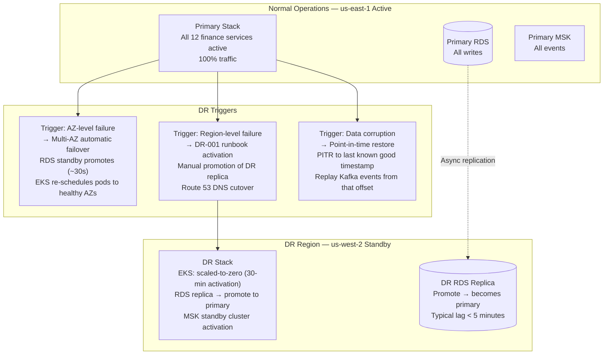
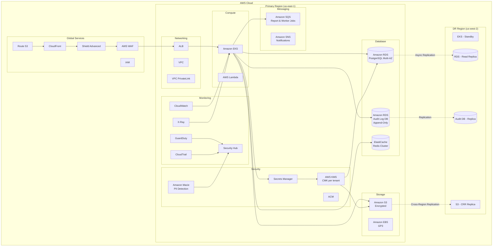
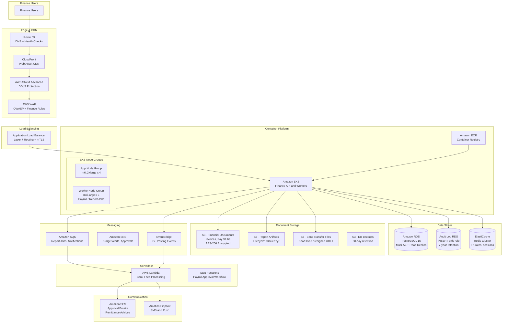
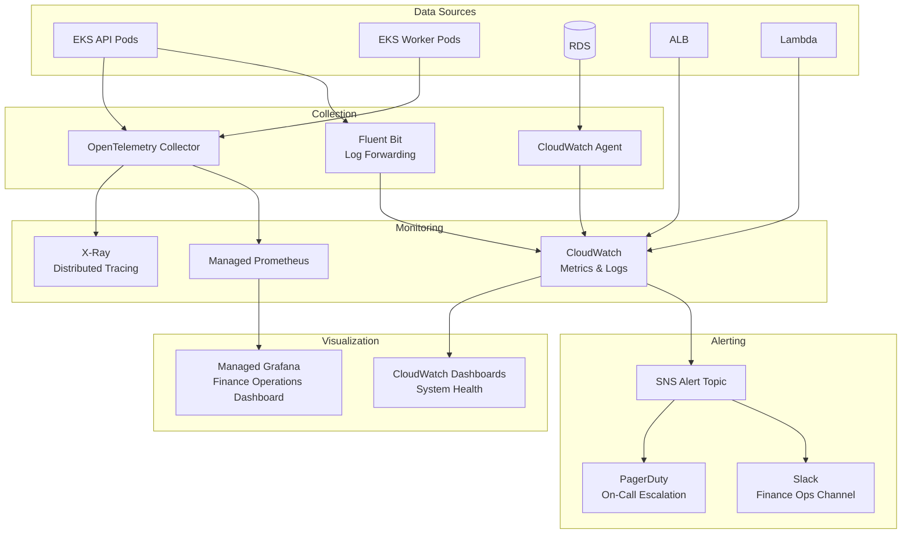

# Cloud Architecture

## Overview

AWS cloud architecture for the Finance Management System. This document describes the target-state, production-grade, multi-AZ primary deployment in `us-east-1` with warm-standby disaster recovery in `us-west-2`. All design decisions prioritize financial data integrity, regulatory compliance, and operational resilience.

**RTO:** 4 hours · **RPO:** 1 hour (financial records and ledger data)

---

## Full AWS Service Architecture

```mermaid
graph TB
    subgraph "Global / Edge Services"
        R53["Route 53\nPublic + Private Hosted Zones\nHealth-check DNS failover\nAlias records to CloudFront"]
        CF["CloudFront\nOrigin Shield (us-east-1)\nHTTPS-only · TLS 1.3\nCaching: API responses (short TTL)\nStatic assets (long TTL)"]
        WAF["AWS WAF v2\nAssociated to CloudFront + ALB\nOWASP CRS · SQL injection\nRate limiting · Geo-blocking"]
        Shield["AWS Shield Advanced\nDDoS protection L3/L4/L7\nDRT (DDoS Response Team) SLA\nAttack diagnostics"]
        IAM["AWS IAM\nIRSA for EKS pods\nLeast-privilege policies\nPermission boundaries\nSCPs on OU"]
    end

    subgraph "Primary Region — us-east-1"
        subgraph "Networking Layer"
            VPC["VPC — 10.0.0.0/16\nFlow Logs → CloudWatch\n3 AZs"]
            ALB["Application Load Balancer\nLayer 7 · HTTPS:443\nHTTP→HTTPS redirect\nTLS termination\nHealth checks: /health/ready"]
            NetworkFW["AWS Network Firewall\nEgress domain allowlist\nIntrusion prevention"]
            PrivLink["VPC PrivateLink\n9 Interface Endpoints\n1 Gateway Endpoint (S3)"]
            ClientVPN["AWS Client VPN\nAdmin / DBA access\nMFA + certificate auth"]
            DirectConn["AWS Direct Connect\n1 Gbps — Bank file transfer\nSite-to-Site VPN (backup)"]
        end

        subgraph "Container Platform"
            EKS["Amazon EKS v1.29\nManaged control plane\nPrivate API endpoint\nOIDC provider for IRSA\nKarpenter node provisioning"]
            ECR["Amazon ECR\nPrivate registry\nImmutable tags\nImage scan on push\nLifecycle: keep last 10 tags"]
            subgraph "EKS Node Groups"
                NG_App["App Node Group\nm6i.2xlarge × 3–12\nfinance-services namespace"]
                NG_Worker["Worker Node Group\nm6i.4xlarge × 2–8\nfinance-workers namespace"]
                NG_System["System Node Group\nm6i.large × 2–4\nkube-system · infra namespace"]
            end
        end

        subgraph "Data Stores"
            RDSPrimary[("Amazon RDS PostgreSQL 15\ndb.r6g.2xlarge — Multi-AZ\n500 GB gp3 · 12k IOPS\nEncrypted: KMS CMK\nAutomated backups: 35 days\nPerformance Insights enabled\npgaudit: DDL + DML logging")]
            RDSReplica1[("Read Replica 1\ndb.r6g.xlarge · AZ-b\nReporting queries")]
            RDSReplica2[("Read Replica 2\ndb.r6g.xlarge · AZ-c\nReconciliation queries")]
            AuditRDS[("Audit Log RDS\nPostgreSQL 15 · db.r6g.large\nINSERT-only application role\nNo DELETE / UPDATE ever granted\n7-year retention\n200 GB gp3")]
            ElastiCache[("ElastiCache Redis 7.x\nCluster mode: 3 shards × 2 nodes\ncache.r6g.large\nTLS in-transit · KMS at-rest\nFX rates · Sessions · Report cache")]
            MSK[("Amazon MSK — Kafka 3.5\n3 brokers · kafka.m5.2xlarge\nTLS-only · KMS encryption\nRetention: 7 days\nTopics: journal.posted,\nar.invoice.created,\nap.payment.approved,\nrecon.run.requested")]
        end

        subgraph "Object Storage — S3"
            S3_Docs["s3://finance-documents\nInvoices · Pay stubs · Contracts\nSSE-KMS · Versioning ON\nObject Lock: COMPLIANCE mode\nLifecycle: Glacier after 7 years"]
            S3_Reports["s3://finance-reports\nGenerated report artifacts\nSSE-KMS · Versioning ON\nLifecycle: Glacier after 90 days"]
            S3_BankFiles["s3://finance-bank-files\nACH / NEFT transfer files\nSSE-KMS · Versioning ON\nPresigned URLs: 1-hour TTL\nLifecycle: Delete after 7 days"]
            S3_Backups["s3://finance-backups\nRDS automated snapshots export\nSSE-KMS · Versioning ON\nLifecycle: Delete after 35 days"]
            S3_Logs["s3://finance-access-logs\nALB · CloudFront · S3 server logs\nSSE-S3 · Lifecycle: 90 days"]
        end

        subgraph "Security Services"
            KMS["AWS KMS\nCustomer Managed Keys (CMK)\nfinance-rds-key\nfinance-s3-key\nfinance-kafka-key\nfinance-audit-key\nAuto-rotation: annual"]
            SecretsManager["Secrets Manager\nDB credentials (auto-rotate 30d)\nAPI keys · Bank certs\nOAuth client secrets\nExternal Secrets Operator sync"]
            ACM["ACM\nTLS cert for *.finance.company.com\nAssociated to ALB + CloudFront\nAuto-renewal"]
            Macie["Amazon Macie\nS3 PII / financial data discovery\nWeekly scan · Alert on findings"]
            GuardDuty["Amazon GuardDuty\nThreat intelligence\nMalware protection\nRuntime monitoring (EKS)\nS3 data event monitoring"]
            Inspector["Amazon Inspector\nECR image vulnerability scan\nEC2 / Lambda scan\nSBOM export"]
            SecurityHub["AWS Security Hub\nAggregates GuardDuty\nMacie · Config · Inspector\nCIS AWS Benchmark\nPCI-DSS standard"]
            CloudTrail["AWS CloudTrail\nAll API calls logged\nManagement + Data events\nS3 data events (financial buckets)\nLog file integrity validation\nS3 + CloudWatch destination"]
            Config["AWS Config\nCIS Benchmark rules\nRDS encryption check\nS3 public access block\nSG unrestricted ingress\nEKS public endpoint check"]
        end

        subgraph "Monitoring and Observability"
            CloudWatch["Amazon CloudWatch\nMetrics · Logs · Alarms\nDashboards: Finance Ops\nSynthetic canaries\nLog Insights queries"]
            XRay["AWS X-Ray\nDistributed tracing\nService map\nLatency analysis\nError % dashboards"]
            ManagedPrometheus["Amazon Managed Prometheus\nKubernetes metrics\nCustom finance business metrics\n15-day retention"]
            ManagedGrafana["Amazon Managed Grafana\nDashboards: posting pipeline,\nreconciliation, period close,\ninfrastructure health"]
            CloudWatchSynthetics["CloudWatch Synthetics\nCanary: POST /api/v1/journal\nCanary: GET /api/v1/health\n5-minute interval"]
        end

        subgraph "Messaging and Events"
            SNS["Amazon SNS\nBudget threshold alerts\nApproval notifications\nSystem alerts → PagerDuty"]
            SQS["Amazon SQS\nReport job queue (FIFO)\nDead-letter queue (14-day)\nVisibility timeout: 300s"]
            EventBridge["Amazon EventBridge\nFinance domain event bus\nScheduled rules: depreciation,\nFX rate refresh, period-close\narchive: 90 days"]
            SES["Amazon SES\nApproval request emails\nRemittance advice delivery\nDedicated IP for deliverability"]
        end

        subgraph "Serverless"
            Lambda["AWS Lambda\nBank feed parser (S3 trigger)\nFX rate fetcher (EventBridge cron)\nNotification dispatcher (SNS)\nRuntime: Python 3.11\nX-Ray tracing: active"]
            StepFunctions["AWS Step Functions\nPeriod close workflow\nPayment approval workflow\nError handling + retry states"]
        end
    end

    subgraph "DR Region — us-west-2 (Warm Standby)"
        EKS_DR["EKS DR Cluster\nScaled-to-zero node groups\n30-min activation target\nRunbook: DR-001"]
        RDS_DR[("RDS Cross-Region Read Replica\ndb.r6g.2xlarge\nPromote on DR activation\nCurrent lag monitored via CloudWatch")]
        AuditRDS_DR[("Audit DB Replica\nAsync cross-region replication\nPoint-in-time recovery 35 days")]
        S3_DR["S3 Cross-Region Replication\nAll 5 finance buckets\nSame SSE-KMS config\nReplica KMS key in us-west-2"]
        MSK_DR["MSK DR Cluster\nStandby — activate on DR\nMirrorMaker 2 replication"]
        SecretsManager_DR["Secrets Manager\nReplicated secrets to us-west-2\nUsed by DR EKS cluster"]
    end

    R53 --> CF
    CF --> Shield
    Shield --> WAF
    WAF --> ALB
    ALB --> EKS

    EKS --> RDSPrimary
    EKS --> RDSReplica1
    EKS --> RDSReplica2
    EKS --> AuditRDS
    EKS --> ElastiCache
    EKS --> MSK
    EKS --> S3_Docs
    EKS --> S3_Reports
    EKS --> S3_BankFiles
    EKS --> SecretsManager
    EKS --> EventBridge

    SecretsManager --> KMS
    KMS --> RDSPrimary
    KMS --> AuditRDS
    KMS --> ElastiCache
    KMS --> MSK
    KMS --> S3_Docs

    EventBridge --> Lambda
    EventBridge --> StepFunctions
    SQS --> Lambda
    Lambda --> SES
    Lambda --> SNS

    CloudWatch --> SNS
    GuardDuty --> SecurityHub
    CloudTrail --> SecurityHub
    Config --> SecurityHub
    Inspector --> ECR
    Macie --> S3_Docs

    RDSPrimary -.->|"Async cross-region"| RDS_DR
    AuditRDS -.->|"Async cross-region"| AuditRDS_DR
    S3_Docs -.->|"CRR"| S3_DR
    MSK -.->|"MirrorMaker 2"| MSK_DR
```

---

## Multi-Region Disaster Recovery Strategy

### RTO / RPO Targets by Finance Process

| Process | RTO | RPO | DR Strategy |
|---------|-----|-----|-------------|
| Ledger posting | 4 hours | 1 hour | Cross-region replica promote + EKS DR activation |
| Journal entry API | 4 hours | 1 hour | Same as ledger posting |
| AP / AR processing | 4 hours | 1 hour | Same as ledger posting |
| Reconciliation | 8 hours | 4 hours | Read replica failover |
| Budget management | 8 hours | 4 hours | Read replica failover |
| Report generation | 8 hours | 4 hours | Async — not critical path |
| Audit log (read) | 4 hours | 0 (sync) | Audit RDS replica |
| Document storage | 2 hours | 15 minutes | S3 CRR — immediate availability in DR region |

---

## Backup Strategy

| Resource | Backup Method | Frequency | Retention | Cross-Region |
|----------|--------------|-----------|-----------|--------------|
| RDS Primary | Automated snapshots | Daily at 02:00 UTC | 35 days | Yes — replicated to us-west-2 |
| RDS Primary | Manual snapshot before schema migration | On-demand | 90 days | Yes |
| Audit RDS | Automated snapshots | Daily at 02:00 UTC | 7 years | Yes |
| ElastiCache | Automatic daily backup | Daily at 03:00 UTC | 7 days | No |
| MSK | MirrorMaker 2 replication | Continuous | 7-day topic retention | Yes |
| S3 buckets | Versioning + CRR | Continuous | Object Lock where required | Yes |
| Kubernetes manifests | Git repository (IaC) | On every change | Indefinite | n/a |
| Secrets | Secrets Manager replication | Immediate | n/a | Yes (us-west-2) |

---

## AWS Services Reference

| Category | Service | Purpose in Finance System |
|----------|---------|--------------------------|
| **Compute** | Amazon EKS v1.29 | Container orchestration for all 12 finance microservices |
| | AWS Lambda | Bank feed parsing, FX rate fetch, notification dispatch |
| | AWS Step Functions | Period close and payment approval state machines |
| **Container Registry** | Amazon ECR | Immutable image storage; vulnerability scan on push |
| **Networking** | VPC (3 AZs) | Network isolation across public, app, and data tiers |
| | ALB | TLS termination, path-based routing to services |
| | CloudFront | CDN for static assets; API cache layer |
| | Route 53 | DNS + health-check failover |
| | AWS Network Firewall | Egress domain allowlist; IPS |
| | VPC PrivateLink | AWS service access without internet traversal |
| | AWS Client VPN | Admin access with MFA + certificate auth |
| | AWS Direct Connect | High-throughput bank file transfer |
| **Database** | RDS PostgreSQL 15 | ACID-compliant transactional store for all services |
| | ElastiCache Redis 7 | Session tokens, FX rate cache, report job status |
| | Amazon MSK (Kafka 3.5) | Event streaming: journal postings, invoice events, recon |
| **Storage** | Amazon S3 | Financial documents, reports, bank files, backups |
| **Security** | AWS WAF v2 | OWASP CRS, rate limiting, geo-blocking |
| | AWS Shield Advanced | L3/L4/L7 DDoS protection with DRT access |
| | AWS KMS (CMK) | Encryption of all data at rest; per-resource keys |
| | Secrets Manager | Credentials, API keys; auto-rotation every 30 days |
| | ACM | TLS certificates for ALB and CloudFront |
| | Amazon Macie | PII / financial data detection in S3 |
| | Amazon GuardDuty | Threat detection with EKS runtime monitoring |
| | Amazon Inspector | Container image CVE scanning; SBOM generation |
| | AWS Security Hub | Compliance posture: CIS Benchmark + PCI-DSS standard |
| | AWS CloudTrail | All API calls logged with integrity validation |
| | AWS Config | Continuous compliance rule evaluation |
| **Monitoring** | CloudWatch | Metrics, logs, dashboards, alarms, synthetics |
| | AWS X-Ray | Distributed tracing and service dependency map |
| | Amazon Managed Prometheus | Kubernetes + business metrics |
| | Amazon Managed Grafana | Finance operations dashboard |
| **Messaging** | Amazon SNS | Budget alerts, approval notifications, system alerts |
| | Amazon SQS (FIFO) | Report job queue with dead-letter support |
| | Amazon EventBridge | Scheduled automation; domain event bus |
| | Amazon SES | Transactional email (approvals, remittance advice) |
| **DR** | RDS Cross-Region Replica | RPO 1 hour; promote to primary on DR activation |
| | S3 Cross-Region Replication | Near-real-time replica in us-west-2 |
| | MSK MirrorMaker 2 | Kafka topic replication to DR region |

---

## Cost Optimization Strategies

| Strategy | Implementation | Estimated Saving |
|----------|---------------|-----------------|
| Reserved Instances (1-year) | RDS, ElastiCache, MSK | 30–40% vs. On-Demand |
| Compute Savings Plans | EKS node groups (baseline load) | 20–30% vs. On-Demand |
| Spot instances for workers | Report workers, reconciliation workers | 60–70% vs. On-Demand |
| S3 Intelligent Tiering | Reports and documents > 30 days old | 30–40% on storage |
| CloudFront caching | Static assets cache; reduce ALB requests | 20–30% on data transfer |
| Right-sizing | Karpenter bin-packing; VPA recommendations | 15–25% on compute |
| NAT Gateway | VPC endpoints for S3/KMS/ECR (no NAT cost) | Reduces NAT data processing fees |

### Estimated Monthly Cost (Production)

| Component | Specification | Est. Monthly (USD) |
|-----------|--------------|-------------------|
| EKS Control Plane | 1 cluster | $73 |
| EC2 — App Node Group | 6× m6i.2xlarge (mixed On-Demand + Reserved) | $2,400 |
| EC2 — Worker Node Group | 4× m6i.4xlarge (Spot-eligible) | $800 |
| EC2 — System Node Group | 2× m6i.large | $180 |
| RDS PostgreSQL | db.r6g.2xlarge Multi-AZ + 2 read replicas | $2,800 |
| Audit RDS | db.r6g.large | $650 |
| ElastiCache Redis | 3 shards × 2 nodes cache.r6g.large | $950 |
| MSK Kafka | 3× kafka.m5.2xlarge | $1,100 |
| S3 Storage | 5 TB across buckets + CRR | $350 |
| CloudFront | 10 TB transfer + HTTPS requests | $650 |
| WAF + Shield Advanced | Standard usage | $1,500 |
| GuardDuty + Macie + Inspector | Standard usage | $600 |
| CloudTrail + CloudWatch + X-Ray | Standard usage | $500 |
| Lambda + SQS + SNS + SES | Standard usage | $200 |
| Data Transfer | Cross-AZ + egress | $300 |
| **Total (est.)** | | **~$13,050 / month** |

> Savings Plans and 1-year RIs can reduce this to approximately **$9,500–10,500/month**.

---

## AWS Architecture Overview

---

## Detailed AWS Service Architecture

---

## Security Architecture

```mermaid
graph TB
    subgraph "Perimeter Security"
        WAF[AWS WAF<br>OWASP Top 10 Rules<br>Finance-Specific Rules]
        Shield[Shield Advanced<br>DDoS Protection]
        Firewall[AWS Network Firewall<br>Egress Filtering]
    end

    subgraph "Identity & Access"
        IAMRoles[IAM Roles<br>Least Privilege]
        STS[STS<br>Temporary Credentials]
        SecretsManager[Secrets Manager<br>DB Credentials, API Keys]
    end

    subgraph "Data Protection"
        KMS[AWS KMS<br>CMK per Entity/Tenant]
        Macie[Amazon Macie<br>PII / Financial Data Detection]
        ACM[ACM<br>TLS Certificates]
    end

    subgraph "Detection & Compliance"
        GuardDuty[GuardDuty<br>Threat Detection]
        SecurityHub[Security Hub<br>Compliance Dashboard]
        CloudTrail[CloudTrail<br>All API Calls Logged]
        Config[AWS Config<br>CIS Benchmark Rules]
        Inspector[Amazon Inspector<br>Container Vulnerability Scan]
    end

    subgraph "Database Security"
        RDS_Encrypt[RDS<br>Storage Encryption KMS]
        RDS_IAM[RDS IAM Auth<br>No password access]
        AuditDB[Audit Log DB<br>INSERT-only role]
    end

    WAF --> ALB
    IAMRoles --> EKS
    KMS --> RDS_Encrypt
    SecretsManager --> EKS
    Macie --> S3
    GuardDuty --> SecurityHub
    CloudTrail --> SecurityHub
    Config --> SecurityHub
    Inspector --> ECR
```

---

## Monitoring & Observability

---

## AWS Services Summary

| Category | Service | Purpose |
|----------|---------|---------|
| **Compute** | EKS | Finance API and worker container orchestration |
| | Lambda | Bank feed processing, notification dispatch |
| | Step Functions | Payroll and approval workflow state machines |
| **Storage** | S3 | Financial documents, reports, bank files (encrypted) |
| | EBS GP3 | EKS node block storage |
| **Database** | RDS PostgreSQL | Primary transactional database (Multi-AZ) |
| | Audit Log RDS | Append-only audit trail database |
| | ElastiCache Redis | Session tokens, FX rates, report cache |
| **Messaging** | SQS | Report job queues, notification queues |
| | SNS | Budget alerts, approval notifications |
| | EventBridge | GL posting event bus |
| **Networking** | VPC | Network isolation |
| | ALB | Layer 7 load balancing with mTLS |
| | CloudFront | CDN for static assets |
| | Route 53 | DNS and health checks |
| **Security** | WAF | OWASP and finance-specific rule groups |
| | KMS | CMK encryption for financial data at rest |
| | Secrets Manager | Credential management (DB, APIs, bank keys) |
| | Macie | PII detection in S3 |
| | GuardDuty | Threat detection |
| | CloudTrail | API-level audit logging |
| | Config | Compliance rule enforcement |
| **Monitoring** | CloudWatch | Metrics, logs, dashboards |
| | X-Ray | Distributed tracing |
| | Prometheus + Grafana | Finance operations dashboard |

---

## Estimated Monthly Costs

| Component | Specification | Est. Monthly Cost |
|-----------|---------------|-------------------|
| EKS Cluster | Control plane + 7 nodes | $1,400 |
| EC2 Instances | 7 x m6i.2xlarge | $4,800 |
| RDS PostgreSQL | db.r6g.2xlarge Multi-AZ + Read Replica | $2,500 |
| Audit Log RDS | db.r6g.large | $600 |
| ElastiCache | 3-node cluster | $900 |
| S3 Storage | 2 TB + lifecycle to Glacier | $200 |
| CloudFront | 5 TB transfer | $425 |
| Security (WAF, GuardDuty, Macie) | Standard usage | $1,200 |
| Lambda + SQS + SNS | Standard usage | $300 |
| **Total** | | **~$12,300/month** |

> Note: Costs are estimates and vary based on actual usage, region, and reserved instance commitments.

## Implementation-Ready Finance Control Expansion

### 1) Accounting Rule Assumptions (Detailed)
- Ledger model is strictly double-entry with balanced journal headers and line-level dimensional tagging (entity, cost-center, project, product, counterparty).
- Posting policies are versioned and time-effective; historical transactions are evaluated against the rule version active at transaction time.
- Currency handling requires transaction currency, functional currency, and optional reporting currency; FX revaluation and realized/unrealized gains are separated.
- Materiality thresholds are explicit and configurable; below-threshold variances may auto-resolve only when policy explicitly allows.

### 2) Transaction Invariants and Data Contracts
- Every command/event must include `transaction_id`, `idempotency_key`, `source_system`, `event_time_utc`, `actor_id/service_principal`, and `policy_version`.
- Mutations affecting posted books are append-only. Corrections use reversal + adjustment entries with causal linkage to original posting IDs.
- Period invariant checks: no unapproved journals in closing period, all sub-ledger control accounts reconciled, and close checklist fully attested.
- Referential invariants: every ledger line links to a provenance artifact (invoice/payment/payroll/expense/asset/tax document).

### 3) Reconciliation and Close Strategy
- Continuous reconciliation cadence:
  - **T+0/T+1** operational reconciliation (gateway, bank, processor, payroll outputs).
  - **Daily** sub-ledger to GL tie-out.
  - **Monthly/Quarterly** close certification with controller sign-off.
- Exception taxonomy is mandatory: timing mismatch, mapping/config error, duplicate, missing source event, external counterparty variance, FX rounding.
- Close blockers are machine-detectable and surfaced on a close dashboard with ownership, ETA, and escalation policy.

### 4) Failure Handling and Operational Recovery
- Posting pipeline uses outbox/inbox patterns with deterministic retries and dead-letter quarantine for non-retriable payloads.
- Duplicate delivery and partial failure scenarios must be proven safe through idempotency and compensating accounting entries.
- Incident runbooks require: containment decision, scope quantification, replay/rebuild method, reconciliation rerun, and financial controller approval.
- Recovery drills must be executed periodically with evidence retained for audit.

### 5) Regulatory / Compliance / Audit Expectations
- Controls must support segregation of duties, least privilege, and end-to-end tamper-evident audit trails.
- Retention strategy must satisfy jurisdictional requirements for financial records, tax documents, and payroll artifacts.
- Sensitive data handling includes classification, masking/tokenization for non-production, and secure export controls.
- Every policy override (manual journal, reopened period, emergency access) requires reason code, approver, and expiration window.

### 6) Data Lineage & Traceability (Requirements → Implementation)
- Maintain an explicit traceability matrix for this artifact (`infrastructure/cloud-architecture.md`):
  - `Requirement ID` → `Business Rule / Event` → `Design Element` (API/schema/diagram component) → `Code Module` → `Test Evidence` → `Control Owner`.
- Lineage metadata minimums: source event ID, transformation ID/version, posting rule version, reconciliation batch ID, and report consumption path.
- Any change touching accounting semantics must include impact analysis across upstream requirements and downstream close/compliance reports.
- Documentation updates are blocking for release when they alter financial behavior, posting logic, or reconciliation outcomes.

### 7) Phase-Specific Implementation Readiness
- Enforce encryption in transit/at rest for PII/financial records and maintain key-rotation evidence.
- Provision isolated environments with masked production-like data and immutable audit-log sinks.
- Define RPO/RTO targets by finance process (payments, payroll, posting, close, reporting) and align backup strategy.

### 8) Implementation Checklist for `cloud architecture`
- [ ] Control objectives and success/failure criteria are explicit and testable.
- [ ] Data contracts include mandatory identifiers, timestamps, and provenance fields.
- [ ] Reconciliation logic defines cadence, tolerances, ownership, and escalation.
- [ ] Operational runbooks cover retries, replay, backfill, and close re-certification.
- [ ] Compliance evidence artifacts are named, retained, and linked to control owners.

