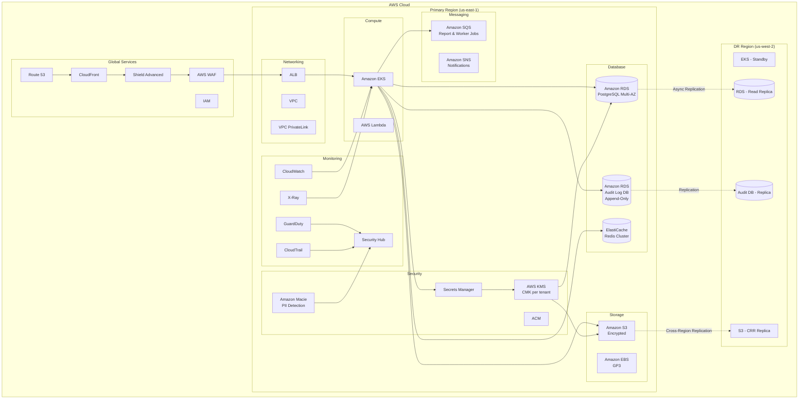
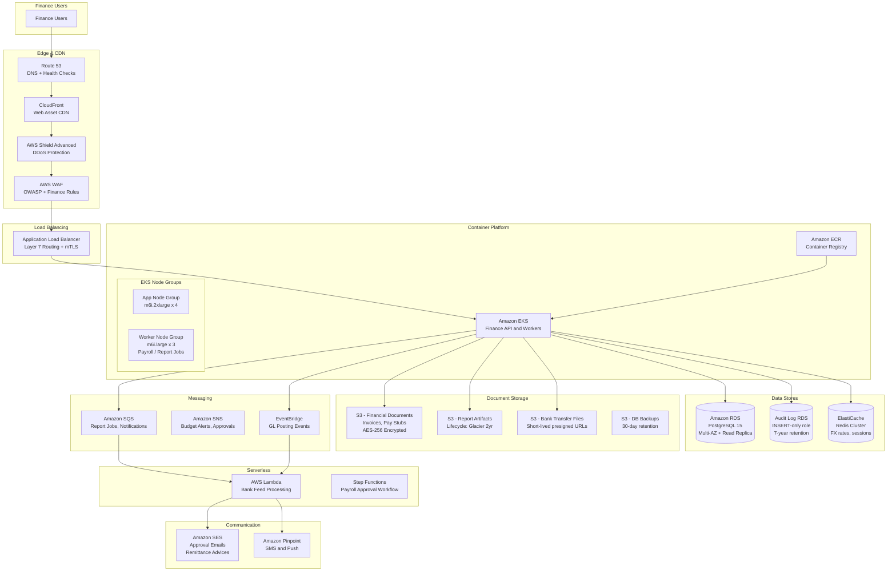
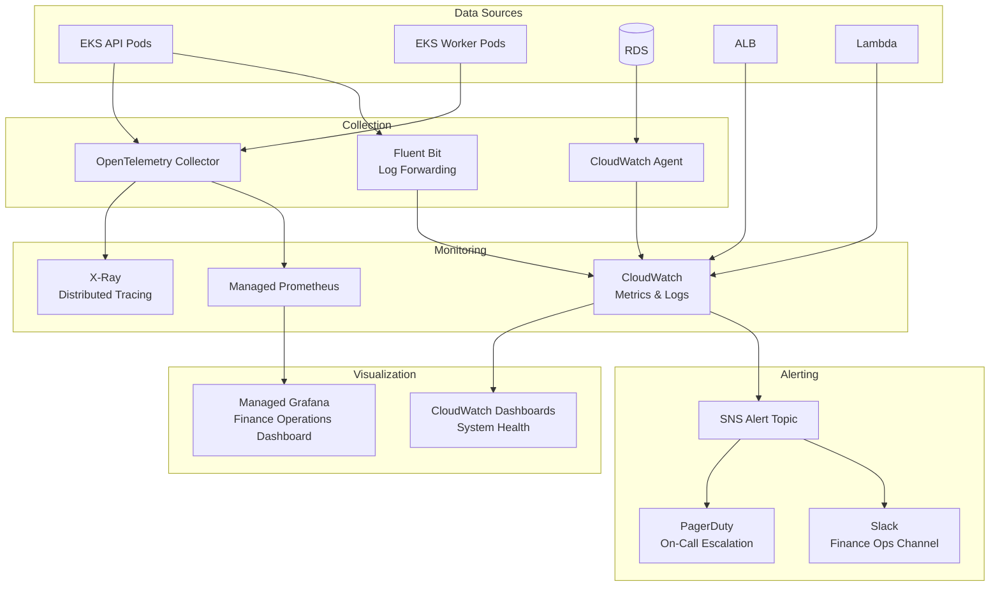

# Cloud Architecture Diagram

## Overview
Cloud architecture design for the Finance Management System on AWS. This document represents the target-state infrastructure design for a production-grade, highly available, and security-compliant financial system.

---

## AWS Architecture Overview

---

## Detailed AWS Service Architecture

---

## Security Architecture

```mermaid
graph TB
    subgraph "Perimeter Security"
        WAF[AWS WAF<br>OWASP Top 10 Rules<br>Finance-Specific Rules]
        Shield[Shield Advanced<br>DDoS Protection]
        Firewall[AWS Network Firewall<br>Egress Filtering]
    end

    subgraph "Identity & Access"
        IAMRoles[IAM Roles<br>Least Privilege]
        STS[STS<br>Temporary Credentials]
        SecretsManager[Secrets Manager<br>DB Credentials, API Keys]
    end

    subgraph "Data Protection"
        KMS[AWS KMS<br>CMK per Entity/Tenant]
        Macie[Amazon Macie<br>PII / Financial Data Detection]
        ACM[ACM<br>TLS Certificates]
    end

    subgraph "Detection & Compliance"
        GuardDuty[GuardDuty<br>Threat Detection]
        SecurityHub[Security Hub<br>Compliance Dashboard]
        CloudTrail[CloudTrail<br>All API Calls Logged]
        Config[AWS Config<br>CIS Benchmark Rules]
        Inspector[Amazon Inspector<br>Container Vulnerability Scan]
    end

    subgraph "Database Security"
        RDS_Encrypt[RDS<br>Storage Encryption KMS]
        RDS_IAM[RDS IAM Auth<br>No password access]
        AuditDB[Audit Log DB<br>INSERT-only role]
    end

    WAF --> ALB
    IAMRoles --> EKS
    KMS --> RDS_Encrypt
    SecretsManager --> EKS
    Macie --> S3
    GuardDuty --> SecurityHub
    CloudTrail --> SecurityHub
    Config --> SecurityHub
    Inspector --> ECR
```

---

## Monitoring & Observability

---

## AWS Services Summary

| Category | Service | Purpose |
|----------|---------|---------|
| **Compute** | EKS | Finance API and worker container orchestration |
| | Lambda | Bank feed processing, notification dispatch |
| | Step Functions | Payroll and approval workflow state machines |
| **Storage** | S3 | Financial documents, reports, bank files (encrypted) |
| | EBS GP3 | EKS node block storage |
| **Database** | RDS PostgreSQL | Primary transactional database (Multi-AZ) |
| | Audit Log RDS | Append-only audit trail database |
| | ElastiCache Redis | Session tokens, FX rates, report cache |
| **Messaging** | SQS | Report job queues, notification queues |
| | SNS | Budget alerts, approval notifications |
| | EventBridge | GL posting event bus |
| **Networking** | VPC | Network isolation |
| | ALB | Layer 7 load balancing with mTLS |
| | CloudFront | CDN for static assets |
| | Route 53 | DNS and health checks |
| **Security** | WAF | OWASP and finance-specific rule groups |
| | KMS | CMK encryption for financial data at rest |
| | Secrets Manager | Credential management (DB, APIs, bank keys) |
| | Macie | PII detection in S3 |
| | GuardDuty | Threat detection |
| | CloudTrail | API-level audit logging |
| | Config | Compliance rule enforcement |
| **Monitoring** | CloudWatch | Metrics, logs, dashboards |
| | X-Ray | Distributed tracing |
| | Prometheus + Grafana | Finance operations dashboard |

---

## Estimated Monthly Costs

| Component | Specification | Est. Monthly Cost |
|-----------|---------------|-------------------|
| EKS Cluster | Control plane + 7 nodes | $1,400 |
| EC2 Instances | 7 x m6i.2xlarge | $4,800 |
| RDS PostgreSQL | db.r6g.2xlarge Multi-AZ + Read Replica | $2,500 |
| Audit Log RDS | db.r6g.large | $600 |
| ElastiCache | 3-node cluster | $900 |
| S3 Storage | 2 TB + lifecycle to Glacier | $200 |
| CloudFront | 5 TB transfer | $425 |
| Security (WAF, GuardDuty, Macie) | Standard usage | $1,200 |
| Lambda + SQS + SNS | Standard usage | $300 |
| **Total** | | **~$12,300/month** |

> Note: Costs are estimates and vary based on actual usage, region, and reserved instance commitments.
