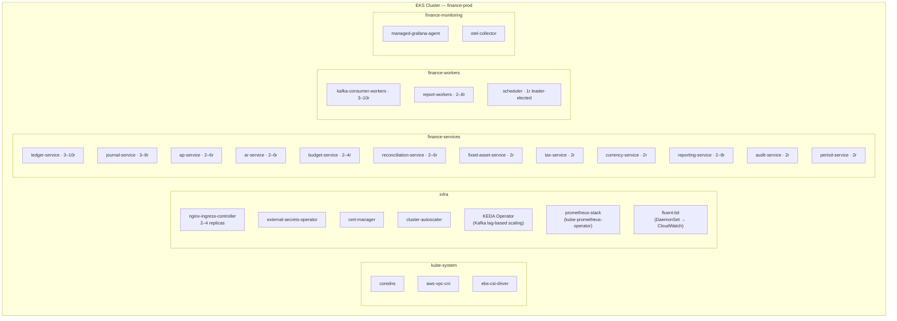
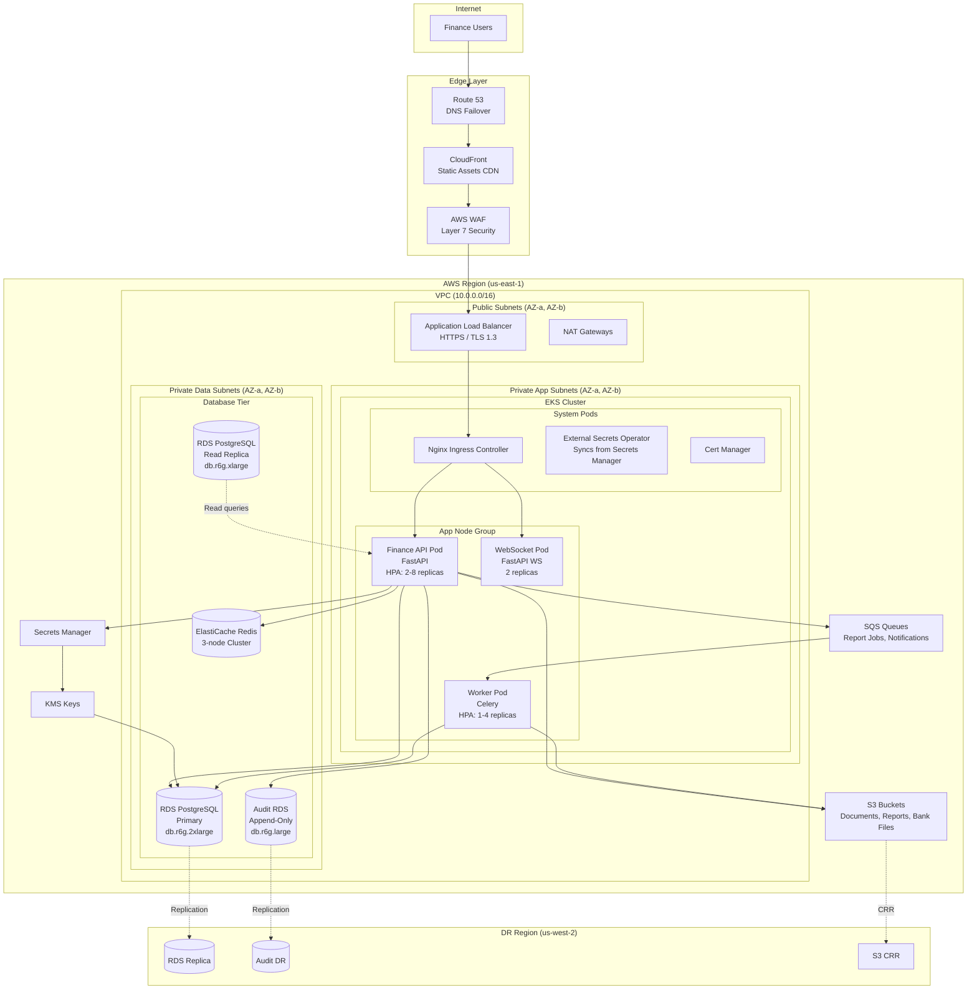
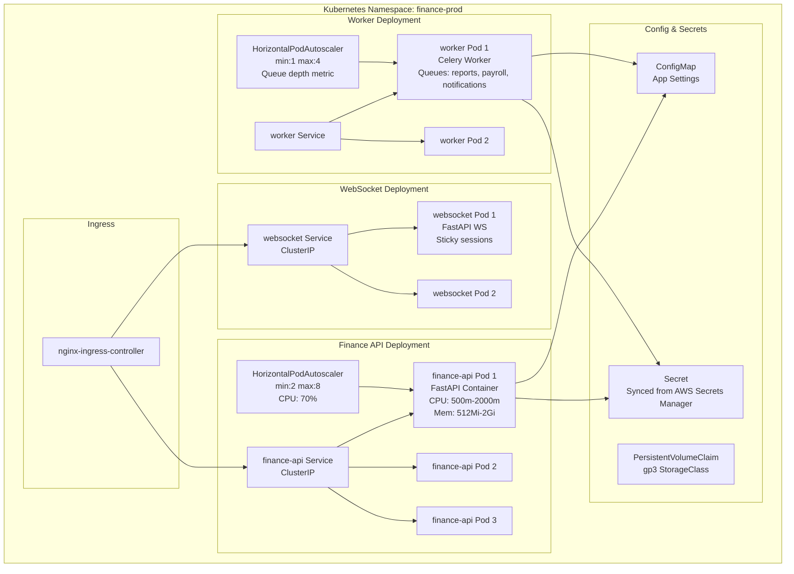
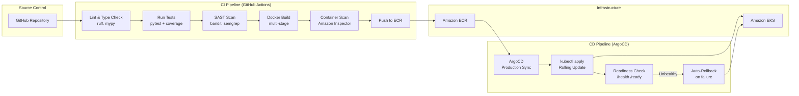
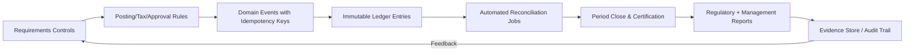

```mermaid
graph LR
    subgraph "Source"
        Git["GitHub\nfeature → main branch"]
    end

    subgraph "CI — GitHub Actions"
        Lint["Lint + Type Check\nruff · mypy · eslint"]
        UnitTest["Unit Tests\npytest · jest\nCoverage ≥ 80%"]
        IntTest["Integration Tests\nDocker Compose\nTestcontainers"]
        SAST["SAST\nSemgrep · Bandit · Snyk"]
        Build["Docker Build\nMulti-stage · Non-root"]
        Scan["Container Scan\nAmazon Inspector · Trivy\nBlock on CRITICAL CVE"]
        Push["Push to ECR\nImmutable tags: sha-{git-sha}"]
    end

    subgraph "CD — ArgoCD (GitOps)"
        ArgoDev["ArgoCD — dev\nAuto-sync on push"]
        ArgoStage["ArgoCD — staging\nManual promotion"]
        ArgoProd["ArgoCD — prod\nManual approval gate\n2 approvers required"]
        RollingUpdate["Rolling Update\nmaxSurge: 1 · maxUnavailable: 0"]
        HealthCheck["Health Check\n/health/ready · /health/live\n30s timeout"]
        AutoRollback["Auto-Rollback\nReverts if 3 pods fail readiness"]
    end

    Git --> Lint --> UnitTest --> IntTest --> SAST
    SAST --> Build --> Scan --> Push
    Push --> ArgoDev --> ArgoStage --> ArgoProd
    ArgoProd --> RollingUpdate --> HealthCheck
    HealthCheck -->|"Unhealthy"| AutoRollback
```

# Deployment Diagram

## Overview

Production deployment topology for the Finance Management System on AWS EKS. All services run in a multi-AZ configuration across `us-east-1` with active-active availability. This document maps every software component to its infrastructure node, replica count, resource envelope, and data-tier dependency.

---

## Production Deployment Topology

```mermaid
graph TB
    subgraph "Internet"
        Users["Finance Users\n(Browsers / Mobile / API Clients)"]
        ExtSys["External Systems\n(Banks · Tax Portals · ERP)"]
    end

    subgraph "AWS Edge — Global"
        R53["Route 53\nAlias + Health-Check Failover\nTTL: 60s"]
        CF["CloudFront\nStatic Assets · API Cache Headers\nOrigin Shield enabled"]
        WAF["AWS WAF v2\nOWASP Core Rule Set\nFinance IP Reputation List\nRate Limit: 2000 req/min per IP"]
        Shield["AWS Shield Advanced\nDDoS L3/L4/L7 Protection"]
    end

    subgraph "Primary Region — us-east-1"
        subgraph "Public Subnets (10.0.1.0/24 · 10.0.2.0/24 · 10.0.3.0/24)"
            ALB["Application Load Balancer\nHTTPS/TLS 1.3 · HTTP→HTTPS Redirect\nAccess Logs → S3\nStickiness: Disabled (stateless API)"]
            NATGW_A["NAT Gateway — AZ-a"]
            NATGW_B["NAT Gateway — AZ-b"]
            NATGW_C["NAT Gateway — AZ-c"]
        end

        subgraph "EKS Cluster — finance-prod (v1.29)"
            subgraph "System Namespace: kube-system / infra"
                NginxIC["Nginx Ingress Controller\n2 replicas · HPA 2–4\nCPU: 250m–1000m · Mem: 256Mi–512Mi"]
                ExtSecrets["External Secrets Operator\nSyncs from Secrets Manager\n30s rotation poll"]
                CertMgr["Cert-Manager\nACM PCA Integration"]
                ClusterAutoscaler["Cluster Autoscaler\nNode group min/max enforcement"]
                MetricsServer["Metrics Server\nHPA / VPA feed"]
            end

            subgraph "Namespace: finance-services"
                subgraph "Ledger Service"
                    LedgerDep["ledger-service\n3 replicas · HPA 3–10\nm6i.2xlarge nodes\nCPU: 500m–2000m · Mem: 512Mi–2Gi\nReadiness: /health/ready\nLiveness: /health/live"]
                end
                subgraph "Journal Service"
                    JournalDep["journal-service\n3 replicas · HPA 3–8\nCPU: 500m–2000m · Mem: 512Mi–2Gi"]
                end
                subgraph "AP / AR Services"
                    APDep["ap-service\n2 replicas · HPA 2–6\nCPU: 250m–1000m · Mem: 256Mi–1Gi"]
                    ARDep["ar-service\n2 replicas · HPA 2–6\nCPU: 250m–1000m · Mem: 256Mi–1Gi"]
                end
                subgraph "Budget & Reconciliation Services"
                    BudgetDep["budget-service\n2 replicas · HPA 2–4\nCPU: 250m–1000m · Mem: 256Mi–1Gi"]
                    ReconDep["reconciliation-service\n2 replicas · HPA 2–6\nCPU: 500m–2000m · Mem: 512Mi–2Gi"]
                end
                subgraph "Fixed Asset / Tax / Currency"
                    AssetDep["fixed-asset-service\n2 replicas\nCPU: 250m–1000m · Mem: 256Mi–1Gi"]
                    TaxDep["tax-service\n2 replicas\nCPU: 250m–1000m · Mem: 256Mi–1Gi"]
                    CurrencyDep["currency-service\n2 replicas\nCPU: 250m–500m · Mem: 128Mi–512Mi"]
                end
                subgraph "Reporting / Audit / Period Services"
                    ReportDep["reporting-service\n2 replicas · HPA 2–8\nCPU: 1000m–4000m · Mem: 1Gi–4Gi"]
                    AuditDep["audit-service\n2 replicas\nCPU: 250m–500m · Mem: 256Mi–512Mi\nIMMUTABLE — append-only writes"]
                    PeriodDep["period-service\n2 replicas\nCPU: 250m–500m · Mem: 128Mi–512Mi"]
                end
            end

            subgraph "Namespace: finance-workers"
                KafkaConsumer["kafka-consumer-workers\n3 replicas · KEDA HPA (lag-based)\nCPU: 500m–2000m · Mem: 512Mi–2Gi\nConsumer groups: posting, recon, notify"]
                ReportWorker["report-async-workers\n2 replicas · KEDA HPA\nCPU: 1000m–4000m · Mem: 2Gi–8Gi\nQueue: report-jobs"]
                SchedulerPod["scheduler-service\n1 replica (leader election)\nCPU: 250m · Mem: 256Mi\nCron: depreciation, FX, period-close"]
            end
        end

        subgraph "Private Data Subnets (10.0.20.0/24 · 10.0.21.0/24 · 10.0.22.0/24)"
            subgraph "PostgreSQL RDS — Multi-AZ"
                RDSPrimary[("RDS Primary\nPostgreSQL 15.4\ndb.r6g.2xlarge · 500 GB gp3\nMulti-AZ Standby in AZ-b\nAutomated backups: 35 days\nEncrypted: KMS CMK")]
                RDSReplica1[("Read Replica 1\ndb.r6g.xlarge · AZ-b\nReporting queries")]
                RDSReplica2[("Read Replica 2\ndb.r6g.xlarge · AZ-c\nReconciliation queries")]
                AuditRDS[("Audit RDS\nPostgreSQL 15.4\ndb.r6g.large · 200 GB gp3\nINSERT-only app role\n7-year retention policy")]
            end
            subgraph "ElastiCache Redis — Cluster Mode"
                RedisCluster[("ElastiCache Redis 7.x\n3 shards × 2 nodes\ncache.r6g.large\nTLS in-transit · KMS at-rest\nFX rates · Sessions · Report cache")]
            end
            subgraph "MSK Kafka — 3-Broker Cluster"
                MSKCluster["Amazon MSK\nKafka 3.5 · 3 brokers\nkafka.m5.2xlarge\nTopics: journal.posted, recon.run,\nar.invoice.created, ap.payment.approved\nRetention: 7 days · Replication factor: 3"]
            end
        end

        subgraph "AWS Managed Services"
            S3["S3 Buckets\nfinance-documents (AES-256, Versioning)\nfinance-reports (Glacier after 90d)\nfinance-bank-files (7-day TTL, presigned)\nfinance-backups (30-day RDS snapshots)"]
            SecretsManager["Secrets Manager\nDB credentials · API keys · Bank certs\nAuto-rotation: 30 days"]
            KMS["KMS — Customer Managed Keys\nfinance-rds-key · finance-s3-key\nfinance-kafka-key · finance-audit-key\nKey rotation: annual"]
            CloudWatch["CloudWatch\nMetrics · Logs · Alarms\nLog Groups: /finance/api /finance/workers\nRetention: 90 days"]
        end
    end

    subgraph "DR Region — us-west-2 (Warm Standby)"
        RDSDR[("RDS Cross-Region Read Replica\ndb.r6g.2xlarge\nPromote on DR event")]
        AuditRDSDR[("Audit DB Replica\nCross-region async")]
        S3DR["S3 Cross-Region Replication\nVersioned, same encryption"]
        EKSDR["EKS DR Cluster\nScaled-to-zero node groups\nActivate via Runbook DR-001"]
    end

    Users --> R53
    R53 --> CF
    CF --> Shield
    Shield --> WAF
    WAF --> ALB
    ALB --> NginxIC
    NginxIC --> LedgerDep
    NginxIC --> JournalDep
    NginxIC --> APDep
    NginxIC --> ARDep
    NginxIC --> BudgetDep
    NginxIC --> ReconDep
    NginxIC --> AssetDep
    NginxIC --> TaxDep
    NginxIC --> CurrencyDep
    NginxIC --> ReportDep
    NginxIC --> PeriodDep

    LedgerDep --> RDSPrimary
    JournalDep --> RDSPrimary
    APDep --> RDSPrimary
    ARDep --> RDSPrimary
    BudgetDep --> RDSPrimary
    ReconDep --> RDSPrimary

    ReportDep --> RDSReplica1
    ReconDep --> RDSReplica2

    LedgerDep --> AuditRDS
    JournalDep --> AuditRDS
    AuditDep --> AuditRDS

    LedgerDep --> RedisCluster
    JournalDep --> RedisCluster
    CurrencyDep --> RedisCluster

    JournalDep --> MSKCluster
    ReconDep --> MSKCluster
    APDep --> MSKCluster
    ARDep --> MSKCluster

    KafkaConsumer --> MSKCluster
    KafkaConsumer --> RDSPrimary

    ReportWorker --> RDSReplica1
    ReportWorker --> S3

    LedgerDep --> SecretsManager
    SecretsManager --> KMS
    KMS --> RDSPrimary
    KMS --> S3

    LedgerDep --> CloudWatch

    ExtSys --> ALB
    ExtSys --> NATGW_A

    RDSPrimary -.->|"Async Cross-Region Replication"| RDSDR
    AuditRDS -.->|"Async Replication"| AuditRDSDR
    S3 -.->|"Cross-Region Replication"| S3DR
```

---

## Kubernetes Namespace Structure

---

## Service Resource Requirements

| Service | Min Replicas | Max Replicas | CPU Request | CPU Limit | Memory Request | Memory Limit | HPA Trigger |
|---------|-------------|-------------|-------------|-----------|----------------|--------------|-------------|
| ledger-service | 3 | 10 | 500m | 2000m | 512Mi | 2Gi | CPU > 70% |
| journal-service | 3 | 8 | 500m | 2000m | 512Mi | 2Gi | CPU > 70% |
| ap-service | 2 | 6 | 250m | 1000m | 256Mi | 1Gi | CPU > 70% |
| ar-service | 2 | 6 | 250m | 1000m | 256Mi | 1Gi | CPU > 70% |
| budget-service | 2 | 4 | 250m | 1000m | 256Mi | 1Gi | CPU > 70% |
| reconciliation-service | 2 | 6 | 500m | 2000m | 512Mi | 2Gi | CPU > 60% |
| fixed-asset-service | 2 | 4 | 250m | 1000m | 256Mi | 1Gi | CPU > 70% |
| tax-service | 2 | 4 | 250m | 1000m | 256Mi | 1Gi | CPU > 70% |
| currency-service | 2 | 4 | 250m | 500m | 128Mi | 512Mi | CPU > 70% |
| reporting-service | 2 | 8 | 1000m | 4000m | 1Gi | 4Gi | CPU > 60% |
| audit-service | 2 | 4 | 250m | 500m | 256Mi | 512Mi | CPU > 70% |
| period-service | 2 | 4 | 250m | 500m | 128Mi | 512Mi | CPU > 70% |
| kafka-consumer-workers | 3 | 10 | 500m | 2000m | 512Mi | 2Gi | Kafka lag > 1000 |
| report-workers | 2 | 8 | 1000m | 4000m | 2Gi | 8Gi | Queue depth > 5 |
| scheduler | 1 | 1 | 250m | 500m | 256Mi | 512Mi | Leader election |

---

## Node Group Configuration

| Node Group | Instance Type | Min Nodes | Max Nodes | AZs | Workloads |
|------------|--------------|-----------|-----------|-----|-----------|
| app-ng | m6i.2xlarge (8 vCPU, 32 GB) | 3 | 12 | a, b, c | Finance API services |
| worker-ng | m6i.4xlarge (16 vCPU, 64 GB) | 2 | 8 | a, b, c | Kafka consumers, report workers |
| system-ng | m6i.large (2 vCPU, 8 GB) | 2 | 4 | a, b | Infra pods, monitoring |

---

## CI/CD Pipeline

---

## RDS PostgreSQL Multi-AZ Configuration

| Parameter | Value |
|-----------|-------|
| Engine | PostgreSQL 15.4 |
| Instance class (primary) | db.r6g.2xlarge |
| Instance class (read replicas) | db.r6g.xlarge |
| Storage type | gp3 · 500 GB · 12,000 IOPS |
| Multi-AZ | Enabled (synchronous standby in AZ-b) |
| Read replicas | 2 (AZ-b reporting, AZ-c reconciliation) |
| Automated backups | 35-day retention · 02:00 UTC window |
| Encryption | KMS CMK (`finance-rds-key`) |
| Performance Insights | Enabled · 7-day retention |
| Enhanced Monitoring | 1-second granularity |
| Parameter group | `finance-pg15` (shared_buffers=25% RAM, max_connections=500) |
| Audit logging | pgaudit extension — DDL + DML on financial tables |

---

## Disaster Recovery Summary

| Tier | RTO Target | RPO Target | Strategy |
|------|-----------|-----------|----------|
| Ledger / Journal posting | 4 hours | 1 hour | Cross-region RDS replica promote + EKS DR activate |
| Reporting / Analytics | 8 hours | 4 hours | Read replica failover |
| Document storage | 2 hours | 15 minutes | S3 CRR with immediate availability |
| Audit log | 4 hours | 0 (synchronous) | Cross-region async with point-in-time recovery |

> DR Runbook: `runbooks/DR-001-region-failover.md` — must be rehearsed quarterly.

---

## Production Deployment Architecture

---

## Kubernetes Deployment Detail

---

## CI/CD Pipeline

## Implementation-Ready Finance Control Expansion

### 1) Accounting Rule Assumptions (Detailed)
- Ledger model is strictly double-entry with balanced journal headers and line-level dimensional tagging (entity, cost-center, project, product, counterparty).
- Posting policies are versioned and time-effective; historical transactions are evaluated against the rule version active at transaction time.
- Currency handling requires transaction currency, functional currency, and optional reporting currency; FX revaluation and realized/unrealized gains are separated.
- Materiality thresholds are explicit and configurable; below-threshold variances may auto-resolve only when policy explicitly allows.

### 2) Transaction Invariants and Data Contracts
- Every command/event must include `transaction_id`, `idempotency_key`, `source_system`, `event_time_utc`, `actor_id/service_principal`, and `policy_version`.
- Mutations affecting posted books are append-only. Corrections use reversal + adjustment entries with causal linkage to original posting IDs.
- Period invariant checks: no unapproved journals in closing period, all sub-ledger control accounts reconciled, and close checklist fully attested.
- Referential invariants: every ledger line links to a provenance artifact (invoice/payment/payroll/expense/asset/tax document).

### 3) Reconciliation and Close Strategy
- Continuous reconciliation cadence:
  - **T+0/T+1** operational reconciliation (gateway, bank, processor, payroll outputs).
  - **Daily** sub-ledger to GL tie-out.
  - **Monthly/Quarterly** close certification with controller sign-off.
- Exception taxonomy is mandatory: timing mismatch, mapping/config error, duplicate, missing source event, external counterparty variance, FX rounding.
- Close blockers are machine-detectable and surfaced on a close dashboard with ownership, ETA, and escalation policy.

### 4) Failure Handling and Operational Recovery
- Posting pipeline uses outbox/inbox patterns with deterministic retries and dead-letter quarantine for non-retriable payloads.
- Duplicate delivery and partial failure scenarios must be proven safe through idempotency and compensating accounting entries.
- Incident runbooks require: containment decision, scope quantification, replay/rebuild method, reconciliation rerun, and financial controller approval.
- Recovery drills must be executed periodically with evidence retained for audit.

### 5) Regulatory / Compliance / Audit Expectations
- Controls must support segregation of duties, least privilege, and end-to-end tamper-evident audit trails.
- Retention strategy must satisfy jurisdictional requirements for financial records, tax documents, and payroll artifacts.
- Sensitive data handling includes classification, masking/tokenization for non-production, and secure export controls.
- Every policy override (manual journal, reopened period, emergency access) requires reason code, approver, and expiration window.

### 6) Data Lineage & Traceability (Requirements → Implementation)
- Maintain an explicit traceability matrix for this artifact (`infrastructure/deployment-diagram.md`):
  - `Requirement ID` → `Business Rule / Event` → `Design Element` (API/schema/diagram component) → `Code Module` → `Test Evidence` → `Control Owner`.
- Lineage metadata minimums: source event ID, transformation ID/version, posting rule version, reconciliation batch ID, and report consumption path.
- Any change touching accounting semantics must include impact analysis across upstream requirements and downstream close/compliance reports.
- Documentation updates are blocking for release when they alter financial behavior, posting logic, or reconciliation outcomes.

### 7) Phase-Specific Implementation Readiness
- Enforce encryption in transit/at rest for PII/financial records and maintain key-rotation evidence.
- Provision isolated environments with masked production-like data and immutable audit-log sinks.
- Define RPO/RTO targets by finance process (payments, payroll, posting, close, reporting) and align backup strategy.

### 8) Implementation Checklist for `deployment diagram`
- [ ] Control objectives and success/failure criteria are explicit and testable.
- [ ] Data contracts include mandatory identifiers, timestamps, and provenance fields.
- [ ] Reconciliation logic defines cadence, tolerances, ownership, and escalation.
- [ ] Operational runbooks cover retries, replay, backfill, and close re-certification.
- [ ] Compliance evidence artifacts are named, retained, and linked to control owners.

### Mermaid Control Overlay (Implementation-Ready)

