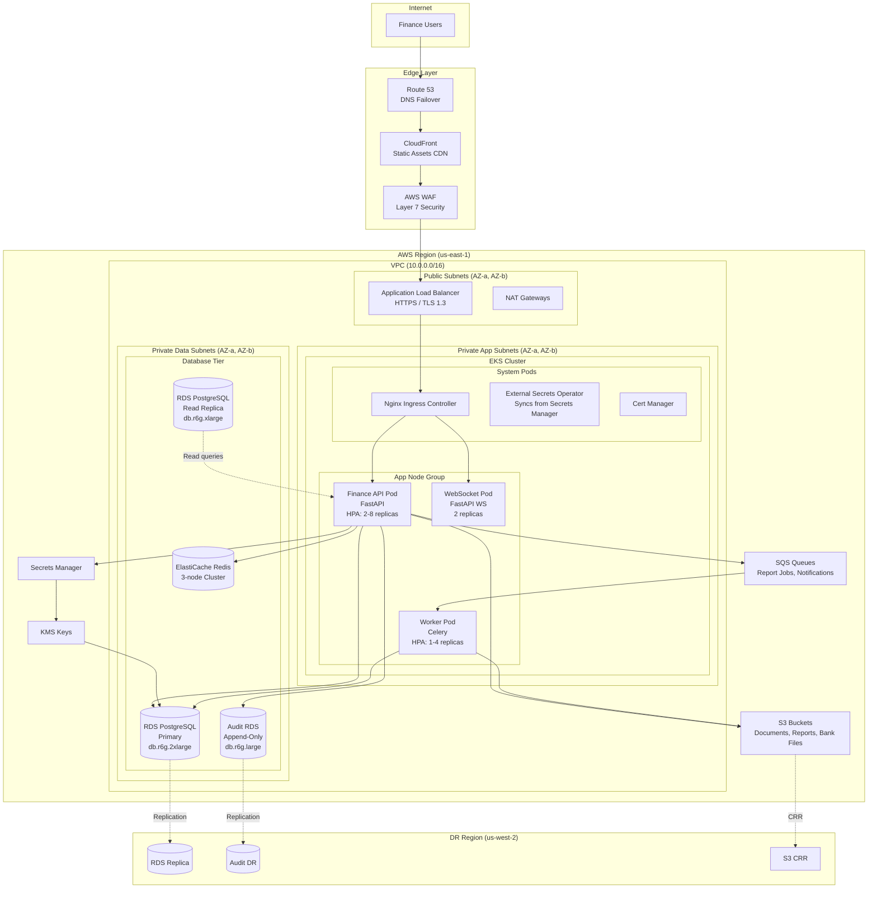
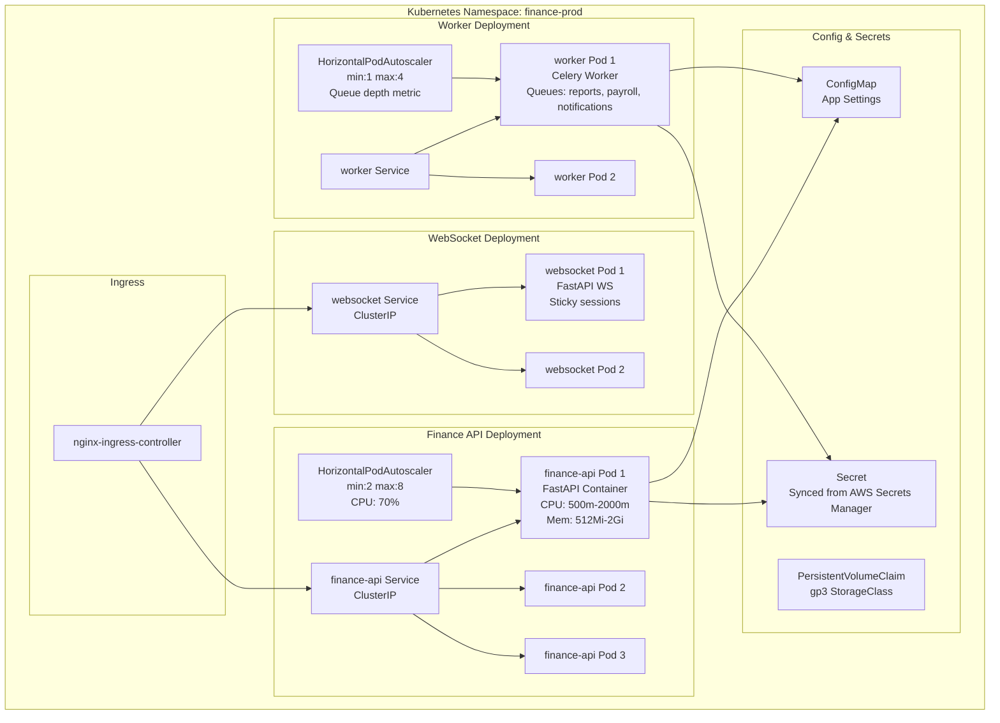
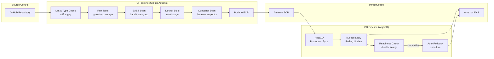

# Deployment Diagram

## Overview
Production deployment architecture for the Finance Management System on AWS EKS, showing the mapping from software components to infrastructure nodes.

---

## Production Deployment Architecture

---

## Kubernetes Deployment Detail

---

## CI/CD Pipeline

