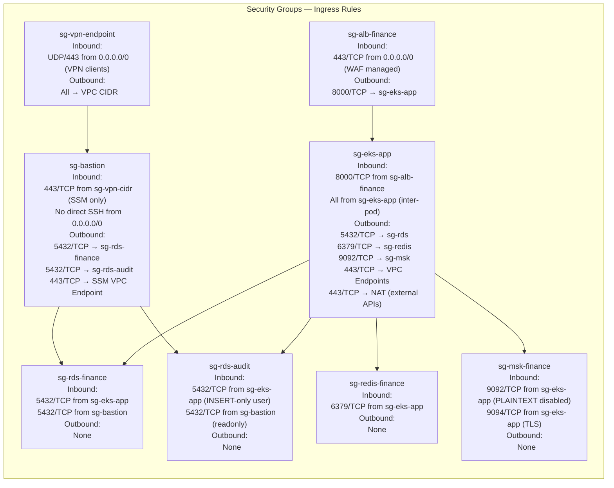
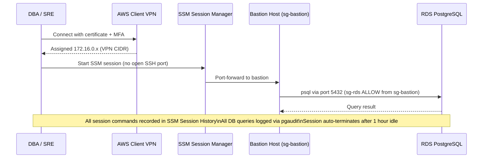
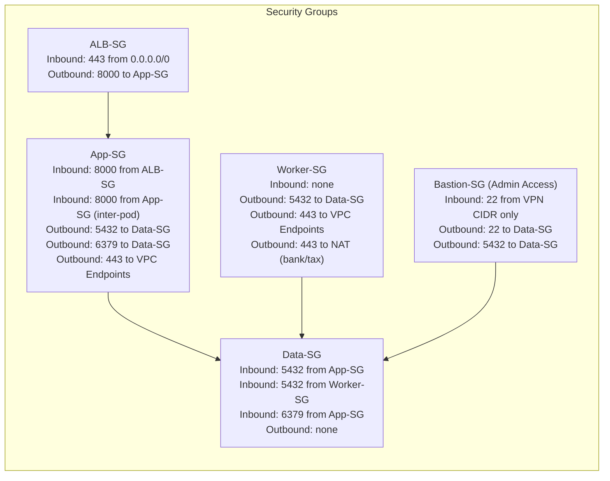
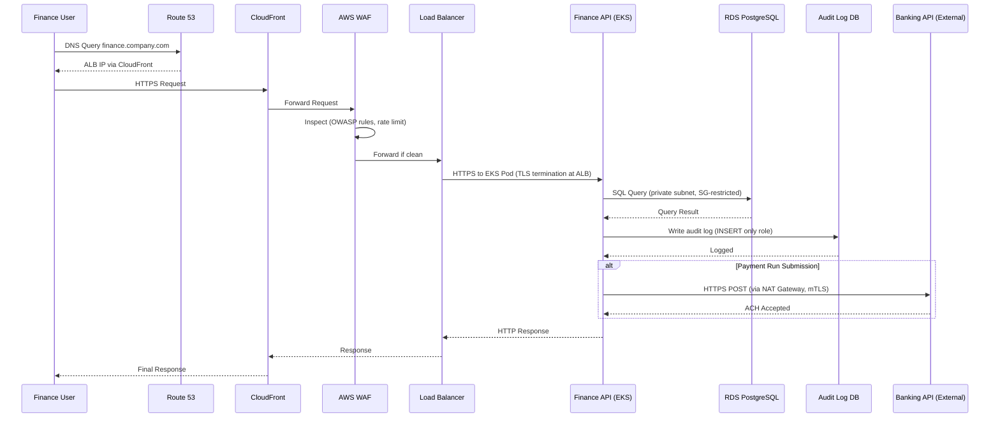
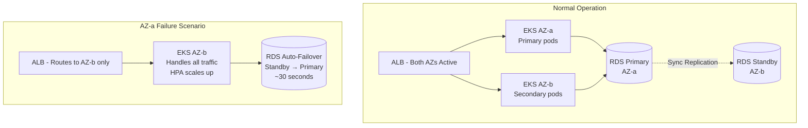

# Network Infrastructure

## Overview

Network topology and layered security architecture for the Finance Management System on AWS. Designed for PCI-DSS compliance, zero-trust enforcement, and defense-in-depth across three network tiers. All financial data traverses only private subnets; no database or cache endpoint is reachable from the internet or public subnets.

---

## VPC Design and Subnet Allocation

| Subnet Tier | AZ-a | AZ-b | AZ-c | Purpose |
|-------------|------|------|------|---------|
| Public | 10.0.1.0/24 | 10.0.2.0/24 | 10.0.3.0/24 | ALB nodes, NAT Gateways, Bastion |
| Private App | 10.0.10.0/24 | 10.0.11.0/24 | 10.0.12.0/24 | EKS worker nodes (all services) |
| Private Data | 10.0.20.0/24 | 10.0.21.0/24 | 10.0.22.0/24 | RDS, ElastiCache, MSK brokers |
| Private MSK | 10.0.30.0/24 | 10.0.31.0/24 | 10.0.32.0/24 | Kafka broker dedicated subnet |

**VPC CIDR:** `10.0.0.0/16`  
**DNS Hostnames:** Enabled — private hosted zone `finance.internal`  
**VPC Flow Logs:** All traffic → CloudWatch Logs `/aws/vpc/finance-prod` (90-day retention)

---

## Network Topology

```mermaid
graph TD
    subgraph "Internet"
        Users["Finance Users"]
        ExtSys["External Systems\nBanks · Tax Portals · ERP"]
    end

    subgraph "AWS Edge Layer"
        R53["Route 53\nPublic Hosted Zone\nHealth-check failover\nAlias to CloudFront"]
        CF["CloudFront\nOrigin Shield\nHTTPS-only · TLS 1.3\nCustom Cache Policies"]
        WAF["AWS WAF v2\nOWASP CRS 3.2\nFinance IP Reputation\nRate: 2000 req/min/IP\nGeo-block: restricted countries"]
        Shield["AWS Shield Advanced\nL3/L4/L7 DDoS\nRT attack visibility\nDDoS Response Team SLA"]
    end

    subgraph "VPC — 10.0.0.0/16"
        subgraph "Public Subnets (3 AZs)"
            ALB["ALB\nHTTPS:443 only\nHTTP→HTTPS redirect\nAccess logs → S3\nDeletion protection: ON"]
            NAT_A["NAT Gateway — AZ-a\nElastic IP: eipalloc-xxx\nUsed for egress to external APIs"]
            NAT_B["NAT Gateway — AZ-b"]
            NAT_C["NAT Gateway — AZ-c"]
            Bastion["Bastion Host\nt3.micro · AZ-a only\nSSM Session Manager\nNo inbound SSH from internet\nEphemeral — terminate after use"]
        end

        subgraph "Private App Subnets (3 AZs)"
            EKS_A["EKS Worker Nodes — AZ-a\n10.0.10.0/24\nAll finance microservices"]
            EKS_B["EKS Worker Nodes — AZ-b\n10.0.11.0/24"]
            EKS_C["EKS Worker Nodes — AZ-c\n10.0.12.0/24"]
        end

        subgraph "Private Data Subnets (3 AZs)"
            RDS_Primary["RDS Primary\n10.0.20.x"]
            RDS_Standby["RDS Multi-AZ Standby\n10.0.21.x"]
            RDS_Replica["RDS Read Replicas\n10.0.22.x"]
            Redis_A["ElastiCache Redis\nShard primaries — AZ-a"]
            Redis_B["ElastiCache Redis\nShard replicas — AZ-b/c"]
            Audit_RDS["Audit RDS\n10.0.20.x (separate SG)"]
        end

        subgraph "Private MSK Subnets (3 AZs)"
            MSK_A["MSK Broker 1 — AZ-a\n10.0.30.x"]
            MSK_B["MSK Broker 2 — AZ-b\n10.0.31.x"]
            MSK_C["MSK Broker 3 — AZ-c\n10.0.32.x"]
        end

        subgraph "VPC Endpoints — PrivateLink"
            EP_S3["S3 Gateway Endpoint\nNo internet traversal for S3"]
            EP_KMS["KMS Interface Endpoint"]
            EP_SM["Secrets Manager Interface Endpoint"]
            EP_ECR_API["ECR API Interface Endpoint"]
            EP_ECR_DKR["ECR Docker Interface Endpoint"]
            EP_CW_LOGS["CloudWatch Logs Interface Endpoint"]
            EP_CW_MON["CloudWatch Monitoring Endpoint"]
            EP_SSM["SSM Interface Endpoint\n(Bastion Session Manager)"]
            EP_STS["STS Interface Endpoint"]
        end
    end

    subgraph "External Services — Outbound via NAT"
        BankAPI["Banking APIs\nACH Gateway · SWIFT\nmTLS client cert required"]
        TaxPortal["Tax Authority Portals\nGSTN · IRS · HMRC"]
        FXFeed["FX Rate Feed\nOpen Exchange Rates\nBloomberg (optional)"]
        ERPInteg["ERP / HRIS Integration\nOutbound REST API"]
    end

    Users --> R53
    R53 --> CF
    CF --> Shield
    Shield --> WAF
    WAF --> ALB

    ALB --> EKS_A
    ALB --> EKS_B
    ALB --> EKS_C

    EKS_A --> RDS_Primary
    EKS_B --> RDS_Primary
    EKS_C --> RDS_Primary

    EKS_A --> Redis_A
    EKS_B --> Redis_B

    EKS_A --> MSK_A
    EKS_B --> MSK_B
    EKS_C --> MSK_C

    EKS_A --> Audit_RDS

    EKS_A --> EP_S3
    EKS_A --> EP_KMS
    EKS_A --> EP_SM
    EKS_A --> EP_ECR_API
    EKS_A --> EP_CW_LOGS

    EKS_A --> NAT_A
    EKS_B --> NAT_B
    EKS_C --> NAT_C

    NAT_A --> BankAPI
    NAT_A --> TaxPortal
    NAT_A --> FXFeed
    NAT_A --> ERPInteg

    Bastion --> EP_SSM
    Bastion --> RDS_Primary
    Bastion --> Audit_RDS
    ExtSys --> WAF
```



---

## Security Group Rules



---

## Network ACLs (Stateless — Subnet-Level)

| Subnet Tier | Rule | Direction | Port | Source/Dest | Action |
|-------------|------|-----------|------|-------------|--------|
| Public | 100 | Inbound | 443 | 0.0.0.0/0 | ALLOW |
| Public | 110 | Inbound | 1024–65535 | 0.0.0.0/0 | ALLOW (ephemeral) |
| Public | 900 | Inbound | All | 0.0.0.0/0 | DENY |
| Public | 100 | Outbound | All | 0.0.0.0/0 | ALLOW |
| Private App | 100 | Inbound | 8000 | 10.0.1.0/22 (public) | ALLOW |
| Private App | 110 | Inbound | 1024–65535 | 10.0.0.0/16 | ALLOW |
| Private App | 120 | Inbound | All | 10.0.10.0/22 (app tier) | ALLOW |
| Private App | 900 | Inbound | All | 0.0.0.0/0 | DENY |
| Private App | 100 | Outbound | All | 10.0.0.0/16 | ALLOW |
| Private App | 110 | Outbound | 443 | 0.0.0.0/0 | ALLOW (NAT egress) |
| Private App | 900 | Outbound | All | 0.0.0.0/0 | DENY |
| Private Data | 100 | Inbound | 5432 | 10.0.10.0/22 (app) | ALLOW |
| Private Data | 110 | Inbound | 6379 | 10.0.10.0/22 (app) | ALLOW |
| Private Data | 120 | Inbound | 9092–9094 | 10.0.10.0/22 (app) | ALLOW |
| Private Data | 900 | Inbound | All | 0.0.0.0/0 | DENY |
| Private Data | 100 | Outbound | 1024–65535 | 10.0.10.0/22 | ALLOW |
| Private Data | 900 | Outbound | All | 0.0.0.0/0 | DENY |

---

## WAF Rule Groups

| Rule Group | Priority | Mode | Purpose |
|------------|----------|------|---------|
| `AWSManagedRulesCommonRuleSet` | 1 | Block | OWASP Top 10 |
| `AWSManagedRulesKnownBadInputsRuleSet` | 2 | Block | Log4Shell, SQLi, XSS |
| `AWSManagedRulesAmazonIpReputationList` | 3 | Block | Known malicious IPs |
| `AWSManagedRulesSQLiRuleSet` | 4 | Block | SQL injection (financial data) |
| `finance-rate-limit-rule` | 10 | Block | 2000 req/5min per IP; 200 req/5min auth endpoints |
| `finance-geo-block` | 20 | Block | Geo-restrict to allowed countries |
| `finance-large-body-block` | 30 | Block | Bodies > 2 MB (prevent upload abuse) |

---

## Egress Controls (Data Exfiltration Prevention)

All outbound traffic from EKS nodes is subject to:

1. **Security Group egress rules** — whitelist only port 443 to VPC endpoints and NAT GW
2. **AWS Network Firewall** — domain allowlist for external HTTPS destinations:
   - `*.amazonaws.com` (AWS services)
   - `api.openexchangerates.org` (FX rates)
   - Bank API domains (explicitly enumerated per integration)
   - Tax authority portal domains
3. **Kubernetes NetworkPolicies** — pod-to-pod isolation: services can only call the downstream services they are explicitly authorized to reach
4. **CloudTrail + VPC Flow Logs** — all egress flows logged and anomaly-alerted via GuardDuty

---

## Bastion and Admin Access Architecture



---

## VPN and Direct Connect for Enterprise Integrations

| Connection Type | Use Case | Configuration |
|-----------------|----------|---------------|
| AWS Client VPN | DBA / SRE admin access | Certificate-based + MFA, split-tunnel, VPN CIDR 172.16.0.0/22 |
| AWS Site-to-Site VPN | ERP / HRIS system integration | BGP, 2 IPSec tunnels (redundant), BFD enabled |
| AWS Direct Connect | High-throughput bank file transfer | 1 Gbps dedicated connection, private VIF to VPC |

---

## DNS and Route 53 Configuration

| Record | Type | Value | Purpose |
|--------|------|-------|---------|
| `finance.company.com` | A (Alias) | CloudFront distribution | Public UI |
| `api.finance.company.com` | A (Alias) | CloudFront → ALB | Public API |
| `*.finance.internal` | A | Internal ALB / ClusterIP | Service mesh internal routing |
| `rds-primary.finance.internal` | CNAME | RDS endpoint | DB connection (apps use this) |
| `rds-replica.finance.internal` | CNAME | RDS read endpoint | Read-only query routing |
| `redis.finance.internal` | CNAME | ElastiCache config endpoint | Cache connection |
| `kafka.finance.internal` | CNAME | MSK bootstrap broker DNS | Kafka producer/consumer |

Route 53 health checks are configured on the ALB with 30-second intervals. DNS failover record set activates the DR region endpoint automatically when the primary health check fails for 3 consecutive intervals.

---

## PCI-DSS Network Segmentation Compliance

| PCI Requirement | Implementation |
|-----------------|----------------|
| Req 1.3 — No direct access between internet and CDE | All financial data in private data subnets; ALB is outside CDE scope |
| Req 1.4 — Prohibit direct public access from CDE to internet | EKS pods route outbound through NAT GW with domain-allowlist firewall |
| Req 2.2 — Develop configuration standards | Baseline AMIs, hardened EKS AMI, CIS benchmark via AWS Config |
| Req 7 — Restrict access to cardholder data | IAM roles, security group least-privilege, Kubernetes NetworkPolicy |
| Req 8 — Identify and authenticate access | MFA on all admin access, SSM Session Manager for bastion, short-lived IAM credentials |
| Req 10 — Log and monitor all access | VPC Flow Logs, CloudTrail, pgaudit, ALB access logs, SSM session history |
| Req 11.4 — Intrusion detection | GuardDuty, Security Hub, CloudWatch anomaly detection |

---

## VPC Network Architecture

```mermaid
graph TB
    subgraph "Internet"
        Internet[Internet]
    end

    subgraph "AWS Edge Services"
        R53[Route 53<br>DNS]
        CF[CloudFront<br>CDN]
        WAF[AWS WAF]
        Shield[Shield Advanced]
    end

    subgraph "VPC (10.0.0.0/16)"
        subgraph "Public Subnets"
            subgraph "AZ-a (10.0.1.0/24)"
                ALB_a[ALB Node]
                NAT_a[NAT Gateway]
            end
            subgraph "AZ-b (10.0.2.0/24)"
                ALB_b[ALB Node]
                NAT_b[NAT Gateway]
            end
        end

        subgraph "Private App Subnets"
            subgraph "AZ-a (10.0.10.0/24)"
                EKS_a[EKS Nodes<br>Finance API + Workers]
            end
            subgraph "AZ-b (10.0.11.0/24)"
                EKS_b[EKS Nodes<br>Finance API + Workers]
            end
        end

        subgraph "Private Data Subnets"
            subgraph "AZ-a (10.0.20.0/24)"
                RDS_a[RDS Primary]
                Redis_a[ElastiCache Node]
            end
            subgraph "AZ-b (10.0.21.0/24)"
                RDS_b[RDS Standby / Replica]
                Redis_b[ElastiCache Node]
            end
        end

        subgraph "VPC Endpoints (PrivateLink)"
            EP_S3[S3 Gateway Endpoint]
            EP_SQS[SQS Interface Endpoint]
            EP_SM[Secrets Manager Endpoint]
            EP_KMS[KMS Endpoint]
            EP_ECR[ECR Interface Endpoint]
            EP_CW[CloudWatch Endpoint]
        end
    end

    subgraph "External Services (via NAT)"
        BankAPI[Banking APIs<br>ACH / SWIFT]
        TaxPortal[Tax Authority Portal]
        FXFeed[FX Rate Feed]
    end

    Internet --> R53
    R53 --> CF
    CF --> Shield
    Shield --> WAF
    WAF --> ALB_a
    WAF --> ALB_b

    ALB_a --> EKS_a
    ALB_b --> EKS_b

    EKS_a --> RDS_a
    EKS_a --> Redis_a
    EKS_b --> RDS_b
    EKS_b --> Redis_b

    EKS_a --> EP_S3
    EKS_a --> EP_SQS
    EKS_a --> EP_SM
    EKS_a --> EP_KMS
    EKS_a --> EP_ECR
    EKS_a --> EP_CW

    EKS_a --> NAT_a
    NAT_a --> BankAPI
    NAT_a --> TaxPortal
    NAT_a --> FXFeed
```

---

## Security Group Rules



---

## Network Traffic Flow



---

## Multi-AZ Failover Architecture



---

## Network Access Control Summary

| Layer | Control | Implementation |
|-------|---------|---------------|
| Internet edge | DDoS protection | AWS Shield Advanced |
| Internet edge | Web application firewall | AWS WAF with OWASP + custom finance rules |
| DNS | Health-check-based routing | Route 53 health checks |
| Load balancer | TLS termination, HTTP → HTTPS redirect | ALB with ACM certificate |
| VPC | Network segmentation | Public, App, Data subnet tiers |
| Pods | Pod-to-pod restriction | Kubernetes NetworkPolicies |
| Security groups | Port-level access control | SG rules per tier as documented |
| Database | No direct internet access | Private subnets only |
| External API calls | Outbound via NAT with IP allowlisting | NAT Gateway + WAF egress rules |
| AWS services | No internet traversal | VPC PrivateLink / Gateway Endpoints |
| Secrets | No hardcoded credentials | AWS Secrets Manager + External Secrets Operator |
| Admin access | Bastion host with VPN requirement | VPN-only access to bastion SG |

## Implementation-Ready Finance Control Expansion

### 1) Accounting Rule Assumptions (Detailed)
- Ledger model is strictly double-entry with balanced journal headers and line-level dimensional tagging (entity, cost-center, project, product, counterparty).
- Posting policies are versioned and time-effective; historical transactions are evaluated against the rule version active at transaction time.
- Currency handling requires transaction currency, functional currency, and optional reporting currency; FX revaluation and realized/unrealized gains are separated.
- Materiality thresholds are explicit and configurable; below-threshold variances may auto-resolve only when policy explicitly allows.

### 2) Transaction Invariants and Data Contracts
- Every command/event must include `transaction_id`, `idempotency_key`, `source_system`, `event_time_utc`, `actor_id/service_principal`, and `policy_version`.
- Mutations affecting posted books are append-only. Corrections use reversal + adjustment entries with causal linkage to original posting IDs.
- Period invariant checks: no unapproved journals in closing period, all sub-ledger control accounts reconciled, and close checklist fully attested.
- Referential invariants: every ledger line links to a provenance artifact (invoice/payment/payroll/expense/asset/tax document).

### 3) Reconciliation and Close Strategy
- Continuous reconciliation cadence:
  - **T+0/T+1** operational reconciliation (gateway, bank, processor, payroll outputs).
  - **Daily** sub-ledger to GL tie-out.
  - **Monthly/Quarterly** close certification with controller sign-off.
- Exception taxonomy is mandatory: timing mismatch, mapping/config error, duplicate, missing source event, external counterparty variance, FX rounding.
- Close blockers are machine-detectable and surfaced on a close dashboard with ownership, ETA, and escalation policy.

### 4) Failure Handling and Operational Recovery
- Posting pipeline uses outbox/inbox patterns with deterministic retries and dead-letter quarantine for non-retriable payloads.
- Duplicate delivery and partial failure scenarios must be proven safe through idempotency and compensating accounting entries.
- Incident runbooks require: containment decision, scope quantification, replay/rebuild method, reconciliation rerun, and financial controller approval.
- Recovery drills must be executed periodically with evidence retained for audit.

### 5) Regulatory / Compliance / Audit Expectations
- Controls must support segregation of duties, least privilege, and end-to-end tamper-evident audit trails.
- Retention strategy must satisfy jurisdictional requirements for financial records, tax documents, and payroll artifacts.
- Sensitive data handling includes classification, masking/tokenization for non-production, and secure export controls.
- Every policy override (manual journal, reopened period, emergency access) requires reason code, approver, and expiration window.

### 6) Data Lineage & Traceability (Requirements → Implementation)
- Maintain an explicit traceability matrix for this artifact (`infrastructure/network-infrastructure.md`):
  - `Requirement ID` → `Business Rule / Event` → `Design Element` (API/schema/diagram component) → `Code Module` → `Test Evidence` → `Control Owner`.
- Lineage metadata minimums: source event ID, transformation ID/version, posting rule version, reconciliation batch ID, and report consumption path.
- Any change touching accounting semantics must include impact analysis across upstream requirements and downstream close/compliance reports.
- Documentation updates are blocking for release when they alter financial behavior, posting logic, or reconciliation outcomes.

### 7) Phase-Specific Implementation Readiness
- Enforce encryption in transit/at rest for PII/financial records and maintain key-rotation evidence.
- Provision isolated environments with masked production-like data and immutable audit-log sinks.
- Define RPO/RTO targets by finance process (payments, payroll, posting, close, reporting) and align backup strategy.

### 8) Implementation Checklist for `network infrastructure`
- [ ] Control objectives and success/failure criteria are explicit and testable.
- [ ] Data contracts include mandatory identifiers, timestamps, and provenance fields.
- [ ] Reconciliation logic defines cadence, tolerances, ownership, and escalation.
- [ ] Operational runbooks cover retries, replay, backfill, and close re-certification.
- [ ] Compliance evidence artifacts are named, retained, and linked to control owners.


