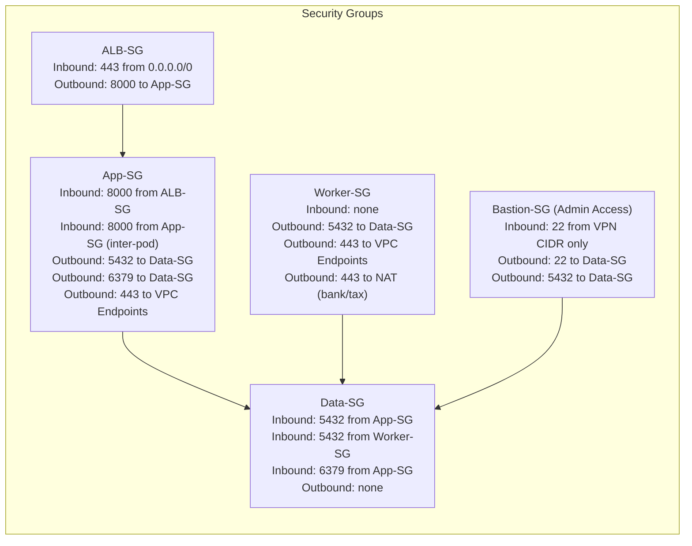
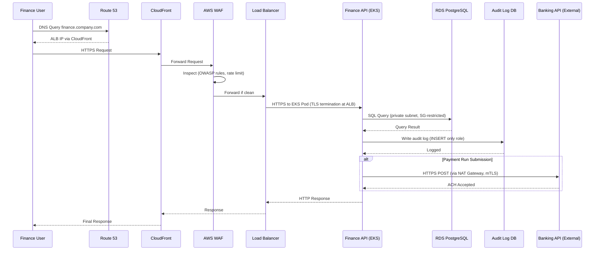
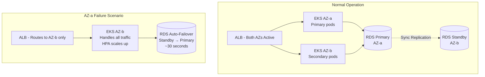

# Network Infrastructure

## Overview
Network topology and security architecture for the Finance Management System, designed with defense-in-depth and zero-trust principles suitable for a financial application.

---

## VPC Network Architecture

```mermaid
graph TB
    subgraph "Internet"
        Internet[Internet]
    end

    subgraph "AWS Edge Services"
        R53[Route 53<br>DNS]
        CF[CloudFront<br>CDN]
        WAF[AWS WAF]
        Shield[Shield Advanced]
    end

    subgraph "VPC (10.0.0.0/16)"
        subgraph "Public Subnets"
            subgraph "AZ-a (10.0.1.0/24)"
                ALB_a[ALB Node]
                NAT_a[NAT Gateway]
            end
            subgraph "AZ-b (10.0.2.0/24)"
                ALB_b[ALB Node]
                NAT_b[NAT Gateway]
            end
        end

        subgraph "Private App Subnets"
            subgraph "AZ-a (10.0.10.0/24)"
                EKS_a[EKS Nodes<br>Finance API + Workers]
            end
            subgraph "AZ-b (10.0.11.0/24)"
                EKS_b[EKS Nodes<br>Finance API + Workers]
            end
        end

        subgraph "Private Data Subnets"
            subgraph "AZ-a (10.0.20.0/24)"
                RDS_a[RDS Primary]
                Redis_a[ElastiCache Node]
            end
            subgraph "AZ-b (10.0.21.0/24)"
                RDS_b[RDS Standby / Replica]
                Redis_b[ElastiCache Node]
            end
        end

        subgraph "VPC Endpoints (PrivateLink)"
            EP_S3[S3 Gateway Endpoint]
            EP_SQS[SQS Interface Endpoint]
            EP_SM[Secrets Manager Endpoint]
            EP_KMS[KMS Endpoint]
            EP_ECR[ECR Interface Endpoint]
            EP_CW[CloudWatch Endpoint]
        end
    end

    subgraph "External Services (via NAT)"
        BankAPI[Banking APIs<br>ACH / SWIFT]
        TaxPortal[Tax Authority Portal]
        FXFeed[FX Rate Feed]
    end

    Internet --> R53
    R53 --> CF
    CF --> Shield
    Shield --> WAF
    WAF --> ALB_a
    WAF --> ALB_b

    ALB_a --> EKS_a
    ALB_b --> EKS_b

    EKS_a --> RDS_a
    EKS_a --> Redis_a
    EKS_b --> RDS_b
    EKS_b --> Redis_b

    EKS_a --> EP_S3
    EKS_a --> EP_SQS
    EKS_a --> EP_SM
    EKS_a --> EP_KMS
    EKS_a --> EP_ECR
    EKS_a --> EP_CW

    EKS_a --> NAT_a
    NAT_a --> BankAPI
    NAT_a --> TaxPortal
    NAT_a --> FXFeed
```

---

## Security Group Rules



---

## Network Traffic Flow



---

## Multi-AZ Failover Architecture



---

## Network Access Control Summary

| Layer | Control | Implementation |
|-------|---------|---------------|
| Internet edge | DDoS protection | AWS Shield Advanced |
| Internet edge | Web application firewall | AWS WAF with OWASP + custom finance rules |
| DNS | Health-check-based routing | Route 53 health checks |
| Load balancer | TLS termination, HTTP → HTTPS redirect | ALB with ACM certificate |
| VPC | Network segmentation | Public, App, Data subnet tiers |
| Pods | Pod-to-pod restriction | Kubernetes NetworkPolicies |
| Security groups | Port-level access control | SG rules per tier as documented |
| Database | No direct internet access | Private subnets only |
| External API calls | Outbound via NAT with IP allowlisting | NAT Gateway + WAF egress rules |
| AWS services | No internet traversal | VPC PrivateLink / Gateway Endpoints |
| Secrets | No hardcoded credentials | AWS Secrets Manager + External Secrets Operator |
| Admin access | Bastion host with VPN requirement | VPN-only access to bastion SG |

## Implementation-Ready Finance Control Expansion

### 1) Accounting Rule Assumptions (Detailed)
- Ledger model is strictly double-entry with balanced journal headers and line-level dimensional tagging (entity, cost-center, project, product, counterparty).
- Posting policies are versioned and time-effective; historical transactions are evaluated against the rule version active at transaction time.
- Currency handling requires transaction currency, functional currency, and optional reporting currency; FX revaluation and realized/unrealized gains are separated.
- Materiality thresholds are explicit and configurable; below-threshold variances may auto-resolve only when policy explicitly allows.

### 2) Transaction Invariants and Data Contracts
- Every command/event must include `transaction_id`, `idempotency_key`, `source_system`, `event_time_utc`, `actor_id/service_principal`, and `policy_version`.
- Mutations affecting posted books are append-only. Corrections use reversal + adjustment entries with causal linkage to original posting IDs.
- Period invariant checks: no unapproved journals in closing period, all sub-ledger control accounts reconciled, and close checklist fully attested.
- Referential invariants: every ledger line links to a provenance artifact (invoice/payment/payroll/expense/asset/tax document).

### 3) Reconciliation and Close Strategy
- Continuous reconciliation cadence:
  - **T+0/T+1** operational reconciliation (gateway, bank, processor, payroll outputs).
  - **Daily** sub-ledger to GL tie-out.
  - **Monthly/Quarterly** close certification with controller sign-off.
- Exception taxonomy is mandatory: timing mismatch, mapping/config error, duplicate, missing source event, external counterparty variance, FX rounding.
- Close blockers are machine-detectable and surfaced on a close dashboard with ownership, ETA, and escalation policy.

### 4) Failure Handling and Operational Recovery
- Posting pipeline uses outbox/inbox patterns with deterministic retries and dead-letter quarantine for non-retriable payloads.
- Duplicate delivery and partial failure scenarios must be proven safe through idempotency and compensating accounting entries.
- Incident runbooks require: containment decision, scope quantification, replay/rebuild method, reconciliation rerun, and financial controller approval.
- Recovery drills must be executed periodically with evidence retained for audit.

### 5) Regulatory / Compliance / Audit Expectations
- Controls must support segregation of duties, least privilege, and end-to-end tamper-evident audit trails.
- Retention strategy must satisfy jurisdictional requirements for financial records, tax documents, and payroll artifacts.
- Sensitive data handling includes classification, masking/tokenization for non-production, and secure export controls.
- Every policy override (manual journal, reopened period, emergency access) requires reason code, approver, and expiration window.

### 6) Data Lineage & Traceability (Requirements → Implementation)
- Maintain an explicit traceability matrix for this artifact (`infrastructure/network-infrastructure.md`):
  - `Requirement ID` → `Business Rule / Event` → `Design Element` (API/schema/diagram component) → `Code Module` → `Test Evidence` → `Control Owner`.
- Lineage metadata minimums: source event ID, transformation ID/version, posting rule version, reconciliation batch ID, and report consumption path.
- Any change touching accounting semantics must include impact analysis across upstream requirements and downstream close/compliance reports.
- Documentation updates are blocking for release when they alter financial behavior, posting logic, or reconciliation outcomes.

### 7) Phase-Specific Implementation Readiness
- Enforce encryption in transit/at rest for PII/financial records and maintain key-rotation evidence.
- Provision isolated environments with masked production-like data and immutable audit-log sinks.
- Define RPO/RTO targets by finance process (payments, payroll, posting, close, reporting) and align backup strategy.

### 8) Implementation Checklist for `network infrastructure`
- [ ] Control objectives and success/failure criteria are explicit and testable.
- [ ] Data contracts include mandatory identifiers, timestamps, and provenance fields.
- [ ] Reconciliation logic defines cadence, tolerances, ownership, and escalation.
- [ ] Operational runbooks cover retries, replay, backfill, and close re-certification.
- [ ] Compliance evidence artifacts are named, retained, and linked to control owners.


