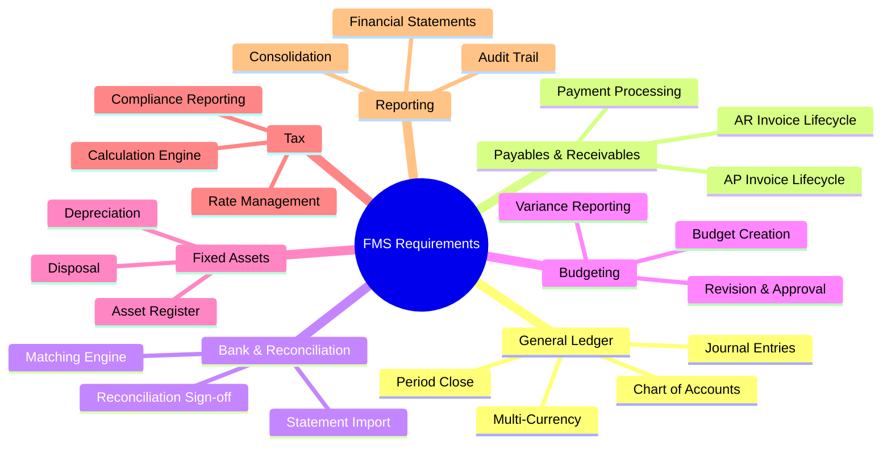

# Requirements Document — Finance Management System

## 1. Introduction

### 1.1 Purpose

This document defines the complete set of functional, non-functional, and integration requirements for the Finance Management System (FMS). It serves as the authoritative specification for design, implementation, testing, and audit evidence. All requirements carry a stable ID and a designated control owner.

### 1.2 Scope

The FMS covers the full record-to-report cycle for one or more legal entities. In scope:

- General Ledger and double-entry bookkeeping
- Accounts Payable and Accounts Receivable management
- Budget planning, tracking, and variance management
- Bank statement import and reconciliation
- Fixed asset register and depreciation
- Tax rule management, calculation, and compliance reporting
- Multi-currency recording, revaluation, and translation
- Financial reporting: P&L, Balance Sheet, Cash Flow, Trial Balance
- Multi-entity consolidation with intercompany elimination
- Immutable audit trail and SOX control evidence

Out of scope: payroll processing, procurement catalogue management, and CRM.

### 1.3 Key Stakeholders

| Stakeholder | Role |
|-------------|------|
| CFO | Executive sponsor; defines policy and compliance obligations |
| Finance Manager | Primary process owner; approves design decisions |
| Controller | Accountable for period-close integrity and financial statement accuracy |
| Auditor (Internal) | Reviews controls, audit trail, and compliance evidence |
| Tax Manager | Owns tax rule configuration and filing requirements |
| IT Security | Owns authentication, authorisation, encryption, and audit-log integrity |
| SRE | Owns availability, recovery time, and operational runbooks |

---

## 2. Functional Requirements

### 2.1 Chart of Accounts

| ID | Requirement |
|----|-------------|
| FR-001 | The system shall allow authorised users to create, read, update, and deactivate GL accounts within a hierarchical chart of accounts (COA). |
| FR-002 | Each GL account shall have a unique account number, account name, account type (Asset, Liability, Equity, Revenue, Expense), normal balance (Debit/Credit), and active status. |
| FR-003 | The system shall support up to six user-defined segment dimensions per account line (entity, cost centre, project, product, region, intercompany counterparty). |
| FR-004 | The system shall enforce that deactivated accounts cannot be used as posting targets in new transactions while retaining all historical balances. |
| FR-005 | COA changes shall be versioned with an effective date so that historical reports render against the account structure active at the transaction date. |

### 2.2 Journal Entries and Posting

| ID | Requirement |
|----|-------------|
| FR-006 | The system shall enforce that every journal entry header balances (sum of debits = sum of credits) before the entry transitions from Draft to Approved status. |
| FR-007 | Journal entries shall follow the workflow: Draft → Submitted → Approved → Posted. Only Approved entries may be posted to the ledger. |
| FR-008 | Posted journal entries shall be immutable. Corrections shall be made by creating a reversal entry linked to the original entry ID, followed by a new correcting entry. |
| FR-009 | The system shall support recurring journal-entry templates with configurable frequency (daily, weekly, monthly, quarterly) and an optional auto-post flag requiring re-approval when disabled. |
| FR-010 | Journal entries shall support attachment of up to ten supporting documents (PDF, XLSX, image) with a maximum individual file size of 20 MB. |
| FR-011 | The system shall prevent posting to a closed fiscal period and shall display a clear error message identifying the affected period. |

### 2.3 Period Open/Close Workflow

| ID | Requirement |
|----|-------------|
| FR-012 | The system shall maintain a fiscal calendar with configurable period start and end dates, supporting 12-month, 13-period, and 4-4-5 calendar layouts. |
| FR-013 | Period close shall progress through states: Open → Soft-Close → Hard-Close. Soft-close allows adjusting entries by designated roles; hard-close prevents all postings. |
| FR-014 | The system shall provide a period-close checklist with assignable tasks, due dates, completion status, and blocker flags. All checklist items must reach Completed before hard-close is permitted. |
| FR-015 | Hard-close shall require sign-off by the Controller role. CFO may override a hard-close for a single entry with a mandatory reason code and dual approval. |
| FR-016 | On period hard-close, the system shall automatically calculate and post closing entries for nominal accounts and carry forward retained earnings to the balance sheet. |

### 2.4 Accounts Payable

| ID | Requirement |
|----|-------------|
| FR-017 | The system shall support the full AP invoice lifecycle: Received → Matched → Approved → Scheduled → Paid → Reconciled. |
| FR-018 | The system shall perform 2-way purchase-order matching (quantity and price) and 3-way matching (PO + goods receipt + invoice) and flag variances exceeding a configurable tolerance percentage. |
| FR-019 | The system shall detect duplicate invoices by vendor ID, invoice number, invoice date, and amount and prevent posting until the duplicate is reviewed and resolved. |
| FR-020 | The system shall calculate and display early-payment discount amounts based on vendor payment terms (e.g., 2/10 Net 30) at the time of payment scheduling. |
| FR-021 | The system shall generate AP ageing reports in configurable buckets (0–30, 31–60, 61–90, 91–120, 120+ days) exportable to PDF and XLSX. |
| FR-022 | The system shall support vendor credit notes that reduce the outstanding payable balance and generate a corresponding GL credit to the expense account. |

### 2.5 Accounts Receivable

| ID | Requirement |
|----|-------------|
| FR-023 | The system shall support the full AR invoice lifecycle: Draft → Issued → Partially Paid → Paid → Overdue → Written Off. |
| FR-024 | The system shall allow partial payment application against AR invoices and maintain an open balance until the invoice is fully settled. |
| FR-025 | The system shall apply configurable dunning schedules with escalating reminder messages at 7, 14, 30, and 60 days past due, dispatched by email or in-app notification. |
| FR-026 | The system shall support customer credit limits with a configurable warning threshold (e.g., 80 % of limit) and a blocking threshold (100 %) that prevents new invoices from being issued. |
| FR-027 | The system shall support AR write-off with a mandatory write-off reason code, dual approval for amounts above a configurable threshold, and automatic GL debit to bad-debt expense. |

### 2.6 Payment Processing

| ID | Requirement |
|----|-------------|
| FR-028 | The system shall support outbound payment runs aggregating approved AP invoices into a payment batch, generating NACHA, SEPA XML, or BAI2 payment files. |
| FR-029 | Payment batches shall require approval by a Finance Manager before transmission. Batches above a configurable value threshold shall require dual approval. |
| FR-030 | The system shall support manual cheque, bank transfer, and virtual-card payment methods with method-specific mandatory fields enforced at entry. |
| FR-031 | On payment confirmation, the system shall automatically generate a GL entry (Debit: Accounts Payable / Credit: Bank) and update the invoice status to Paid. |

### 2.7 Bank Statement Import and Reconciliation

| ID | Requirement |
|----|-------------|
| FR-032 | The system shall import bank statements in CSV, BAI2, and SWIFT MT940 formats. Import validation shall reject malformed files with a line-level error report. |
| FR-033 | The reconciliation engine shall auto-match bank lines to GL transactions by amount, value date, and reference number using configurable matching rules with a minimum confidence score. |
| FR-034 | Unmatched bank lines shall enter an exceptions queue with assigned ownership, resolution deadline, and status tracking (Open, In Review, Resolved). |
| FR-035 | Completed bank reconciliations shall require sign-off by an Accountant and a Finance Manager. Signed-off reconciliations shall be locked and read-only. |
| FR-036 | The system shall flag bank lines that match previously reconciled periods as potential duplicates and require explicit confirmation before acceptance. |

### 2.8 Budget Management

| ID | Requirement |
|----|-------------|
| FR-037 | The system shall support annual and rolling budget creation at the account and cost-centre level with monthly period breakdown. |
| FR-038 | Budgets shall support top-down distribution (CFO allocates total; managers populate detail) and bottom-up aggregation (managers submit; Finance Manager consolidates). |
| FR-039 | The system shall version all budget revisions and retain the original approved budget for variance comparison. Each revision shall require approval before becoming the active budget. |
| FR-040 | The system shall trigger configurable alerts (in-app and email) when actual spend reaches 80 % and 95 % of the approved budget for any account-cost-centre combination. |
| FR-041 | The system shall produce a budget-vs-actual variance report with period and YTD columns, variance amount, variance percentage, and drill-down to source transactions. |

### 2.9 Cost Centre Accounting

| ID | Requirement |
|----|-------------|
| FR-042 | Every posting line shall carry a mandatory cost-centre dimension. Transactions without a valid cost-centre shall be rejected. |
| FR-043 | The system shall support allocation rules that distribute shared costs across cost centres by configurable drivers (headcount, revenue, floor area, fixed percentage). |
| FR-044 | The system shall generate a cost-centre P&L statement showing direct costs, allocated shared costs, and a net contribution per period. |

### 2.10 Fixed Asset Management

| ID | Requirement |
|----|-------------|
| FR-045 | The system shall maintain an asset register with fields: asset ID, description, category, acquisition date, acquisition cost, location, responsible department, and useful life. |
| FR-046 | The system shall calculate depreciation using Straight-Line (SL), Declining Balance (DB), Sum-of-Years-Digits (SYD), and Units-of-Production (UOP) methods, applied per asset category. |
| FR-047 | Monthly depreciation runs shall be automated and post a GL entry (Debit: Depreciation Expense / Credit: Accumulated Depreciation) for each depreciable asset. |
| FR-048 | Asset disposal shall record the disposal proceeds, remove the asset cost and accumulated depreciation from the GL, and post a gain or loss on disposal to the income statement. |
| FR-049 | The system shall produce a fixed-asset schedule showing opening NBV, additions, disposals, depreciation charge, and closing NBV per period. |

### 2.11 Tax Management

| ID | Requirement |
|----|-------------|
| FR-050 | The system shall maintain a tax-rate table with jurisdiction, tax type (VAT, GST, sales tax, withholding), rate, effective date, and expiry date. |
| FR-051 | Tax codes shall be assigned to product/service categories and customer/vendor master records; the system shall auto-calculate tax on transactions based on these assignments. |
| FR-052 | The system shall support reverse-charge VAT mechanics for cross-border B2B transactions within applicable jurisdictions. |
| FR-053 | The system shall generate a tax summary report (input tax, output tax, net payable/refundable) per jurisdiction per period, formatted for submission to the relevant authority. |
| FR-054 | Tax rate changes shall be effective-dated; the system shall apply the rate active at the transaction date and allow prior-period recalculation when rates are amended retroactively with an authorised reason code. |

### 2.12 Multi-Currency

| ID | Requirement |
|----|-------------|
| FR-055 | The system shall record each transaction in three currencies: transaction currency, functional currency (entity base), and optional reporting currency. |
| FR-056 | Exchange rates shall be loaded via API from a configurable rate provider daily and shall support manual override with a mandatory reason code and approver. |
| FR-057 | Period-end revaluation shall recalculate open monetary balances (AR, AP, bank) at the closing rate and post unrealised FX gain/loss to a designated GL account. |
| FR-058 | Realised FX gain/loss shall be calculated and posted automatically when a foreign-currency transaction is settled. |

### 2.13 Financial Reporting and Consolidation

| ID | Requirement |
|----|-------------|
| FR-059 | The system shall generate on-demand P&L, Balance Sheet, Cash Flow Statement (indirect method), and Trial Balance for any entity and period combination, exportable to PDF and XLSX. |
| FR-060 | The system shall consolidate financial statements across multiple legal entities with automatic intercompany elimination of payables, receivables, revenues, and expenses. |

---

## 3. Non-Functional Requirements

### 3.1 Performance

| ID | Requirement |
|----|-------------|
| NFR-001 | Single-record reads (GL account, invoice, journal entry) shall respond in ≤ 200 ms at the 95th percentile under normal load (up to 500 concurrent users). |
| NFR-002 | List queries (e.g., journal entries for a period, AP ageing) returning up to 1 000 rows shall respond in ≤ 500 ms at the 95th percentile. |
| NFR-003 | Standard financial report generation (P&L, Balance Sheet) for a single entity and single period shall complete in ≤ 2 s at the 95th percentile. |
| NFR-004 | Consolidated multi-entity reports (up to 20 subsidiaries) shall complete in ≤ 30 s at the 95th percentile. |
| NFR-005 | Bank statement import of up to 10 000 lines shall complete in ≤ 60 s; auto-matching shall complete within 5 minutes. |

### 3.2 Availability and Reliability

| ID | Requirement |
|----|-------------|
| NFR-006 | The system shall achieve 99.9 % monthly uptime (≤ 43.8 min unplanned downtime per month), excluding scheduled maintenance windows announced ≥ 48 hours in advance. |
| NFR-007 | Recovery Time Objective (RTO) shall be ≤ 4 hours; Recovery Point Objective (RPO) shall be ≤ 1 hour for all financial data. |
| NFR-008 | All financial write operations shall be ACID-compliant. Partial transaction commits are not permitted; failures shall trigger full rollback. |
| NFR-009 | The system shall implement idempotency keys for all payment and posting API calls to prevent duplicate financial entries on retry. |

### 3.3 Security

| ID | Requirement |
|----|-------------|
| NFR-010 | Access to the system shall require multi-factor authentication (MFA). SSO via SAML 2.0 or OIDC shall be supported. |
| NFR-011 | Role-based access control (RBAC) shall enforce least-privilege. No role shall have both the ability to create and the ability to approve the same transaction type (segregation of duties). |
| NFR-012 | All data at rest shall be encrypted using AES-256. All data in transit shall use TLS 1.3 or higher. |
| NFR-013 | The audit log shall be append-only, stored in an isolated write-once data store, and protected from modification by any application service account. |
| NFR-014 | Sensitive fields (bank account numbers, tax IDs) shall be masked in all non-production environments and in API responses for roles without explicit data-access grants. |

### 3.4 Compliance and Data Governance

| ID | Requirement |
|----|-------------|
| NFR-015 | The system shall comply with SOX Section 302 and 404 control requirements, providing evidence artefacts for IT general controls and application controls. |
| NFR-016 | Financial records shall be retained for a minimum of seven years in an immutable, auditable storage tier. Records subject to active legal holds shall be retained indefinitely. |
| NFR-017 | The system shall support IFRS and US GAAP reporting configurations, selectable per entity. Switching between standards requires CFO authorisation and creates a version boundary in the audit log. |
| NFR-018 | GDPR and equivalent privacy regulations shall be supported: personal data of employees and individual customers shall be pseudonymisable on request without affecting financial record integrity. |

### 3.5 Scalability and Maintainability

| ID | Requirement |
|----|-------------|
| NFR-019 | The system shall support horizontal scaling of stateless application tiers to handle peak loads (e.g., month-end close) up to 10× baseline concurrent users without configuration changes. |
| NFR-020 | Database schema changes shall be backwards-compatible and applied via versioned migration scripts. Zero-downtime deployments shall be achievable for all non-breaking changes. |

---

## 4. Integration Requirements

| ID | Requirement |
|----|-------------|
| IR-001 | The system shall expose a RESTful API (OpenAPI 3.1 specification) for all create, read, update, and status-change operations on financial objects. |
| IR-002 | The system shall publish domain events (JournalPosted, InvoiceApproved, PaymentSent, PeriodClosed) to a message broker (Kafka or equivalent) for consumption by downstream systems. |
| IR-003 | The system shall integrate with at least one external exchange-rate provider (e.g., Open Exchange Rates, ECB) via a configurable API adapter with fallback to the last known rate on provider failure. |
| IR-004 | The system shall support bank connectivity via SFTP or API for automated bank statement import from a configurable set of financial institutions. |
| IR-005 | The system shall support integration with ERP systems (SAP, Oracle, NetSuite) via configurable field-mapping adapters for chart-of-accounts synchronisation and transaction export. |
| IR-006 | The system shall support e-invoicing integration (e.g., Peppol, UBL 2.1) for submitting and receiving electronic invoices where mandated by jurisdiction. |
| IR-007 | All outbound integration calls shall implement circuit-breaker and retry patterns with exponential back-off. Integration failures shall be logged and surfaced on an operational health dashboard. |

---

## 5. Constraints and Assumptions

### 5.1 Constraints

- The system must operate within a single cloud region by default (data residency), with an optional secondary DR region. Cross-region data replication must not violate applicable data-sovereignty rules.
- Financial period locking is a hard constraint; no mechanism shall exist to bypass a hard-closed period without a dual-approved override that creates an audit log entry.
- Payment file formats (NACHA, SEPA XML) are externally governed standards; the system must remain compliant with the current published versions.

### 5.2 Assumptions

- Each legal entity has a single functional currency. Reporting currency translation is additive, not a replacement for functional-currency accounting.
- The organisation's fiscal year calendar is configured at system inception and cannot be changed retroactively for posted periods.
- External ERP or HR systems are the system of record for employee master data and vendor/customer master data; FMS consumes these via integration and does not own master data creation.
- All actors accessing the system have unique individual user accounts; shared credentials are prohibited.
- Tax rate configuration is the responsibility of the Tax Manager role; the system validates that all active transactions have a tax code but does not perform autonomous tax advice.

### 1.2 Scope
The system will support:
- General Ledger and double-entry bookkeeping
- Accounts Payable and Accounts Receivable management
- Budget planning, forecasting, and variance tracking
- Employee expense management and reimbursements
- Payroll processing and statutory compliance
- Fixed asset lifecycle management
- Tax management and regulatory filings
- Financial reporting and analytics
- Multi-entity and multi-currency operations

### 1.3 Definitions

| Term | Definition |
|------|------------|
| **GL** | General Ledger — the master record of all financial transactions |
| **AP** | Accounts Payable — money the organization owes to vendors/suppliers |
| **AR** | Accounts Receivable — money owed to the organization by customers |
| **Journal Entry** | A double-entry record that debits one account and credits another |
| **Trial Balance** | A report listing debit and credit balances of all GL accounts |
| **Chart of Accounts (CoA)** | A structured list of all financial accounts used by the organization |
| **GAAP** | Generally Accepted Accounting Principles |
| **IFRS** | International Financial Reporting Standards |
| **Period Close** | The process of finalizing financial records for an accounting period |
| **Depreciation** | Systematic allocation of an asset's cost over its useful life |
| **Accrual** | Recording revenue/expense when earned/incurred, not when cash moves |

---

## 2. Functional Requirements

### 2.1 General Ledger Module

#### FR-GL-001: Chart of Accounts Management
- System shall support a hierarchical Chart of Accounts (up to 5 levels)
- Admin shall create, edit, deactivate, and reorder accounts
- Accounts shall be classified by type: Asset, Liability, Equity, Revenue, Expense
- System shall prevent deletion of accounts with existing transactions

#### FR-GL-002: Journal Entry Management
- Accountants shall create manual journal entries with debit and credit lines
- System shall enforce balanced entries (debits = credits)
- System shall support recurring journal entries on configurable schedules
- System shall support reversing journal entries for the next period
- All entries shall require at least one supporting document attachment

#### FR-GL-003: Period Management
- System shall support monthly, quarterly, and annual accounting periods
- Finance Manager shall initiate and complete period-close workflows
- System shall prevent posting to closed periods
- System shall support soft-close (restricted) and hard-close (locked) states
- System shall allow adjustment entries during soft-close with approval

#### FR-GL-004: Trial Balance & Reconciliation
- System shall generate trial balance at any point in time
- System shall flag accounts with reconciling items
- Accountants shall perform bank reconciliations with statement import
- System shall auto-match transactions against imported bank statements

---

### 2.2 Accounts Payable Module

#### FR-AP-001: Vendor Management
- System shall maintain a vendor master with business and banking details
- System shall support vendor onboarding approval workflow
- System shall track vendor payment terms (Net 30, Net 60, etc.)
- System shall support 1099/TDS vendor flags for tax reporting

#### FR-AP-002: Purchase Invoice Processing
- Accountants shall record vendor invoices against purchase orders (3-way match)
- System shall support 2-way match (invoice vs. PO) and 3-way match (invoice vs. PO vs. receipt)
- System shall detect duplicate invoices by vendor + invoice number + amount
- System shall support credit notes and vendor debit adjustments

#### FR-AP-003: Payment Processing
- Finance Manager shall schedule and approve vendor payment batches
- System shall support ACH, wire transfer, check, and virtual card payments
- System shall apply early-payment discounts automatically when configured
- System shall track payment status (scheduled, sent, cleared, failed)

#### FR-AP-004: Aging & Reporting
- System shall generate AP aging reports (Current, 30, 60, 90, 90+ days)
- System shall send payment-due reminders to the AP team
- System shall track invoice accruals for open liabilities

---

### 2.3 Accounts Receivable Module

#### FR-AR-001: Customer Management
- System shall maintain a customer master with contact and credit terms
- System shall track credit limits and current exposure per customer
- System shall support customer groups for reporting

#### FR-AR-002: Invoice Management
- Finance team shall create and send customer invoices
- System shall support recurring invoices and subscription billing
- System shall generate PDF invoices with organization branding
- System shall track invoice delivery and customer acknowledgment

#### FR-AR-003: Payment Collection
- System shall record customer payments against open invoices
- System shall support partial payments and installment plans
- System shall auto-apply payments using FIFO or customer-specified allocation
- System shall support credit card, ACH, check, and wire collection methods

#### FR-AR-004: Collections & Aging
- System shall generate AR aging reports
- System shall automate overdue payment reminder emails at configurable intervals
- System shall support escalation workflows for delinquent accounts
- System shall track write-offs and bad debt provisions

---

### 2.4 Budgeting & Forecasting Module

#### FR-BF-001: Budget Creation
- Budget Managers shall create annual and quarterly budgets by department and account
- System shall support top-down and bottom-up budget entry models
- System shall allow budget templates from prior period actuals
- System shall support version control for budget iterations (Draft, Approved, Revised)

#### FR-BF-002: Budget Approval Workflow
- Budgets shall route through configurable multi-level approval chains
- CFO shall give final budget approval
- System shall notify stakeholders at each approval step
- System shall maintain full audit trail of all approval actions

#### FR-BF-003: Budget vs. Actuals Tracking
- System shall compare actual GL postings against approved budgets in real time
- System shall display budget utilization percentages per department
- System shall alert Budget Managers when spending exceeds configurable thresholds
- System shall generate variance analysis reports with explanations

#### FR-BF-004: Forecasting
- System shall project period-end financials based on current run rate
- System shall support rolling forecasts with actuals-to-date plus projections
- System shall generate forecast vs. budget comparison reports

---

### 2.5 Expense Management Module

#### FR-EM-001: Expense Submission
- Employees shall submit expense claims with receipt attachments
- System shall support expense categories (Travel, Meals, Office Supplies, etc.)
- System shall enforce per-category daily/monthly spending limits
- System shall support mileage claims with configurable reimbursement rates

#### FR-EM-002: Expense Approval Workflow
- Expenses shall route to the submitter's Department Head for first approval
- Finance Manager shall perform second-level review for amounts above threshold
- System shall notify approvers via email and in-app notifications
- Rejected expenses shall return to the employee with mandatory rejection notes

#### FR-EM-003: Reimbursement Processing
- Approved expenses shall be batched for payroll or direct bank reimbursement
- System shall track reimbursement status (approved, batched, paid)
- System shall generate expense reimbursement reports per employee and department

#### FR-EM-004: Corporate Card Reconciliation
- System shall import corporate card transactions via bank feed or CSV
- Employees shall match card transactions to submitted expense reports
- System shall flag unmatched transactions after a configurable grace period

---

### 2.6 Payroll Module

#### FR-PR-001: Employee Payroll Setup
- System shall maintain employee payroll profiles with salary, tax, and deduction details
- System shall support multiple pay types: salary, hourly, commission, bonus
- System shall support statutory deductions (income tax, social security, provident fund)
- System shall manage pay schedules (weekly, bi-weekly, monthly)

#### FR-PR-002: Payroll Processing
- Finance team shall initiate payroll runs for a given period
- System shall calculate gross pay, deductions, and net pay automatically
- System shall enforce pre-processing validations (missing timesheets, bank details)
- System shall generate payroll register and individual pay stubs

#### FR-PR-003: Payroll Tax Compliance
- System shall calculate and withhold applicable payroll taxes
- System shall generate tax deposit remittance files for government payment
- System shall produce year-end tax forms (W-2, 1099, Form 16, etc.)
- System shall maintain a complete payroll audit trail

#### FR-PR-004: Payroll Disbursement
- System shall generate ACH/bank transfer files for direct deposit
- System shall track disbursement status per employee per run
- System shall notify employees of pay deposits with digital pay stubs

---

### 2.7 Fixed Asset Module

#### FR-FA-001: Asset Registration
- Finance team shall register new assets with purchase details, location, and category
- System shall assign unique asset IDs and barcodes
- System shall record asset cost, useful life, residual value, and depreciation method
- System shall maintain asset documentation (purchase invoice, warranty)

#### FR-FA-002: Depreciation Management
- System shall calculate depreciation automatically using configured methods (Straight-Line, Declining Balance, Sum-of-Years-Digits)
- System shall post depreciation journal entries at period close
- System shall generate depreciation schedules per asset and asset class
- System shall support partial-year depreciation for mid-period acquisitions

#### FR-FA-003: Asset Lifecycle Management
- System shall track asset transfers between departments/locations
- System shall handle asset disposal with gain/loss calculation
- System shall manage asset write-downs and impairment
- System shall track maintenance schedules and history

#### FR-FA-004: Asset Reporting
- System shall generate asset register reports
- System shall produce depreciation expense reports by period and asset class
- System shall report on fully depreciated but still-in-use assets

---

### 2.8 Tax Management Module

#### FR-TM-001: Tax Configuration
- Admin shall configure applicable tax types (GST, VAT, Sales Tax, TDS, etc.)
- System shall support multiple tax jurisdictions and rates
- System shall apply correct tax rates based on transaction type and geography

#### FR-TM-002: Tax Calculation
- System shall auto-calculate taxes on AP invoices and AR invoices
- System shall support tax-exempt transactions with documented exemptions
- System shall handle tax rounding rules per jurisdiction

#### FR-TM-003: Tax Reporting & Filing
- System shall generate tax liability reports (Input vs. Output tax)
- System shall produce filing-ready tax returns in standard formats (GSTR, VAT returns)
- System shall track filing deadlines and send reminders
- System shall maintain e-filing acknowledgment records

#### FR-TM-004: Withholding Tax
- System shall calculate TDS/WHT on applicable AP transactions
- System shall generate withholding tax certificates for vendors
- System shall produce TDS reconciliation and quarterly/annual filing statements

---

### 2.9 Financial Reporting Module

#### FR-FR-001: Standard Financial Statements
- System shall generate Profit & Loss (Income Statement) for any period
- System shall generate Balance Sheet as of any date
- System shall generate Cash Flow Statement (direct and indirect method)
- System shall generate Statement of Changes in Equity

#### FR-FR-002: Management Reporting
- System shall generate department-wise P&L reports
- System shall produce cost center reports with budget vs. actual comparison
- System shall support custom report builder with drag-and-drop columns
- System shall support report scheduling with email delivery

#### FR-FR-003: Consolidation
- System shall consolidate financials across multiple legal entities
- System shall handle intercompany eliminations automatically
- System shall support different functional currencies per entity with consolidation at group currency

#### FR-FR-004: Report Export & Distribution
- System shall export reports to PDF, Excel, and CSV formats
- System shall support report subscriptions with scheduled delivery
- System shall maintain a report archive with version history

---

### 2.10 Audit & Compliance Module

#### FR-AC-001: Audit Trail
- System shall record every create, update, and delete action with user, timestamp, and before/after values
- Audit logs shall be immutable and tamper-evident
- System shall support audit log search by user, date, entity, and action type

#### FR-AC-002: Role-Based Access Control
- System shall enforce RBAC across all modules
- Admin shall configure custom roles with granular permissions
- System shall support segregation of duties (e.g., invoice creator ≠ payment approver)
- System shall log all privilege escalations and role changes

#### FR-AC-003: Period-End Controls
- System shall enforce checklist-based period-close procedures
- System shall require sign-off on each close checklist item
- System shall prevent posting once a period is hard-closed

#### FR-AC-004: Internal Controls
- System shall enforce dual-control on high-value transactions above configurable thresholds
- System shall generate internal control exception reports
- Auditors shall view read-only access to all records, reports, and audit logs

---

### 2.11 Notification Module

#### FR-NM-001: Email Notifications
- System shall send approval request, approval decision, and rejection emails
- System shall send payment confirmation and remittance advices
- System shall send budget threshold breach alerts

#### FR-NM-002: In-App Notifications
- System shall display real-time notifications for pending approvals, overdue invoices, and budget alerts
- System shall support notification preferences per user

#### FR-NM-003: System Alerts
- System shall alert Finance Manager on period-close approaching deadlines
- System shall alert on failed payment batches
- System shall alert Accountants on bank reconciliation mismatches

---

## 3. Non-Functional Requirements

### 3.1 Performance

| Requirement | Target |
|-------------|--------|
| Dashboard load time | < 2 seconds |
| API response time | < 300ms (p95) |
| Report generation (standard) | < 10 seconds |
| Report generation (large) | < 60 seconds |
| Concurrent users | 5,000+ |
| Transactions per minute | 500+ |

### 3.2 Scalability
- Horizontal scaling of application tier
- Database read replicas for reporting queries
- Asynchronous report generation for large datasets
- Archiving strategy for transactions older than 7 years

### 3.3 Availability
- 99.9% uptime SLA (excluding scheduled maintenance)
- Zero-downtime deployments
- Automated failover for database and application tier
- Graceful degradation for non-critical features

### 3.4 Security
- HTTPS/TLS 1.3 for all communications
- AES-256 encryption for data at rest
- PCI-DSS compliance for payment processing features
- SOC 2 Type II alignment
- GDPR/data privacy compliance
- Field-level encryption for sensitive financial data (bank accounts, SSN/TAN)
- IP allowlisting for API access in production

### 3.5 Reliability
- Automated backups (hourly incremental, daily full)
- Point-in-time recovery within 30-day window
- Data replication across availability zones
- Transactional integrity with ACID compliance
- Idempotent payment and journal-entry submission

### 3.6 Maintainability
- Modular architecture enabling independent module deployments
- Comprehensive structured logging
- Distributed tracing for all financial workflows
- Health check and readiness endpoints
- Feature flags for phased rollouts

### 3.7 Usability
- Responsive design for web access from any device
- WCAG 2.1 AA accessibility compliance
- Multi-language support (i18n) for multinational deployments
- Keyboard-navigable interfaces for power users

---

## 4. System Constraints

### 4.1 Technical Constraints
- Cloud-native deployment (AWS/GCP/Azure)
- Container-based deployment (Docker/Kubernetes)
- Event-driven architecture for async operations (approvals, notifications, report generation)
- API-first design (REST)
- All financial calculations performed server-side to prevent client-side tampering

### 4.2 Business Constraints
- Multi-currency support with daily exchange rate feeds
- Compliance with local GAAP and IFRS where applicable
- Integration with existing HR, ERP, and banking systems
- Support for multi-entity and intercompany transactions
- Minimum 7-year financial data retention

### 4.3 Regulatory Constraints
- Income tax and payroll tax compliance (jurisdiction-specific)
- VAT/GST/Sales Tax compliance
- Anti-money laundering (AML) transaction monitoring hooks
- SOX controls for public companies (segregation of duties, audit trails)
- Data residency requirements for financial records

## Implementation-Ready Finance Control Expansion

### 1) Accounting Rule Assumptions (Detailed)
- Ledger model is strictly double-entry with balanced journal headers and line-level dimensional tagging (entity, cost-center, project, product, counterparty).
- Posting policies are versioned and time-effective; historical transactions are evaluated against the rule version active at transaction time.
- Currency handling requires transaction currency, functional currency, and optional reporting currency; FX revaluation and realized/unrealized gains are separated.
- Materiality thresholds are explicit and configurable; below-threshold variances may auto-resolve only when policy explicitly allows.

### 2) Transaction Invariants and Data Contracts
- Every command/event must include `transaction_id`, `idempotency_key`, `source_system`, `event_time_utc`, `actor_id/service_principal`, and `policy_version`.
- Mutations affecting posted books are append-only. Corrections use reversal + adjustment entries with causal linkage to original posting IDs.
- Period invariant checks: no unapproved journals in closing period, all sub-ledger control accounts reconciled, and close checklist fully attested.
- Referential invariants: every ledger line links to a provenance artifact (invoice/payment/payroll/expense/asset/tax document).

### 3) Reconciliation and Close Strategy
- Continuous reconciliation cadence:
  - **T+0/T+1** operational reconciliation (gateway, bank, processor, payroll outputs).
  - **Daily** sub-ledger to GL tie-out.
  - **Monthly/Quarterly** close certification with controller sign-off.
- Exception taxonomy is mandatory: timing mismatch, mapping/config error, duplicate, missing source event, external counterparty variance, FX rounding.
- Close blockers are machine-detectable and surfaced on a close dashboard with ownership, ETA, and escalation policy.

### 4) Failure Handling and Operational Recovery
- Posting pipeline uses outbox/inbox patterns with deterministic retries and dead-letter quarantine for non-retriable payloads.
- Duplicate delivery and partial failure scenarios must be proven safe through idempotency and compensating accounting entries.
- Incident runbooks require: containment decision, scope quantification, replay/rebuild method, reconciliation rerun, and financial controller approval.
- Recovery drills must be executed periodically with evidence retained for audit.

### 5) Regulatory / Compliance / Audit Expectations
- Controls must support segregation of duties, least privilege, and end-to-end tamper-evident audit trails.
- Retention strategy must satisfy jurisdictional requirements for financial records, tax documents, and payroll artifacts.
- Sensitive data handling includes classification, masking/tokenization for non-production, and secure export controls.
- Every policy override (manual journal, reopened period, emergency access) requires reason code, approver, and expiration window.

### 6) Data Lineage & Traceability (Requirements → Implementation)
- Maintain an explicit traceability matrix for this artifact (`requirements/requirements.md`):
  - `Requirement ID` → `Business Rule / Event` → `Design Element` (API/schema/diagram component) → `Code Module` → `Test Evidence` → `Control Owner`.
- Lineage metadata minimums: source event ID, transformation ID/version, posting rule version, reconciliation batch ID, and report consumption path.
- Any change touching accounting semantics must include impact analysis across upstream requirements and downstream close/compliance reports.
- Documentation updates are blocking for release when they alter financial behavior, posting logic, or reconciliation outcomes.

### 7) Phase-Specific Implementation Readiness
- Define control objectives as testable statements: completeness, accuracy, authorization, cutoff, classification, and valuation.
- Assign each requirement a stable ID (`FR-`, `NFR-`, `CTRL-`) and a control owner (Finance Ops, Controller, Tax, Security, SRE).
- Capture statutory scope per jurisdiction (sales tax/VAT/GST, payroll withholding, e-invoicing, retention windows).

### 8) Implementation Checklist for `requirements`
- [ ] Control objectives and success/failure criteria are explicit and testable.
- [ ] Data contracts include mandatory identifiers, timestamps, and provenance fields.
- [ ] Reconciliation logic defines cadence, tolerances, ownership, and escalation.
- [ ] Operational runbooks cover retries, replay, backfill, and close re-certification.
- [ ] Compliance evidence artifacts are named, retained, and linked to control owners.

