# Activity Diagrams — Fleet Management System

This document presents three activity diagrams modelling the key operational workflows in the Fleet Management System: the end-to-end Trip Lifecycle, the Maintenance Scheduling workflow, and the Incident Reporting workflow. Diagrams are rendered as Mermaid flowcharts.

---

## 1. Trip Lifecycle Workflow

The Trip Lifecycle covers the complete journey of a vehicle from the moment a driver opens the app through pre-trip inspection, active driving with real-time monitoring, post-trip inspection, and final archival of the trip record with a calculated driver performance score.

```mermaid
flowchart TD
    A([Driver Opens Mobile App]) --> B{Vehicle Assigned?}
    B -- No --> C[Request Vehicle Assignment\nfrom Dispatcher]
    C --> D{Assignment\nConfirmed?}
    D -- No --> E([Driver Waits for Assignment])
    D -- Yes --> F[Load Vehicle Details\nand DVIR Checklist]
    B -- Yes --> F

    F --> G[Complete Pre-Trip\nDVIR Inspection]
    G --> H{Defects\nFound?}
    H -- Critical Defect --> I[Flag Vehicle for Maintenance\nCreate Work Order]
    I --> J[Notify Dispatcher\nand Fleet Manager]
    J --> K([Trip Blocked — Vehicle Unavailable])
    H -- Minor Defect --> L[Record Defect\nContinue with Warning]
    H -- No Defects --> M[DVIR Passed]
    L --> M

    M --> N[Driver Taps Start Trip]
    N --> O[System Creates Trip Record\nStatus: ACTIVE\nRecords Start Odometer]
    O --> P[GPS Tracking Active\nWaypoint Recording Begins]

    P --> Q[GPS Device Transmits\nTelemetry Every 30s]
    Q --> R[System Appends Waypoint\nto Trip Record]
    R --> S[System Evaluates Speed\nvs Posted Speed Limit]
    S --> T{Speeding\nDetected?}
    T -- Yes --> U[Record Speeding Event\nDeduct Score Points]
    T -- No --> V[Evaluate Harsh Driving\nBraking / Acceleration / Cornering]
    U --> V
    V --> W{Harsh Driving\nEvent Detected?}
    W -- Yes --> X[Record Behaviour Event\nDeduct Score Points]
    W -- No --> Y[Evaluate Geofence Zones]
    X --> Y

    Y --> Z{Geofence Boundary\nCrossed?}
    Z -- Yes --> AA[Create Geofence Event\nEntry or Exit]
    AA --> AB[Dispatch Alert\nPush / SMS / Email]
    AB --> AC{Trip\nComplete?}
    Z -- No --> AC

    AC -- No --> Q
    AC -- Yes --> AD[Driver Taps End Trip]

    AD --> AE[System Sets Trip Status\nto COMPLETED\nRecords End Odometer]
    AE --> AF[Calculate Trip Metrics\nDistance, Duration,\nAvg Speed, Idle Time]
    AF --> AG[Complete Post-Trip\nDVIR Inspection]
    AG --> AH{Post-Trip Defects\nFound?}
    AH -- Yes --> AI[Create Work Order\nFlag Vehicle for Inspection]
    AH -- No --> AJ[Post-Trip DVIR Passed]
    AI --> AJ

    AJ --> AK[Invoke Driver Score Engine\nProcess Behaviour Events]
    AK --> AL[Calculate Trip Score\n0 to 100 Weighted Deduction]
    AL --> AM[Update Rolling 30-Day\nDriver Score]
    AM --> AN{Score Below\nAlert Threshold?}
    AN -- Yes --> AO[Create Performance Alert\nNotify Fleet Manager]
    AN -- No --> AP[Set Trip Status\nto ARCHIVED]
    AO --> AP
    AP --> AQ([Trip Archived — Visible in History])
```

---

## 2. Maintenance Scheduling Workflow

The Maintenance Scheduling workflow is largely system-driven. It begins with the automated detection of a mileage or time threshold breach and ends with the closure of a work order and recalculation of the next service interval.

```mermaid
flowchart TD
    A([Maintenance Monitor\nRuns Hourly]) --> B[Retrieve All Vehicles\nWith Active Maintenance Rules]
    B --> C[Compare Current Odometer\nand Last Service Date\nto Rule Thresholds]

    C --> D{Threshold\nBreached or\nDue Within 14 Days?}
    D -- No --> E([Monitor Continues\nNext Hourly Cycle])
    D -- Yes --> F{Threshold\nType}

    F -- Mileage --> G[Create MaintenanceSchedule\nRecord — DUE_SOON\nType: MILEAGE]
    F -- Time Interval --> H[Create MaintenanceSchedule\nRecord — DUE_SOON\nType: TIME]
    F -- DVIR Defect --> I[Create MaintenanceSchedule\nRecord — CRITICAL\nType: DVIR_DEFECT]

    G --> J[Send Alert to Dispatcher\nand Fleet Manager]
    H --> J
    I --> K[Send High-Priority Alert\nNotify Dispatcher Immediately]
    K --> L[Update Vehicle Status\nto MAINTENANCE_REQUIRED]
    L --> J

    J --> M[Dispatcher Reviews\nMaintenance Alert Dashboard]
    M --> N{Approve\nMaintenance?}
    N -- Defer --> O[Snooze Alert\nfor Defined Period\nLog Deferral Reason]
    O --> E
    N -- Approve --> P[Select Service Provider\nfrom Approved Vendor List]

    P --> Q{Provider\nAvailable?}
    Q -- No --> R[Fleet Manager Adds\nNew Service Provider]
    R --> P
    Q -- Yes --> S[Set Target Service Date\nand Assign to Provider]

    S --> T[System Creates Work Order\nStatus: OPEN\nLinks to Vehicle and Schedule]
    T --> U[Email Work Order\nto Service Provider]
    U --> V[Mechanic Receives\nWork Order in Portal]

    V --> W[Mechanic Reviews\nVehicle Service History]
    W --> X[Perform Maintenance\nService and Inspections]
    X --> Y[Record Service Details\nParts Used, Labour Hours,\nUpdated Odometer]

    Y --> Z{Additional Defects\nFound During Service?}
    Z -- Yes --> AA[Add Defect Items\nto Work Order\nNotify Fleet Manager]
    AA --> AB{Approve Additional\nRepairs?}
    AB -- Yes --> X
    AB -- No --> BB[Flag Pending Items\nfor Follow-Up Work Order]
    BB --> AC[Mark Work Order\nComplete]
    Z -- No --> AC

    AC --> AD[System Updates Vehicle\nlastServiceDate and\nlastServiceOdometer]
    AD --> AE[Recalculate Next\nMaintenance Threshold\nfor Each Rule]
    AE --> AF[Update Vehicle Status\nto UP_TO_DATE]
    AF --> AG[Send Completion Notification\nto Fleet Manager]
    AG --> AH([Work Order Closed\nMaintenance Record Archived])
```

---

## 3. Incident Reporting Workflow

The Incident Reporting workflow captures everything from the initial event in the field through driver reporting, management review, compliance assessment, insurance filing if required, and final case closure.

```mermaid
flowchart TD
    A([Incident Occurs\nin the Field]) --> B[Driver Ensures\nPersonal Safety\nMoves to Safe Location]
    B --> C{Injuries\nInvolved?}
    C -- Yes --> D[Call Emergency Services\n911 or Local Equivalent]
    D --> E[Emergency Services\nRespond to Scene]
    E --> F[Driver Opens Mobile App\nTaps Report Incident]
    C -- No --> F

    F --> G[Select Incident Type\nCollision / Near-Miss /\nCargo Damage / Mechanical /\nTheft / Infringement / Other]
    G --> H[Form Auto-Populated\nTimestamp, GPS Location,\nActive Vehicle and Driver]

    H --> I[Driver Completes\nIncident Description\nand Third-Party Details]
    I --> J{Police Report\nObtained?}
    J -- Yes --> K[Enter Police Report Number\nand Officer Badge Number]
    J -- No --> L[Note Reason\nPolice Not Attended]
    K --> M[Upload Photo Evidence]
    L --> M

    M --> N{Photos\nUploaded\nSuccessfully?}
    N -- Upload Failure --> O[Queue Photos for\nBackground Retry\nAllow Form Submission]
    N -- Success --> P[Photos Stored in\nSecure S3 Bucket\nLinked to Incident]
    O --> P

    P --> Q[Driver Submits\nIncident Report]
    Q --> R[System Creates IncidentRecord\nStatus: SUBMITTED\nTimestamp Recorded]
    R --> S[System Sends Immediate\nPush Notification and Email\nto Fleet Manager]

    S --> T[Fleet Manager Reviews\nIncident in Compliance Module]
    T --> U[Fleet Manager Assigns\nSeverity Level\nLow / Medium / High / Critical]
    U --> V[Fleet Manager Adds\nInternal Notes and\nAcknowledges Report]
    V --> W[Incident Status Updated\nto UNDER_REVIEW]

    W --> X[Compliance Officer\nReviews Incident Record]
    X --> Y{Severity\nLevel?}

    Y -- Low --> Z[Compliance Officer\nAdds Review Notes\nCloses with No Action]
    Z --> AA[Incident Status\nSet to CLOSED]

    Y -- Medium --> AB[Compliance Officer\nDocuments Corrective Actions\nDriver Coaching if Required]
    AB --> AC{Insurance\nClaim Required?}

    Y -- High or Critical --> AD[Compliance Officer\nAssesses Regulatory\nReporting Obligations]
    AD --> AE{Reportable\nto DOT?}
    AE -- Yes --> AF[Prepare DOT\nAccident Report\nSubmit via FMCSA API]
    AE -- No --> AC
    AF --> AC

    AC -- No --> AG[Incident Status\nSet to RESOLVED]
    AC -- Yes --> AH[Compliance Officer\nCompletes Insurance\nFiling Form in FMS]

    AH --> AI[System Submits Claim\nto Insurance Platform API\nAttaches Photos and Evidence]
    AI --> AJ{API\nResponse?}
    AJ -- Success --> AK[Store Claim Reference Number\nUpdate Incident Record]
    AJ -- API Failure --> AL[Queue Claim for Retry\nAlert Compliance Officer\nRetry Every 15 Minutes]
    AL --> AM{Retry\nSuccessful?}
    AM -- Yes --> AK
    AM -- No after 24h --> AN[Escalate to Manual Filing\nGenerate PDF Claim Summary]
    AN --> AO([Manual Insurance Filing\nRequired])

    AK --> AP[Incident Status\nSet to CLAIM_FILED]
    AP --> AQ{Claim\nSettled?}
    AQ -- Yes --> AR[Record Settlement Amount\nand Date]
    AQ -- Pending --> AS([Incident Remains Open\nPending Insurance Resolution])
    AR --> AT[Incident Status\nSet to CLOSED]

    AG --> AU[Driver Notified\nof Outcome via Push]
    AA --> AU
    AT --> AU
    AU --> AV([Incident Archived\nin Compliance Record Store])
```

---

## Workflow Summary

| Workflow               | Primary Trigger                    | Key Actors                                    | End State                         |
|------------------------|------------------------------------|-----------------------------------------------|-----------------------------------|
| Trip Lifecycle         | Driver taps Start Trip             | Driver, GPS Device, System                    | Trip Archived, Score Updated      |
| Maintenance Scheduling | Mileage/time threshold or DVIR flag| System, Dispatcher, Mechanic, Fleet Manager   | Work Order Closed, Schedule Reset |
| Incident Reporting     | Incident occurs in the field       | Driver, Fleet Manager, Compliance Officer     | Incident Archived, Claim Filed    |

### Key Design Principles
- **Non-blocking inspection failures:** Minor DVIR defects allow trip continuation with a warning; only critical defects block operations.
- **Graceful degradation:** GPS signal loss during a trip does not end the trip; waypoints are interpolated and flagged.
- **Automated escalation:** The System actor proactively creates alerts at every threshold, reducing reliance on manual monitoring.
- **Audit trail at every step:** Every status transition records a timestamp, actor identity, and optional notes, supporting regulatory audit requirements.
- **Retry resilience:** External API failures (insurance, fuel card, notifications) trigger queued retries before escalating to manual processes.
