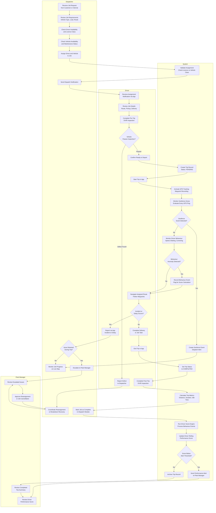
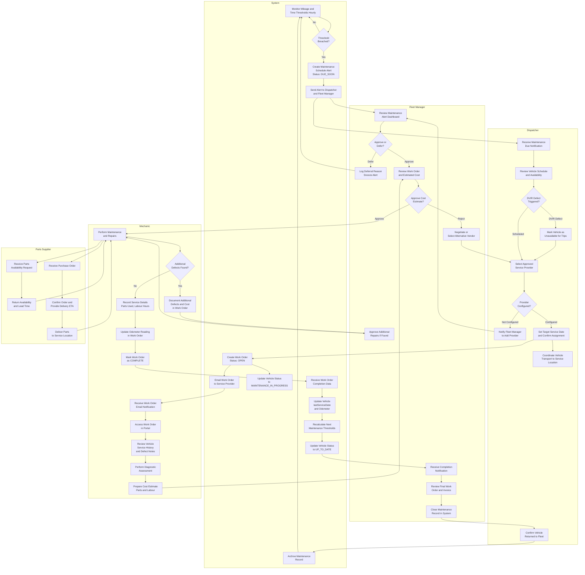

# BPMN Swimlane Diagrams — Fleet Management System

This document presents two process diagrams modelled as swimlane flowcharts using Mermaid subgraphs. Each swimlane represents a distinct role/actor, and arrows between swimlanes show handoffs and dependencies across organisational boundaries.

---

## 1. Dispatch-to-Delivery Process

This diagram models the end-to-end process from the moment a job request is received by the Dispatcher through driver assignment, trip execution, real-time monitoring by the System, and final job closure. It covers the four swimlanes: Dispatcher, Driver, System, and Fleet Manager.

---

## 2. Maintenance Work Order Process

This diagram models the complete lifecycle of a maintenance work order from automated detection or DVIR defect trigger through scheduling, execution by a mechanic or external service provider, parts procurement, quality verification, and closure with schedule recalculation.

---

## Process Design Notes

### Handoff Points and Latency Targets

| Handoff                                    | From            | To              | Target Latency  |
|--------------------------------------------|-----------------|-----------------|-----------------|
| Maintenance alert issued to dispatcher     | System          | Dispatcher      | < 2 minutes     |
| Work order created after dispatcher approval | Dispatcher    | System          | Immediate       |
| Work order delivered to service provider   | System          | Mechanic        | < 5 minutes     |
| Cost estimate returned to fleet manager    | Mechanic        | Fleet Manager   | < 1 business day|
| Parts delivered to service location        | Parts Supplier  | Mechanic        | Per supplier ETA|
| Work order marked complete to fleet manager| Mechanic        | Fleet Manager   | < 2 minutes     |
| Vehicle status restored to UP_TO_DATE      | System          | All Users       | Immediate       |
| Driver assignment notification delivered   | System          | Driver App      | < 30 seconds    |
| Driver score updated after trip            | System          | Driver Profile  | < 5 minutes     |
| Geofence alert dispatched after event      | System          | Dispatcher      | < 10 seconds    |

### Escalation Paths

**Dispatch-to-Delivery:**
- If a DVIR defect blocks a trip, the Dispatcher escalates to the Fleet Manager for a reassignment decision.
- If an in-trip incident is severe (driver safety, cargo loss), the Dispatcher escalates to the Fleet Manager who coordinates with the Compliance Officer.
- If a driver score drops below the threshold, the System alerts the Fleet Manager to schedule a coaching session.

**Maintenance Work Order:**
- If no approved service providers are configured for the vehicle's region, the Dispatcher escalates to the Fleet Manager to onboard a new vendor.
- If the Mechanic discovers additional defects beyond the original scope, the Fleet Manager approves or defers the additional work.
- If a cost estimate is rejected, the Dispatcher is re-engaged to select an alternative service provider.
- If the vehicle is out of service beyond the expected return date, the Dispatcher is notified to arrange alternative fleet coverage.

### Compliance Considerations

All work order records, DVIR inspections, and driver assignments are retained for a minimum of 12 months in compliance with FMCSA record-keeping requirements. Critical DVIR defects that block trips are logged with timestamps and actor identities to create an auditable safety record. Deferred maintenance is logged with the authorising user's identity and the stated reason, providing an audit trail for any regulatory investigation.
