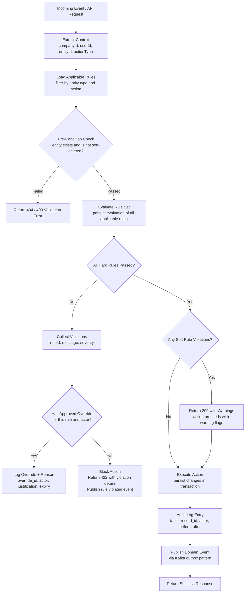

# Business Rules — Fleet Management System

## Enforceable Rules

1. BR-01 — Driver Hours of Service Limit: A commercial driver must not drive more than 11 hours after 10 consecutive hours off duty (FMCSA 49 CFR Part 395). System blocks trip start if HOS violation is detected. The 14-hour window rule also applies: a driver may not drive beyond the 14th consecutive hour after coming on duty, regardless of off-duty breaks taken within that window.

2. BR-02 — Vehicle Inspection Requirement: A vehicle must have a completed Driver Vehicle Inspection Report (DVIR) within the last 24 hours before being assigned to any interstate trip. System enforces pre-trip inspection completion status before activating a trip. Post-trip DVIR is also required within 2 hours of trip completion for vehicles operating under FMCSA jurisdiction.

3. BR-03 — License Class Validation: A driver may only operate a vehicle whose GVWR corresponds to their CDL class or lower (Class A: any combination; Class B: single vehicles ≥ 26,001 lbs; Class C: vehicles carrying 16+ passengers or hazmat). System validates the vehicle's GVWR against driver's `license_class` before confirming any trip assignment.

4. BR-04 — Insurance Expiry Enforcement: Vehicles with an `insurance_expiry_date` on or before today must be automatically flagged and their status set to `out_of_service`. These vehicles cannot be assigned to new trips. The nightly compliance job runs at 00:05 UTC and processes all vehicles. Fleet Managers receive a 90-day advance warning, a 30-day warning, and a 7-day final notice before expiry.

5. BR-05 — Geofence Alert Trigger: When a vehicle enters or exits a geofence zone where `alert_on_enter` or `alert_on_exit` is true, the system must generate a `GeofenceEvent` record and publish the corresponding domain event within 60 seconds of the GPS ping that crosses the zone boundary. Dwell-time alerts are triggered if the vehicle remains inside a zone beyond `alert_on_dwell_minutes` without an exit ping.

6. BR-06 — Maintenance Overdue Threshold: If a vehicle's current `odometer_km` exceeds the `next_service_km` on any open maintenance schedule by more than 500 km, or if the `scheduled_date` of any open maintenance record is more than 7 calendar days in the past, the vehicle status must be set to `maintenance_overdue`. Vehicles in `maintenance_overdue` status cannot be assigned to new trips until the overdue maintenance record is marked `completed`.

7. BR-07 — Fuel Card Spending Limit: A fuel transaction submitted via the Fuel Service must not exceed the `per_transaction_limit_usd` configured on the associated fuel card. Transactions exceeding the limit are rejected before persistence, a `fuel_card.limit_exceeded` event is published, and the fuel card is temporarily suspended pending Fleet Manager review. The transaction is held in a `pending_review` state for 24 hours before auto-rejection.

8. BR-08 — Driver Score Calculation: Driver composite score is computed as a weighted average: Safety Score × 0.40 + Efficiency Score × 0.30 + Compliance Score × 0.30. Scores are recalculated after every completed trip and on a nightly batch for rolling 30-day averages. Scores are bounded [0, 100]. Drivers with a composite score below 60 are automatically enrolled in the mandatory coaching review queue. Fleet Managers are notified via dashboard alert and email.

9. BR-09 — Incident Reporting Deadline: All incidents where `injuries_reported = true` or `estimated_damage_cost > 1000` must have a complete incident report (all required fields populated and status ≠ `open`) within 24 hours of `occurred_at`. The system sends an escalation alert to the Fleet Manager at the 12-hour mark and a final critical alert at the 23-hour mark if the report is not submitted. Incidents unresolved at 24 hours are escalated to the Compliance Officer.

10. BR-10 — IFTA Reporting Period: IFTA fuel tax reports must be generated per quarter (Q1: Jan 1–Mar 31; Q2: Apr 1–Jun 30; Q3: Jul 1–Sep 30; Q4: Oct 1–Dec 31) and submitted within 30 days of quarter-end. The Reporting Service auto-generates a draft IFTA report 7 days before the submission deadline. Fleet Managers receive a reminder 3 days before deadline. Failure to submit triggers a compliance flag on the fleet record.

11. BR-11 — GPS Ping Frequency: Any vehicle with an active trip must transmit GPS pings at minimum every 60 seconds. If the GPS Ingestion API receives no ping for a given vehicle for 5 consecutive minutes, the system sets the vehicle's tracking status to `gps_signal_lost`, publishes a `vehicle.gps.signal-lost` event, and sends an alert to the assigned dispatcher. Tracking status is automatically cleared on the next successful ping.

12. BR-12 — Document Expiry Alerts: The Document Service runs a daily batch at 08:00 UTC and sends alerts at 90 days, 30 days, and 7 days before the expiry of: driver CDLs, vehicle registrations, vehicle inspection certificates, and insurance policies. Alerts are sent to the Fleet Manager and the document owner (driver or vehicle administrator). Documents expired within the last 7 days also generate a `compliance.block` flag preventing new trip assignments.

13. BR-13 — Multi-Tenant Data Isolation: All database queries must be scoped to the authenticated user's company via the `app.current_company_id` session variable enforced by Row-Level Security. No API endpoint may return, modify, or reference data belonging to a different company. Cross-company operations are prohibited except for explicitly authorized system-level admin actions, which require a `sudo_token` with a 15-minute TTL and generate double-audit entries.

14. BR-14 — Speed Violation Threshold: A speeding event is recorded when a vehicle's reported `speed_kmh` from GPS exceeds the posted speed limit for that road segment by more than 10 km/h. Severe speeding is classified as exceeding the limit by more than 20 km/h. Each speeding event reduces the driver's Safety Score by 1 point; each severe speeding event deducts 3 points. Three or more severe speeding events within any rolling 30-day window automatically triggers a mandatory driver review notification.

15. BR-15 — Harsh Braking and Acceleration Detection: A harsh braking event is recorded when vehicle deceleration exceeds 0.4g (approximately 3.9 m/s²). A harsh acceleration event is recorded when acceleration exceeds 0.4g. Each harsh braking event deducts 2 points from the driver's Safety Score; each harsh acceleration event deducts 1 point. Events are detected from the GPS ping velocity delta stream and validated against a 3-ping sliding window to suppress false positives from GPS noise.

16. BR-16 — Fuel Consumption Anomaly Detection: If a submitted fuel transaction's `quantity_l` exceeds the vehicle's `fuel_tank_capacity_l` by more than 10%, the transaction is flagged with status `anomaly_review`. The associated fuel card is temporarily frozen and the Fleet Manager is alerted. The transaction is not credited to fuel analytics until a Fleet Manager or Compliance Officer manually approves or rejects it. Anomaly decisions are logged in the audit trail.

17. BR-17 — Trip Overlap Prevention: A driver or vehicle cannot be the subject of two simultaneously active trips (status = `in_progress` or `scheduled` with overlapping time ranges). The system enforces this via a PostgreSQL exclusion constraint using `tstzrange` on the trips table. Any attempt to create or modify a trip that creates an overlap returns a 422 Unprocessable Entity response with a descriptive conflict message identifying the conflicting trip ID.

18. BR-18 — DVIR Defect Escalation: If a submitted DVIR inspection identifies any safety-critical defect in the categories: brakes, tires, steering, lighting, or coupling devices, the vehicle must be immediately placed in `out_of_service` status. This transition happens synchronously within the DVIR submission API response. The vehicle cannot be moved back to `available` or `in_maintenance` until a qualified technician marks the defect as resolved and a post-repair inspection is completed and approved by a Fleet Manager or higher.

19. BR-19 — ELD Mandate Compliance: Vehicles with a GVWR greater than 10,001 lbs (4,536 kg) that are operated in interstate commerce must have a certified Electronic Logging Device (ELD) installed and registered in the system. The ELD's FMCSA registration number must be recorded in the `vehicles` table. The compliance engine checks ELD status nightly and flags vehicles missing valid ELD certification as `compliance_hold`, blocking new trip assignments until the device is registered.

20. BR-20 — Data Retention Compliance: GPS pings must be retained for a minimum of 7 years to satisfy FMCSA audit requirements, with the first 2 years in hot Postgres storage and the remainder in cold S3 Glacier storage. HOS logs must be retained for a minimum of 6 months in hot storage (accessible within seconds) and a subsequent 6 months in warm storage (accessible within minutes). After 12 months, HOS logs are archived for an additional 5.5 years. Purge jobs must not execute before the minimum retention period has elapsed, and any purge action must be logged in the immutable audit trail.

---

## Rule Evaluation Pipeline

When any event or API request is processed by the system, it passes through the rule evaluation pipeline before the action is committed:

### Rule Categories

| Category | Description | Override Allowed | Response on Violation |
|----------|-------------|-----------------|----------------------|
| **Hard Rule** | Legally mandated or safety-critical constraint. Blocking; the action cannot proceed without an approved override. Examples: HOS limits (BR-01), DVIR defect block (BR-18), license class mismatch (BR-03). | By Compliance Officer or System Admin only, with documented justification and TTL | 422 Unprocessable Entity + `rule.violated` event |
| **Soft Rule** | Business policy that can be waived by an authorized role. System records the waiver. Examples: trip purpose required (informational), fuel station location mismatch. | By Fleet Manager, Compliance Officer, or System Admin | 200 OK with `X-Rule-Warning` headers |
| **Warning Rule** | Informational check with no blocking behavior. Alerts are surfaced to dashboards and reports. Examples: driver score below recommended threshold, vehicle approaching maintenance interval. | Not applicable — no blocking occurs | 200 OK; warning added to response body and dashboard feed |

---

## Exception and Override Handling

### Override Request Process

When a Hard Rule violation is encountered and an override is required, the following process applies:

1. **Requestor** (Fleet Manager or Dispatcher) submits an override request via the Compliance Portal, selecting:
   - The blocked action and entity ID
   - The specific rule(s) being overridden
   - A mandatory free-text justification (minimum 50 characters)
   - Requested override duration (maximum 8 hours for operational overrides; maximum 30 days for policy exceptions)

2. **Approver** reviews the request in the Compliance Portal. Approval authority by rule:

| Rule | Can Be Overridden By | Maximum Duration |
|------|---------------------|-----------------|
| BR-01 (HOS Limit) | Compliance Officer, System Admin | 2 hours |
| BR-02 (DVIR Requirement) | Fleet Manager, Compliance Officer | 4 hours |
| BR-03 (License Class) | Compliance Officer, System Admin | Not eligible |
| BR-04 (Insurance Expiry) | System Admin only | 24 hours (pending renewal) |
| BR-06 (Maintenance Overdue) | Fleet Manager, Compliance Officer | 48 hours |
| BR-07 (Fuel Card Limit) | Fleet Manager | 1 transaction |
| BR-09 (Incident Deadline) | Compliance Officer | Not eligible |
| BR-11 (GPS Ping Frequency) | System Admin | 30 minutes |
| BR-17 (Trip Overlap) | Fleet Manager, Compliance Officer | Not eligible |
| BR-18 (DVIR Defect Block) | Compliance Officer, System Admin | Not eligible |
| BR-19 (ELD Mandate) | Compliance Officer | Not eligible |

3. **Approved overrides** are persisted in the `rule_overrides` table with: `rule_id`, `entity_id`, `requestor_id`, `approver_id`, `justification`, `granted_at`, `expires_at`, and `status`. The override is automatically deactivated when it expires or when the underlying condition is resolved.

4. **Audit trail**: Every override request (submitted, approved, rejected, expired, revoked) generates an entry in the immutable `audit_log`. Overrides of Hard Rules generate an additional entry in the `compliance_events` table for regulatory review.

---

### Emergency Override

For time-critical operational situations (e.g., medical transport, emergency cargo, natural disaster response):

- A **System Admin** can issue an emergency override via the CLI or Admin API by providing a justification string and a maximum duration of 4 hours.
- Emergency overrides are tagged `emergency = true` in the `rule_overrides` table.
- A post-incident review must be completed within 48 hours by a Compliance Officer, documenting the business necessity.
- Emergency overrides are subject to quarterly compliance audits and must not exceed 0.5% of total rule evaluations per month before triggering a mandatory process review.

---

### Automatic Exception Logging

The following conditions generate automatic exception log entries without requiring a manual override:

| Condition | Auto-Exception Type | Logged Fields |
|-----------|-------------------|---------------|
| GPS signal loss > 5 min | `tracking.signal_lost` | vehicleId, lastPingTime, driverId |
| Driver score drops below 60 | `driver.score_threshold_breach` | driverId, previousScore, newScore, tripId |
| Fuel anomaly flagged | `fuel.anomaly_detected` | fuelRecordId, vehicleId, quantityL, tankCapacityL |
| Document expiry within 7 days | `document.critical_expiry` | documentId, entityType, entityId, expiryDate |
| Maintenance overdue detected | `maintenance.overdue` | vehicleId, overdueKm, overdueDays |

---

### Exception Expiry Periods

| Exception Type | Auto-Expiry | Behavior on Expiry |
|---------------|------------|-------------------|
| Operational override (Soft Rules) | 8 hours | Override deactivated; rule re-evaluated on next action |
| Policy exception (Hard Rules) | 30 days maximum | Rule re-enforced; entity status re-evaluated |
| Emergency override | 4 hours | Override deactivated; post-incident review triggered |
| Fuel card freeze (anomaly) | 24 hours pending review | Auto-rejected if not reviewed; card remains frozen |
| GPS signal lost | Cleared on next successful ping | Status reverted to `active` automatically |

---

### Conflict Resolution When Multiple Rules Apply

When a single action triggers violations from multiple rules simultaneously, the following precedence applies:

1. **Safety-critical Hard Rules take absolute precedence** (BR-18, BR-03, BR-19). If any safety-critical rule is violated, the action is blocked regardless of other outcomes.
2. **Regulatory Hard Rules are evaluated next** (BR-01, BR-04, BR-09). A violation here also blocks the action unless a valid override exists for each violated rule.
3. **Operational Hard Rules follow** (BR-06, BR-17). Same blocking behavior; each requires its own override.
4. **All violations are collected and returned together** in a single API response. The system does not short-circuit at the first violation; it evaluates all applicable rules and reports the complete set of violations so the operator can address them simultaneously.
5. **When override requests are required**, a single override request can reference multiple rule violations for the same action and entity, reducing approval friction for multi-rule conflicts.

---

### Rule Classification Reference

The table below provides a complete quick-reference for all 20 enforceable rules, their classification, and the enforcement mechanism used:

| Rule ID | Name | Category | Enforcement | Override Eligible |
|---------|------|----------|-------------|------------------|
| BR-01 | HOS Limit | Hard — Regulatory | API block + DB state check | Compliance Officer / Admin (max 2h) |
| BR-02 | DVIR Requirement | Hard — Safety | API block + inspection status check | Fleet Manager / Compliance Officer (max 4h) |
| BR-03 | License Class | Hard — Safety | API block + enum comparison | Not eligible |
| BR-04 | Insurance Expiry | Hard — Regulatory | Nightly job + status flag | System Admin only (max 24h) |
| BR-05 | Geofence Alert | Soft — Operational | Async event trigger | Fleet Manager |
| BR-06 | Maintenance Overdue | Hard — Operational | Nightly job + status flag | Fleet Manager (max 48h) |
| BR-07 | Fuel Card Limit | Hard — Financial | Real-time transaction check | Fleet Manager (1 transaction) |
| BR-08 | Driver Score Calc | Warning | Post-trip async calculation | Not applicable |
| BR-09 | Incident Deadline | Hard — Regulatory | Escalating alert + auto-flag | Not eligible |
| BR-10 | IFTA Quarterly | Soft — Regulatory | Scheduled draft generation | Fleet Manager |
| BR-11 | GPS Ping Frequency | Soft — Operational | Timeout watchdog | System Admin (max 30 min) |
| BR-12 | Document Expiry Alerts | Warning | Daily batch job | Not applicable |
| BR-13 | Multi-Tenant Isolation | Hard — Security | RLS + JWT middleware | Not eligible |
| BR-14 | Speed Violation | Warning | GPS telemetry analysis | Not applicable |
| BR-15 | Harsh Events | Warning | Accelerometer/GPS delta | Not applicable |
| BR-16 | Fuel Anomaly | Hard — Financial | Capacity comparison check | Fleet Manager (per record) |
| BR-17 | Trip Overlap | Hard — Operational | DB exclusion constraint | Not eligible |
| BR-18 | DVIR Defect Block | Hard — Safety | Synchronous status change | Not eligible |
| BR-19 | ELD Mandate | Hard — Regulatory | Nightly compliance check | Not eligible |
| BR-20 | Data Retention | Hard — Regulatory | Purge job gating | Not eligible |

---

### Regulatory References

The following regulations directly inform the enforceable rules in this document:

| Regulation | Jurisdiction | Relevant Rules | Summary |
|-----------|-------------|----------------|---------|
| FMCSA 49 CFR Part 395 | United States | BR-01, BR-20 | Hours of Service for commercial drivers |
| FMCSA 49 CFR Part 396.11 | United States | BR-02, BR-18 | Driver Vehicle Inspection Reports (DVIR) |
| FMCSA ELD Mandate (49 CFR Part 395.8) | United States | BR-19, BR-20 | Electronic Logging Device requirements |
| International Fuel Tax Agreement (IFTA) | US/Canada | BR-10 | Fuel use reporting across jurisdictions |
| FMCSA 49 CFR Part 391 | United States | BR-03 | Commercial driver qualifications |
| DOT Drug and Alcohol Testing (49 CFR Part 382) | United States | BR-08, BR-09 | Post-accident testing triggers |
| GDPR Article 5(1)(e) | European Union | BR-20 | Storage limitation principle for personal data |
| ISO 39001 | International | BR-14, BR-15 | Road traffic safety management systems |

All rules are reviewed annually by the Compliance Officer and updated to reflect regulatory amendments within 30 days of their effective date.
