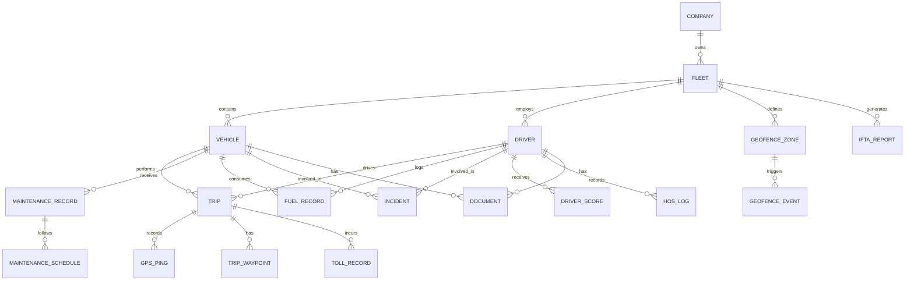

# Data Dictionary — Fleet Management System

## Core Entities

### Vehicle

| Field | Type | Nullable | Default | Constraints | Description |
|-------|------|----------|---------|-------------|-------------|
| id | UUID | No | gen_random_uuid() | PRIMARY KEY | Unique vehicle identifier |
| fleet_id | UUID | No | — | FK → fleets.id | Fleet this vehicle belongs to |
| vin | VARCHAR(17) | No | — | UNIQUE, pattern [A-HJ-NPR-Z0-9]{17} | Vehicle Identification Number |
| license_plate | VARCHAR(20) | No | — | UNIQUE per jurisdiction | License plate number |
| make | VARCHAR(100) | No | — | NOT NULL | Manufacturer (e.g., Ford, Freightliner) |
| model | VARCHAR(100) | No | — | NOT NULL | Model name |
| year | SMALLINT | No | — | 1900–2100 | Model year |
| status | vehicle_status_enum | No | 'available' | IN (available, in_trip, in_maintenance, out_of_service) | Current operational status |
| odometer_km | DECIMAL(10,2) | No | 0.00 | ≥ 0 | Current odometer reading in kilometers |
| fuel_type | VARCHAR(20) | No | — | IN (diesel, gasoline, electric, hybrid, cng) | Primary fuel type |
| fuel_tank_capacity_l | DECIMAL(8,2) | Yes | NULL | > 0 | Tank capacity in liters |
| gross_vehicle_weight_kg | DECIMAL(10,2) | Yes | NULL | > 0 | GVW in kilograms |
| insurance_expiry_date | DATE | Yes | NULL | — | Insurance policy expiry |
| registration_expiry_date | DATE | Yes | NULL | — | Vehicle registration expiry |
| last_inspection_date | DATE | Yes | NULL | — | Most recent DVIR inspection date |
| notes | TEXT | Yes | NULL | max 2000 chars | Free-form operational notes |
| created_at | TIMESTAMPTZ | No | now() | — | Record creation timestamp |
| updated_at | TIMESTAMPTZ | No | now() | — | Record last updated timestamp |
| deleted_at | TIMESTAMPTZ | Yes | NULL | — | Soft delete timestamp |

**Enum: vehicle_status_enum** — `available` | `in_trip` | `in_maintenance` | `maintenance_overdue` | `out_of_service`

---

### Driver

| Field | Type | Nullable | Default | Constraints | Description |
|-------|------|----------|---------|-------------|-------------|
| id | UUID | No | gen_random_uuid() | PRIMARY KEY | Unique driver identifier |
| company_id | UUID | No | — | FK → companies.id | Company this driver belongs to |
| employee_id | VARCHAR(50) | No | — | UNIQUE per company | Internal employee/payroll identifier |
| first_name | VARCHAR(100) | No | — | NOT NULL | Driver's legal first name |
| last_name | VARCHAR(100) | No | — | NOT NULL | Driver's legal last name |
| email | VARCHAR(255) | No | — | UNIQUE, valid RFC 5322 format | Driver's work email address |
| phone | VARCHAR(20) | Yes | NULL | E.164 format | Driver's mobile phone number |
| license_number | VARCHAR(50) | No | — | UNIQUE per license_state | Commercial driver's license number |
| license_class | VARCHAR(5) | No | — | IN (A, B, C, D) | CDL class (A = tractor-trailer, B = straight truck, C = passenger) |
| license_state | CHAR(2) | No | — | ISO 3166-2 US state code | State or province of CDL issuance |
| license_expiry_date | DATE | No | — | Must be ≥ current date on insert | CDL expiration date |
| cdl_endorsements | VARCHAR[] | Yes | '{}' | Subset of (H, N, P, S, T, X) | CDL endorsement codes held by driver |
| status | driver_status_enum | No | 'available' | IN (available, on_trip, off_duty, suspended, terminated) | Current driver operational status |
| driver_score | DECIMAL(5,2) | No | 100.00 | 0–100 | Composite driver performance score |
| total_trips | INTEGER | No | 0 | ≥ 0 | Lifetime trip count |
| total_km_driven | DECIMAL(12,2) | No | 0.00 | ≥ 0 | Lifetime kilometers driven |
| hos_status | hos_status_enum | No | 'off_duty' | IN (off_duty, sleeper_berth, driving, on_duty_not_driving) | Current Hours of Service duty status |
| created_at | TIMESTAMPTZ | No | now() | — | Record creation timestamp |
| updated_at | TIMESTAMPTZ | No | now() | — | Record last updated timestamp |
| deleted_at | TIMESTAMPTZ | Yes | NULL | — | Soft delete timestamp |

**Enum: driver_status_enum** — `available` | `on_trip` | `off_duty` | `suspended` | `terminated`
**Enum: hos_status_enum** — `off_duty` | `sleeper_berth` | `driving` | `on_duty_not_driving`

---

### Trip

| Field | Type | Nullable | Default | Constraints | Description |
|-------|------|----------|---------|-------------|-------------|
| id | UUID | No | gen_random_uuid() | PRIMARY KEY | Unique trip identifier |
| vehicle_id | UUID | No | — | FK → vehicles.id | Vehicle performing the trip |
| driver_id | UUID | No | — | FK → drivers.id | Driver operating the vehicle |
| fleet_id | UUID | No | — | FK → fleets.id | Fleet owning this trip record |
| status | trip_status_enum | No | 'scheduled' | IN (scheduled, in_progress, completed, cancelled) | Current trip lifecycle status |
| start_time | TIMESTAMPTZ | Yes | NULL | — | Actual trip start timestamp (UTC) |
| end_time | TIMESTAMPTZ | Yes | NULL | ≥ start_time when set | Actual trip end timestamp (UTC) |
| start_location_lat | DECIMAL(10,7) | Yes | NULL | -90 to 90 | Start location latitude (WGS84) |
| start_location_lng | DECIMAL(10,7) | Yes | NULL | -180 to 180 | Start location longitude (WGS84) |
| end_location_lat | DECIMAL(10,7) | Yes | NULL | -90 to 90 | End location latitude (WGS84) |
| end_location_lng | DECIMAL(10,7) | Yes | NULL | -180 to 180 | End location longitude (WGS84) |
| start_address | VARCHAR(500) | Yes | NULL | — | Human-readable departure address |
| end_address | VARCHAR(500) | Yes | NULL | — | Human-readable arrival address |
| distance_km | DECIMAL(10,2) | Yes | NULL | ≥ 0 | Total trip distance in kilometers |
| duration_minutes | INTEGER | Yes | NULL | ≥ 0 | Total trip duration in minutes |
| avg_speed_kmh | DECIMAL(6,2) | Yes | NULL | ≥ 0 | Time-weighted average speed in km/h |
| max_speed_kmh | DECIMAL(6,2) | Yes | NULL | ≥ 0 | Peak recorded speed during trip in km/h |
| fuel_consumed_l | DECIMAL(8,2) | Yes | NULL | ≥ 0 | Total fuel consumed in liters |
| idle_time_minutes | INTEGER | Yes | NULL | ≥ 0 | Total engine idle time in minutes |
| harsh_braking_events | SMALLINT | No | 0 | ≥ 0 | Count of deceleration events exceeding 0.4g |
| harsh_acceleration_events | SMALLINT | No | 0 | ≥ 0 | Count of acceleration events exceeding 0.4g |
| speeding_events | SMALLINT | No | 0 | ≥ 0 | Count of posted speed limit violations |
| driver_score | DECIMAL(5,2) | Yes | NULL | 0–100 | Trip-level driver safety and efficiency score |
| purpose | VARCHAR(100) | Yes | NULL | — | Trip purpose (e.g., Delivery, Service Call, Transfer) |
| notes | TEXT | Yes | NULL | max 2000 chars | Dispatcher or driver trip notes |

**Enum: trip_status_enum** — `scheduled` | `in_progress` | `completed` | `cancelled`

---

### GPSPing

| Field | Type | Nullable | Default | Constraints | Description |
|-------|------|----------|---------|-------------|-------------|
| id | UUID | No | gen_random_uuid() | PRIMARY KEY | Unique GPS ping identifier |
| vehicle_id | UUID | No | — | FK → vehicles.id, indexed (BRIN on timestamp) | Vehicle emitting this telemetry ping |
| trip_id | UUID | Yes | NULL | FK → trips.id | Associated active trip; null if vehicle is idle |
| latitude | DECIMAL(10,7) | No | — | -90.0000000 to 90.0000000 | WGS84 latitude coordinate |
| longitude | DECIMAL(10,7) | No | — | -180.0000000 to 180.0000000 | WGS84 longitude coordinate |
| altitude_m | DECIMAL(8,2) | Yes | NULL | -500 to 10000 | Altitude in meters above mean sea level |
| speed_kmh | DECIMAL(6,2) | No | 0.00 | ≥ 0 | Instantaneous vehicle speed in km/h |
| heading_degrees | DECIMAL(5,2) | Yes | NULL | 0.00–359.99 | Direction of travel, degrees clockwise from true north |
| accuracy_m | DECIMAL(6,2) | Yes | NULL | > 0 | Estimated horizontal GPS accuracy radius in meters |
| timestamp | TIMESTAMPTZ | No | — | NOT NULL, partition key | UTC timestamp of the GPS fix |
| signal_strength | SMALLINT | Yes | NULL | 0–100 | Composite GPS/cellular signal strength percentage |
| source | VARCHAR(20) | No | 'gps' | IN (gps, cell_tower, wifi, manual) | Technology used to determine location |

> **Partitioning**: `gps_pings` is range-partitioned by `timestamp` with monthly partitions. Each partition is automatically created 30 days in advance by a scheduled job.

---

### MaintenanceRecord

| Field | Type | Nullable | Default | Constraints | Description |
|-------|------|----------|---------|-------------|-------------|
| id | UUID | No | gen_random_uuid() | PRIMARY KEY | Unique maintenance record identifier |
| vehicle_id | UUID | No | — | FK → vehicles.id | Vehicle receiving maintenance |
| fleet_id | UUID | No | — | FK → fleets.id | Fleet that owns this maintenance record |
| type | VARCHAR(50) | No | — | IN (oil_change, tire_rotation, brake_service, inspection, repair, recall, major_overhaul) | Service type category |
| status | maintenance_status_enum | No | 'scheduled' | IN (scheduled, in_progress, completed, cancelled) | Current service record status |
| scheduled_date | DATE | Yes | NULL | — | Planned date for the service |
| completed_date | DATE | Yes | NULL | ≥ scheduled_date if provided | Actual date the service was completed |
| odometer_at_service_km | DECIMAL(10,2) | Yes | NULL | ≥ 0 | Vehicle odometer reading at time of service |
| next_service_km | DECIMAL(10,2) | Yes | NULL | > odometer_at_service_km | Odometer threshold that triggers next maintenance |
| next_service_date | DATE | Yes | NULL | > completed_date if provided | Calendar date trigger for the next maintenance |
| service_provider_id | UUID | Yes | NULL | FK → service_providers.id | External shop or vendor performing the work |
| technician_name | VARCHAR(200) | Yes | NULL | — | Full name of the servicing technician |
| labor_hours | DECIMAL(6,2) | Yes | NULL | ≥ 0 | Total billable labor hours charged |
| parts_cost | DECIMAL(12,2) | Yes | NULL | ≥ 0 | Aggregate cost of all parts in base currency |
| labor_cost | DECIMAL(12,2) | Yes | NULL | ≥ 0 | Total labor cost charged in base currency |
| total_cost | DECIMAL(12,2) | Yes | NULL | ≥ 0; computed as parts_cost + labor_cost | Grand total service cost |
| description | TEXT | No | — | NOT NULL | Narrative description of all work performed |
| notes | TEXT | Yes | NULL | max 2000 chars | Additional technician or fleet manager annotations |

---

### FuelRecord

| Field | Type | Nullable | Default | Constraints | Description |
|-------|------|----------|---------|-------------|-------------|
| id | UUID | No | gen_random_uuid() | PRIMARY KEY | Unique fuel transaction identifier |
| vehicle_id | UUID | No | — | FK → vehicles.id | Vehicle being fueled |
| driver_id | UUID | Yes | NULL | FK → drivers.id | Driver who initiated the fueling |
| fleet_id | UUID | No | — | FK → fleets.id | Fleet owning this transaction |
| recorded_at | TIMESTAMPTZ | No | now() | NOT NULL | UTC timestamp of the fueling event |
| location_lat | DECIMAL(10,7) | Yes | NULL | -90 to 90 | Fuel station latitude |
| location_lng | DECIMAL(10,7) | Yes | NULL | -180 to 180 | Fuel station longitude |
| fuel_station_name | VARCHAR(255) | Yes | NULL | — | Name of the fuel station or card-network merchant |
| fuel_type | VARCHAR(20) | No | — | IN (diesel, gasoline, electric, hydrogen, cng) | Type of fuel or energy dispensed |
| quantity_l | DECIMAL(8,3) | No | — | > 0 | Volume of fuel dispensed in liters |
| unit_price | DECIMAL(10,4) | No | — | > 0 | Per-liter price in base currency (4 decimal places) |
| total_cost | DECIMAL(12,2) | No | — | > 0; validated ≈ quantity_l × unit_price ±1% | Total transaction amount in base currency |
| odometer_km | DECIMAL(10,2) | No | — | ≥ 0 | Vehicle odometer reading at time of fueling |
| fuel_card_id | UUID | Yes | NULL | FK → fuel_cards.id | Fuel card used for payment, if applicable |
| authorization_code | VARCHAR(50) | Yes | NULL | — | Payment network authorization code |
| notes | TEXT | Yes | NULL | max 1000 chars | Notes on fueling event (e.g., partial fill, DEF added) |

---

### Incident

| Field | Type | Nullable | Default | Constraints | Description |
|-------|------|----------|---------|-------------|-------------|
| id | UUID | No | gen_random_uuid() | PRIMARY KEY | Unique incident report identifier |
| vehicle_id | UUID | No | — | FK → vehicles.id | Vehicle involved in the incident |
| driver_id | UUID | Yes | NULL | FK → drivers.id | Driver at the wheel; null if vehicle was unoccupied |
| fleet_id | UUID | No | — | FK → fleets.id | Fleet owning this incident record |
| type | incident_type_enum | No | — | IN (collision, near_miss, theft, vandalism, breakdown, cargo_damage, weather_damage, other) | Incident classification |
| severity | incident_severity_enum | No | — | IN (minor, moderate, major, critical) | Severity level for triage and escalation routing |
| status | incident_status_enum | No | 'open' | IN (open, under_review, pending_repair, closed, disputed) | Current investigation or resolution status |
| occurred_at | TIMESTAMPTZ | No | — | NOT NULL; must be ≤ now() | UTC timestamp when the incident took place |
| location_lat | DECIMAL(10,7) | Yes | NULL | -90 to 90 | Incident latitude coordinate |
| location_lng | DECIMAL(10,7) | Yes | NULL | -180 to 180 | Incident longitude coordinate |
| location_address | VARCHAR(500) | Yes | NULL | — | Reverse-geocoded or manually entered address |
| description | TEXT | No | — | NOT NULL, max 5000 chars | Full incident narrative |
| injuries_reported | BOOLEAN | No | false | — | True if any occupant or third-party injuries were reported |
| property_damage | BOOLEAN | No | false | — | True if third-party property damage occurred |
| police_report_number | VARCHAR(100) | Yes | NULL | — | Law enforcement incident report reference number |
| insurance_claim_number | VARCHAR(100) | Yes | NULL | — | Insurance carrier claim reference number |
| estimated_damage_cost | DECIMAL(12,2) | Yes | NULL | ≥ 0 | Estimated total damage cost in base currency |
| reported_by | UUID | No | — | FK → users.id | User who filed the incident report |
| created_at | TIMESTAMPTZ | No | now() | — | Record creation timestamp |
| updated_at | TIMESTAMPTZ | No | now() | — | Record last updated timestamp |

---

### GeofenceZone

| Field | Type | Nullable | Default | Constraints | Description |
|-------|------|----------|---------|-------------|-------------|
| id | UUID | No | gen_random_uuid() | PRIMARY KEY | Unique geofence zone identifier |
| fleet_id | UUID | No | — | FK → fleets.id | Fleet that owns this zone |
| name | VARCHAR(200) | No | — | NOT NULL, UNIQUE per fleet_id | Human-readable zone name |
| description | TEXT | Yes | NULL | max 1000 chars | Purpose or operational context of the zone |
| shape_type | VARCHAR(20) | No | — | IN (circle, polygon, rectangle) | Geometric shape used to define the boundary |
| coordinates_json | JSONB | No | — | Valid GeoJSON Geometry object | Zone boundary expressed as GeoJSON |
| radius_m | DECIMAL(10,2) | Yes | NULL | > 0; required when shape_type = 'circle' | Circle radius in meters |
| alert_on_enter | BOOLEAN | No | true | — | Generate a GeofenceEvent when a vehicle enters |
| alert_on_exit | BOOLEAN | No | true | — | Generate a GeofenceEvent when a vehicle exits |
| alert_on_dwell_minutes | INTEGER | Yes | NULL | > 0 | Generate alert if vehicle remains inside longer than this threshold |
| active | BOOLEAN | No | true | — | Whether zone is currently evaluated against GPS pings |
| created_by | UUID | No | — | FK → users.id | User who created the zone |
| created_at | TIMESTAMPTZ | No | now() | — | Record creation timestamp |
| updated_at | TIMESTAMPTZ | No | now() | — | Record last updated timestamp |

---

### Supporting Entities (Summary)

#### Fleet

| Field | Type | Nullable | Constraints | Description |
|-------|------|----------|-------------|-------------|
| id | UUID | No | PRIMARY KEY | Unique fleet identifier |
| company_id | UUID | No | FK → companies.id | Owning company |
| name | VARCHAR(200) | No | NOT NULL, UNIQUE per company | Fleet display name |
| timezone | VARCHAR(50) | No | IANA timezone string | Operational timezone for reporting |
| base_currency | CHAR(3) | No | ISO 4217 currency code | Currency for all cost fields |
| created_at | TIMESTAMPTZ | No | — | Record creation timestamp |
| deleted_at | TIMESTAMPTZ | Yes | — | Soft delete timestamp |

#### HOSLog

| Field | Type | Nullable | Constraints | Description |
|-------|------|----------|-------------|-------------|
| id | UUID | No | PRIMARY KEY | Unique HOS log entry identifier |
| driver_id | UUID | No | FK → drivers.id | Driver this log belongs to |
| duty_status | hos_status_enum | No | NOT NULL | Duty status at start of this entry |
| start_time | TIMESTAMPTZ | No | NOT NULL | When this duty-status period began |
| end_time | TIMESTAMPTZ | Yes | ≥ start_time | When this duty-status period ended (null if current) |
| location_lat | DECIMAL(10,7) | Yes | -90 to 90 | Driver's latitude at status change |
| location_lng | DECIMAL(10,7) | Yes | -180 to 180 | Driver's longitude at status change |
| vehicle_id | UUID | Yes | FK → vehicles.id | Vehicle in use at this entry (null if off duty) |
| eld_sequence_id | INTEGER | No | ≥ 1, per ELD device | Sequential record ID from ELD device |
| origin | VARCHAR(20) | No | IN (eld, driver_app, auto, edit) | How this entry was created |
| annotation | TEXT | Yes | max 500 chars | Driver or back-office annotation |
| created_at | TIMESTAMPTZ | No | now() | Record creation timestamp |

#### DriverScore

| Field | Type | Nullable | Constraints | Description |
|-------|------|----------|-------------|-------------|
| id | UUID | No | PRIMARY KEY | Unique score record identifier |
| driver_id | UUID | No | FK → drivers.id | Driver being scored |
| trip_id | UUID | Yes | FK → trips.id | Trip that contributed to this score delta |
| period_start | DATE | No | NOT NULL | Start of scoring period |
| period_end | DATE | No | NOT NULL; ≥ period_start | End of scoring period |
| safety_score | DECIMAL(5,2) | No | 0–100 | Weighted safety sub-score |
| efficiency_score | DECIMAL(5,2) | No | 0–100 | Weighted efficiency sub-score |
| compliance_score | DECIMAL(5,2) | No | 0–100 | Weighted compliance sub-score |
| composite_score | DECIMAL(5,2) | No | 0–100 | Weighted composite (40/30/30) |
| computed_at | TIMESTAMPTZ | No | NOT NULL | When the score was calculated |

---

## Canonical Relationship Diagram

---

## Data Quality Controls

### Validation Rules by Entity

#### Vehicle
| Rule | Constraint | Enforcement Layer |
|------|-----------|-------------------|
| VIN Format | Must match regex `[A-HJ-NPR-Z0-9]{17}`; 9th character is the check digit per NHTSA algorithm | DB CHECK + Application layer |
| VIN Check Digit | Calculated per NHTSA transliteration table; rejected if invalid | Application layer (pre-insert) |
| Odometer monotonicity | `odometer_km` must never decrease; any update where new value < current value is rejected | DB trigger + Application layer |
| Year range | `year` must be between 1900 and current year + 1 | DB CHECK constraint |
| Fuel type consistency | If `fuel_type = 'electric'`, `fuel_tank_capacity_l` should be NULL; `energy_capacity_kwh` should be set | Application-level validation |
| GVW positive | `gross_vehicle_weight_kg` > 0 when provided | DB CHECK constraint |

#### Driver
| Rule | Constraint | Enforcement Layer |
|------|-----------|-------------------|
| Email format | Must conform to RFC 5322; verified against DNS MX record on first insert | Application layer |
| License expiry future | `license_expiry_date` must not be in the past at time of driver creation | Application layer |
| CDL endorsement values | Each value in `cdl_endorsements[]` must be in the set {H, N, P, S, T, X} | DB CHECK constraint on array elements |
| Score bounds | `driver_score` must be in [0, 100] | DB CHECK constraint |
| HOS status transition | Status transitions must follow FMCSA legal duty-status graph (e.g., cannot go from `sleeper_berth` directly to `driving` without `on_duty_not_driving`) | Application state machine |

#### Trip
| Rule | Constraint | Enforcement Layer |
|------|-----------|-------------------|
| End after start | `end_time` must be ≥ `start_time` when both are set | DB CHECK constraint |
| Lat/Lng range | Latitude in [-90, 90]; longitude in [-180, 180] | DB CHECK constraints on all lat/lng columns |
| Overlap prevention | A driver or vehicle cannot have two trips with overlapping time ranges (status = in_progress) | DB exclusion constraint using tstzrange |
| Distance non-negative | `distance_km` ≥ 0 | DB CHECK constraint |
| Score on completion | `driver_score` must be populated before a trip transitions to `completed` | Application state machine |

#### GPSPing
| Rule | Constraint | Enforcement Layer |
|------|-----------|-------------------|
| Coordinate validity | Latitude in [-90, 90]; longitude in [-180, 180]; altitude in [-500, 10000] | DB CHECK constraint |
| Timestamp ordering | Pings for a given vehicle must arrive with non-decreasing timestamps; out-of-order pings older than 5 minutes are rejected | Application layer (deduplication buffer) |
| Speed plausibility | `speed_kmh` must be ≤ 300 (physically implausible above this threshold for ground vehicles) | Application layer soft check; alerts flagged |
| Heading range | `heading_degrees` in [0, 360) | DB CHECK constraint |

#### FuelRecord
| Rule | Constraint | Enforcement Layer |
|------|-----------|-------------------|
| Quantity vs. tank capacity | If `quantity_l` > `fuel_tank_capacity_l` × 1.10, the record is flagged for anomaly review and the fuel card is temporarily frozen | Application layer |
| Total cost reconciliation | `total_cost` must equal `quantity_l × unit_price` within 1% tolerance | Application layer |
| Odometer forward movement | `odometer_km` at fueling must be ≥ last known odometer for that vehicle | Application layer |

#### Incident
| Rule | Constraint | Enforcement Layer |
|------|-----------|-------------------|
| Occurred in past | `occurred_at` must be ≤ now() | DB CHECK constraint |
| Severity-status matrix | `critical` severity incidents cannot be closed until `police_report_number` and `insurance_claim_number` are present | Application state machine |
| Reporting deadline | Incidents with `injuries_reported = true` or `estimated_damage_cost > 1000` must have a complete report within 24 hours | Async job + escalation alerts |

---

### Data Integrity Constraints

1. **Referential Integrity** — All foreign keys are enforced at the database level with `ON DELETE RESTRICT` by default. Soft-deleted parents (non-null `deleted_at`) are not physically removed; child records remain intact and can be historically queried.

2. **Unique Constraints**
   - `vehicles.vin` — globally unique across the entire system.
   - `vehicles.license_plate` — unique per `(license_plate, jurisdiction)` composite key.
   - `drivers.license_number` — unique per `(license_number, license_state)` composite key.
   - `drivers.email` — globally unique (one login identity per email).
   - `geofence_zones.name` — unique per `fleet_id`.

3. **Domain Enumerations** — All enum types are defined as PostgreSQL `ENUM` types and also enforced at the application layer (Zod/OpenAPI schema). New values require a schema migration and a feature flag rollout.

4. **JSON Schema Validation** — `coordinates_json` on `GeofenceZone` must be a valid GeoJSON `Geometry` object (Point, Polygon, or MultiPolygon). Validated using `pgTAP` DB tests and a Postgres `CHECK` constraint calling a PL/pgSQL validation function.

---

### Audit Trail Requirements

Every write operation (INSERT, UPDATE, DELETE) on the following tables is captured in the `audit_log` table:

- `vehicles`, `drivers`, `trips`, `maintenance_records`, `fuel_records`, `incidents`, `geofence_zones`, `fleet`, `users`

The `audit_log` schema:

| Field | Type | Description |
|-------|------|-------------|
| id | UUID | Unique audit entry identifier |
| table_name | VARCHAR(100) | Name of the affected table |
| record_id | UUID | Primary key of the modified record |
| operation | CHAR(6) | INSERT, UPDATE, or DELETE |
| old_data | JSONB | Full row snapshot before change (null for INSERT) |
| new_data | JSONB | Full row snapshot after change (null for DELETE) |
| changed_by | UUID | User ID who performed the action |
| changed_at | TIMESTAMPTZ | Timestamp of the change (default: now()) |
| ip_address | INET | Client IP address from the request context |
| user_agent | TEXT | HTTP user agent string |

Audit logs are append-only. No application role has UPDATE or DELETE privileges on `audit_log`. Logs are streamed to an immutable S3 bucket (Object Lock: COMPLIANCE mode, 10-year retention) via a CDC pipeline.

---

### Data Retention Policies

| Data Category | Hot Storage | Warm Storage | Cold / Archive | Legal Basis |
|---------------|-------------|--------------|----------------|-------------|
| GPS Pings | 2 years (partitioned Postgres) | — | 7 years (S3 Glacier Instant Retrieval) | FMCSA 49 CFR Part 395 |
| HOS Logs | 6 months (Postgres) | 6 months (read-replica) | 7 years (S3 Glacier) | FMCSA 49 CFR Part 395.8 |
| Trip Records | 3 years (Postgres) | — | 10 years (S3 Glacier) | DOT audit requirements |
| Incident Reports | 5 years (Postgres) | — | 10 years (S3 Glacier) | Insurance and litigation |
| Fuel Records | 3 years (Postgres) | — | 7 years (S3 Glacier) | IFTA and tax audit |
| Maintenance Records | 3 years (Postgres) | — | 7 years (S3 Glacier) | Vehicle warranty and DOT |
| Driver Documents | Active + 2 years | — | 7 years (S3 Glacier) | DOT compliance |
| Audit Logs | 1 year (Postgres) | — | 10 years (S3 Object Lock) | SOC 2 / GDPR |
| DVIR Records | 3 months (Postgres) | — | 7 years (S3 Glacier) | FMCSA 49 CFR Part 396.11 |

Partition pruning jobs run nightly to move data from hot to cold storage. Restored cold records are available within 12 hours via on-demand retrieval API.

---

### Soft Delete Strategy

All primary entities use a `deleted_at TIMESTAMPTZ` column. The soft delete policy is:

1. **Application layer** sets `deleted_at = now()` on DELETE API calls; no SQL `DELETE` is issued.
2. **Row-level security (RLS)** policies automatically filter `WHERE deleted_at IS NULL` for all standard queries.
3. **Unique constraints** on soft-deleted records are handled by partial unique indexes: `CREATE UNIQUE INDEX ... WHERE deleted_at IS NULL`.
4. **Hard deletes** are only performed by a privileged `data_retention_admin` role as part of scheduled purge jobs following the retention policies above. Hard deletes generate an audit log entry before execution.
5. **Cascade behavior**: soft-deleting a Fleet marks all associated Vehicles and Drivers as soft-deleted in the same transaction; child records that are referenced by active Trips are blocked from deletion.

---

### Multi-Tenancy Data Isolation Rules

The system is a multi-tenant SaaS application. Tenant isolation is enforced at three layers:

1. **Database layer (Row-Level Security)**
   - Every primary table has a `company_id` column (direct or through a join to `fleets`).
   - RLS policies require `company_id = current_setting('app.current_company_id')::UUID`.
   - The `SET LOCAL "app.current_company_id" = $1` is injected by the connection pool middleware on every transaction.
   - The application DB role (`app_rw`) has `BYPASSRLS = false`; only `postgres` superuser can bypass.

2. **API layer (JWT Claims)**
   - Every authenticated request carries a JWT with `company_id` and `user_id` claims.
   - The API middleware validates the JWT and sets `app.current_company_id` before executing any query.
   - Cross-company access (e.g., admin impersonation) requires an explicit `sudo_token` with a TTL of 15 minutes; all sudo actions are double-logged.

3. **Application layer (Query Builder)**
   - All repository classes enforce `.where('company_id = ?', ctx.companyId)` as a mandatory clause.
   - Integration tests verify that authenticated users cannot access data from a different company by attempting cross-tenant API calls and asserting 403 responses.
   - Data export jobs (CSV, reports) validate tenant scope before generating any output files.
