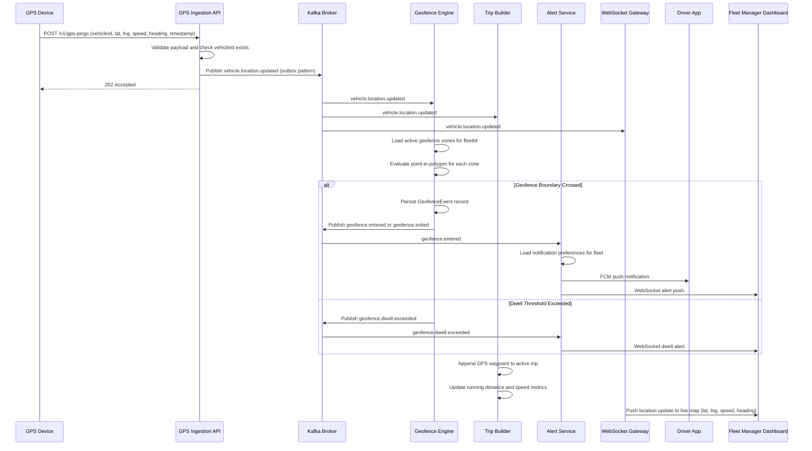
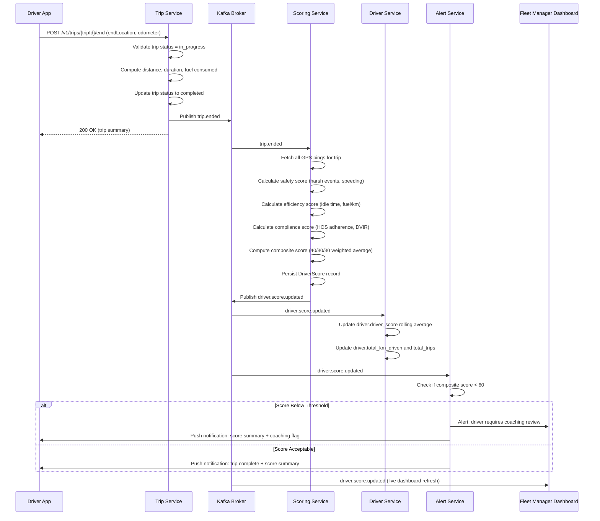

# Event Catalog — Fleet Management System

## Contract Conventions

### Event Envelope Format

All events published to Kafka conform to the following JSON envelope schema:

```json
{
  "$schema": "https://fleet-platform.io/schemas/event-envelope/v1.0.json",
  "eventId": "uuid-v4",
  "eventType": "vehicle.location.updated",
  "version": "1.0.0",
  "timestamp": "2024-11-15T14:32:01.123Z",
  "aggregateId": "3fa85f64-5717-4562-b3fc-2c963f66afa6",
  "aggregateType": "Vehicle",
  "producerService": "tracking-service",
  "correlationId": "7a1b2c3d-4e5f-6789-abcd-ef0123456789",
  "causationId": "nullable-uuid-of-command-that-caused-this-event",
  "tenantId": "company-uuid",
  "payload": {}
}
```

**Envelope Field Reference:**

| Field | Type | Required | Description |
|-------|------|----------|-------------|
| eventId | UUID v4 | Yes | Globally unique event identifier; used for idempotency |
| eventType | string | Yes | Dot-notation event name; format: `{domain}.{aggregate}.{action}` |
| version | semver | Yes | Schema version of the event payload |
| timestamp | ISO 8601 UTC | Yes | Wall-clock time when the event was produced |
| aggregateId | UUID | Yes | Primary key of the aggregate this event is about |
| aggregateType | string | Yes | Pascal-case aggregate class name (e.g., `Vehicle`, `Driver`, `Trip`) |
| producerService | string | Yes | Kebab-case service that emitted this event |
| correlationId | UUID | Yes | Request or workflow trace ID for distributed tracing |
| causationId | UUID | No | ID of the command or event that caused this event (event sourcing chain) |
| tenantId | UUID | Yes | Company ID for tenant-scoped event routing and filtering |
| payload | object | Yes | Event-specific data; schema defined per `eventType` and `version` |

---

### Versioning Strategy

Events use **semantic versioning** (MAJOR.MINOR.PATCH) for payload schemas:

- **PATCH** (1.0.0 → 1.0.1): Bug fixes to descriptions or constraint corrections; no structural change.
- **MINOR** (1.0.0 → 1.1.0): Backward-compatible additions (new optional fields added to payload).
- **MAJOR** (1.0.0 → 2.0.0): Breaking changes (field renames, type changes, required field additions, field removals). Major version bumps require a new topic and a deprecation window of minimum 90 days for the old topic.

During the deprecation window, the producer publishes to both the old and new topic. Consumers are expected to migrate before the old topic is decommissioned. A schema migration guide is published to the internal developer portal for each MAJOR bump.

---

### Topic Naming Convention

Topics follow the pattern: `{env}.{domain}.{aggregate}.{action}`

| Segment | Example Values | Notes |
|---------|---------------|-------|
| env | `prod`, `staging`, `dev` | Environment prefix; omitted in development internal tooling |
| domain | `fleet`, `tracking`, `compliance`, `billing` | Bounded context / domain name |
| aggregate | `vehicle`, `driver`, `trip`, `geofence-zone` | Kebab-case aggregate name |
| action | `location-updated`, `status-changed`, `trip-started` | Kebab-case past-tense verb phrase |

**Examples:**
- `prod.tracking.vehicle.location-updated`
- `prod.fleet.trip.started`
- `prod.compliance.hos.violation-detected`
- `prod.maintenance.vehicle.maintenance-due`

---

### Kafka Topic Configuration

| Parameter | Value | Rationale |
|-----------|-------|-----------|
| Partitioning key | `vehicleId` for vehicle events; `driverId` for driver events | Preserves per-entity ordering |
| Partitions (high-volume topics) | 24 partitions | Supports up to 24 parallel consumers per group |
| Partitions (low-volume topics) | 6 partitions | Adequate for alert and compliance topics |
| Retention (GPS / location events) | 7 days hot; downstream consumers archive to S3 | Raw location data is large-volume |
| Retention (compliance events) | 30 days | Compliance consumers have generous processing windows |
| Retention (trip lifecycle events) | 14 days | Trip scoring and billing pipelines must complete within this window |
| Replication factor | 3 | Survives one broker failure |
| `min.insync.replicas` | 2 | Ensures at-least-once delivery durability |
| Compression | `lz4` | Optimal balance of CPU and throughput for JSON payloads |
| `max.message.bytes` | 1 MB | GPS batch pings and geofence coordinate payloads may be large |

---

### Schema Registry

All event schemas are registered in the **Confluent Schema Registry** using **Avro** format. JSON Schema variants are also registered for REST-consumer compatibility.

- Schema subjects follow the pattern: `{topic-name}-value`
- Compatibility mode: **BACKWARD_TRANSITIVE** — new schema versions must be readable by consumers using any previous version of the schema.
- Schemas are co-located with their producing service in the `/schemas` directory and registered during CI/CD pipeline deployment.
- Producers serialize using the Confluent Avro wire format (magic byte + schema ID + payload).

---

### Consumer Group Naming Convention

Consumer groups follow the pattern: `{service-name}.{topic-action}.cg`

**Examples:**
- `geofence-engine.vehicle-location-updated.cg`
- `alert-service.trip-ended.cg`
- `scoring-service.trip-ended.cg`
- `billing-service.trip-ended.cg`

Each consumer group maintains its own offset, allowing independent replay and scaling. Consumer group IDs are stable across deployments (not randomly generated) to preserve offset state.

---

### Dead Letter Queue Handling

All consumer groups that perform stateful processing publish failed messages to a dedicated DLQ topic:

- DLQ topic pattern: `{original-topic}.dlq`
- A message is moved to the DLQ after **3 retry attempts** with exponential backoff (1s, 4s, 16s).
- DLQ messages include additional headers: `original-topic`, `original-partition`, `original-offset`, `failure-reason`, `failure-timestamp`, `retry-count`.
- A DLQ monitoring service alerts the on-call engineer when DLQ depth exceeds 100 messages for any consumer group.
- DLQ messages are retained for 14 days and can be replayed to the original topic after the root cause is resolved.

---

## Domain Events

The following table catalogs all domain events produced by the Fleet Management System:

| Event Name | Producer | Consumers | Payload Fields | SLO |
|------------|----------|-----------|----------------|-----|
| `vehicle.location.updated` | Tracking Service | Geofence Engine, Trip Builder, Dashboard WS, Alert Service | vehicleId, latitude, longitude, speed, heading, altitude, timestamp, accuracy, tripId | p99 < 100ms processing |
| `trip.started` | Trip Service | Driver App, Dispatcher Dashboard, Billing Service, Alert Service | tripId, vehicleId, driverId, fleetId, startTime, startLocationLat, startLocationLng, startAddress | p99 < 500ms delivery |
| `trip.ended` | Trip Service | Scoring Service, Reporting Service, Billing Service, Driver App | tripId, vehicleId, driverId, endTime, endLocationLat, endLocationLng, distanceKm, durationMinutes, fuelConsumedL | p99 < 500ms delivery |
| `geofence.entered` | Geofence Engine | Alert Service, Dispatcher Dashboard, Compliance Service | geofenceEventId, geofenceZoneId, zoneName, vehicleId, driverId, entryTime, latitude, longitude | p99 < 60s from GPS ping |
| `geofence.exited` | Geofence Engine | Alert Service, Dispatcher Dashboard, Compliance Service | geofenceEventId, geofenceZoneId, zoneName, vehicleId, driverId, exitTime, dwellMinutes, latitude, longitude | p99 < 60s from GPS ping |
| `maintenance.due` | Maintenance Service | Alert Service, Dispatcher Dashboard, Fleet Manager App | vehicleId, maintenanceType, dueDate, dueMileageKm, currentMileageKm, overdueDays, overdueKm | p99 < 24h from trigger |
| `maintenance.completed` | Maintenance Service | Vehicle Service, Reporting Service, Alert Service | maintenanceRecordId, vehicleId, completedDate, nextServiceDate, nextServiceKm, totalCostUsd, technicianName | p99 < 1h from completion |
| `fuel.recorded` | Fuel Service | Analytics Service, Reporting Service, Anomaly Detection | fuelRecordId, vehicleId, driverId, quantityL, totalCost, unitPrice, odometerKm, fuelType, locationLat, locationLng | p99 < 2s from submission |
| `driver.score.updated` | Scoring Service | Driver App, Fleet Manager Dashboard, Alert Service | driverId, previousScore, newScore, scoreDelta, tripId, safetyScore, efficiencyScore, complianceScore, computedAt | p99 < 5min from trip end |
| `incident.reported` | Incident Service | Alert Service, Compliance Service, Fleet Manager App, Insurance Integration | incidentId, vehicleId, driverId, severity, occurredAt, locationLat, locationLng, incidentType, injuriesReported, estimatedDamageCost | p99 < 1min from submission |
| `document.expiring` | Document Service | Alert Service, Fleet Manager App, Driver App | documentId, entityType, entityId, documentType, expiryDate, daysUntilExpiry, ownerEmail | Daily batch at 08:00 UTC |
| `hos.violation.detected` | HOS Service | Alert Service, Compliance Officer Portal, Dispatcher Dashboard, Driver App | driverId, violationType, hoursWorked, hoursRemaining, currentDutyStatus, detectedAt, tripId, vehicleId | p99 < 30s from detection |
| `vehicle.status.changed` | Vehicle Service | Dispatcher Dashboard, Alert Service, Trip Service, Maintenance Service | vehicleId, previousStatus, newStatus, changedAt, reason, triggeredBy | p99 < 500ms from change |
| `dvir.defect.found` | Inspection Service | Vehicle Service, Alert Service, Mechanic App, Compliance Service | dvirId, vehicleId, defects, severityLevel, inspectorId, inspectedAt, vehiclePlacedOutOfService | p99 < 1min from submission |
| `geofence.dwell.exceeded` | Geofence Engine | Alert Service, Dispatcher Dashboard | geofenceEventId, geofenceZoneId, vehicleId, driverId, entryTime, dwellThresholdMinutes, currentDwellMinutes | p99 < 2min from threshold |
| `fuel.anomaly.detected` | Anomaly Detection | Alert Service, Fleet Manager App, Fuel Card Service | fuelRecordId, vehicleId, driverId, quantityL, tankCapacityL, anomalyType, detectedAt, fuelCardId | p99 < 10s from fuel.recorded |

---

### Payload Schemas (Selected)

#### `vehicle.location.updated` v1.0.0
```json
{
  "vehicleId": "uuid",
  "latitude": -33.8688,
  "longitude": 151.2093,
  "altitude": 45.2,
  "speed": 62.5,
  "heading": 247.3,
  "accuracy": 4.1,
  "timestamp": "2024-11-15T14:32:01.000Z",
  "tripId": "uuid-or-null",
  "signalStrength": 87,
  "source": "gps"
}
```

#### `trip.ended` v1.0.0
```json
{
  "tripId": "uuid",
  "vehicleId": "uuid",
  "driverId": "uuid",
  "fleetId": "uuid",
  "endTime": "2024-11-15T18:45:00.000Z",
  "endLocationLat": -33.9205,
  "endLocationLng": 151.1907,
  "endAddress": "45 Botany Road, Waterloo NSW 2017",
  "distanceKm": 128.4,
  "durationMinutes": 97,
  "avgSpeedKmh": 79.4,
  "maxSpeedKmh": 102.0,
  "fuelConsumedL": 14.2,
  "idleTimeMinutes": 8,
  "harshBrakingEvents": 2,
  "harshAccelerationEvents": 1,
  "speedingEvents": 0
}
```

---

## Publish and Consumption Sequence

### GPS Ping → Geofence Alert Flow



---

### Trip Ended → Driver Scoring Flow



---

## Operational SLOs

### Per-Event SLO Table

| Event | Max Processing Latency (p99) | Max End-to-End Latency (p99) | Min Throughput | Availability |
|-------|-----------------------------|-----------------------------|----------------|-------------|
| `vehicle.location.updated` | 100 ms | 500 ms (to dashboard render) | 10,000 msgs/sec peak | 99.95% |
| `trip.started` | 500 ms | 1 s (to driver app notification) | 500 msgs/sec | 99.9% |
| `trip.ended` | 500 ms | 5 min (scoring pipeline complete) | 500 msgs/sec | 99.9% |
| `geofence.entered` | 60 s from GPS ping | 90 s (to alert delivery) | 200 msgs/sec | 99.9% |
| `geofence.exited` | 60 s from GPS ping | 90 s (to alert delivery) | 200 msgs/sec | 99.9% |
| `maintenance.due` | 24 h from trigger | 24 h (to alert delivery) | 50 msgs/sec | 99.5% |
| `fuel.recorded` | 2 s | 10 s (anomaly detection complete) | 200 msgs/sec | 99.9% |
| `driver.score.updated` | 5 min from trip end | 5 min | 200 msgs/sec | 99.9% |
| `incident.reported` | 1 min | 2 min (to compliance + alert) | 20 msgs/sec | 99.9% |
| `document.expiring` | Batch: 08:00 UTC daily | 30 min (batch window) | 100 msgs/sec | 99.5% |
| `hos.violation.detected` | 30 s | 60 s (to driver + dispatcher) | 50 msgs/sec | 99.95% |
| `vehicle.status.changed` | 500 ms | 1 s | 300 msgs/sec | 99.9% |
| `dvir.defect.found` | 1 min | 2 min (vehicle blocked) | 30 msgs/sec | 99.95% |
| `fuel.anomaly.detected` | 10 s from `fuel.recorded` | 30 s (card frozen) | 50 msgs/sec | 99.9% |

---

### GPS Ingestion Throughput Targets

The GPS Ingestion API and downstream `vehicle.location.updated` Kafka topic must sustain:

| Metric | Target |
|--------|--------|
| Sustained throughput | 5,000 pings/second |
| Peak burst throughput | 10,000 pings/second (15-minute bursts) |
| P50 HTTP response time | < 20 ms |
| P99 HTTP response time | < 100 ms |
| P99.9 HTTP response time | < 250 ms |
| HTTP error rate | < 0.01% under sustained load |
| Kafka publish latency (p99) | < 50 ms from HTTP receipt to broker ack |

Horizontal scaling is triggered when the ingestion API pod's CPU exceeds 70% for 2 consecutive minutes (Kubernetes HPA). The minimum replica count is 3; maximum is 20.

---

### Dashboard Real-Time Update SLOs

| Update Type | Maximum Lag | Measurement Point |
|-------------|------------|-------------------|
| Vehicle map position | 2 seconds | GPS timestamp → WebSocket frame received by browser |
| Trip status badge | 1 second | Trip event → dashboard state change |
| Driver score widget | 5 minutes | Trip end → score displayed on dashboard |
| Alert notification banner | 60 seconds | Event trigger → notification rendered |
| Geofence breach indicator | 90 seconds | GPS ping boundary crossing → zone highlight on map |

---

### Error Budget

| Service | Monthly Availability Target | Allowed Downtime / Month | Error Rate Budget |
|---------|----------------------------|--------------------------|-------------------|
| GPS Ingestion API | 99.95% | 21.9 minutes | 0.05% |
| Trip Service | 99.9% | 43.8 minutes | 0.1% |
| Geofence Engine | 99.9% | 43.8 minutes | 0.1% |
| Alert Service | 99.9% | 43.8 minutes | 0.1% |
| Scoring Service | 99.5% | 3.65 hours | 0.5% |
| Reporting Service | 99.0% | 7.3 hours | 1.0% |
| Document Service (batch) | 99.5% | 3.65 hours | 0.5% |

When 50% of a service's monthly error budget is consumed, the team is alerted and a root-cause investigation is required. When 100% is consumed, all non-critical deployments to that service are frozen until the next billing cycle or until the issue is resolved with a documented post-mortem.

---

### Monitoring and Alerting Thresholds

| Metric | Warning Threshold | Critical Threshold | Alert Channel |
|--------|------------------|-------------------|--------------|
| GPS ingestion HTTP error rate | > 0.1% over 5 min | > 1% over 2 min | PagerDuty P2 / P1 |
| GPS ingestion p99 latency | > 150 ms over 5 min | > 300 ms over 2 min | PagerDuty P2 / P1 |
| Kafka consumer lag (GPS topic) | > 5,000 messages | > 50,000 messages | PagerDuty P2 / P1 |
| Kafka consumer lag (other topics) | > 1,000 messages | > 10,000 messages | Slack #fleet-alerts / PagerDuty P2 |
| DLQ depth (any consumer group) | > 10 messages | > 100 messages | Slack #fleet-alerts / PagerDuty P2 |
| Scoring pipeline lag | > 10 min from trip end | > 30 min from trip end | Slack #fleet-alerts / PagerDuty P2 |
| Alert delivery failure rate | > 1% over 15 min | > 5% over 5 min | PagerDuty P1 |
| Schema registry unreachable | — | Any failure | PagerDuty P1 |
| Kafka broker count drops | < 3 brokers | < 2 brokers | PagerDuty P1 |

All metrics are collected via Prometheus with 15-second scrape intervals. Dashboards are hosted in Grafana. SLO burn-rate alerts use the multi-window, multi-burn-rate approach (1h + 6h windows at 14× and 6× burn rate respectively) to minimize alert fatigue while ensuring timely detection.

---

### Kafka Consumer Lag Thresholds

Consumer lag is monitored per consumer group per partition. The following action matrix applies:

| Lag Level | Action |
|-----------|--------|
| < 1,000 messages | Normal operation; no action required |
| 1,000–5,000 messages | Auto-scale consumer pods (+1 replica) |
| 5,000–50,000 messages | Auto-scale to max replicas; Slack alert to on-call team |
| > 50,000 messages | PagerDuty P1 incident; incident commander assigned; consider emergency partition increase |
| > 500,000 messages (GPS topic only) | Declare Kafka operational incident; activate runbook `kafka-gps-lag-recovery.md` |

Consumer lag is exported to Prometheus via the Kafka JMX exporter and the `kafka_consumer_group_lag` metric. Lag dashboards are available per consumer group in Grafana under the "Fleet — Kafka Operational" dashboard.
