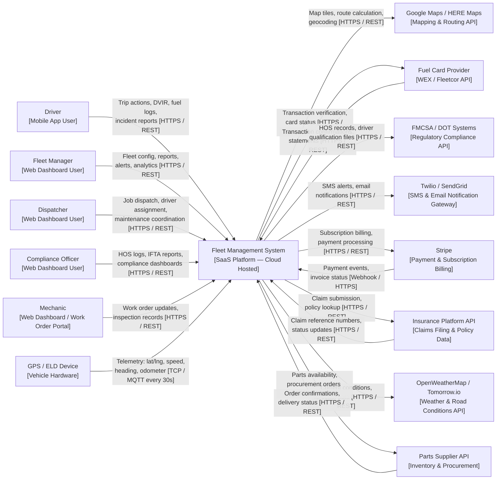

# System Context Diagram — Fleet Management System

## Overview

This document presents the system context for the Fleet Management System (FMS) — a cloud-hosted SaaS platform that centralises vehicle tracking, driver management, compliance reporting, maintenance scheduling, and fuel management for commercial fleet operators.

The context diagram identifies all external actors (human users and external systems) that interact with the FMS, the nature of each interaction, the data exchanged, the communication protocol used, and the frequency of communication.

---

## System Context Diagram

---

## Human Actors

### Driver — Mobile App User
Drivers are the primary field-facing users of the FMS. They interact with the platform through a native mobile application available on iOS and Android. The application requires an internet connection for real-time sync but supports offline caching of vehicle assignments, DVIR checklists, and pending fuel entries that sync when connectivity is restored.

**Data sent to FMS:** Trip start/end events, DVIR inspection results, fuel fill-up records, GPS location (background, while the app is active during a trip), incident reports and photo evidence, HOS duty status changes.

**Data received from FMS:** Vehicle assignment details, dispatch notifications, DVIR defect history, personal performance scores, geofence entry/exit alerts, maintenance reminders for the assigned vehicle.

**Protocol:** HTTPS REST API with JWT bearer token authentication. WebSocket for real-time push during active trips.

---

### Fleet Manager — Web Dashboard User
Fleet Managers use a web-based dashboard to oversee all fleet operations. They have the broadest permission set in the system. They access detailed analytics, configure system-wide rules, manage user accounts, and are the primary escalation point for alerts.

**Data sent to FMS:** Vehicle registration and document uploads, driver profile management, geofence zone configuration, alert rule settings, maintenance schedule thresholds, fuel card assignments.

**Data received from FMS:** Real-time fleet map view, performance analytics, cost reports, maintenance status, compliance alerts, geofence event history, driver score trends.

**Protocol:** HTTPS REST API with JWT bearer token authentication. WebSocket for live map updates and real-time alert delivery.

---

### Dispatcher — Web Dashboard User
Dispatchers manage daily operational flow. They have a narrower permission set focused on assignment management, job coordination, and real-time monitoring. They do not have access to financial reports, compliance filings, or organisation-level configuration.

**Data sent to FMS:** Driver and vehicle assignments, work order creation and routing, job status updates.

**Data received from FMS:** Live vehicle positions, driver availability status, maintenance due alerts, geofence alerts relevant to active dispatches.

---

### Compliance Officer — Web Dashboard User
Compliance Officers are responsible for regulatory adherence. They interact primarily with the compliance and reporting modules. Their access is read-heavy with write access limited to filing and annotation functions.

**Data sent to FMS:** HOS review annotations, incident severity classifications, IFTA filing confirmations, compliance notes.

**Data received from FMS:** HOS violation reports, IFTA quarterly returns, DOT inspection history, incident records, driver qualification file status.

---

### Mechanic — Work Order Portal User
Mechanics access the FMS through a simplified work order portal, accessible from both desktop and mobile browsers. They do not have access to the live tracking map or driver management modules.

**Data sent to FMS:** Work order completion details (services performed, parts used, labour hours, updated odometer), DVIR inspection outcomes, defect resolutions.

**Data received from FMS:** Assigned work orders, vehicle service history, DVIR defect reports.

---

## External System Integrations

### GPS / ELD Device
Commercial GPS trackers and FMCSA-compliant Electronic Logging Devices installed in each vehicle. Devices transmit periodic telemetry packets to the FMS ingestion endpoint.

| Attribute       | Detail |
|-----------------|--------|
| **Protocol**    | TCP socket with binary framing (device-specific protocol) or MQTT over TLS |
| **Data Sent**   | Latitude, longitude, altitude, speed (km/h), heading (degrees), ignition state, odometer reading, engine hours, fault codes (J1939/OBD-II if supported) |
| **Frequency**   | Every 30 seconds while ignition is on; every 5 minutes while ignition is off |
| **Auth**        | Device-specific pre-shared token issued at provisioning |
| **Purpose**     | Provides real-time vehicle location and telematics data that underpins live tracking, trip recording, geofence evaluation, and driver scoring |

---

### Google Maps / HERE Maps (Mapping & Routing API)

The FMS integrates with Google Maps Platform as the primary mapping provider and HERE Maps as a failover. Both are used for map tile rendering, geocoding, reverse geocoding, route calculation, and road speed limit data.

| Attribute       | Detail |
|-----------------|--------|
| **Protocol**    | HTTPS REST |
| **Data Sent**   | Coordinate pairs for geocoding; origin/destination/waypoints for routing; bounding box for tile requests |
| **Data Received**| Map tile images (PNG/WebGL), geocoded addresses, route polylines, turn-by-turn instructions, posted speed limits per road segment |
| **Frequency**   | On demand — triggered by user map interactions, new trip route calculations, and fuel station geocoding |
| **Auth**        | API Key (scoped per service) |
| **Purpose**     | Powers the live map dashboard, trip route display, geofence zone drawing, speed limit enforcement in driver scoring, and route optimisation for dispatch |

---

### WEX / Fleetcor (Fuel Card Provider API)

WEX and Fleetcor are the two most widely used commercial fleet fuel card networks. The FMS integrates with their APIs to verify fuel card transactions and import transaction statements.

| Attribute       | Detail |
|-----------------|--------|
| **Protocol**    | HTTPS REST (WEX Open API, Fleetcor Connexus API) |
| **Data Sent**   | Card number and transaction details for verification requests; date range parameters for statement imports |
| **Data Received**| Transaction authorisation status, transaction details (merchant, volume, price, timestamp), monthly card statements |
| **Frequency**   | Real-time for transaction verification; nightly batch for statement reconciliation |
| **Auth**        | OAuth 2.0 Client Credentials |
| **Purpose**     | Validates fuel card transactions at point of entry to prevent fraud, automates statement reconciliation to reduce manual data entry, and flags unauthorised purchases |

---

### FMCSA / DOT Systems (Regulatory Compliance API)

The Federal Motor Carrier Safety Administration (FMCSA) provides APIs and data exchange mechanisms for submitting driver qualification files, HOS records, and accessing safety violation histories.

| Attribute       | Detail |
|-----------------|--------|
| **Protocol**    | HTTPS REST (FMCSA Portal API) |
| **Data Sent**   | Driver licence verification requests, HOS log submissions, pre-employment screening queries |
| **Data Received**| Driver history reports (PSP), safety measurement system (SMS) data, violation records |
| **Frequency**   | On demand (driver onboarding) and quarterly (HOS compliance submissions) |
| **Auth**        | FMCSA-issued API credentials with MFA for portal access |
| **Purpose**     | Automates driver qualification verification during onboarding, supports FMCSA-compliant HOS record submission, and provides compliance officers access to regulatory safety data |

---

### Twilio / SendGrid (Notification Gateway)

All outbound SMS and email notifications from the FMS are routed through Twilio (SMS) and SendGrid (email transactional). This decouples notification delivery from the core platform and provides delivery receipts and retry logic.

| Attribute       | Detail |
|-----------------|--------|
| **Protocol**    | HTTPS REST (Twilio Messaging API, SendGrid Mail Send API) |
| **Data Sent**   | Recipient phone number or email address, message content (templated), notification type tag |
| **Data Received**| Delivery status callbacks (delivered, failed, bounced) via webhook |
| **Frequency**   | Event-driven — triggered by geofence events, maintenance alerts, incident reports, compliance warnings |
| **Auth**        | API Key (per service, rotated quarterly) |
| **Purpose**     | Delivers time-sensitive alerts (geofence breaches, SOS, maintenance overdue) to fleet managers, drivers, and dispatchers via SMS and email without dependency on app push notifications |

---

### Stripe (Payment & Subscription Billing)

Stripe manages the FMS SaaS subscription billing, including plan changes, usage-based billing for additional vehicles, and invoice generation.

| Attribute       | Detail |
|-----------------|--------|
| **Protocol**    | HTTPS REST (Stripe API); Webhooks for event callbacks |
| **Data Sent**   | Customer metadata, subscription plan changes, payment method tokens |
| **Data Received**| Invoice status, payment intent results, subscription lifecycle events (created, renewed, cancelled, past_due) via webhook |
| **Frequency**   | Monthly billing cycles; real-time webhooks for payment events |
| **Auth**        | Stripe Secret Key (server-side only, never exposed to client); webhook signature verification |
| **Purpose**     | Automates subscription lifecycle management, triggers account suspension on payment failure, and provides billing history to Fleet Managers |

---

### Insurance Platform API (Claims Filing)

The FMS integrates with fleet insurance providers via their claims API to allow Compliance Officers to submit incident claims directly from the incident record workflow.

| Attribute       | Detail |
|-----------------|--------|
| **Protocol**    | HTTPS REST |
| **Data Sent**   | Incident details (date, type, description, vehicle, driver), GPS location at time of incident, photo attachments (as signed S3 URLs), police report number |
| **Data Received**| Claim reference number, claim status updates, adjuster contact information |
| **Frequency**   | On demand, triggered by Compliance Officer action |
| **Auth**        | OAuth 2.0 with per-organisation credentials provided by the insurance carrier |
| **Purpose**     | Reduces claim filing time from days to minutes by pre-populating claim forms with FMS incident data, ensuring accuracy and completeness |

---

### Weather API (OpenWeatherMap / Tomorrow.io)

Weather data is used to provide drivers with hazard warnings, inform route optimisation decisions, and provide contextual data for incident investigations.

| Attribute       | Detail |
|-----------------|--------|
| **Protocol**    | HTTPS REST |
| **Data Sent**   | GPS coordinates or city name, forecast horizon |
| **Data Received**| Current conditions (temperature, precipitation, wind, visibility), hourly forecast, severe weather alerts |
| **Frequency**   | Every 15 minutes for active trip regions; on demand for route planning |
| **Auth**        | API Key |
| **Purpose**     | Provides in-app weather overlays on the live map, triggers weather-related alerts for drivers operating in adverse conditions, and enriches incident records with conditions at the time of the event |

---

### Parts Supplier API (Maintenance Procurement)

Integration with parts supplier APIs allows the FMS to check part availability and create purchase orders directly from within a maintenance work order, reducing the time mechanics wait for parts.

| Attribute       | Detail |
|-----------------|--------|
| **Protocol**    | HTTPS REST |
| **Data Sent**   | Part number or description, vehicle make/model/year, required quantity |
| **Data Received**| Part availability, pricing, estimated delivery date, order confirmation |
| **Frequency**   | On demand, triggered when a mechanic adds a part to a work order |
| **Auth**        | API Key with organisation-level supplier account linkage |
| **Purpose**     | Streamlines parts procurement by enabling Fleet Managers to order directly from within the FMS, tracks parts spend per vehicle, and provides estimated maintenance completion dates based on parts delivery timelines |

---

## Data Flow Summary

| Direction        | From                    | To                      | Data                              | Frequency       |
|------------------|-------------------------|-------------------------|-----------------------------------|-----------------|
| Inbound          | GPS Device              | FMS                     | Location telemetry                | Every 30s       |
| Outbound         | FMS                     | Google Maps / HERE      | Geocoding, routing requests       | On demand       |
| Bidirectional    | FMS ↔ Fuel Card API     | FMS ↔ WEX/Fleetcor      | Transaction verification          | Real-time       |
| Outbound         | FMS                     | FMCSA                   | HOS records, driver queries       | Quarterly / Ad hoc |
| Outbound         | FMS                     | Twilio / SendGrid       | SMS & email notifications         | Event-driven    |
| Bidirectional    | FMS ↔ Stripe            | FMS ↔ Stripe            | Billing, subscription events      | Monthly + webhooks |
| Bidirectional    | FMS ↔ Insurance API     | FMS ↔ Insurance API     | Claim filing, status updates      | On demand       |
| Inbound          | Weather API             | FMS                     | Forecast, severe weather alerts   | Every 15 min    |
| Bidirectional    | FMS ↔ Parts Supplier    | FMS ↔ Parts Supplier    | Parts orders, availability        | On demand       |
