# Use Case Diagram — Fleet Management System

## Overview

This document presents the complete use case model for the Fleet Management System (FMS). It identifies all system actors, their roles, responsibilities, and the use cases they participate in across eight functional domains.

---

## Actors

### Fleet Manager
The Fleet Manager is the primary administrative user of the platform. They are responsible for the overall health and performance of the fleet. Their duties include registering and decommissioning vehicles, reviewing driver performance scores, managing compliance documentation, analyzing fuel and maintenance costs, and configuring geofence alert rules. The Fleet Manager has the broadest access rights in the system and is the primary recipient of operational alerts.

### Driver
The Driver is a field-facing user who interacts with the system primarily through a mobile application. Drivers perform pre-trip and post-trip DVIR (Driver Vehicle Inspection Reports), start and end trips, log fuel fill-ups, and report incidents. Drivers can view their own performance scores and trip history but have no administrative access to other drivers' data or fleet-wide settings.

### Dispatcher
The Dispatcher coordinates daily fleet operations. They assign drivers to vehicles, create and manage dispatch jobs, monitor live vehicle positions on the map, and escalate issues to the Fleet Manager. Dispatchers interact closely with maintenance scheduling — they receive maintenance due alerts and assign work orders to service providers. They do not have access to compliance reporting or financial data.

### Mechanic
The Mechanic is responsible for executing vehicle maintenance. They receive work orders, perform the physical service, record parts and labour, update odometer readings, and mark work orders as complete. Mechanics may also conduct scheduled inspections and upload inspection reports.

### Compliance Officer
The Compliance Officer ensures the fleet adheres to regulatory requirements including FMCSA Hours of Service (HOS) rules, International Fuel Tax Agreement (IFTA) filings, and DOT inspection compliance. They generate quarterly IFTA reports, review HOS logs for violations, and manage incident reports that may require insurance filings or regulatory submission.

### System (Automated)
The System actor represents the FMS platform's automated background processes. These include the real-time GPS location ingestion pipeline, geofence event evaluation, driver score calculation engine, maintenance threshold monitoring, and scheduled report generation. The System actor initiates use cases without human input based on scheduled triggers, incoming telemetry, or threshold breaches.

### GPS Device
The GPS Device actor represents the hardware installed in each vehicle — either a dedicated GPS tracker or a compliant ELD (Electronic Logging Device). It transmits location coordinates (latitude, longitude, heading, speed) at a configurable interval (default 30 seconds) via cellular or satellite link. The GPS Device is a passive actor that feeds data into the system but does not receive commands in the standard flow.

### External Integrations
External Integrations represent third-party systems that the FMS interacts with: mapping APIs (Google Maps, HERE Maps), fuel card networks (WEX, Fleetcor), notification gateways (Twilio, SendGrid), payment processors (Stripe), weather APIs, and parts supplier APIs. These actors send and receive data based on API calls initiated by the FMS.

---

## Use Case Diagram

```mermaid
graph TD
    FleetManager(["Fleet Manager"])
    Driver(["Driver"])
    Dispatcher(["Dispatcher"])
    Mechanic(["Mechanic"])
    ComplianceOfficer(["Compliance Officer"])
    System(["System"])
    GPSDevice(["GPS Device"])
    ExternalIntegrations(["External Integrations"])

    subgraph VehicleManagement["Vehicle Management"]
        UC_RV["Register Vehicle"]
        UC_TV["Track Vehicle"]
        UC_VVH["View Vehicle History"]
        UC_MVD["Manage Vehicle Documents"]
        UC_UVS["Update Vehicle Status"]
    end

    subgraph DriverManagement["Driver Management"]
        UC_CDP["Create Driver Profile"]
        UC_ADV["Assign Driver to Vehicle"]
        UC_VDS["View Driver Score"]
        UC_MDD["Manage Driver Documents"]
        UC_SD["Suspend Driver"]
    end

    subgraph TripManagement["Trip Management"]
        UC_ST["Start Trip"]
        UC_RW["Record Waypoints"]
        UC_ET["End Trip"]
        UC_RT["Replay Trip"]
        UC_VTH["View Trip History"]
    end

    subgraph Maintenance["Maintenance"]
        UC_SM["Schedule Maintenance"]
        UC_CWO["Create Work Order"]
        UC_CDV["Complete DVIR Inspection"]
        UC_MMC["Mark Maintenance Complete"]
    end

    subgraph Fuel["Fuel Management"]
        UC_LFR["Log Fuel Record"]
        UC_MFC["Manage Fuel Cards"]
        UC_VFA["View Fuel Analytics"]
    end

    subgraph Geofencing["Geofencing"]
        UC_CGZ["Create Geofence Zone"]
        UC_VGA["View Geofence Alerts"]
        UC_MAR["Manage Alert Rules"]
    end

    subgraph Compliance["Compliance"]
        UC_GIR["Generate IFTA Report"]
        UC_LHS["Log HOS"]
        UC_VCD["View Compliance Dashboard"]
    end

    subgraph Incidents["Incidents"]
        UC_RI["Report Incident"]
        UC_UP["Upload Photos"]
        UC_FIC["File Insurance Claim"]
    end

    %% Fleet Manager interactions
    FleetManager --> UC_RV
    FleetManager --> UC_TV
    FleetManager --> UC_VVH
    FleetManager --> UC_MVD
    FleetManager --> UC_UVS
    FleetManager --> UC_CDP
    FleetManager --> UC_ADV
    FleetManager --> UC_VDS
    FleetManager --> UC_MDD
    FleetManager --> UC_SD
    FleetManager --> UC_VTH
    FleetManager --> UC_SM
    FleetManager --> UC_VFA
    FleetManager --> UC_MFC
    FleetManager --> UC_CGZ
    FleetManager --> UC_MAR
    FleetManager --> UC_VGA
    FleetManager --> UC_VCD
    FleetManager --> UC_GIR

    %% Driver interactions
    Driver --> UC_CDV
    Driver --> UC_ST
    Driver --> UC_ET
    Driver --> UC_LFR
    Driver --> UC_RI
    Driver --> UC_UP
    Driver --> UC_VDS
    Driver --> UC_LHS

    %% Dispatcher interactions
    Dispatcher --> UC_ADV
    Dispatcher --> UC_TV
    Dispatcher --> UC_SM
    Dispatcher --> UC_CWO
    Dispatcher --> UC_VGA

    %% Mechanic interactions
    Mechanic --> UC_CWO
    Mechanic --> UC_MMC
    Mechanic --> UC_CDV

    %% Compliance Officer interactions
    ComplianceOfficer --> UC_GIR
    ComplianceOfficer --> UC_VCD
    ComplianceOfficer --> UC_LHS
    ComplianceOfficer --> UC_FIC
    ComplianceOfficer --> UC_RI

    %% System automated interactions
    System --> UC_TV
    System --> UC_RW
    System --> UC_VGA
    System --> UC_SM
    System --> UC_VDS
    System --> UC_GIR

    %% GPS Device interactions
    GPSDevice --> UC_TV
    GPSDevice --> UC_RW

    %% External Integration interactions
    ExternalIntegrations --> UC_MFC
    ExternalIntegrations --> UC_FIC
    ExternalIntegrations --> UC_GIR
```

---

## Actor–Use Case Responsibility Matrix

| Use Case                  | Fleet Manager | Driver | Dispatcher | Mechanic | Compliance Officer | System | GPS Device |
|---------------------------|:---:|:---:|:---:|:---:|:---:|:---:|:---:|
| Register Vehicle          | ✓   |     |            |          |                    |        |            |
| Track Vehicle             | ✓   |     | ✓          |          |                    | ✓      | ✓          |
| View Vehicle History      | ✓   |     |            |          |                    |        |            |
| Manage Vehicle Documents  | ✓   |     |            |          |                    |        |            |
| Update Vehicle Status     | ✓   |     |            | ✓        |                    | ✓      |            |
| Create Driver Profile     | ✓   |     |            |          |                    |        |            |
| Assign Driver to Vehicle  | ✓   |     | ✓          |          |                    |        |            |
| View Driver Score         | ✓   | ✓   |            |          |                    |        |            |
| Manage Driver Documents   | ✓   |     |            |          |                    |        |            |
| Suspend Driver            | ✓   |     |            |          |                    |        |            |
| Start Trip                |     | ✓   |            |          |                    |        |            |
| Record Waypoints          |     |     |            |          |                    | ✓      | ✓          |
| End Trip                  |     | ✓   |            |          |                    |        |            |
| Replay Trip               | ✓   | ✓   | ✓          |          |                    |        |            |
| View Trip History         | ✓   | ✓   | ✓          |          |                    |        |            |
| Schedule Maintenance      | ✓   |     | ✓          |          |                    | ✓      |            |
| Create Work Order         |     |     | ✓          | ✓        |                    |        |            |
| Complete DVIR Inspection  |     | ✓   |            | ✓        |                    |        |            |
| Mark Maintenance Complete |     |     |            | ✓        |                    |        |            |
| Log Fuel Record           | ✓   | ✓   |            |          |                    |        |            |
| Manage Fuel Cards         | ✓   |     |            |          |                    |        |            |
| View Fuel Analytics       | ✓   |     |            |          |                    |        |            |
| Create Geofence Zone      | ✓   |     |            |          |                    |        |            |
| View Geofence Alerts      | ✓   |     | ✓          |          |                    | ✓      |            |
| Manage Alert Rules        | ✓   |     |            |          |                    |        |            |
| Generate IFTA Report      | ✓   |     |            |          | ✓                  | ✓      |            |
| Log HOS                   |     | ✓   |            |          | ✓                  |        |            |
| View Compliance Dashboard | ✓   |     |            |          | ✓                  |        |            |
| Report Incident           |     | ✓   |            |          | ✓                  |        |            |
| Upload Photos             |     | ✓   |            |          |                    |        |            |
| File Insurance Claim      |     |     |            |          | ✓                  |        |            |

---

## Domain Descriptions

### Vehicle Management
Covers the full lifecycle of a vehicle in the fleet from initial registration through decommissioning. A vehicle record holds the VIN, make, model, year, licence plate, insurance policy number, registration expiry, and odometer reading. Documents such as insurance certificates, registration papers, and safety inspection reports are stored and linked to the vehicle. The system automatically flags documents approaching their expiry date.

### Driver Management
Manages driver onboarding, licence and certification tracking, performance monitoring, and offboarding. Each driver profile stores licence class, expiry dates, medical certificate status, and a running performance score derived from trip telemetry. Suspension prevents a driver from being assigned to any vehicle and triggers an alert to the Fleet Manager.

### Trip Management
Records every journey from ignition-on to ignition-off. Trips capture a sequence of GPS waypoints, speed samples, idle periods, and engine diagnostics. After a trip ends, the system calculates total distance, fuel consumed, driving time, and the driver performance score for that trip.

### Maintenance
Proactively manages vehicle servicing using both mileage and time-based thresholds configured per vehicle class. DVIR inspections before and after each trip feed into the maintenance workflow — any defect flagged in a DVIR automatically creates a maintenance work order.

### Fuel Management
Tracks every fuel fill-up event, linking it to a driver, vehicle, fuel card transaction, and GPS location. The analytics module calculates miles-per-gallon, flags anomalous consumption, and supports reconciliation against fuel card statements.

### Geofencing
Allows Fleet Managers to define geographic zones (polygons or circles) representing customer sites, depots, restricted areas, or service boundaries. The system evaluates each incoming GPS ping against all active geofence rules and fires enter/exit events in real time, optionally sending push notifications, emails, or SMS messages.

### Compliance
Covers regulatory obligations including FMCSA HOS rules and IFTA quarterly fuel tax reporting. The system aggregates trip mileage by state/province jurisdiction and pairs it with fuel consumption data to produce IFTA tax calculations ready for filing.

### Incidents
Provides a structured workflow for capturing, escalating, and resolving incidents including collisions, cargo damage, roadside breakdowns, and near-miss events. Photo evidence is stored with the incident record, and the workflow routes serious incidents to the Compliance Officer for insurance filing.
