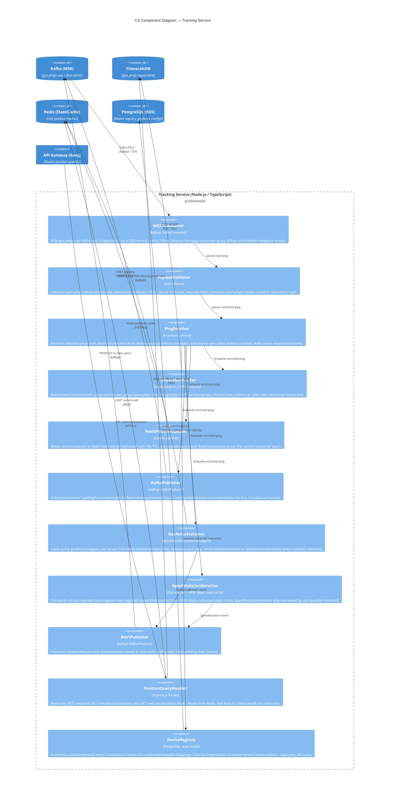
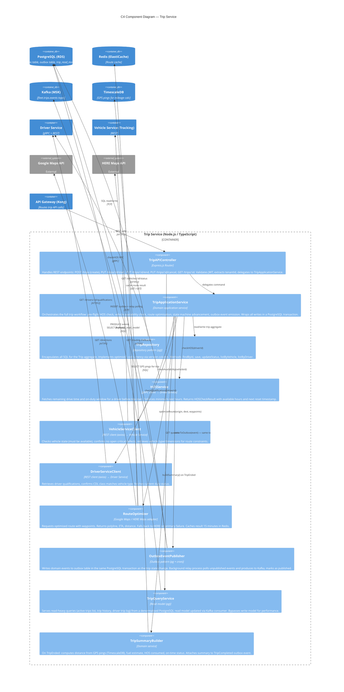

# C4 Component Diagrams

## Overview

This document provides drill-down C4 Level 3 component diagrams for the two most architecturally significant services: the **Tracking Service**, which is the highest-throughput service in the system, and the **Trip Service**, which orchestrates the core business workflow. For each service, the diagram shows internal components, their relationships, and how they interact with stores and external containers. Interface contracts and applied design patterns are documented at the end to give implementors a precise implementation target.

The Tracking Service must sustain ingest rates of up to 50,000 GPS pings per second during peak hours across all tenants. The Trip Service is the primary orchestrator, coordinating Vehicle Service, Driver Service, and external mapping providers in a single transactional workflow. Both services are designed so that their read path (queries) and write path (commands) are independently scalable — a principle formalised by the CQRS pattern applied throughout.

---

## C4 Component Diagram — Tracking Service

The Tracking Service is a headless consumer service. It has no REST endpoints exposed to the API Gateway for writes; all data enters via the Kafka topic `gps.pings.raw` bridged from AWS IoT Core. It exposes a read-only REST API for live position queries, consumed by the Web Application and Mobile App via the API Gateway.

---

## C4 Component Diagram — Trip Service

The Trip Service exposes a REST API and orchestrates cross-service workflows. It uses the Outbox Pattern to guarantee that state changes and Kafka events are published atomically even if the broker is temporarily unavailable.

---

## Component Interface Contracts

| Component | Interface | Method Signature | Contract |
|---|---|---|---|
| `PayloadValidator` | Synchronous validate | `validate(raw: unknown): Result<ValidatedPing, ValidationError>` | Returns `Ok(ValidatedPing)` if all fields pass; `Err(ValidationError)` with field-level error details if any field fails. Never throws. |
| `GeofenceEvaluator` | Synchronous evaluate | `evaluate(ping: EnrichedPing, fences: Geofence[]): GeofenceEvent[]` | Returns an array of `GeofenceEntered` or `GeofenceExited` events; empty array if no transition detected. Pure function; no side effects. |
| `RedisPositionUpdater` | Async write | `updatePosition(ping: EnrichedPing): Promise<void>` | Writes to Redis; silently logs and continues on Redis error (position cache is best-effort). Must complete within 50ms p99. |
| `TripRepository` | Async CRUD | `save(trip: Trip): Promise<Trip>` | Persists trip aggregate; throws `ConcurrencyError` if `version` mismatch detected. Caller must retry with fresh load. |
| `HOSService` | Async gRPC | `checkHOS(driverId: string): Promise<HOSCheckResult>` | Returns `{ availableDriveHours, availableOnDutyHours, nextResetAt }`. Throws `HOSInsufficientError` if less than 1 hour of drive time remains. |
| `RouteOptimizer` | Async optimise | `optimiseRoute(req: RouteRequest): Promise<OptimisedRoute>` | Returns route with `polyline`, `distanceMetres`, `durationSeconds`, `waypoints`. Throws `RoutingServiceUnavailableError` only if both Google Maps and HERE Maps fail after retries. |
| `OutboxEventPublisher` | Async write | `publish(event: DomainEvent, tx: DbTransaction): Promise<void>` | Writes event to `outbox` table within provided transaction. Does NOT produce to Kafka directly; relay process handles Kafka produce asynchronously. Idempotency guaranteed via `event.id` unique constraint. |
| `TripSummaryBuilder` | Async build | `buildSummary(tripId: string, startedAt: Date, endedAt: Date): Promise<TripSummary>` | Queries TimescaleDB for GPS pings in window; computes Haversine distance sum, max speed, average speed. Returns summary struct. Best-effort: returns partial summary if GPS data is missing. |
| `AlertPublisher` | Async publish | `publishAlert(event: AlertEvent): Promise<void>` | Produces to `fleet.alerts` with vehicle's `tenantId` as partition key for ordered delivery per tenant. At-least-once delivery guaranteed; consumers must be idempotent. |
| `PositionQueryHandler` | REST GET | `GET /vehicles/:id/position → PositionResponse` | Returns position from Redis within 10ms p95. Falls back to TimescaleDB (last known position) if Redis cache miss; indicates staleness via `cacheHit: false` flag. Returns 404 if vehicle unknown. |

---

## Design Patterns Used

### Repository Pattern

All database access in every service is encapsulated behind a typed Repository interface. Application services depend on the interface, not the concrete implementation. This enables unit testing with in-memory fakes and allows the underlying database or query strategy to change without touching business logic. Example: `TripRepository` hides all SQL including hypertable joins and the optimistic concurrency `WHERE version = $n` clause.

### CQRS — Command Query Responsibility Segregation

The Tracking Service and Trip Service separate their write path (commands: ingest ping, start trip, end trip) from their read path (queries: get live position, list active trips). Write handlers advance state and emit events; query handlers read from denormalised read models (Redis, PostgreSQL `trip_read_model` table, or TimescaleDB continuous aggregates). This segregation allows the live map endpoint to serve sub-10ms responses from Redis while the write path handles complex validation without impacting read performance.

### Outbox Pattern

The Trip Service must guarantee that when a trip state change is persisted to PostgreSQL, the corresponding Kafka event (e.g., `TripStarted`) is also published — even if the Kafka broker is temporarily unavailable. The Outbox Pattern achieves this by writing the event to an `outbox` table in the same PostgreSQL transaction as the state change. A lightweight relay process polls the `outbox` table for unpublished events and produces them to Kafka, marking them published on success. This eliminates the dual-write problem and ensures exactly-once state transitions with at-least-once event delivery.

### Circuit Breaker — External GPS Device / Mapping Calls

The `RouteOptimizer` and any outbound HTTP call to third-party APIs (Google Maps, HERE Maps, FMCSA) are wrapped in a circuit breaker using the `opossum` library. When the failure rate exceeds the configured threshold (5 failures per 30-second window), the circuit OPENS and subsequent calls return a cached fallback immediately without attempting the network call. This prevents a degraded mapping provider from cascading into trip creation failures and exhausting HTTP connection pool threads.

| Pattern | Applied In | Problem Solved |
|---|---|---|
| Repository | All services (TripRepository, DriverRepository, etc.) | Decouples business logic from SQL; enables unit testing with fakes |
| CQRS | Tracking Service, Trip Service | Separates high-throughput read path from write path; independent scaling |
| Outbox | Trip Service, Driver Service | Guarantees atomic state change + event publish; eliminates dual-write problem |
| Circuit Breaker | RouteOptimizer, ELDRegistrySync, all external HTTP clients | Prevents cascading failures from external API degradation |
| Consumer Group | All Kafka consumers | Allows multiple services to independently consume the same events |
| Dead Letter Queue | PayloadValidator, NotificationService | Isolates poison-pill messages; enables manual replay without blocking main pipeline |
