# Class Diagram — Fleet Management System

## Overview

This document describes the full domain model for the Fleet Management System. The class diagram covers all major entities across vehicle tracking, driver management, trips, maintenance, compliance, geofencing, fuel management, alerting, and reporting.

---

## Enumerations

```mermaid
classDiagram
    class VehicleStatus {
        <<enumeration>>
        ACTIVE
        INACTIVE
        IN_MAINTENANCE
        DECOMMISSIONED
        OUT_OF_SERVICE
    }

    class VehicleType {
        <<enumeration>>
        TRUCK
        VAN
        CAR
        MOTORCYCLE
        TRAILER
        HEAVY_EQUIPMENT
    }

    class FuelType {
        <<enumeration>>
        GASOLINE
        DIESEL
        ELECTRIC
        HYBRID
        CNG
        LNG
    }

    class DriverStatus {
        <<enumeration>>
        ACTIVE
        INACTIVE
        SUSPENDED
        ON_LEAVE
    }

    class HOSDutyStatus {
        <<enumeration>>
        OFF_DUTY
        SLEEPER_BERTH
        DRIVING
        ON_DUTY_NOT_DRIVING
    }

    class TripStatus {
        <<enumeration>>
        PLANNED
        IN_PROGRESS
        COMPLETED
        CANCELLED
    }

    class WorkOrderStatus {
        <<enumeration>>
        OPEN
        IN_PROGRESS
        AWAITING_PARTS
        COMPLETED
        CANCELLED
    }

    class DVIRStatus {
        <<enumeration>>
        DRAFT
        SUBMITTED
        REVIEWED
        DEFECT_FOUND
        CLEARED
    }

    class GeofenceType {
        <<enumeration>>
        CIRCLE
        POLYGON
        CORRIDOR
    }

    class AlertSeverity {
        <<enumeration>>
        INFO
        WARNING
        CRITICAL
    }

    class MaintenanceType {
        <<enumeration>>
        PREVENTIVE
        CORRECTIVE
        INSPECTION
        RECALL
    }
```

---

## Core Domain Classes

```mermaid
classDiagram
    %% ─────────────────────────────────────────
    %% Vehicle Aggregate
    %% ─────────────────────────────────────────
    class Vehicle {
        +UUID id
        +String vin
        +String make
        +String model
        +int year
        +String licensePlate
        +FuelType fuelType
        +VehicleType vehicleType
        +VehicleStatus status
        +float odometerMiles
        +float engineHours
        +float maxPayloadLbs
        +Date insuranceExpiry
        +Date registrationExpiry
        +UUID assignedDriverId
        +UUID fleetGroupId
        +Date createdAt
        +Date updatedAt
        +assignDriver(driverId UUID) void
        +updateOdometer(miles float) void
        +scheduleMaintenance(type MaintenanceType) MaintenanceSchedule
        +getActiveTrip() Trip
        +getLastKnownPosition() GpsPing
    }

    class FleetGroup {
        +UUID id
        +String name
        +String description
        +UUID parentGroupId
        +UUID managerId
        +Date createdAt
        +addVehicle(vehicleId UUID) void
        +removeVehicle(vehicleId UUID) void
        +getVehicles() Vehicle[]
        +getNestedGroups() FleetGroup[]
    }

    %% ─────────────────────────────────────────
    %% Driver Aggregate
    %% ─────────────────────────────────────────
    class Driver {
        +UUID id
        +String employeeId
        +String firstName
        +String lastName
        +String licenseNumber
        +String licenseClass
        +Date licenseExpiry
        +HOSDutyStatus hosStatus
        +float availableHours
        +float driverScore
        +String mobileDeviceId
        +DriverStatus status
        +String phoneNumber
        +String email
        +Date hireDate
        +Date createdAt
        +startTrip(tripId UUID) void
        +endTrip(tripId UUID) void
        +submitDVIR(dvir DVIR) DVIRStatus
        +logHOSStatus(status HOSDutyStatus) HosLog
        +getAvailableHours() float
        +updateScore(event DriverScoreEvent) void
    }

    %% ─────────────────────────────────────────
    %% GPS Telemetry (Time-Series)
    %% ─────────────────────────────────────────
    class GpsPing {
        +UUID id
        +UUID vehicleId
        +float latitude
        +float longitude
        +float speed
        +float heading
        +float altitude
        +float accuracy
        +Date timestamp
        +boolean engineOn
        +float odometer
        +float fuelLevel
        +float engineTemp
        +float batteryVoltage
        +int satelliteCount
        +String rawPayload
        +isValid() boolean
        +distanceTo(other GpsPing) float
    }

    %% ─────────────────────────────────────────
    %% Trip Aggregate
    %% ─────────────────────────────────────────
    class Trip {
        +UUID id
        +UUID vehicleId
        +UUID driverId
        +UUID routeId
        +TripStatus status
        +float startOdometer
        +float endOdometer
        +Date scheduledStart
        +Date scheduledEnd
        +Date actualStart
        +Date actualEnd
        +float distanceMiles
        +float fuelUsedGallons
        +String originAddress
        +String destinationAddress
        +float originLat
        +float originLng
        +float destLat
        +float destLng
        +Date createdAt
        +start() void
        +end() void
        +calculateDistance() float
        +calculateFuelConsumption() float
        +generateTripReport() TripReport
        +addWaypoint(waypoint Waypoint) void
    }

    class Route {
        +UUID id
        +String name
        +String description
        +float totalDistanceMiles
        +int estimatedDurationMin
        +boolean isOptimized
        +Date createdAt
        +addWaypoint(waypoint Waypoint) void
        +optimize() Route
        +getPolyline() String
    }

    class Waypoint {
        +UUID id
        +UUID routeId
        +int sequence
        +float latitude
        +float longitude
        +String address
        +int stopDurationMin
        +String notes
        +boolean isVisited
        +Date arrivedAt
        +Date departedAt
    }

    %% ─────────────────────────────────────────
    %% Geofencing
    %% ─────────────────────────────────────────
    class Geofence {
        +UUID id
        +String name
        +String description
        +GeofenceType type
        +float centerLat
        +float centerLng
        +float radiusMeters
        +JSON polygonCoordinates
        +float speedLimitMph
        +boolean isActive
        +UUID fleetGroupId
        +Date createdAt
        +contains(lat float, lng float) boolean
        +checkVehicleEntry(ping GpsPing) boolean
        +evaluate(ping GpsPing) GeofenceEvent
        +getAlertRules() AlertRule[]
    }

    class GeofenceEvent {
        +UUID id
        +UUID geofenceId
        +UUID vehicleId
        +UUID driverId
        +String eventType
        +float latitude
        +float longitude
        +float speed
        +Date occurredAt
        +boolean acknowledged
        +UUID acknowledgedBy
        +Date acknowledgedAt
    }

    %% ─────────────────────────────────────────
    %% Maintenance Aggregate
    %% ─────────────────────────────────────────
    class MaintenanceRecord {
        +UUID id
        +UUID vehicleId
        +UUID workOrderId
        +MaintenanceType maintenanceType
        +String description
        +float odometerAtService
        +float engineHoursAtService
        +Date serviceDate
        +float laborHours
        +float totalCost
        +String technicianName
        +String shopName
        +String notes
        +Part[] parts
        +addPart(part Part) void
        +calculateTotalCost() float
    }

    class MaintenanceSchedule {
        +UUID id
        +UUID vehicleId
        +MaintenanceType maintenanceType
        +String serviceDescription
        +float intervalMiles
        +int intervalDays
        +float lastServiceOdometer
        +Date lastServiceDate
        +float nextServiceOdometer
        +Date nextServiceDue
        +boolean isPredictive
        +float confidenceScore
        +isOverdue() boolean
        +daysUntilDue() int
        +milesUntilDue() float
    }

    class Part {
        +UUID id
        +String partNumber
        +String name
        +int quantity
        +float unitCost
        +String supplier
        +String warrantyMonths
    }

    class WorkOrder {
        +UUID id
        +UUID vehicleId
        +UUID assignedMechanicId
        +UUID maintenanceScheduleId
        +WorkOrderStatus status
        +String title
        +String description
        +MaintenanceType maintenanceType
        +int priorityLevel
        +Date scheduledDate
        +Date completedDate
        +float estimatedCost
        +float actualCost
        +String notes
        +Date createdAt
        +assign(mechanicId UUID) void
        +complete(report ServiceReport) void
        +addPart(part Part) void
        +cancel(reason String) void
    }

    %% ─────────────────────────────────────────
    %% DVIR (Driver Vehicle Inspection Report)
    %% ─────────────────────────────────────────
    class DVIR {
        +UUID id
        +UUID vehicleId
        +UUID driverId
        +DVIRStatus status
        +String inspectionType
        +Date inspectionDate
        +float odometerReading
        +boolean defectsFound
        +String driverSignature
        +Date signedAt
        +UUID certifiedBy
        +Date certifiedAt
        +String remarks
        +DVIRDefect[] defects
        +addDefect(defect DVIRDefect) void
        +submit() DVIRStatus
        +review(mechanicId UUID) void
        +certify(certifierId UUID) void
        +isPreTrip() boolean
        +isPostTrip() boolean
    }

    class DVIRDefect {
        +UUID id
        +UUID dvirId
        +String componentArea
        +String defectDescription
        +String severity
        +boolean needsImmediateAttention
        +String correctiveAction
        +boolean isResolved
        +UUID resolvedBy
        +Date resolvedAt
        +String photoUrl
    }

    %% ─────────────────────────────────────────
    %% Fuel Management
    %% ─────────────────────────────────────────
    class FuelRecord {
        +UUID id
        +UUID vehicleId
        +UUID driverId
        +float gallons
        +float pricePerGallon
        +float totalCost
        +float odometerReading
        +String stationName
        +String stateCode
        +float latitude
        +float longitude
        +Date filledAt
        +String receiptUrl
        +boolean isVerified
        +computeMpg(previousOdometer float) float
    }

    %% ─────────────────────────────────────────
    %% HOS (Hours of Service)
    %% ─────────────────────────────────────────
    class HosLog {
        +UUID id
        +UUID driverId
        +UUID vehicleId
        +HOSDutyStatus status
        +Date startTime
        +Date endTime
        +float durationHours
        +float latitude
        +float longitude
        +String remarks
        +String eldSource
        +boolean isEdited
        +String editReason
        +getDuration() float
        +isCompliant() boolean
    }

    class HosCycle {
        +UUID id
        +UUID driverId
        +Date cycleStartDate
        +float drivingHours70Day
        +float onDutyHours70Day
        +float drivingHoursToday
        +float onDutyHoursToday
        +float drivingHoursThisWeek
        +int consecutiveDaysWorked
        +Date lastRestartDate
        +getRemainingDrivingHours() float
        +getRemainingOnDutyHours() float
        +requiresRestart() boolean
        +getViolations() HOSViolation[]
    }

    class HOSViolation {
        +UUID id
        +UUID driverId
        +UUID cycleId
        +String violationType
        +Date occurredAt
        +float excessHours
        +boolean isReported
        +String regulationCode
    }

    %% ─────────────────────────────────────────
    %% Driver Scoring
    %% ─────────────────────────────────────────
    class DriverScore {
        +UUID id
        +UUID driverId
        +float overallScore
        +float speedingScore
        +float harshBrakingScore
        +float harshAccelerationScore
        +float idlingScore
        +float seatbeltScore
        +float phoneUseScore
        +Date periodStart
        +Date periodEnd
        +int totalEvents
        +float totalMiles
        +recalculate() void
        +getTrend() String
    }

    class DriverScoreEvent {
        +UUID id
        +UUID driverId
        +UUID tripId
        +String eventType
        +float severity
        +float latitude
        +float longitude
        +float speed
        +float speedLimit
        +Date occurredAt
        +int durationSeconds
        +float scoreImpact
    }

    %% ─────────────────────────────────────────
    %% Alerting
    %% ─────────────────────────────────────────
    class AlertRule {
        +UUID id
        +String name
        +String description
        +String triggerType
        +JSON conditionExpression
        +AlertSeverity severity
        +String[] notificationChannels
        +UUID[] recipientIds
        +boolean isActive
        +UUID fleetGroupId
        +evaluate(context JSON) boolean
        +getRecipients() User[]
    }

    class Alert {
        +UUID id
        +UUID alertRuleId
        +UUID vehicleId
        +UUID driverId
        +AlertSeverity severity
        +String title
        +String message
        +JSON metadata
        +boolean isAcknowledged
        +UUID acknowledgedBy
        +Date acknowledgedAt
        +Date createdAt
        +Date resolvedAt
        +acknowledge(userId UUID) void
        +resolve() void
        +escalate() void
    }

    %% ─────────────────────────────────────────
    %% IFTA Compliance
    %% ─────────────────────────────────────────
    class IftaReport {
        +UUID id
        +UUID fleetGroupId
        +int quarterYear
        +int quarter
        +Date generatedAt
        +UUID generatedBy
        +float totalMiles
        +float totalGallons
        +float totalTaxOwed
        +String pdfUrl
        +String status
        +IftaJurisdiction[] jurisdictions
        +generate() void
        +exportPdf() String
        +submit() void
    }

    class IftaJurisdiction {
        +UUID id
        +UUID reportId
        +String stateCode
        +String stateName
        +float taxableMiles
        +float taxPaidGallons
        +float taxableGallons
        +float taxRate
        +float taxOwed
        +float taxCredit
        +float netTax
    }

    %% ─────────────────────────────────────────
    %% Relationships
    %% ─────────────────────────────────────────

    Vehicle "1" --> "0..1" Driver : assignedTo
    Vehicle "1" --> "1" FleetGroup : belongsTo
    Vehicle "1" --> "*" GpsPing : generates
    Vehicle "1" --> "*" Trip : completedIn
    Vehicle "1" --> "*" MaintenanceRecord : serviceHistory
    Vehicle "1" --> "*" MaintenanceSchedule : schedules
    Vehicle "1" --> "*" FuelRecord : fuelHistory
    Vehicle "1" --> "*" DVIR : inspections
    Vehicle "1" --> "*" WorkOrder : workOrders

    Driver "1" --> "*" Trip : drives
    Driver "1" --> "*" HosLog : hosLogs
    Driver "1" --> "1" HosCycle : currentCycle
    Driver "1" --> "*" DriverScoreEvent : scoreEvents
    Driver "1" --> "1" DriverScore : score
    Driver "1" --> "*" DVIR : submits

    Trip "1" --> "1" Route : follows
    Trip "1" --> "*" FuelRecord : fuelStops
    Route "1" --> "*" Waypoint : waypoints

    MaintenanceRecord "*" --> "*" Part : uses
    WorkOrder "1" --> "1" MaintenanceRecord : generates

    DVIR "1" --> "*" DVIRDefect : defects

    HosCycle "1" --> "*" HosLog : logs
    HosCycle "1" --> "*" HOSViolation : violations

    DriverScore "1" --> "*" DriverScoreEvent : events

    Geofence "1" --> "*" GeofenceEvent : triggers
    Geofence "1" --> "*" AlertRule : rules

    AlertRule "1" --> "*" Alert : generates

    IftaReport "1" --> "*" IftaJurisdiction : breakdown

    FleetGroup "1" --> "*" Vehicle : contains
    FleetGroup "0..1" --> "*" FleetGroup : subGroups
```

---

## Class Responsibility Summary

| Class | Responsibility |
|---|---|
| `Vehicle` | Core asset entity; tracks registration, fuel type, odometer, and assignment |
| `FleetGroup` | Hierarchical grouping of vehicles for organization and policy enforcement |
| `Driver` | Operator profile including license, HOS status, and performance score |
| `GpsPing` | Immutable time-series telemetry record written to TimescaleDB hypertable |
| `Trip` | Lifecycle of a single vehicle dispatch from origin to destination |
| `Route` | Pre-planned path composed of ordered waypoints |
| `Waypoint` | Individual stop on a route with arrival/departure tracking |
| `Geofence` | Spatial boundary (circle, polygon, corridor) with PostGIS geometry |
| `GeofenceEvent` | Recorded entry/exit of a vehicle crossing a geofence boundary |
| `MaintenanceRecord` | Historical service entry with parts, labor, and cost |
| `MaintenanceSchedule` | Interval-based or predictive schedule for upcoming services |
| `WorkOrder` | Structured task for a mechanic to perform maintenance |
| `Part` | Individual part used in a maintenance record |
| `DVIR` | DOT-compliant pre/post-trip vehicle inspection form |
| `DVIRDefect` | Specific defect found during inspection with resolution tracking |
| `FuelRecord` | Per-fill-up fuel purchase with location for IFTA reporting |
| `HosLog` | Individual duty status segment per federal ELD mandate |
| `HosCycle` | Rolling 70-hour/8-day window aggregation per driver |
| `HOSViolation` | Regulatory breach detected in a driver's HOS logs |
| `DriverScore` | Aggregated safety score per driver per period |
| `DriverScoreEvent` | Individual scored driving event (speeding, harsh braking, etc.) |
| `AlertRule` | Configurable threshold rule that generates alerts |
| `Alert` | Fired instance of an alert rule with acknowledgement lifecycle |
| `IftaReport` | Quarterly fuel tax report submitted to IFTA jurisdictions |
| `IftaJurisdiction` | Per-state mileage, fuel, and tax breakdown within an IFTA report |
