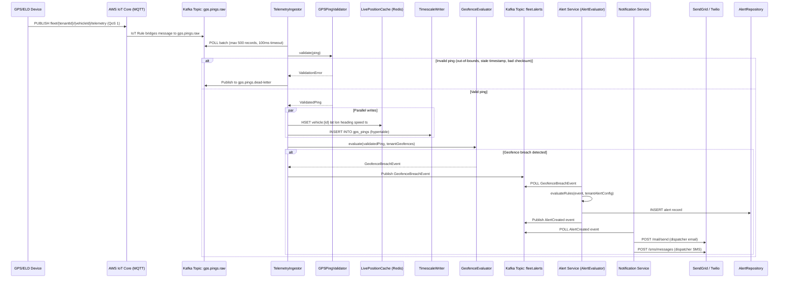

# Component Diagram

## Overview

This document decomposes each microservice into its internal components, shows how those components collaborate across service boundaries, and documents the integration contracts with external systems. Components are the primary unit of design review: each has a single, named responsibility and a defined interface. The decomposition follows the principle that a component should be independently testable with mocked collaborators.

Components within a service communicate in-process via dependency injection. Cross-service communication uses either synchronous HTTP/2 (for query-path operations requiring a response) or asynchronous Kafka events (for command-path operations that can tolerate eventual delivery). This hybrid model keeps the read path fast while decoupling write-side workflows.

---

## Component Diagram

```mermaid
block-beta
    columns 3

    block:TrackingService["Tracking Service"]:1
        TelemetryIngestor["TelemetryIngestor\n(MQTT Consumer)"]
        GPSPingValidator["GPSPingValidator\n(Schema + Bounds Check)"]
        LivePositionCache["LivePositionCache\n(Redis Writer)"]
        GeofenceEvaluator["GeofenceEvaluator\n(Polygon Check)"]
        SpeedViolationDetector["SpeedViolationDetector\n(Threshold Rules)"]
        TimescaleWriter["TimescaleWriter\n(GPS Persistence)"]
    end

    block:TripService["Trip Service"]:1
        TripController["TripController\n(REST Endpoints)"]
        TripAppService["TripApplicationService\n(Orchestrator)"]
        TripRepository["TripRepository\n(PostgreSQL)"]
        HOSCalculator["HOSCalculator\n(HOS Rules Engine)"]
        RouteOptimizer["RouteOptimizer\n(Google Maps Adapter)"]
        TripSummaryBuilder["TripSummaryBuilder\n(Kafka Publisher)"]
    end

    block:MaintenanceService["Maintenance Service"]:1
        MaintenanceController["MaintenanceController\n(REST Endpoints)"]
        ScheduleEngine["ScheduleEngine\n(PM Interval Calculator)"]
        DVIRProcessor["DVIRProcessor\n(Defect Classifier)"]
        ServiceAlertPublisher["ServiceAlertPublisher\n(Kafka Producer)"]
        WorkOrderRepository["WorkOrderRepository\n(PostgreSQL)"]
    end

    block:DriverService["Driver Service"]:1
        DriverController["DriverController\n(REST Endpoints)"]
        QualificationChecker["QualificationChecker\n(CDL/Med Cert Validator)"]
        DriverScoreCalculator["DriverScoreCalculator\n(Safety Score Engine)"]
        HOSEnforcer["HOSEnforcer\n(HOS State Machine)"]
        DriverRepository["DriverRepository\n(PostgreSQL)"]
    end

    block:ComplianceService["Compliance Service"]:1
        ComplianceAuditor["ComplianceAuditor\n(Rule Evaluator)"]
        ELDRegistrySync["ELDRegistrySync\n(FMCSA Client)"]
        IFTAReportGenerator["IFTAReportGenerator\n(Quarterly Report Builder)"]
        DocumentExpiryMonitor["DocumentExpiryMonitor\n(Scheduled Job)"]
        ComplianceRepository["ComplianceRepository\n(PostgreSQL)"]
    end

    block:AlertNotificationServices["Alert & Notification Services"]:1
        AlertEvaluator["AlertEvaluator\n(Rule Engine)"]
        AlertRepository["AlertRepository\n(PostgreSQL)"]
        EmailDispatcher["EmailDispatcher\n(SendGrid Adapter)"]
        SMSDispatcher["SMSDispatcher\n(Twilio Adapter)"]
        PushDispatcher["PushDispatcher\n(FCM/APNs Adapter)"]
    end
```

---

## Service-to-Service Communication

The following sequence illustrates the critical path from a raw GPS ping arriving at the MQTT broker through to a geofence breach notification delivered to the dispatcher.

---

## Component Responsibilities

| Component | Service | Technology | Key Responsibility |
|---|---|---|---|
| `TelemetryIngestor` | Tracking | Kafka Consumer (kafkajs) | Polls `gps.pings.raw` topic in batches; orchestrates the validation, persistence, and evaluation pipeline for each ping |
| `GPSPingValidator` | Tracking | Zod schema validation | Validates coordinates are within world bounds (±90 lat, ±180 lon), timestamp is within 60s of server time, device ID matches registered vehicle |
| `LivePositionCache` | Tracking | ioredis | Writes validated position to Redis hash `vehicle:{vehicleId}` with 90-second TTL; read by map API endpoint |
| `TimescaleWriter` | Tracking | pg (node-postgres) | Batch-inserts GPS pings into TimescaleDB hypertable `gps_pings`; uses `COPY` protocol for throughput |
| `GeofenceEvaluator` | Tracking | @turf/turf (spatial) | Loads tenant geofence polygons from Redis cache; evaluates each ping using `booleanPointInPolygon`; emits entry/exit events |
| `SpeedViolationDetector` | Tracking | In-process rule engine | Compares reported speed against posted speed limit (loaded from HERE Maps road segment cache); emits `SpeedViolationDetected` event |
| `TripController` | Trip | Express.js Router | Handles REST endpoints: `POST /trips`, `PUT /trips/:id/start`, `PUT /trips/:id/end`; validates JWT claims and tenant context |
| `TripApplicationService` | Trip | Domain service | Orchestrates trip creation, driver/vehicle assignment, HOS pre-check, and route calculation; ensures state machine is advanced atomically |
| `TripRepository` | Trip | pg with pg-pool | CRUD for trip aggregate; implements optimistic locking via `version` column to prevent concurrent modification |
| `HOSCalculator` | Trip | HOS rules engine | Computes remaining available drive time and on-duty window for a driver before a trip starts; reads HOS log from Driver Service via gRPC |
| `RouteOptimizer` | Trip | Google Maps Directions API adapter | Requests optimised route with waypoints; caches result in Redis for 15 minutes; falls back to HERE Maps on HTTP 5xx |
| `TripSummaryBuilder` | Trip | Kafka Producer | Constructs `TripCompleted` event with mileage, duration, fuel estimate, HOS consumed; publishes to `fleet.trips.completed` topic |
| `MaintenanceController` | Maintenance | Express.js Router | REST endpoints for work orders, DVIR submission, service history; enforces `maintenance:write` scope |
| `ScheduleEngine` | Maintenance | Cron job (node-cron) | Runs every hour; queries vehicles due for PM within 7 days by mileage or calendar interval; creates scheduled maintenance records |
| `DVIRProcessor` | Maintenance | Domain service | Classifies DVIR defects as critical/non-critical per FMCSA Part 396.11; triggers vehicle state transition to `out_of_service` for critical defects |
| `ServiceAlertPublisher` | Maintenance | Kafka Producer | Publishes `MaintenanceOverdue` and `DVIRDefectFlagged` events to `fleet.maintenance.alerts` topic |
| `DriverController` | Driver | Express.js Router | REST endpoints for driver profiles, CDL/cert upload, HOS log queries, score dashboard |
| `QualificationChecker` | Driver | Scheduled job | Daily check of CDL expiry, medical certificate expiry, and drug test due dates; marks driver as `qualification_hold` if expired |
| `DriverScoreCalculator` | Driver | Analytics engine | Computes weekly safety score from: speeding events (30%), harsh braking (25%), HOS compliance (25%), idling (20%); stored in PostgreSQL |
| `HOSEnforcer` | Driver | XState state machine | Implements FMCSA HOS state machine; listens to Kafka trip and vehicle events; writes duty status logs; emits `HOSViolationDetected` |
| `ComplianceAuditor` | Compliance | Rule engine | Evaluates fleet against active FMCSA rules; generates non-conformance records for audit reports |
| `ELDRegistrySync` | Compliance | REST client (axios) | Polls FMCSA ELD Registry weekly to verify registered device models; flags deregistered devices |
| `IFTAReportGenerator` | Compliance | Report builder | Aggregates GPS mileage and fuel purchases by state per quarter; generates IFTA-compliant XML/PDF reports |
| `DocumentExpiryMonitor` | Compliance | Scheduled job (daily) | Scans vehicle registrations, insurance certificates, and inspection stickers for expiry within 30/7/1 days; emits `DocumentExpiringSoon` events |
| `AlertEvaluator` | Alert | Kafka Consumer + rule engine | Evaluates domain events against tenant-configured alert rules; deduplicates within a 5-minute window; writes alert records |
| `EmailDispatcher` | Notification | SendGrid SDK | Renders Handlebars email templates and dispatches via SendGrid; implements exponential backoff on 429/503 |
| `SMSDispatcher` | Notification | Twilio SDK | Sends SMS alerts for P1 events (HOS violation, vehicle breakdown, geofence breach); respects quiet hours config per tenant |

---

## External Integration Points

| Integration | Protocol | Data Flow Direction | Failure Handling |
|---|---|---|---|
| AWS IoT Core (MQTT) | MQTT 3.1.1 over TLS (port 8883) | Inbound: GPS/ELD device → IoT Core → Kafka | IoT Core persists undelivered messages; Kafka consumer retries on lag; dead-letter topic for malformed payloads |
| Google Maps Directions API | HTTPS REST | Outbound: Trip Service → Google Maps | Circuit breaker (5 failures/30s trips to OPEN); fallback to HERE Maps; cached routes served stale on both failures |
| HERE Maps Routing API | HTTPS REST | Outbound: Trip Service → HERE Maps (fallback) | Retry with exponential backoff (max 3 attempts, 2s base delay); if both mapping providers fail, trip creation returns 503 with retry guidance |
| FMCSA ELD Registry | HTTPS REST | Outbound: Compliance Service → FMCSA | Weekly polling; cached locally; failures log a warning and retain last-known valid device list; alert sent to compliance officer |
| SendGrid Mail API | HTTPS REST | Outbound: Notification Service → SendGrid | Retry on 429 (honour Retry-After header); retry on 5xx (3 attempts); undelivered messages written to `notification.dead-letter` Kafka topic |
| Twilio SMS API | HTTPS REST | Outbound: Notification Service → Twilio | Retry on transient errors; SQS dead-letter queue for undelivered SMS after 3 attempts; ops alert on DLQ depth >10 |
| Stripe API | HTTPS REST | Outbound: Fuel Service → Stripe | Idempotency keys on all payment requests; webhook validation via Stripe-Signature header; failed webhooks retried by Stripe for 72 hours |
| TimescaleDB | PostgreSQL wire protocol (TCP 5432) | Bidirectional: Tracking Service writes; Reporting Service reads | Connection pooling via PgBouncer; read replicas for reporting queries; circuit breaker on connection pool exhaustion |
| Redis (ElastiCache) | Redis RESP protocol (TCP 6379) | Bidirectional: Tracking writes positions; API reads positions | Cluster mode with 3 shards; fall-through to PostgreSQL if Redis unavailable (degraded mode, higher latency); auto-reconnect with jitter |
