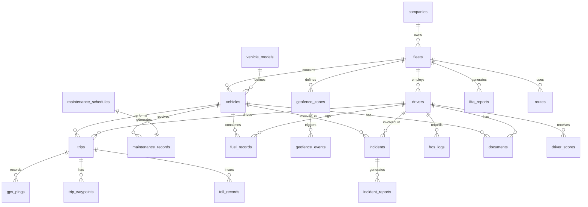

# Fleet Management System — ERD & Database Schema

## Table of Contents
1. [Entity Relationship Diagram](#entity-relationship-diagram)
2. [Design Decisions](#design-decisions)
3. [Extensions & ENUM Types](#extensions--enum-types)
4. [Table Definitions](#table-definitions)
5. [Index Definitions](#index-definitions)
6. [Partitioning & TimescaleDB Notes](#partitioning--timescaledb-notes)

---

## Entity Relationship Diagram



---

## Design Decisions

### Multi-Tenancy via Companies → Fleets
Every object in the system is scoped to a `fleet_id` (and transitively to a `company_id`). This two-level hierarchy allows a single company to operate multiple logically separated fleets (e.g., by region or business unit) without cross-contamination of data or user permissions. Row-level security (RLS) policies in PostgreSQL can enforce this at the database layer.

### UUID Primary Keys
All tables use `gen_random_uuid()` (from `pgcrypto`) rather than integer sequences. UUIDs prevent enumeration attacks, are safe to generate client-side for optimistic inserts, and work seamlessly across shards or merged datasets.

### Soft Deletes
Core business objects (`companies`, `fleets`, `vehicles`, `drivers`, `documents`) carry a `deleted_at` column rather than hard deletes. This preserves referential integrity for historical records (trips, maintenance logs, fuel records) and supports audit trails.

### GPS Pings as a TimescaleDB Hypertable
`gps_pings` is the highest-volume table by orders of magnitude — a 500-vehicle fleet at one ping every 10 seconds generates ~43 million rows per day. TimescaleDB's time-based partitioning (chunks of 1 day) enables efficient time-range queries, automatic compression of old chunks, and chunk-level data retention policies without touching application code.

### Generated Columns
`maintenance_records.total_cost` is a `GENERATED ALWAYS AS` column that sums `parts_cost + labor_cost`. `hos_logs.duration_minutes` is likewise computed from `started_at` and `ended_at`. This eliminates inconsistency that would arise from storing computed values separately.

### JSONB for Flexible Payloads
`geofence_zones.coordinates_json`, `routes.waypoints_json`, and `ifta_reports.jurisdiction_data` use JSONB because their structure varies by shape type, route provider, or jurisdiction count. GIN indexes on these columns allow efficient document-level queries.

### PostGIS vs Decimal Coordinates
Latitude/longitude values are stored as `DECIMAL(10,7)` for maximum portability and readability. For production deployments requiring spatial queries (radius searches, polygon containment), adding a PostGIS `GEOMETRY` column with a GIST index is recommended. The PostGIS extension is pre-enabled in the schema.

### IFTA Quarterly Uniqueness
The `UNIQUE (fleet_id, report_year, report_quarter)` constraint on `ifta_reports` prevents duplicate quarterly filings at the database level, complementing application-layer validation.

---

## Extensions & ENUM Types

```sql
-- ============================================================
-- EXTENSIONS
-- ============================================================
CREATE EXTENSION IF NOT EXISTS "pgcrypto";    -- gen_random_uuid()
CREATE EXTENSION IF NOT EXISTS "postgis";     -- spatial queries (optional but recommended)

-- ============================================================
-- ENUM TYPES
-- ============================================================

CREATE TYPE vehicle_status AS ENUM (
    'available',            -- ready to be dispatched
    'assigned',             -- assigned to a driver, not yet moving
    'in_trip',              -- actively on a trip
    'in_maintenance',       -- currently at a service center
    'maintenance_overdue',  -- past-due scheduled maintenance
    'out_of_service',       -- temporarily unavailable
    'retired'               -- decommissioned from the fleet
);

CREATE TYPE driver_status AS ENUM (
    'active',               -- available to be assigned
    'assigned',             -- assigned to a vehicle/trip
    'on_duty',              -- on duty, not currently driving
    'on_break',             -- mid-shift break per HOS rules
    'off_duty',             -- off duty per HOS
    'suspended',            -- disciplinary or regulatory hold
    'inactive'              -- terminated / on extended leave
);

CREATE TYPE trip_status AS ENUM (
    'draft',                -- created but not yet dispatched
    'scheduled',            -- confirmed, awaiting departure time
    'dispatched',           -- driver notified, not yet started
    'in_progress',          -- vehicle is moving
    'paused',               -- driver stopped, trip on hold
    'completed',            -- arrived at destination
    'cancelled',            -- cancelled before completion
    'disputed'              -- flagged for review
);

CREATE TYPE maintenance_type AS ENUM (
    'oil_change',
    'tire_rotation',
    'brake_service',
    'transmission',
    'engine',
    'hvac',
    'electrical',
    'body_repair',
    'annual_inspection',
    'dot_inspection',
    'scheduled_pm',         -- preventive maintenance per schedule
    'emergency'             -- unplanned roadside or urgent repair
);

CREATE TYPE maintenance_status AS ENUM (
    'scheduled',
    'pending_assignment',   -- due but no technician assigned
    'assigned',
    'in_progress',
    'awaiting_parts',
    'completed',
    'cancelled',
    'overdue'
);

CREATE TYPE incident_type AS ENUM (
    'collision',
    'near_miss',
    'theft',
    'vandalism',
    'mechanical_failure',
    'cargo_damage',
    'injury',
    'traffic_violation',
    'weather',
    'other'
);

CREATE TYPE incident_severity AS ENUM (
    'minor',                -- no injury, minimal damage
    'moderate',             -- minor injury or moderate damage
    'severe',               -- serious injury or significant damage
    'critical'              -- fatality or total loss
);

CREATE TYPE incident_status AS ENUM (
    'reported',
    'under_review',
    'investigation',
    'resolved',
    'closed',
    'disputed'
);

CREATE TYPE document_type AS ENUM (
    'driver_license',
    'cdl',
    'medical_certificate',
    'vehicle_registration',
    'insurance_certificate',
    'title',
    'inspection_report',
    'work_order',
    'ifta_report',
    'other'
);

CREATE TYPE hos_status AS ENUM (
    'off_duty',
    'sleeper_berth',
    'driving',
    'on_duty_not_driving'
);

CREATE TYPE geofence_shape AS ENUM (
    'circle',               -- center + radius
    'polygon',              -- arbitrary GeoJSON polygon
    'rectangle'             -- bounding box (two corner points)
);

CREATE TYPE fuel_type AS ENUM (
    'diesel',
    'gasoline',
    'electric',             -- kWh recorded as energy equivalent
    'hybrid',
    'cng',                  -- compressed natural gas
    'lpg'                   -- liquefied petroleum gas
);

CREATE TYPE license_class AS ENUM (
    'A',                    -- CDL Class A — combination vehicles
    'B',                    -- CDL Class B — heavy straight vehicles
    'C',                    -- CDL Class C — small HazMat / 16+ passengers
    'D',                    -- standard non-commercial driver's license
    'non_cdl'               -- other non-CDL classification
);
```

---

## Table Definitions

```sql
-- ============================================================
-- companies
-- Root tenant table. One row per customer organization.
-- ============================================================
CREATE TABLE companies (
    id                      UUID            PRIMARY KEY DEFAULT gen_random_uuid(),
    name                    VARCHAR(255)    NOT NULL,
    slug                    VARCHAR(100)    NOT NULL UNIQUE,
    legal_name              VARCHAR(255),
    tax_id                  VARCHAR(50),
    dot_number              VARCHAR(20),                        -- FMCSA DOT number
    mc_number               VARCHAR(20),                        -- Motor Carrier number
    address_line1           VARCHAR(255),
    address_line2           VARCHAR(255),
    city                    VARCHAR(100),
    state                   VARCHAR(50),
    postal_code             VARCHAR(20),
    country                 VARCHAR(2)      NOT NULL DEFAULT 'US',
    phone                   VARCHAR(30),
    email                   VARCHAR(255),
    subscription_plan       VARCHAR(50)     NOT NULL DEFAULT 'starter',
    subscription_status     VARCHAR(20)     NOT NULL DEFAULT 'active',
    max_vehicles            INTEGER         NOT NULL DEFAULT 10,
    max_drivers             INTEGER         NOT NULL DEFAULT 20,
    timezone                VARCHAR(50)     NOT NULL DEFAULT 'America/Chicago',
    created_at              TIMESTAMPTZ     NOT NULL DEFAULT NOW(),
    updated_at              TIMESTAMPTZ     NOT NULL DEFAULT NOW(),
    deleted_at              TIMESTAMPTZ,
    CONSTRAINT companies_email_check CHECK (
        email IS NULL OR email ~* '^[A-Za-z0-9._%+-]+@[A-Za-z0-9.-]+\.[A-Za-z]{2,}$'
    )
);

COMMENT ON TABLE  companies IS 'Root tenant. Every other entity traces back to a company via fleet_id.';
COMMENT ON COLUMN companies.slug IS 'URL-safe identifier used in subdomains and API paths, e.g. acme-logistics.';
COMMENT ON COLUMN companies.dot_number IS 'FMCSA-issued DOT number; required for carriers crossing state lines.';
COMMENT ON COLUMN companies.max_vehicles IS 'Subscription-enforced hard cap on active vehicles.';

-- ============================================================
-- fleets
-- Sub-grouping within a company (region, business unit, etc.)
-- ============================================================
CREATE TABLE fleets (
    id                      UUID            PRIMARY KEY DEFAULT gen_random_uuid(),
    company_id              UUID            NOT NULL REFERENCES companies(id) ON DELETE CASCADE,
    name                    VARCHAR(255)    NOT NULL,
    description             TEXT,
    fleet_type              VARCHAR(50)     NOT NULL DEFAULT 'mixed',   -- mixed, ltl, ftl, last_mile, passenger
    home_location_lat       DECIMAL(10,7),
    home_location_lng       DECIMAL(10,7),
    home_location_address   VARCHAR(500),
    active                  BOOLEAN         NOT NULL DEFAULT TRUE,
    created_at              TIMESTAMPTZ     NOT NULL DEFAULT NOW(),
    updated_at              TIMESTAMPTZ     NOT NULL DEFAULT NOW(),
    deleted_at              TIMESTAMPTZ,
    UNIQUE (company_id, name)
);

COMMENT ON TABLE  fleets IS 'Logical sub-division of a company. Vehicles, drivers, routes, and geofences belong to a fleet.';
COMMENT ON COLUMN fleets.fleet_type IS 'Operational profile: mixed | ltl | ftl | last_mile | passenger | refrigerated.';

-- ============================================================
-- vehicle_models
-- Reference catalog of make/model/year combinations.
-- Shared across all tenants to avoid data duplication.
-- ============================================================
CREATE TABLE vehicle_models (
    id                          UUID            PRIMARY KEY DEFAULT gen_random_uuid(),
    make                        VARCHAR(100)    NOT NULL,
    model                       VARCHAR(100)    NOT NULL,
    year                        SMALLINT        NOT NULL CHECK (year BETWEEN 1900 AND 2100),
    vehicle_class               VARCHAR(50),                            -- Class 1-8 per FHWA
    gvwr_kg                     DECIMAL(10,2)   CHECK (gvwr_kg > 0),
    fuel_type                   fuel_type       NOT NULL DEFAULT 'diesel',
    tank_capacity_l             DECIMAL(8,2)    CHECK (tank_capacity_l > 0),
    avg_fuel_economy_lper100km  DECIMAL(5,2)    CHECK (avg_fuel_economy_lper100km > 0),
    engine_displacement_l       DECIMAL(4,2),
    horsepower                  INTEGER,
    created_at                  TIMESTAMPTZ     NOT NULL DEFAULT NOW(),
    UNIQUE (make, model, year)
);

COMMENT ON TABLE  vehicle_models IS 'Shared catalog of vehicle make/model/year specs. Vehicles reference this for baseline fuel economy and weight data.';
COMMENT ON COLUMN vehicle_models.vehicle_class IS 'FHWA GVW class (1-8). Class 8 = heavy-duty (>33,000 lb GVWR).';

-- ============================================================
-- vehicles
-- Physical vehicles in the fleet.
-- ============================================================
CREATE TABLE vehicles (
    id                          UUID            PRIMARY KEY DEFAULT gen_random_uuid(),
    fleet_id                    UUID            NOT NULL REFERENCES fleets(id) ON DELETE RESTRICT,
    vehicle_model_id            UUID            REFERENCES vehicle_models(id),
    vin                         VARCHAR(17)     NOT NULL UNIQUE,
    license_plate               VARCHAR(20)     NOT NULL,
    license_plate_state         VARCHAR(2)      NOT NULL DEFAULT 'TX',
    make                        VARCHAR(100)    NOT NULL,
    model                       VARCHAR(100)    NOT NULL,
    year                        SMALLINT        NOT NULL CHECK (year BETWEEN 1900 AND 2100),
    color                       VARCHAR(50),
    status                      vehicle_status  NOT NULL DEFAULT 'available',
    odometer_km                 DECIMAL(10,2)   NOT NULL DEFAULT 0 CHECK (odometer_km >= 0),
    fuel_type                   fuel_type       NOT NULL DEFAULT 'diesel',
    fuel_tank_capacity_l        DECIMAL(8,2)    CHECK (fuel_tank_capacity_l > 0),
    gross_vehicle_weight_kg     DECIMAL(10,2)   CHECK (gross_vehicle_weight_kg > 0),
    gps_device_serial           VARCHAR(100),
    eld_device_serial           VARCHAR(100),
    eld_certified               BOOLEAN         NOT NULL DEFAULT FALSE,
    insurance_policy_number     VARCHAR(100),
    insurance_expiry_date       DATE,
    registration_expiry_date    DATE,
    last_inspection_date        DATE,
    last_inspection_pass        BOOLEAN,
    acquisition_date            DATE,
    acquisition_cost            DECIMAL(12,2),
    notes                       TEXT,
    created_at                  TIMESTAMPTZ     NOT NULL DEFAULT NOW(),
    updated_at                  TIMESTAMPTZ     NOT NULL DEFAULT NOW(),
    deleted_at                  TIMESTAMPTZ,
    CONSTRAINT vehicles_license_plate_state_unique UNIQUE (license_plate, license_plate_state),
    CONSTRAINT vehicles_vin_format CHECK (vin ~* '^[A-HJ-NPR-Z0-9]{17}$')
);

COMMENT ON TABLE  vehicles IS 'Core entity. Holds registration, compliance, telematics device, and operational status.';
COMMENT ON COLUMN vehicles.vin IS '17-character VIN. Characters I, O, Q excluded per ISO 3779.';
COMMENT ON COLUMN vehicles.odometer_km IS 'Running odometer in km. Updated after each trip completion.';
COMMENT ON COLUMN vehicles.eld_certified IS 'TRUE if the ELD device meets FMCSA 49 CFR Part 395 certification requirements.';

-- ============================================================
-- drivers
-- Licensed operators employed by a fleet.
-- ============================================================
CREATE TABLE drivers (
    id                      UUID            PRIMARY KEY DEFAULT gen_random_uuid(),
    fleet_id                UUID            NOT NULL REFERENCES fleets(id) ON DELETE RESTRICT,
    employee_id             VARCHAR(50),
    first_name              VARCHAR(100)    NOT NULL,
    last_name               VARCHAR(100)    NOT NULL,
    email                   VARCHAR(255)    NOT NULL,
    phone                   VARCHAR(30)     NOT NULL,
    date_of_birth           DATE,
    hire_date               DATE,
    license_number          VARCHAR(50)     NOT NULL,
    license_class           license_class   NOT NULL DEFAULT 'A',
    license_state           VARCHAR(2)      NOT NULL,
    license_expiry_date     DATE            NOT NULL,
    cdl_endorsements        TEXT[],                                 -- H, N, P, S, T, X, etc.
    medical_cert_expiry     DATE,
    status                  driver_status   NOT NULL DEFAULT 'active',
    driver_score            DECIMAL(5,2)    NOT NULL DEFAULT 100.00 CHECK (driver_score BETWEEN 0 AND 100),
    total_trips             INTEGER         NOT NULL DEFAULT 0,
    total_km_driven         DECIMAL(12,2)   NOT NULL DEFAULT 0,
    hos_status              hos_status      NOT NULL DEFAULT 'off_duty',
    app_user_id             UUID,                                   -- FK to auth users table (external)
    notes                   TEXT,
    created_at              TIMESTAMPTZ     NOT NULL DEFAULT NOW(),
    updated_at              TIMESTAMPTZ     NOT NULL DEFAULT NOW(),
    deleted_at              TIMESTAMPTZ,
    UNIQUE (fleet_id, license_number, license_state),
    UNIQUE (fleet_id, employee_id)
);

COMMENT ON TABLE  drivers IS 'Licensed fleet operators. CDL endorsements stored as a text array for multi-value flexibility.';
COMMENT ON COLUMN drivers.cdl_endorsements IS 'FMCSA CDL endorsement codes: H=HazMat, N=Tank, P=Passenger, S=School Bus, T=Double/Triple, X=HazMat+Tank.';
COMMENT ON COLUMN drivers.driver_score IS 'Composite safety score 0-100. Decayed by events; updated after each scored trip.';
COMMENT ON COLUMN drivers.app_user_id IS 'References the authentication service user ID. Not enforced via FK to allow decoupled auth microservice.';

-- ============================================================
-- trips
-- A single journey from origin to destination.
-- ============================================================
CREATE TABLE trips (
    id                          UUID            PRIMARY KEY DEFAULT gen_random_uuid(),
    vehicle_id                  UUID            NOT NULL REFERENCES vehicles(id) ON DELETE RESTRICT,
    driver_id                   UUID            NOT NULL REFERENCES drivers(id) ON DELETE RESTRICT,
    fleet_id                    UUID            NOT NULL REFERENCES fleets(id) ON DELETE RESTRICT,
    route_id                    UUID            REFERENCES routes(id),
    status                      trip_status     NOT NULL DEFAULT 'scheduled',
    start_time                  TIMESTAMPTZ,
    end_time                    TIMESTAMPTZ,
    scheduled_start_time        TIMESTAMPTZ,
    scheduled_end_time          TIMESTAMPTZ,
    start_location_lat          DECIMAL(10,7),
    start_location_lng          DECIMAL(10,7),
    end_location_lat            DECIMAL(10,7),
    end_location_lng            DECIMAL(10,7),
    start_address               VARCHAR(500),
    end_address                 VARCHAR(500),
    distance_km                 DECIMAL(10,2)   CHECK (distance_km >= 0),
    duration_minutes            INTEGER         CHECK (duration_minutes >= 0),
    avg_speed_kmh               DECIMAL(6,2)    CHECK (avg_speed_kmh >= 0),
    max_speed_kmh               DECIMAL(6,2)    CHECK (max_speed_kmh >= 0),
    fuel_consumed_l             DECIMAL(8,2)    CHECK (fuel_consumed_l >= 0),
    idle_time_minutes           INTEGER         NOT NULL DEFAULT 0,
    harsh_braking_events        INTEGER         NOT NULL DEFAULT 0,
    harsh_acceleration_events   INTEGER         NOT NULL DEFAULT 0,
    speeding_events             INTEGER         NOT NULL DEFAULT 0,
    geofence_violations         INTEGER         NOT NULL DEFAULT 0,
    driver_score                DECIMAL(5,2)    CHECK (driver_score BETWEEN 0 AND 100),
    purpose                     VARCHAR(255),
    cargo_description           VARCHAR(500),
    notes                       TEXT,
    created_at                  TIMESTAMPTZ     NOT NULL DEFAULT NOW(),
    updated_at                  TIMESTAMPTZ     NOT NULL DEFAULT NOW(),
    CONSTRAINT trips_end_after_start CHECK (end_time IS NULL OR end_time > start_time)
);

COMMENT ON TABLE  trips IS 'Core operational record. Aggregates driving metrics post-completion via a background scoring job.';
COMMENT ON COLUMN trips.driver_score IS 'Per-trip computed score written by the scoring service after trip ends.';
COMMENT ON COLUMN trips.idle_time_minutes IS 'Engine-on, zero-speed seconds converted to minutes. Computed from gps_pings.';

-- ============================================================
-- trip_waypoints
-- Ordered stop list for multi-stop trips.
-- ============================================================
CREATE TABLE trip_waypoints (
    id              UUID            PRIMARY KEY DEFAULT gen_random_uuid(),
    trip_id         UUID            NOT NULL REFERENCES trips(id) ON DELETE CASCADE,
    sequence_num    INTEGER         NOT NULL,
    address         VARCHAR(500),
    latitude        DECIMAL(10,7)   NOT NULL CHECK (latitude BETWEEN -90 AND 90),
    longitude       DECIMAL(10,7)   NOT NULL CHECK (longitude BETWEEN -180 AND 180),
    arrived_at      TIMESTAMPTZ,
    departed_at     TIMESTAMPTZ,
    notes           TEXT,
    UNIQUE (trip_id, sequence_num)
);

COMMENT ON TABLE trip_waypoints IS 'Ordered stops within a trip. sequence_num is 1-based and must be contiguous.';

-- ============================================================
-- gps_pings
-- High-frequency telemetry feed from GPS/ELD devices.
-- Converted to a TimescaleDB hypertable after creation.
-- ============================================================
CREATE TABLE gps_pings (
    id              UUID            NOT NULL DEFAULT gen_random_uuid(),
    vehicle_id      UUID            NOT NULL,
    trip_id         UUID,
    latitude        DECIMAL(10,7)   NOT NULL CHECK (latitude BETWEEN -90 AND 90),
    longitude       DECIMAL(10,7)   NOT NULL CHECK (longitude BETWEEN -180 AND 180),
    altitude_m      DECIMAL(8,2),
    speed_kmh       DECIMAL(6,2)    CHECK (speed_kmh >= 0),
    heading_degrees SMALLINT        CHECK (heading_degrees BETWEEN 0 AND 359),
    accuracy_m      DECIMAL(8,2),
    timestamp       TIMESTAMPTZ     NOT NULL,
    signal_strength INTEGER,
    source          VARCHAR(20)     NOT NULL DEFAULT 'gps_device',  -- gps_device | eld | mobile_app
    PRIMARY KEY (id, timestamp)
);

-- Convert to TimescaleDB hypertable partitioned by day
SELECT create_hypertable('gps_pings', 'timestamp', chunk_time_interval => INTERVAL '1 day');

COMMENT ON TABLE  gps_pings IS 'High-volume telemetry. TimescaleDB hypertable, 1-day chunks. Old chunks compressed after 7 days via compression policy.';
COMMENT ON COLUMN gps_pings.source IS 'Data origin: gps_device (hardware tracker) | eld (ELD onboard) | mobile_app (driver app fallback).';

-- ============================================================
-- geofence_zones
-- Named geographic boundaries for entry/exit alerting.
-- ============================================================
CREATE TABLE geofence_zones (
    id                      UUID            PRIMARY KEY DEFAULT gen_random_uuid(),
    fleet_id                UUID            NOT NULL REFERENCES fleets(id) ON DELETE CASCADE,
    name                    VARCHAR(255)    NOT NULL,
    description             TEXT,
    shape_type              geofence_shape  NOT NULL DEFAULT 'polygon',
    coordinates_json        JSONB           NOT NULL,
    radius_m                DECIMAL(10,2),                              -- only for circle shapes
    alert_on_enter          BOOLEAN         NOT NULL DEFAULT TRUE,
    alert_on_exit           BOOLEAN         NOT NULL DEFAULT TRUE,
    alert_on_dwell_minutes  INTEGER,                                    -- NULL = no dwell alert
    active                  BOOLEAN         NOT NULL DEFAULT TRUE,
    created_by              UUID            NOT NULL,
    created_at              TIMESTAMPTZ     NOT NULL DEFAULT NOW(),
    updated_at              TIMESTAMPTZ     NOT NULL DEFAULT NOW(),
    UNIQUE (fleet_id, name)
);

COMMENT ON COLUMN geofence_zones.coordinates_json IS 'GeoJSON-compatible coordinate array. For polygon: [[lng,lat],...]. For rectangle: [[sw_lng,sw_lat],[ne_lng,ne_lat]]. For circle: [center_lng, center_lat].';
COMMENT ON COLUMN geofence_zones.radius_m IS 'Radius in meters. Only relevant when shape_type = circle.';

-- ============================================================
-- geofence_events
-- Audit log of every geofence boundary crossing.
-- ============================================================
CREATE TABLE geofence_events (
    id                  UUID            PRIMARY KEY DEFAULT gen_random_uuid(),
    geofence_zone_id    UUID            NOT NULL REFERENCES geofence_zones(id) ON DELETE CASCADE,
    vehicle_id          UUID            NOT NULL,
    driver_id           UUID,
    trip_id             UUID,
    event_type          VARCHAR(20)     NOT NULL CHECK (event_type IN ('entered', 'exited', 'dwell_exceeded')),
    occurred_at         TIMESTAMPTZ     NOT NULL,
    location_lat        DECIMAL(10,7)   NOT NULL,
    location_lng        DECIMAL(10,7)   NOT NULL,
    dwell_minutes       INTEGER,
    alert_sent          BOOLEAN         NOT NULL DEFAULT FALSE,
    alert_sent_at       TIMESTAMPTZ,
    created_at          TIMESTAMPTZ     NOT NULL DEFAULT NOW()
);

COMMENT ON TABLE geofence_events IS 'Immutable event log. Written by the geofence processor service on each boundary crossing.';

-- ============================================================
-- maintenance_schedules
-- Recurring service intervals per vehicle.
-- ============================================================
CREATE TABLE maintenance_schedules (
    id                  UUID                PRIMARY KEY DEFAULT gen_random_uuid(),
    vehicle_id          UUID                NOT NULL REFERENCES vehicles(id) ON DELETE CASCADE,
    maintenance_type    maintenance_type    NOT NULL,
    interval_km         DECIMAL(10,2),                  -- service every N km
    interval_days       INTEGER,                        -- service every N days
    last_service_km     DECIMAL(10,2),
    last_service_date   DATE,
    next_service_km     DECIMAL(10,2),
    next_service_date   DATE,
    active              BOOLEAN             NOT NULL DEFAULT TRUE,
    created_at          TIMESTAMPTZ         NOT NULL DEFAULT NOW(),
    updated_at          TIMESTAMPTZ         NOT NULL DEFAULT NOW()
);

COMMENT ON TABLE  maintenance_schedules IS 'Defines recurring PM intervals. A scheduler job queries due schedules daily and creates maintenance_records.';
COMMENT ON COLUMN maintenance_schedules.interval_km IS 'Trigger a new record when odometer exceeds last_service_km + interval_km.';

-- ============================================================
-- maintenance_records
-- Individual service events (planned or emergency).
-- ============================================================
CREATE TABLE maintenance_records (
    id                      UUID                PRIMARY KEY DEFAULT gen_random_uuid(),
    vehicle_id              UUID                NOT NULL REFERENCES vehicles(id) ON DELETE RESTRICT,
    schedule_id             UUID                REFERENCES maintenance_schedules(id),
    fleet_id                UUID                NOT NULL REFERENCES fleets(id) ON DELETE RESTRICT,
    maintenance_type        maintenance_type    NOT NULL,
    status                  maintenance_status  NOT NULL DEFAULT 'scheduled',
    scheduled_date          DATE                NOT NULL,
    completed_date          TIMESTAMPTZ,
    odometer_at_service_km  DECIMAL(10,2),
    next_service_km         DECIMAL(10,2),
    next_service_date       DATE,
    service_provider_name   VARCHAR(255),
    service_provider_id     UUID,
    technician_name         VARCHAR(255),
    labor_hours             DECIMAL(6,2)        CHECK (labor_hours >= 0),
    parts_cost              DECIMAL(12,2)       NOT NULL DEFAULT 0 CHECK (parts_cost >= 0),
    labor_cost              DECIMAL(12,2)       NOT NULL DEFAULT 0 CHECK (labor_cost >= 0),
    total_cost              DECIMAL(12,2)       GENERATED ALWAYS AS (parts_cost + labor_cost) STORED,
    description             TEXT                NOT NULL,
    notes                   TEXT,
    created_at              TIMESTAMPTZ         NOT NULL DEFAULT NOW(),
    updated_at              TIMESTAMPTZ         NOT NULL DEFAULT NOW()
);

COMMENT ON COLUMN maintenance_records.total_cost IS 'Generated column: parts_cost + labor_cost. Never updated manually.';
COMMENT ON COLUMN maintenance_records.schedule_id IS 'NULL for emergency/ad-hoc work orders.';

-- ============================================================
-- fuel_records
-- Fuel purchase transactions.
-- ============================================================
CREATE TABLE fuel_records (
    id                      UUID            PRIMARY KEY DEFAULT gen_random_uuid(),
    vehicle_id              UUID            NOT NULL REFERENCES vehicles(id) ON DELETE RESTRICT,
    driver_id               UUID            REFERENCES drivers(id),
    fleet_id                UUID            NOT NULL REFERENCES fleets(id) ON DELETE RESTRICT,
    recorded_at             TIMESTAMPTZ     NOT NULL,
    location_lat            DECIMAL(10,7),
    location_lng            DECIMAL(10,7),
    fuel_station_name       VARCHAR(255),
    fuel_station_address    VARCHAR(500),
    fuel_type               fuel_type       NOT NULL DEFAULT 'diesel',
    quantity_l              DECIMAL(8,2)    NOT NULL CHECK (quantity_l > 0),
    unit_price              DECIMAL(8,4)    NOT NULL CHECK (unit_price > 0),
    total_cost              DECIMAL(12,2)   NOT NULL CHECK (total_cost > 0),
    odometer_km             DECIMAL(10,2)   NOT NULL CHECK (odometer_km >= 0),
    fuel_card_id            UUID,
    authorization_code      VARCHAR(100),
    is_flagged              BOOLEAN         NOT NULL DEFAULT FALSE,
    flag_reason             VARCHAR(500),
    notes                   TEXT,
    created_at              TIMESTAMPTZ     NOT NULL DEFAULT NOW(),
    updated_at              TIMESTAMPTZ     NOT NULL DEFAULT NOW()
);

COMMENT ON TABLE  fuel_records IS 'Fuel purchase log used for IFTA mileage/fuel calculations and cost reporting.';
COMMENT ON COLUMN fuel_records.is_flagged IS 'Set TRUE by anomaly detection: purchase outside normal geography, unusually large quantity, duplicate within 30 min, etc.';

-- ============================================================
-- incidents
-- Safety and compliance events.
-- ============================================================
CREATE TABLE incidents (
    id                      UUID                PRIMARY KEY DEFAULT gen_random_uuid(),
    vehicle_id              UUID                NOT NULL REFERENCES vehicles(id) ON DELETE RESTRICT,
    driver_id               UUID                REFERENCES drivers(id),
    fleet_id                UUID                NOT NULL REFERENCES fleets(id) ON DELETE RESTRICT,
    incident_type           incident_type       NOT NULL,
    severity                incident_severity   NOT NULL DEFAULT 'minor',
    status                  incident_status     NOT NULL DEFAULT 'reported',
    occurred_at             TIMESTAMPTZ         NOT NULL,
    reported_at             TIMESTAMPTZ         NOT NULL DEFAULT NOW(),
    location_lat            DECIMAL(10,7),
    location_lng            DECIMAL(10,7),
    location_address        VARCHAR(500),
    description             TEXT                NOT NULL,
    injuries_reported       BOOLEAN             NOT NULL DEFAULT FALSE,
    injury_description      TEXT,
    property_damage         BOOLEAN             NOT NULL DEFAULT FALSE,
    damage_description      TEXT,
    police_report_number    VARCHAR(100),
    insurance_claim_number  VARCHAR(100),
    estimated_damage_cost   DECIMAL(12,2)       CHECK (estimated_damage_cost >= 0),
    actual_damage_cost      DECIMAL(12,2)       CHECK (actual_damage_cost >= 0),
    reported_by             UUID                NOT NULL,
    assigned_to             UUID,
    resolved_at             TIMESTAMPTZ,
    resolution_notes        TEXT,
    created_at              TIMESTAMPTZ         NOT NULL DEFAULT NOW(),
    updated_at              TIMESTAMPTZ         NOT NULL DEFAULT NOW()
);

-- ============================================================
-- incident_reports
-- Structured reports attached to incidents (initial, follow-up, final).
-- ============================================================
CREATE TABLE incident_reports (
    id              UUID            PRIMARY KEY DEFAULT gen_random_uuid(),
    incident_id     UUID            NOT NULL REFERENCES incidents(id) ON DELETE CASCADE,
    report_type     VARCHAR(50)     NOT NULL DEFAULT 'initial',   -- initial | follow_up | final | insurance
    content         TEXT            NOT NULL,
    submitted_by    UUID            NOT NULL,
    submitted_at    TIMESTAMPTZ     NOT NULL DEFAULT NOW(),
    reviewed_by     UUID,
    reviewed_at     TIMESTAMPTZ,
    status          VARCHAR(20)     NOT NULL DEFAULT 'draft'
                        CHECK (status IN ('draft', 'submitted', 'reviewed', 'approved', 'rejected'))
);

-- ============================================================
-- documents
-- File attachments for vehicles, drivers, incidents, maintenance.
-- Actual files stored in object storage (S3/GCS); this table holds metadata.
-- ============================================================
CREATE TABLE documents (
    id                  UUID            PRIMARY KEY DEFAULT gen_random_uuid(),
    fleet_id            UUID            NOT NULL REFERENCES fleets(id) ON DELETE CASCADE,
    entity_type         VARCHAR(50)     NOT NULL
                            CHECK (entity_type IN ('vehicle', 'driver', 'incident', 'maintenance', 'company')),
    entity_id           UUID            NOT NULL,
    document_type       document_type   NOT NULL,
    name                VARCHAR(255)    NOT NULL,
    description         TEXT,
    file_path           VARCHAR(1000)   NOT NULL,           -- S3/GCS object key
    file_size_bytes     INTEGER,
    mime_type           VARCHAR(100),
    expiry_date         DATE,
    issued_date         DATE,
    issuing_authority   VARCHAR(255),
    document_number     VARCHAR(100),
    is_verified         BOOLEAN         NOT NULL DEFAULT FALSE,
    verified_by         UUID,
    verified_at         TIMESTAMPTZ,
    created_by          UUID            NOT NULL,
    created_at          TIMESTAMPTZ     NOT NULL DEFAULT NOW(),
    updated_at          TIMESTAMPTZ     NOT NULL DEFAULT NOW(),
    deleted_at          TIMESTAMPTZ
);

COMMENT ON TABLE  documents IS 'Metadata for files stored in object storage. file_path is the bucket-relative key.';
COMMENT ON COLUMN documents.entity_type IS 'Polymorphic parent reference. entity_id + entity_type together identify the owning record.';

-- ============================================================
-- hos_logs
-- Hours of Service duty status changes per FMCSA ELD mandate.
-- ============================================================
CREATE TABLE hos_logs (
    id              UUID            PRIMARY KEY DEFAULT gen_random_uuid(),
    driver_id       UUID            NOT NULL REFERENCES drivers(id) ON DELETE RESTRICT,
    vehicle_id      UUID            REFERENCES vehicles(id),
    trip_id         UUID            REFERENCES trips(id),
    status          hos_status      NOT NULL,
    started_at      TIMESTAMPTZ     NOT NULL,
    ended_at        TIMESTAMPTZ,
    duration_minutes INTEGER        GENERATED ALWAYS AS (
                        CASE WHEN ended_at IS NOT NULL
                             THEN CAST(EXTRACT(EPOCH FROM (ended_at - started_at)) / 60 AS INTEGER)
                             ELSE NULL END
                    ) STORED,
    location_lat    DECIMAL(10,7),
    location_lng    DECIMAL(10,7),
    notes           TEXT,
    eld_event_id    VARCHAR(100),   -- ELD vendor's internal event reference
    created_at      TIMESTAMPTZ     NOT NULL DEFAULT NOW()
);

COMMENT ON TABLE  hos_logs IS 'ELD duty-status change log. duration_minutes is a generated column computed from started_at/ended_at.';

-- ============================================================
-- routes
-- Pre-computed or optimized routes available for dispatch.
-- ============================================================
CREATE TABLE routes (
    id                          UUID            PRIMARY KEY DEFAULT gen_random_uuid(),
    fleet_id                    UUID            NOT NULL REFERENCES fleets(id) ON DELETE CASCADE,
    name                        VARCHAR(255),
    origin_address              VARCHAR(500)    NOT NULL,
    origin_lat                  DECIMAL(10,7)   NOT NULL,
    origin_lng                  DECIMAL(10,7)   NOT NULL,
    destination_address         VARCHAR(500)    NOT NULL,
    destination_lat             DECIMAL(10,7)   NOT NULL,
    destination_lng             DECIMAL(10,7)   NOT NULL,
    waypoints_json              JSONB,                          -- ordered intermediate stops
    distance_km                 DECIMAL(10,2),
    estimated_duration_minutes  INTEGER,
    estimated_fuel_l            DECIMAL(8,2),
    estimated_toll_cost         DECIMAL(10,2),
    optimization_criteria       VARCHAR(50)     DEFAULT 'fastest',  -- fastest | shortest | fuel_efficient
    provider                    VARCHAR(50)     DEFAULT 'google_maps',
    polyline_encoded            TEXT,                           -- Google encoded polyline for map rendering
    optimized_at                TIMESTAMPTZ,
    created_at                  TIMESTAMPTZ     NOT NULL DEFAULT NOW(),
    updated_at                  TIMESTAMPTZ     NOT NULL DEFAULT NOW()
);

-- ============================================================
-- ifta_reports
-- International Fuel Tax Agreement quarterly filings.
-- ============================================================
CREATE TABLE ifta_reports (
    id                  UUID            PRIMARY KEY DEFAULT gen_random_uuid(),
    fleet_id            UUID            NOT NULL REFERENCES fleets(id) ON DELETE RESTRICT,
    report_year         SMALLINT        NOT NULL CHECK (report_year BETWEEN 2000 AND 2100),
    report_quarter      SMALLINT        NOT NULL CHECK (report_quarter BETWEEN 1 AND 4),
    status              VARCHAR(20)     NOT NULL DEFAULT 'draft'
                            CHECK (status IN ('draft', 'under_review', 'submitted', 'accepted', 'amended')),
    total_miles         DECIMAL(12,2),
    total_gallons       DECIMAL(12,4),
    jurisdiction_data   JSONB           NOT NULL DEFAULT '[]',      -- per-state miles & fuel breakdown
    generated_at        TIMESTAMPTZ     NOT NULL DEFAULT NOW(),
    submitted_at        TIMESTAMPTZ,
    submitted_by        UUID,
    file_path           VARCHAR(1000),                              -- PDF/CSV export in object storage
    notes               TEXT,
    created_at          TIMESTAMPTZ     NOT NULL DEFAULT NOW(),
    updated_at          TIMESTAMPTZ     NOT NULL DEFAULT NOW(),
    UNIQUE (fleet_id, report_year, report_quarter)
);

COMMENT ON COLUMN ifta_reports.jurisdiction_data IS 'Array of {state, miles, gallons, tax_rate, tax_owed} objects. One entry per jurisdiction traveled.';

-- ============================================================
-- driver_scores
-- Immutable per-trip scoring snapshots. Roll up to drivers.driver_score.
-- ============================================================
CREATE TABLE driver_scores (
    id                          UUID            PRIMARY KEY DEFAULT gen_random_uuid(),
    driver_id                   UUID            NOT NULL REFERENCES drivers(id) ON DELETE CASCADE,
    trip_id                     UUID            REFERENCES trips(id),
    safety_score                DECIMAL(5,2)    NOT NULL CHECK (safety_score BETWEEN 0 AND 100),
    efficiency_score            DECIMAL(5,2)    NOT NULL CHECK (efficiency_score BETWEEN 0 AND 100),
    compliance_score            DECIMAL(5,2)    NOT NULL CHECK (compliance_score BETWEEN 0 AND 100),
    overall_score               DECIMAL(5,2)    NOT NULL CHECK (overall_score BETWEEN 0 AND 100),
    harsh_braking_count         INTEGER         NOT NULL DEFAULT 0,
    harsh_acceleration_count    INTEGER         NOT NULL DEFAULT 0,
    speeding_count              INTEGER         NOT NULL DEFAULT 0,
    idle_time_minutes           INTEGER         NOT NULL DEFAULT 0,
    distance_km                 DECIMAL(10,2),
    calculated_at               TIMESTAMPTZ     NOT NULL DEFAULT NOW()
);

COMMENT ON TABLE  driver_scores IS 'Append-only scoring history. The scoring service writes one row per trip; drivers.driver_score is a rolling 90-day weighted average.';

-- ============================================================
-- toll_records
-- Toll charges incurred during trips.
-- ============================================================
CREATE TABLE toll_records (
    id              UUID            PRIMARY KEY DEFAULT gen_random_uuid(),
    trip_id         UUID            NOT NULL REFERENCES trips(id) ON DELETE CASCADE,
    vehicle_id      UUID            NOT NULL REFERENCES vehicles(id),
    toll_plaza_name VARCHAR(255),
    location_lat    DECIMAL(10,7),
    location_lng    DECIMAL(10,7),
    amount          DECIMAL(8,2)    NOT NULL CHECK (amount >= 0),
    currency        VARCHAR(3)      NOT NULL DEFAULT 'USD',
    occurred_at     TIMESTAMPTZ     NOT NULL,
    transponder_id  VARCHAR(100),   -- E-ZPass / TxTag / SunPass transponder number
    created_at      TIMESTAMPTZ     NOT NULL DEFAULT NOW()
);
```

---

## Index Definitions

```sql
-- ============================================================
-- companies
-- ============================================================
CREATE INDEX idx_companies_slug           ON companies (slug);
CREATE INDEX idx_companies_deleted_at     ON companies (deleted_at) WHERE deleted_at IS NULL;

-- ============================================================
-- fleets
-- ============================================================
CREATE INDEX idx_fleets_company_id        ON fleets (company_id);
CREATE INDEX idx_fleets_active            ON fleets (company_id, active) WHERE active = TRUE;

-- ============================================================
-- vehicles
-- ============================================================
CREATE INDEX idx_vehicles_fleet_id        ON vehicles (fleet_id);
CREATE INDEX idx_vehicles_status          ON vehicles (fleet_id, status);
CREATE INDEX idx_vehicles_vin             ON vehicles (vin);
CREATE INDEX idx_vehicles_gps_serial      ON vehicles (gps_device_serial) WHERE gps_device_serial IS NOT NULL;
CREATE INDEX idx_vehicles_insurance_exp   ON vehicles (insurance_expiry_date) WHERE deleted_at IS NULL;
CREATE INDEX idx_vehicles_reg_exp         ON vehicles (registration_expiry_date) WHERE deleted_at IS NULL;
CREATE INDEX idx_vehicles_deleted_at      ON vehicles (deleted_at) WHERE deleted_at IS NULL;

-- ============================================================
-- drivers
-- ============================================================
CREATE INDEX idx_drivers_fleet_id         ON drivers (fleet_id);
CREATE INDEX idx_drivers_status           ON drivers (fleet_id, status);
CREATE INDEX idx_drivers_license_exp      ON drivers (license_expiry_date) WHERE deleted_at IS NULL;
CREATE INDEX idx_drivers_medical_exp      ON drivers (medical_cert_expiry) WHERE deleted_at IS NULL;
CREATE INDEX idx_drivers_app_user_id      ON drivers (app_user_id) WHERE app_user_id IS NOT NULL;
CREATE INDEX idx_drivers_deleted_at       ON drivers (deleted_at) WHERE deleted_at IS NULL;

-- ============================================================
-- trips
-- ============================================================
CREATE INDEX idx_trips_vehicle_id         ON trips (vehicle_id);
CREATE INDEX idx_trips_driver_id          ON trips (driver_id);
CREATE INDEX idx_trips_fleet_id           ON trips (fleet_id);
CREATE INDEX idx_trips_status             ON trips (fleet_id, status);
CREATE INDEX idx_trips_start_time         ON trips (start_time DESC);
CREATE INDEX idx_trips_vehicle_start      ON trips (vehicle_id, start_time DESC);
CREATE INDEX idx_trips_driver_start       ON trips (driver_id, start_time DESC);

-- ============================================================
-- gps_pings (TimescaleDB — indexes are per-chunk automatically)
-- TimescaleDB replicates these indexes to every new chunk.
-- ============================================================
CREATE INDEX idx_gps_pings_vehicle_time   ON gps_pings (vehicle_id, timestamp DESC);
CREATE INDEX idx_gps_pings_trip_time      ON gps_pings (trip_id, timestamp DESC) WHERE trip_id IS NOT NULL;

-- ============================================================
-- geofence_zones / geofence_events
-- ============================================================
CREATE INDEX idx_geofence_zones_fleet     ON geofence_zones (fleet_id) WHERE active = TRUE;
CREATE INDEX idx_geofence_events_zone     ON geofence_events (geofence_zone_id, occurred_at DESC);
CREATE INDEX idx_geofence_events_vehicle  ON geofence_events (vehicle_id, occurred_at DESC);

-- ============================================================
-- maintenance_schedules / maintenance_records
-- ============================================================
CREATE INDEX idx_maint_sched_vehicle      ON maintenance_schedules (vehicle_id) WHERE active = TRUE;
CREATE INDEX idx_maint_sched_next_date    ON maintenance_schedules (next_service_date) WHERE active = TRUE;
CREATE INDEX idx_maint_records_vehicle    ON maintenance_records (vehicle_id);
CREATE INDEX idx_maint_records_fleet      ON maintenance_records (fleet_id, status);
CREATE INDEX idx_maint_records_scheduled  ON maintenance_records (scheduled_date) WHERE status != 'completed' AND status != 'cancelled';

-- ============================================================
-- fuel_records
-- ============================================================
CREATE INDEX idx_fuel_vehicle_recorded    ON fuel_records (vehicle_id, recorded_at DESC);
CREATE INDEX idx_fuel_fleet_recorded      ON fuel_records (fleet_id, recorded_at DESC);
CREATE INDEX idx_fuel_flagged             ON fuel_records (fleet_id, is_flagged) WHERE is_flagged = TRUE;

-- ============================================================
-- incidents
-- ============================================================
CREATE INDEX idx_incidents_vehicle        ON incidents (vehicle_id, occurred_at DESC);
CREATE INDEX idx_incidents_driver         ON incidents (driver_id, occurred_at DESC);
CREATE INDEX idx_incidents_fleet_status   ON incidents (fleet_id, status);

-- ============================================================
-- hos_logs
-- ============================================================
CREATE INDEX idx_hos_logs_driver_time     ON hos_logs (driver_id, started_at DESC);
CREATE INDEX idx_hos_logs_vehicle         ON hos_logs (vehicle_id, started_at DESC) WHERE vehicle_id IS NOT NULL;

-- ============================================================
-- documents
-- ============================================================
CREATE INDEX idx_documents_entity         ON documents (entity_type, entity_id) WHERE deleted_at IS NULL;
CREATE INDEX idx_documents_expiry         ON documents (expiry_date) WHERE deleted_at IS NULL AND expiry_date IS NOT NULL;
CREATE INDEX idx_documents_fleet          ON documents (fleet_id) WHERE deleted_at IS NULL;

-- ============================================================
-- driver_scores
-- ============================================================
CREATE INDEX idx_driver_scores_driver     ON driver_scores (driver_id, calculated_at DESC);
CREATE INDEX idx_driver_scores_trip       ON driver_scores (trip_id) WHERE trip_id IS NOT NULL;

-- ============================================================
-- JSONB GIN indexes
-- ============================================================
CREATE INDEX idx_geofence_coords_gin      ON geofence_zones USING GIN (coordinates_json);
CREATE INDEX idx_routes_waypoints_gin     ON routes USING GIN (waypoints_json) WHERE waypoints_json IS NOT NULL;
CREATE INDEX idx_ifta_jurisdiction_gin    ON ifta_reports USING GIN (jurisdiction_data);
```

---

## Partitioning & TimescaleDB Notes

### TimescaleDB Hypertable: `gps_pings`

`gps_pings` is declared as a TimescaleDB hypertable with a **1-day chunk interval**. Each day's data is stored in a separate internal table (chunk), allowing:

- **Efficient time-range queries** — the query planner prunes irrelevant chunks entirely.
- **Chunk-level compression** — chunks older than 7 days are compressed with TimescaleDB's columnar compression, achieving 10–20× storage reduction for telemetry data.
- **Data retention policies** — chunks older than 90 days can be dropped automatically without locking the parent table.
- **Parallel query execution** — multiple chunks can be scanned in parallel on multi-core hardware.

```sql
-- Apply compression policy: compress chunks older than 7 days
ALTER TABLE gps_pings SET (
    timescaledb.compress,
    timescaledb.compress_orderby = 'timestamp DESC',
    timescaledb.compress_segmentby = 'vehicle_id'
);
SELECT add_compression_policy('gps_pings', INTERVAL '7 days');

-- Apply data retention policy: drop chunks older than 90 days
SELECT add_retention_policy('gps_pings', INTERVAL '90 days');
```

> **Note:** For long-term GPS history beyond 90 days, configure a continuous aggregate or export job to write summarized trip paths to `trips` and `trip_waypoints` before the raw pings are dropped.

### Space-Time Partitioning (Optional Scale-Out)

For fleets exceeding 5,000 active vehicles, enable TimescaleDB's **space partitioning** by `vehicle_id` to distribute high-cardinality device streams across multiple partitions:

```sql
SELECT add_dimension('gps_pings', by_hash('vehicle_id', number_partitions => 8));
```

This should only be applied at initial table creation on a fresh database; adding space partitions to an existing hypertable requires a data migration.

### Archival Strategy

| Table | Retention | Archive Target |
|---|---|---|
| `gps_pings` | 90 days hot | S3 Parquet via TimescaleDB data tiering |
| `trips` | 7 years | No archival; standard PostgreSQL |
| `hos_logs` | 6 months hot | Tiered to object storage (DOT compliance) |
| `maintenance_records` | Indefinite | No archival |
| `fuel_records` | 3 years | No archival (IFTA audit window) |
| `incidents` | Indefinite | No archival |
