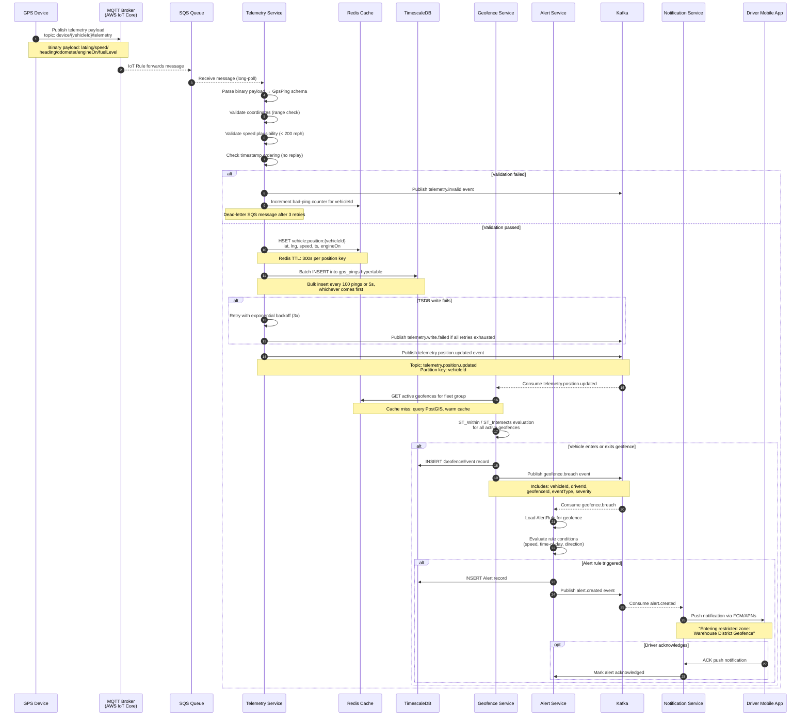
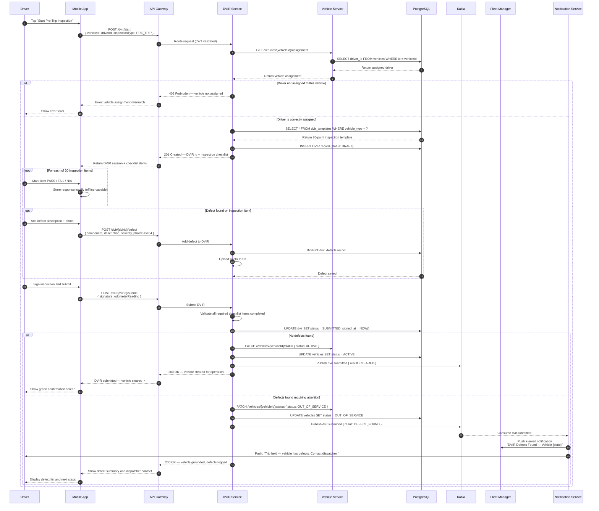
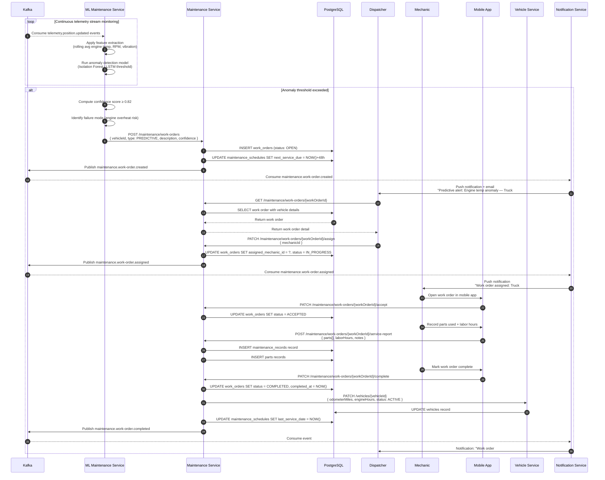
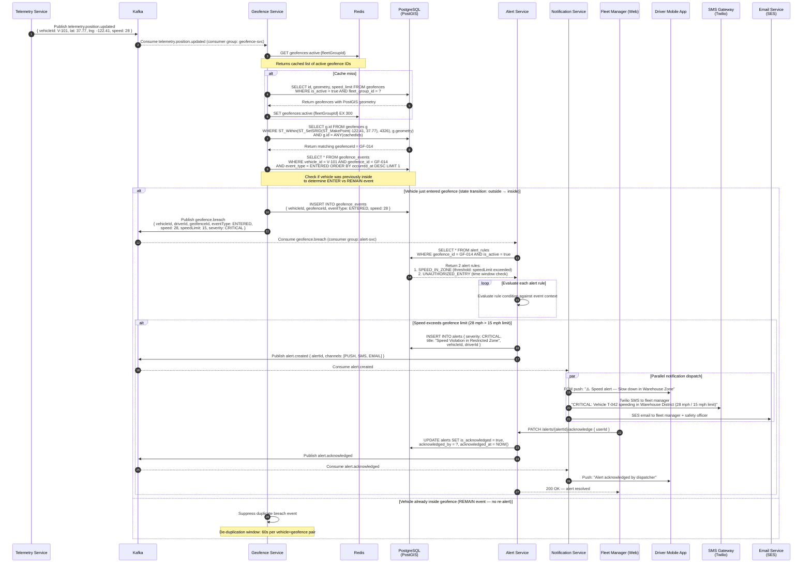
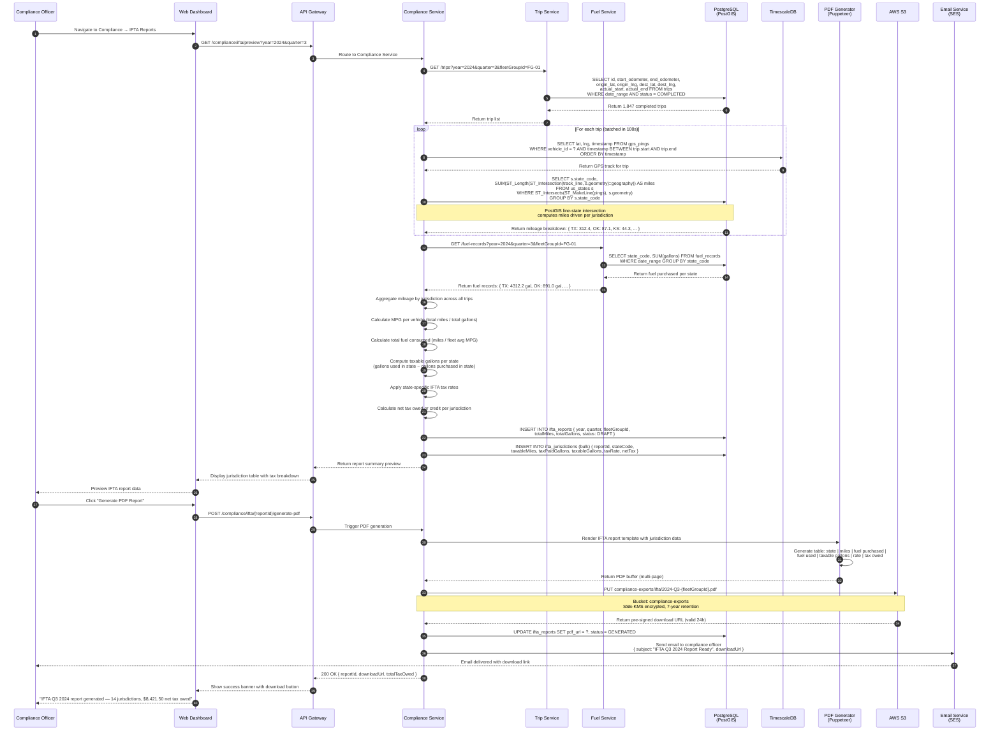

# Sequence Diagrams — Fleet Management System

## Overview

This document describes five detailed interaction flows across the Fleet Management System. Each diagram captures the full end-to-end behavior including error paths, retry logic, and integration with external systems.

---

## 1. Real-Time GPS Telemetry Processing

This flow describes how a GPS ping travels from a physical device installed in a vehicle all the way through ingestion, validation, live cache update, time-series persistence, geofence evaluation, and driver notification.

---

## 2. Driver Mobile App — Pre-Trip DVIR Submission

This flow covers a driver performing a DOT-compliant pre-trip vehicle inspection using the mobile app. It includes defect handling and fleet manager notification.

---

## 3. Predictive Maintenance Trigger and Work Order Lifecycle

This flow captures how the ML-based predictive maintenance engine detects an anomaly from telemetry data and generates a work order that is fulfilled by a mechanic.

---

## 4. Geofence Breach Detection and Multi-Channel Alert Dispatch

This flow details how a vehicle crossing a geofence boundary is detected, evaluated, and escalated across multiple notification channels, ending with fleet manager acknowledgement.

---

## 5. IFTA Quarterly Report Generation

This flow describes the compliance officer requesting an IFTA quarterly fuel tax report, including mileage aggregation by jurisdiction using PostGIS state boundary intersections.

---

## Sequence Diagram Coverage Summary

| Flow | Services Involved | Key Patterns |
|---|---|---|
| GPS Telemetry Processing | Telemetry, Redis, TimescaleDB, Geofence, Alert, Notification | Kafka fan-out, PostGIS eval, retry/DLQ |
| Pre-Trip DVIR Submission | DVIR, Vehicle, Notification | Offline form, S3 photo upload, conditional grounding |
| Predictive Maintenance | ML Service, Maintenance, Vehicle, Notification | ML anomaly trigger, work order lifecycle |
| Geofence Breach Alerting | Geofence, Alert, Notification, SMS/Email | Multi-channel dispatch, dedup suppression |
| IFTA Report Generation | Compliance, Trip, Fuel, PostgreSQL/PostGIS, S3 | GIS mileage split, tax calculation, PDF export |
