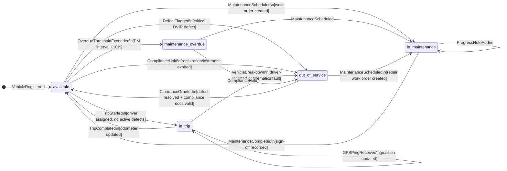
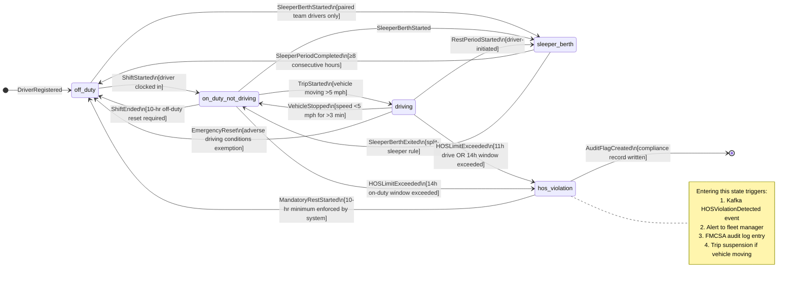
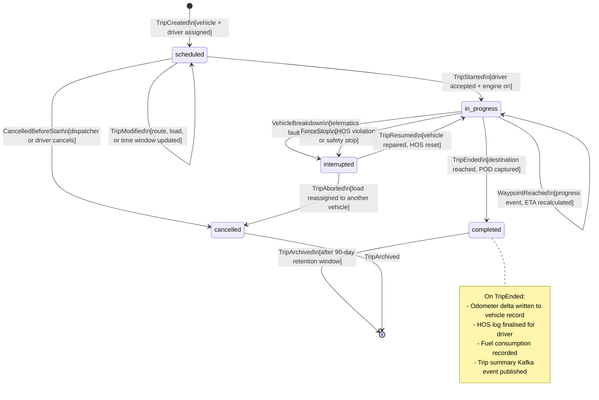
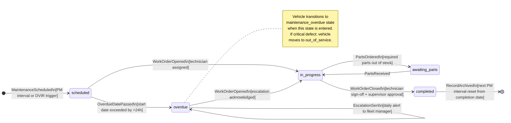

# State Machine Diagrams

## Overview

State machines govern the lifecycle of every core aggregate in the Fleet Management System. Rather than embedding ad-hoc status flags scattered across service logic, all state transitions are modelled explicitly so that invalid transitions are rejected at the domain layer before any persistence occurs. This document defines four state machines — Vehicle, Driver HOS, Trip, and Maintenance Record — and closes with a consolidated transition rules table that maps each state, trigger, guard condition, and resulting action to its successor state.

Each state machine is implemented as a TypeScript class using the XState library, which emits Kafka events on every transition. Consumers such as the Alert Service and Compliance Service subscribe to these transition events to trigger downstream workflows without coupling to the originating service.

---

## Vehicle State Machine

A vehicle moves through six stable states. The transitions enforce that a vehicle cannot be dispatched while in maintenance, and cannot return to service while under a compliance hold without explicit clearance.

### Vehicle State Descriptions

| State | Meaning | Dispatching Allowed |
|---|---|---|
| `available` | Vehicle is roadworthy and ready for dispatch | Yes |
| `in_trip` | Vehicle is actively on an assigned trip | No (already dispatched) |
| `in_maintenance` | Vehicle is at a shop; work order is open | No |
| `maintenance_overdue` | PM interval exceeded threshold; soft block on dispatch | Configurable per tenant |
| `out_of_service` | Safety defect or compliance hold; hard block | No |

---

## Driver State Machine

The Driver HOS state machine models the four FMCSA Hours of Service duty statuses plus a terminal violation state. The system continuously evaluates accumulated drive time against federal limits (11-hour driving limit, 14-hour on-duty window, 30-minute rest break after 8 hours of driving).

### HOS Limit Reference

| Rule | Limit | Reset Requirement |
|---|---|---|
| Driving window | 11 hours driving per shift | 10 consecutive hours off duty |
| On-duty window | 14 hours from first on-duty | 10 consecutive hours off duty |
| Rest break | 30-minute break after 8h driving | Must be off-duty or sleeper berth |
| Weekly limit (property) | 60h/7 days or 70h/8 days | 34-hour restart |

---

## Trip State Machine

The Trip aggregate tracks the lifecycle of a single dispatch from scheduling through completion or interruption.

---

## Maintenance Record State Machine

Maintenance records are created either by the schedule engine (preventive) or by a DVIR defect submission (corrective). Overdue records generate escalating alerts.

---

## State Transition Rules

| Aggregate | Current State | Trigger Event | Guard Condition | Action | Next State |
|---|---|---|---|---|---|
| Vehicle | `available` | `TripStarted` | Driver assigned; no open critical defects; insurance not expired | Emit `VehicleDispatched` Kafka event; lock vehicle | `in_trip` |
| Vehicle | `in_trip` | `TripCompleted` | Matching trip ID; driver signed off | Update odometer; emit `VehicleReturned` event | `available` |
| Vehicle | `available` | `MaintenanceScheduled` | Valid work order ID | Emit `VehicleInMaintenance` event | `in_maintenance` |
| Vehicle | `in_maintenance` | `MaintenanceCompleted` | Work order closed and supervisor approved | Reset PM interval counter; emit event | `available` |
| Vehicle | `available` | `OverdueThresholdExceeded` | PM interval exceeded by ≥10% of interval | Soft-block dispatch (configurable); notify fleet manager | `maintenance_overdue` |
| Vehicle | `available` | `DefectFlagged` | Critical defect category in DVIR | Hard-block dispatch; emit `VehicleOutOfService` event | `out_of_service` |
| Vehicle | `out_of_service` | `ClearanceGranted` | All defects resolved; compliance docs valid | Remove dispatch block; emit clearance event | `available` |
| Driver | `off_duty` | `TripStarted` | 10-hr off-duty rest period satisfied; CDL valid; medical cert valid | Start HOS clock; emit `DriverDriving` event | `driving` |
| Driver | `driving` | `HOSLimitExceeded` | Accumulated drive time >11h OR on-duty window >14h | Suspend active trip; emit `HOSViolationDetected`; write audit log | `hos_violation` |
| Driver | `driving` | `VehicleStopped` | Speed <5 mph for >3 minutes | Transition duty status; continue HOS clock | `on_duty_not_driving` |
| Driver | `sleeper_berth` | `SleeperPeriodCompleted` | ≥8 consecutive hours in sleeper | Partial reset on 34h restart; update HOS counters | `off_duty` |
| Trip | `scheduled` | `TripStarted` | Driver accepted; vehicle state = `in_trip`; departure window ≤30 min | Emit `TripStarted` Kafka event; start ETA calculation | `in_progress` |
| Trip | `in_progress` | `TripEnded` | All required waypoints visited; POD captured if required | Write trip summary; update odometer; finalise HOS | `completed` |
| Trip | `in_progress` | `VehicleBreakdown` | Telematics fault code OR driver report | Emit `TripInterrupted` event; notify dispatcher; trigger roadside assistance alert | `interrupted` |
| Trip | `scheduled` | `CancelledBeforeStart` | No driver HOS hours consumed | Release vehicle and driver; emit `TripCancelled` event | `cancelled` |
| Maintenance | `scheduled` | `WorkOrderOpened` | Technician assigned; parts availability confirmed | Emit `MaintenanceStarted` event; vehicle → `in_maintenance` | `in_progress` |
| Maintenance | `scheduled` | `OverdueDatePassed` | Current date > scheduled start + 24h | Emit `MaintenanceOverdue` event; trigger daily escalation alerts | `overdue` |
| Maintenance | `in_progress` | `WorkOrderClosed` | Supervisor sign-off present; no open defects | Reset PM odometer/date counter; vehicle → `available` | `completed` |
| Maintenance | `in_progress` | `PartsOrdered` | Parts not in stock; order placed | Pause labour clock; notify ETA to fleet manager | `awaiting_parts` |
