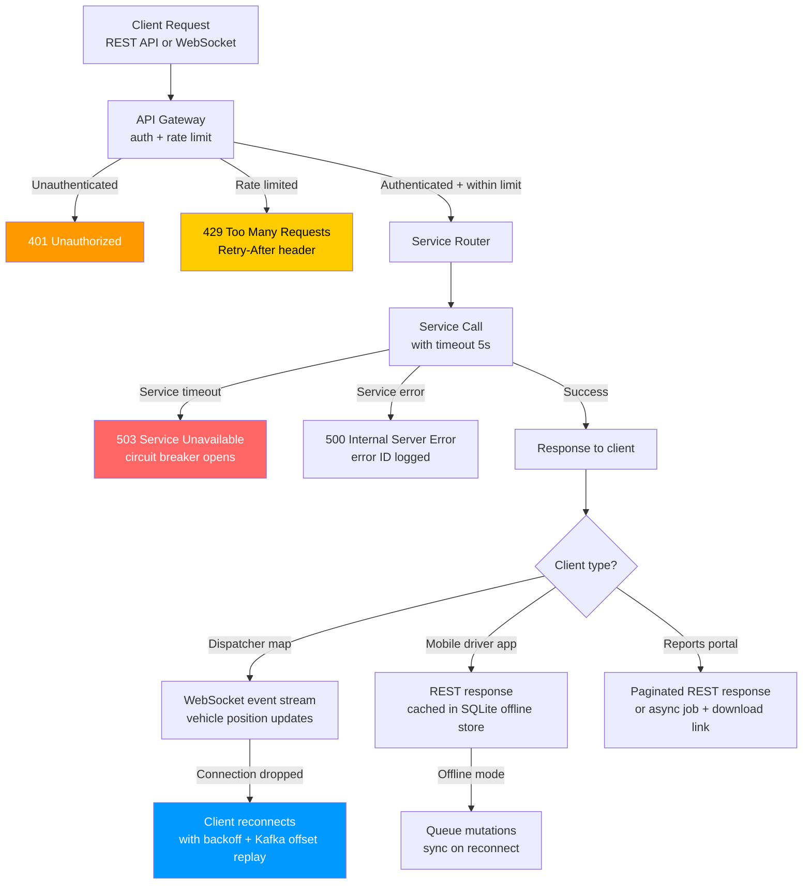

## API and UI Edge Cases

This file covers edge cases in the Fleet Management System's API layer and user interfaces, including the dispatcher web application, driver mobile app, and Fleet Manager reporting portal. Failures in this layer degrade operational efficiency even when the underlying data and services are functioning correctly. Issues covered include stale map state, duplicate request handling, reporting performance, offline mobile sync, rate limiting, and WebSocket reconnection.

## Failure Detection and Recovery Flow

## EC-01: Dispatcher Map Shows Vehicles in Wrong Positions

**Failure Mode:** The dispatcher map renders vehicle positions from a Redis-backed live cache. When the WebSocket connection between the dispatcher browser client and the `position-streaming` service is silently dropped (due to a load balancer timeout, network blip, or service pod restart), the client stops receiving position update events. The map continues to display the last-known positions, which become increasingly stale. Dispatchers make routing decisions based on positions that may be minutes or tens of minutes out of date.

**Impact:** A dispatcher who believes a vehicle is at position A may assign a pickup to that vehicle when the vehicle is actually 20 km away. Incorrect ETA calculations are communicated to customers. In emergency response fleets, stale vehicle positions can cause significant response delays. If the stale state persists across an HOS boundary, duty-segment attribution in compliance logs may be incorrect.

**Detection:** The WebSocket client implements a heartbeat: it sends a `ping` frame every 15 seconds and expects a `pong` response within 5 seconds. Three consecutive missed pongs classify the connection as dead. The client tracks a `lastEventReceivedAt` timestamp; if no events are received within 30 seconds (even in a low-traffic period where pings should still arrive), the connection is considered stale. A visible staleness indicator is shown on the dispatcher UI after 30 seconds without an update.

**Mitigation:** On connection drop detection, the client initiates reconnection with exponential backoff: 1s, 2s, 4s, 8s, up to a maximum of 30s between attempts. During the reconnect window, all vehicle position icons on the map are grayed out with a "reconnecting" overlay. The dispatcher UI shows a banner: "Live tracking temporarily unavailable — positions may be stale." Position data is not used for automated ETA calculations or geofence evaluations during the stale window.

**Recovery:** On successful reconnection, the client sends the timestamp of the last event it received (`?since=<ISO8601>`). The `position-streaming` service replays missed position events from the Kafka `vehicle_positions` topic starting at the offset corresponding to that timestamp. The client applies the replayed events to update all vehicle positions simultaneously, resolving the stale state. The staleness overlay is removed and normal operation resumes.

**Prevention:** Deploy the `position-streaming` WebSocket service behind a load balancer configured with WebSocket-aware sticky sessions (AWS ALB with `stickiness.enabled: true`) to prevent mid-session pod reassignments. Configure load balancer idle timeout to 120 seconds (above the 15-second heartbeat interval) to prevent premature connection termination. Use a service mesh (Istio) to surface WebSocket connection drop metrics and alert on abnormal drop rates.

---

## EC-02: Trip Creation API Receives a Duplicate Request

**Failure Mode:** A dispatcher clicks "Create Trip" and the API request is sent but the browser tab experiences a network stall (the request was sent but the response was lost). The dispatcher, seeing no feedback, clicks "Create Trip" again. Two identical trip creation requests arrive at the API with the same payload but without an idempotency key. Both requests pass initial validation and attempt to insert into the `vehicle_trips` table simultaneously.

**Impact:** If both requests succeed, the vehicle has two active trip records in the database. Both trips consume driver HOS, vehicle availability, and route capacity. The dispatcher sees two identical trips in the active trip list and must manually identify and cancel the duplicate. If the duplicate is not caught, two drivers may be assigned to the same trip, or the vehicle's HOS is double-counted in compliance calculations.

**Detection:** The trip creation endpoint requires an `Idempotency-Key` header (UUID v4 generated by the client). The first request with a given key is processed normally and the result is cached in Redis with the idempotency key as the cache key (`idempotency:{key}`) for 24 hours. Subsequent requests with the same key within 24 hours return the cached response without re-executing the creation logic. A PostgreSQL exclusion constraint on `(vehicle_id, status, overlapping time range)` provides a last-resort data-integrity guard against duplicates that bypass the idempotency cache.

**Mitigation:** If the exclusion constraint fires (indicating a duplicate that bypassed idempotency caching), the API returns HTTP 409 Conflict with the existing trip's ID in the response body (`conflict_trip_id`). The dispatcher UI receives the 409 and navigates to the existing trip rather than showing an error. A `duplicate_trip_attempt` audit log entry is written with the duplicate request details for operational review.

**Recovery:** If duplicate trips are discovered after the fact (via the nightly `TripIntegrityAuditJob`), a Fleet Manager reviews the duplicates and cancels the erroneous one. The cancelled trip's HOS and vehicle availability allocations are released. The audit job generates a Slack notification when duplicate trip count exceeds 0 on any given day, so the trend is visible to engineering.

**Prevention:** The dispatcher UI must disable the "Create Trip" button immediately on first click and display a loading spinner until the API response is received. Implement client-side idempotency key generation (using `crypto.randomUUID()`) in the form submission handler, persisting the key in session storage so that a page refresh does not generate a new key for the same in-progress submission. Include the `Idempotency-Key` header in the API client SDK documentation as a required field for all write operations.

---

## EC-03: Fleet Manager Reports Page Times Out on Large Dataset

**Failure Mode:** A Fleet Manager requests a "Fleet Utilization Report" for the previous 12 months across 800 vehicles. The query joins `vehicle_trips`, `gps_pings`, `driver_duty_logs`, and `fuel_transactions` across a 12-month date range. Without pagination and with TimescaleDB chunk count spanning 52 weekly chunks, the query runs for 45 seconds before the API gateway's 30-second timeout terminates the connection. The Fleet Manager receives a "504 Gateway Timeout" error.

**Impact:** Fleet Managers are unable to generate strategic reports that cover periods longer than a few weeks. This limits visibility into long-term utilization trends, maintenance cost analysis, and driver performance benchmarking. In preparation for FMCSA audits, the inability to export historical records in bulk delays compliance preparation.

**Detection:** Report endpoints track query duration via `pg_stat_statements`. Queries exceeding `REPORT_SLOW_QUERY_THRESHOLD_MS` (5,000 ms) are logged to the `slow_query_log` table. A Prometheus histogram `report_query_duration_seconds` with labels for report type and date range is monitored. Alert on p95 > 15 seconds. The API gateway logs all 504 responses with the upstream service and endpoint for trending.

**Mitigation:** Reports with estimated result row count above `ASYNC_REPORT_THRESHOLD_ROWS` (50,000 rows, estimated via `EXPLAIN`) or requested date ranges exceeding 90 days are automatically routed to an asynchronous report generation job. The API immediately returns HTTP 202 Accepted with a `job_id`. The job runs as a background Kubernetes Job, writing the result to a PostgreSQL `report_results` table and an S3 bucket. The Fleet Manager receives an in-app notification with a download link when the report is ready.

**Recovery:** If a background report job fails (OOM, timeout in the job pod), the failure is logged and the Fleet Manager is notified with an error message. The job can be retried from the Fleet Manager UI with a single click. For very large reports, the job is split into monthly sub-jobs that are merged after all sub-jobs complete, preventing any single sub-job from exceeding memory limits.

**Prevention:** Apply TimescaleDB continuous aggregate materialization for the most common report metrics (daily mileage per vehicle, monthly fuel consumption, driver HOS utilization) so that long-range reports can be served from pre-aggregated data rather than raw hypertable scans. Index all foreign key columns and date range columns with partial indexes on `status = 'completed'` to avoid full-table scans in report queries. Provide Fleet Managers with date range pickers that surface estimated data volume before the query is submitted.

---

## EC-04: Mobile Driver App Submits HOS Update While Offline

**Failure Mode:** A driver completes a duty-status change (e.g., switches from `on_duty_not_driving` to `driving`) while in a cellular dead zone. The mobile app records the event in its local SQLite database and queues it for sync. The driver re-enters coverage 45 minutes later, and the queued HOS event syncs to the server. However, the server's HOS engine already processed subsequent events from a different source (e.g., an automatic `driving` status triggered by GPS movement detection) during the offline window.

**Impact:** The late-syncing HOS event may conflict with server-side HOS records, causing duplicate duty segments, incorrect cumulative hour calculations, or a duty log that shows the driver as simultaneously in two statuses. FMCSA regulations require that ELD records accurately reflect actual duty status; conflicts that cannot be automatically resolved require manual driver annotation, which may trigger an audit flag.

**Detection:** The HOS sync endpoint checks the submitted event's `device_timestamp` against the last server-recorded event for the driver. If the submitted timestamp is before the last server-recorded event (i.e., it is a late arrival), the event is tagged `late_arriving: true`. The HOS engine identifies conflicts by scanning for overlapping duty segments within a 5-minute tolerance window.

**Mitigation:** Conflicts are classified into two categories: (1) auto-resolvable — the late-arriving event matches the server-inferred status and can be merged without data loss; (2) manual review required — the late-arriving event conflicts with a server-recorded status. Auto-resolvable conflicts are merged silently with a `conflict_resolution: auto_merged` annotation. Manual conflicts generate a `hos_conflict_review` task assigned to the driver's Fleet Manager, with both the device-reported and server-recorded versions displayed side by side.

**Recovery:** The driver and Fleet Manager resolve manual conflicts by selecting the correct status from the conflicting pair and annotating the record with the reason (ELD app note, FMCSA required annotation for any change to a submitted ELD record). The resolved record is locked against further modification and marked `manually_certified: true`. The HOS totals are recalculated from the corrected event sequence.

**Prevention:** The offline sync protocol uses a vector clock / sequence number scheme: every HOS event is tagged with a monotonically increasing `sequence_number` local to the device session. The sync endpoint processes events in sequence order, not arrival order, so late-arriving events are inserted at the correct position in the duty log timeline. The driver app should display a "sync pending" indicator whenever queued offline events exist, prompting the driver to seek connectivity.

---

## EC-05: API Gateway Rate Limits Legitimate High-Frequency GPS Bulk Import

**Failure Mode:** A fleet operator integrates a third-party telematics platform that periodically sends bulk GPS ping batches to the Fleet Management System's REST API. The batch job sends 10,000 pings in a single burst every 5 minutes. The API gateway's default rate limit of 1,000 req/min per API key blocks the majority of the batch, returning 429 responses. The telematics integration retries immediately, causing a retry storm that further exhausts the rate limit.

**Impact:** GPS position history has large gaps during batch import windows, affecting mileage calculations, geofence event reconstruction, and IFTA reports. The retry storm from rate-limited responses consumes API gateway capacity that could serve real-time dispatcher and driver requests. The third-party integration team receives support escalations and may disable the integration.

**Detection:** The API gateway logs `429` responses with the associated API key and rate limit tier. A Prometheus metric `api_gateway_rate_limit_rejections_total` labeled by `api_key_tier` and `endpoint` alerts when the GPS bulk import endpoint exceeds 50 rejections per minute. The batch import API key is identified as a distinct client tier via the `X-Fleet-Client-Type: bulk-import` header.

**Mitigation:** A dedicated `/v1/gps/bulk` endpoint accepts batch payloads of up to 5,000 pings per request, with a rate limit of 20 req/min (100,000 pings/min effective capacity) on the `bulk-import` API key tier. The bulk endpoint accepts the array, acknowledges with HTTP 202 and a `batch_id`, and processes asynchronously via a Kafka producer that publishes each ping to the `gps_pings_raw` topic. The response includes a `batch_status_url` for the integration to poll for processing completion.

**Recovery:** For integrations that have been rate-limited on the standard endpoint before the bulk endpoint is adopted, a `GPSBatchReplayJob` can ingest historical ping files (CSV or JSON) uploaded to a pre-signed S3 URL. This provides a recovery path for gaps caused by earlier rate limiting without requiring the integration to re-send pings over the API. The Fleet Manager is notified when the replay is complete and the mileage/geofence records have been reconstructed.

**Prevention:** During API key provisioning, require operators to declare their integration type (real-time device, bulk import, or reporting). Key type determines the rate limit tier applied at the gateway. Document the bulk import endpoint prominently in the integration guide and provide reference client implementations that use batch endpoints by default for telematics platform integrations. Apply exponential backoff with jitter in all retry logic, with a `Retry-After` header respected by the client.

---

## EC-06: Real-Time Dashboard Loses WebSocket Connection During Vehicle Tracking

**Failure Mode:** A dispatcher is monitoring 150 vehicles on the live tracking dashboard when a rolling Kubernetes deployment restarts the `position-streaming` pods. The WebSocket connections, established directly to individual pods, are terminated. The client-side reconnection logic uses a fixed 5-second retry interval without backoff, causing all 200+ connected dispatcher clients to attempt reconnection simultaneously, overwhelming the new pods before they are fully warmed up.

**Impact:** The thundering herd of simultaneous reconnections causes the new pods to be CPU-bound during warm-up, extending the recovery window from seconds to minutes. Dispatchers experience a multi-minute blackout of vehicle positions. If the deployment occurs during a busy dispatch window (morning shift start), the outage coincides with peak dispatcher activity. Kafka consumer lag in the `vehicle_positions` topic grows during the blackout.

**Detection:** Pod restart events are monitored via Kubernetes event watching. A `K8sRollingDeploymentAlert` fires when a deployment rollout begins on the `position-streaming` Deployment, pre-emptively warning the on-call SRE. Client-side connection drop rate is tracked via a `WebSocket.onclose` telemetry event sent to the application analytics endpoint before the connection is lost. The analytics service tracks `websocket_disconnect_rate_per_minute` and alerts on spikes.

**Mitigation:** Client reconnection uses a full jitter exponential backoff: `delay = min(cap, base * 2^attempt * random(0, 1))` with `base = 500ms` and `cap = 30s`. This spreads 200 reconnection attempts across a 0–30 second window instead of hitting simultaneously. The API gateway's WebSocket listener is pre-scaled 2 minutes before a scheduled deployment using a pre-deployment hook that signals the HPA to increase replica count before the rollout begins.

**Recovery:** On successful reconnection, each client requests a `since` replay from the last received Kafka offset. The `position-streaming` service maintains a per-session `last_offset` in Redis to support replay from any offset within the last 30 minutes. Clients that reconnect within 30 minutes of disconnection receive all missed events; clients reconnecting after 30 minutes receive the current fleet snapshot and resume normal streaming. Kafka consumer lag is resolved within minutes as the consumer group stabilizes after the deployment.

**Prevention:** Deploy the `position-streaming` service with `RollingUpdate` strategy and `minReadySeconds: 30` to ensure new pods are serving traffic before old pods are terminated. Configure pre-stop lifecycle hooks with a 10-second graceful drain period, allowing in-flight WebSocket messages to be flushed before pod shutdown. Use connection draining at the load balancer level (AWS ALB deregistration delay 30s) to give clients a graceful 30-second window to reconnect to the remaining pods before the draining pod is fully removed.
