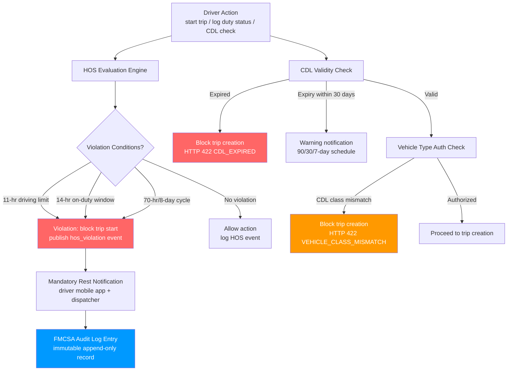

## Driver Management Edge Cases

This file covers edge cases in the driver management domain, encompassing Hours-of-Service (HOS) compliance under FMCSA 49 CFR Part 395, CDL validation and expiry enforcement, vehicle type authorization, concurrent driver session conflicts, driver scoring, and in-progress trip handling when a driver's employment status changes. Driver management failures directly affect regulatory compliance, public safety, and the carrier's operating authority.

## Failure Detection and Recovery Flow

## EC-01: HOS Violation Detected During an Active Trip

**Failure Mode:** A driver exceeds the FMCSA 11-hour driving limit or the 14-hour on-duty window while a trip is in progress. The HOS engine, which evaluates cumulative duty hours in real time as duty-status events arrive from the driver mobile app, detects the violation mid-trip. The driver may be unaware they are approaching the limit, or may have dismissed previous soft-warning notifications.

**Impact:** Driving in violation of HOS rules is a critical FMCSA violation. If the driver is involved in an accident while in violation, the carrier's liability exposure is significantly elevated. DOT roadside inspections will flag the violation in the CSA (Compliance, Safety, Accountability) SMS system, affecting the carrier's Safety Measurement System scores. Repeated violations can result in carrier out-of-service orders.

**Detection:** The HOS engine re-evaluates cumulative hours on every duty-status event and on a 1-minute timer tick for drivers in `driving` status. Soft warnings are generated at 80 % and 95 % of each limit. A hard violation event is generated at 100 %. The `hos_violation_events` Kafka topic receives an event containing `driver_id`, `violation_type`, `hours_used`, `hours_limit`, `trip_id`, and `timestamp`. The violation is also written synchronously to the `fmcsa_audit_log` (append-only, no deletes, no updates).

**Mitigation:** On hard violation detection, the driver app displays a full-screen mandatory rest notification with the required rest duration. The in-progress trip is flagged as `hos_violated: true` but is not automatically terminated (the vehicle may be moving at highway speed and an abrupt stop would be unsafe). The dispatcher is alerted with the driver's current GPS position and the remaining driving time available. The system recommends the three nearest safe rest stops or truck stops.

**Recovery:** The driver must enter a `sleeper_berth` or `off_duty` status to begin the mandatory rest period. The HOS engine monitors the rest period and clears the violation state once the required consecutive rest hours have elapsed (10 hours for property-carrying drivers). The trip is resumed or reassigned to a relief driver. All HOS events, including the violation and rest period, are retained in the immutable audit log and are available for FMCSA export.

**Prevention:** Configure HOS soft warnings at 80 % of each limit and enable an in-cab audio alert via the ELD device at the 95 % threshold. The trip creation pre-check must refuse to create trips where the estimated duration would exceed the driver's remaining available hours given current HOS state. Route optimization must factor available HOS hours into route feasibility scoring, incorporating mandatory rest stops when hours are insufficient for a direct route.

---

## EC-02: Driver CDL Expires Mid-Assignment Period

**Failure Mode:** A driver's Commercial Driver's License (CDL) expiry date passes while the driver is in the middle of an active assignment period or is scheduled for trips in the coming days. The CDL expiry may coincide with a weekend, holiday, or a period when the Fleet Manager is out of office, causing it to be missed.

**Impact:** Operating a commercial motor vehicle with an expired CDL is a criminal offense under FMCSA 49 CFR Part 383 and most state transportation laws. The carrier is liable for knowingly dispatching a driver with an expired license. Insurance coverage may be voided for incidents occurring while the driver was operating with an expired CDL. The driver faces personal fines, license suspension, and potential criminal charges.

**Detection:** A `CDLExpiryMonitor` service queries the `drivers` table daily for all CDLs with `expiry_date` within the next 90 days. It publishes warning events to the `driver_compliance_alerts` Kafka topic at 90-day, 30-day, 7-day, 3-day, and 1-day intervals before expiry. These events generate push notifications to the driver app, email notifications to the Fleet Manager, and tasks in the compliance management queue. On the expiry date, the driver's status is automatically set to `cdl_expired` and all future trip assignments for that driver are blocked.

**Mitigation:** When a CDL expiry is detected within 7 days, the Fleet Manager's dashboard prominently flags the driver with an orange "CDL Expiring Soon" badge. Trip creation for the driver is blocked 1 day before expiry (configurable `CDL_BLOCK_DAYS_BEFORE_EXPIRY`) to allow time to confirm renewal before the driver's next shift. Dispatchers see a `CDL_EXPIRING` warning when attempting to assign the driver to a trip during the warning window.

**Recovery:** Once the driver renews their CDL, a Fleet Manager or HR administrator updates the CDL record in the driver profile with the new expiry date and license number, attaching a scan of the renewed license. The `cdl_expired` status is cleared and the driver is returned to `active` status. If the driver has trips scheduled that were blocked due to the expiry, the dispatcher receives a notification to proceed with assignment.

**Prevention:** Integrate with state DMV license verification APIs (where available) to receive proactive expiry notifications directly from the issuing authority. Store the CDL issuing state and license number to enable automated lookup. Establish a fleet policy requiring drivers to submit renewal documentation 30 days before expiry. Include CDL expiry status in the driver's monthly performance review to ensure it is tracked as a routine administrative responsibility.

---

## EC-03: Driver Attempts to Operate Unauthorized Vehicle Type

**Failure Mode:** A driver with a Class B CDL (authorized for vehicles with GVWR over 26,000 lbs but not combination vehicles) is assigned to a trip in a Class A combination vehicle (semi-truck with trailer, GVWR over 26,001 lbs for the combination). The assignment may be made by a dispatcher who is unaware of the CDL class restriction or by an automated optimization system that does not check CDL class against vehicle GVWR.

**Impact:** Dispatching a Class B driver in a Class A vehicle is an FMCSA violation under 49 CFR Part 383.37. Any accident in the combination vehicle would expose the carrier to liability for negligent entrustment. State law enforcement at weigh stations or during roadside inspections would place the driver and vehicle out of service, causing significant delivery delay and fine exposure.

**Detection:** The trip creation service performs a vehicle authorization check as part of the pre-trip validation: it retrieves the driver's `cdl_class` and the vehicle's `gvwr_lbs` and `vehicle_type` (solo, combination, double/triple) from the PostgreSQL `drivers` and `vehicles` tables. The authorization matrix is encoded in a `vehicle_authorization` lookup table that maps CDL class + endorsements to permitted vehicle types. A mismatch returns HTTP 422 with error code `VEHICLE_CLASS_MISMATCH`.

**Mitigation:** The trip creation API response includes a human-readable explanation of the authorization failure (e.g., "Driver holds Class B CDL. Vehicle requires Class A CDL for combination vehicle operation.") and a suggested list of drivers in the same yard who hold the required CDL class and are within HOS limits. The dispatch UI surfaces a vehicle assignment filter that only shows vehicles authorized for the selected driver's CDL class by default.

**Recovery:** The dispatcher selects an authorized driver from the suggested list. If no authorized driver is available at the required yard, the Fleet Manager is notified to arrange either a driver transfer or a vehicle swap. The failed assignment attempt is logged in `trip_creation_audit_log` with the driver ID, vehicle ID, and rejection reason for compliance traceability.

**Prevention:** Build CDL class validation into the automated route optimization assignment engine so that vehicle-driver matching respects CDL class constraints before routes are generated. During driver onboarding, the HR system should record all CDL classes and endorsements (Hazmat, Tanker, Passenger, School Bus, Doubles/Triples) with expiry dates for each endorsement. Vehicle records should be tagged with the minimum required CDL class and all applicable endorsements to enable automated matching.

---

## EC-04: Multiple Drivers Clock Into the Same Vehicle Simultaneously

**Failure Mode:** Two drivers attempt to start duty in the same vehicle at the same time — for example, during a team-driving handoff where both drivers are logged into the ELD simultaneously, or due to a dispatcher error that assigns the same vehicle to two different drivers' shift schedules. A race condition in the trip creation service allows both trip records to be created before the overlap constraint is enforced.

**Impact:** ELD regulations (49 CFR Part 395.15) permit team driving with two drivers in a vehicle, but require each driver to log their own HOS status independently. An unintended dual clock-in corrupts HOS records for both drivers: mileage is double-counted, and the co-driver's off-duty or sleeper-berth time may be incorrectly classified as driving. Conflicting GPS position ownership also produces data quality issues in the `vehicle_trips` table.

**Detection:** The trip creation endpoint acquires a `SELECT FOR UPDATE` advisory lock on the `vehicle_id` row in the `vehicles` table before checking for active trips. A unique partial index on `vehicle_trips(vehicle_id)` where `status IN ('in_progress', 'assigned')` and `is_team_drive = false` prevents two non-team-drive trips from being created for the same vehicle. For legitimate team-drive trips, the `is_team_drive` flag must be explicitly set and both driver IDs must be present.

**Mitigation:** When the overlap constraint fires, the API returns HTTP 422 with error code `VEHICLE_TRIP_CONFLICT` and the ID of the existing active trip and its assigned driver. The dispatcher UI surfaces both driver names and trip IDs to facilitate manual resolution. The second trip creation is rolled back entirely. A `trip_conflict_events` Kafka event is published so that audit systems can track conflict frequency.

**Recovery:** The dispatcher resolves the conflict by either: (a) converting the existing trip to a team-drive trip and adding the second driver, (b) reassigning the second driver to a different vehicle, or (c) canceling one of the trips. The HOS engine recalculates both drivers' duty records once the conflict is resolved to ensure no duplicate mileage or duty time was recorded.

**Prevention:** The vehicle assignment step in the dispatcher UI should display a real-time vehicle availability indicator showing "occupied" for vehicles with active trips, making duplicate assignment visually obvious. Automated route optimization must check vehicle availability as an allocation constraint. Implement a pre-assignment lock that reserves the vehicle for 5 minutes during the dispatch workflow to prevent concurrent assignment by two dispatchers.

---

## EC-05: Driver Safety Score Drops Below Threshold After Series of Incidents

**Failure Mode:** A driver accumulates multiple harsh braking events, speeding violations, and HOS warnings over a rolling 30-day period, causing their calculated safety score to drop from 78 to 55 (below the fleet's minimum acceptable threshold of 60). The score recalculation runs as a nightly batch job, meaning the score may be below threshold for up to 24 hours before corrective action is triggered.

**Impact:** Drivers with low safety scores pose elevated accident risk and increase the carrier's insurance premiums through CSA SMS scoring. Without timely intervention, the driver continues to accumulate incidents during the recalculation window. If an accident occurs during this window, the carrier's awareness of the score drop without immediate action could be used as evidence of negligence in litigation.

**Detection:** In addition to the nightly batch recalculation, an event-driven score estimator triggers on each `safety_event` (harsh brake, speeding, HOS violation). The estimator computes an approximate current score delta and checks whether the estimated score has crossed the `SAFETY_SCORE_LOW_THRESHOLD` (60). If so, a `safety_score_low_warning` event is published immediately. The nightly batch job performs the authoritative recalculation. A Prometheus gauge tracks the count of drivers below threshold.

**Mitigation:** On a confirmed score drop below threshold, three actions are triggered simultaneously: (1) the driver is automatically enrolled in the coaching queue, generating a coaching session request assigned to their Fleet Manager; (2) the Fleet Manager and Safety Officer receive an in-app notification; (3) the driver's future trip assignments are flagged as `requires_safety_review` so that a Fleet Manager must manually approve each new trip until the score recovers above threshold. The driver is notified of the coaching enrollment via the mobile app.

**Recovery:** After completing the assigned coaching session, the Fleet Manager marks the session as complete with notes. The driver's score is re-evaluated immediately (not waiting for the nightly batch) based on the current 30-day event window. If the score is above 60, the `requires_safety_review` flag is cleared and normal dispatch resumes. If the score remains below 60 after 2 coaching sessions within 30 days, an HR review process is triggered under the fleet's disciplinary policy.

**Prevention:** Configure event-driven score notifications for drivers whose estimated score is trending toward the threshold (below 70) and proactively queue a coaching session before the hard threshold is crossed. Display the driver's rolling safety score on their mobile app home screen so they have continuous visibility into their performance. Implement gamification elements (leaderboards, score improvement streaks) to motivate safety-conscious driving behavior.

---

## EC-06: Driver Is Terminated but Has an In-Progress Trip

**Failure Mode:** A driver's employment is terminated (voluntarily or involuntarily) while they are in the middle of a multi-day trip. HR updates the driver record to `terminated` status in the HR system, which triggers a sync to the Fleet Management System. The driver's app access, login credentials, and dispatch assignments should be revoked — but the in-progress trip must be handled gracefully rather than abruptly abandoned.

**Impact:** Immediate access revocation without a handoff plan leaves the cargo in a vehicle that no one is authorized to drive. The driver, now without app access, cannot submit HOS logs, complete delivery confirmation, or communicate with dispatch. If the driver continues driving without a valid employment status, the carrier is operating an unregistered driver. Abrupt trip cancellation triggers financial penalties with customers and downstream logistics partners.

**Detection:** The HR system integration publishes a `driver_terminated` event to the `hr_events` Kafka topic. A `DriverTerminationHandler` consumer subscribes to this topic and checks the `vehicle_trips` table for any trips assigned to the terminated driver with `status IN ('in_progress', 'assigned')`. If an in-progress trip is found, the handler enters a graceful handoff workflow rather than immediately revoking all access.

**Mitigation:** The terminated driver's access is placed in `pending_revocation` state: they retain read-only access to their current trip details and messaging for a configurable grace period (default 4 hours or until the trip reaches a safe stopping point). The Fleet Manager and dispatcher are immediately alerted with the driver's current GPS position, remaining trip legs, and a list of available replacement drivers near the vehicle's current location. The driver's login is fully revoked when the handoff is confirmed.

**Recovery:** A replacement driver is assigned to the trip. The original driver's in-progress trip record is transferred to the replacement driver (maintaining the original `trip_id` for continuity). The original driver's HOS records up to the handoff point are finalized and locked. All access credentials (JWT tokens, mobile app sessions, MQTT device authentication) for the terminated driver are revoked after the handoff is confirmed, and the revocation is recorded in the security audit log.

**Prevention:** Establish a pre-termination checklist in the HR system that requires Fleet Manager confirmation before the termination is processed when the driver has an active trip. For voluntary terminations with notice periods, plan the termination effective date to coincide with a trip boundary. Implement a "driver handoff" workflow that can be initiated independently of the termination event, so that graceful trip transfers are practiced routinely and not only under emergency conditions.
