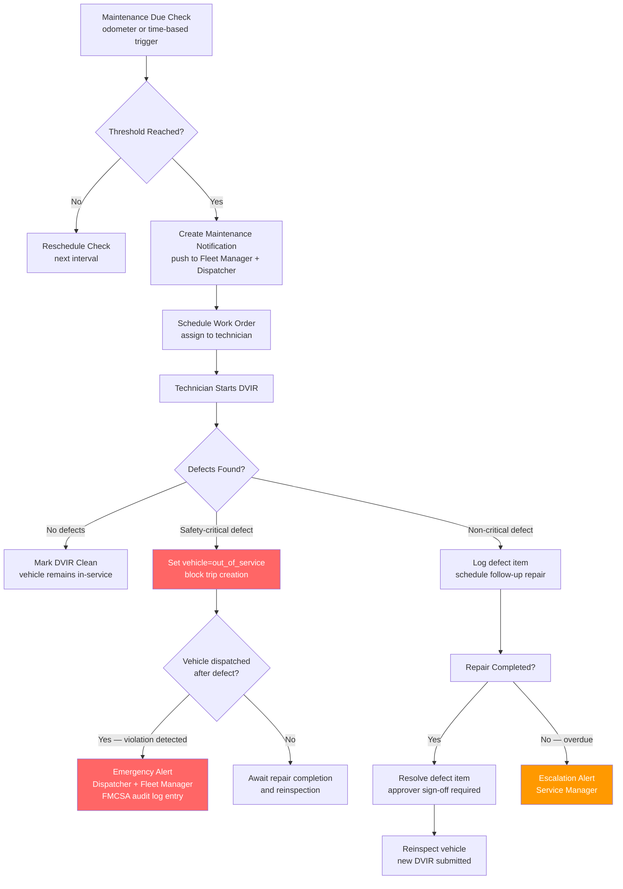

## Maintenance Scheduling Edge Cases

This file covers edge cases in the maintenance scheduling domain of the Fleet Management System, including DVIR (Driver Vehicle Inspection Report) workflows, service interval tracking, odometer anomaly handling, offline technician submissions, and overlapping work order management. Maintenance failures that go undetected have direct safety and regulatory consequences: an out-of-service vehicle driven in violation, or a missed oil-change interval, can result in FMCSA citations, vehicle breakdown, and liability exposure.

## Failure Detection and Recovery Flow

## EC-01: Maintenance Record Not Created When Vehicle Reaches Service Interval

**Failure Mode:** The service interval scheduler polls GPS odometer data to determine when a vehicle has accumulated enough mileage since its last service. If GPS pings are missing for an extended period (device failure, signal loss, or fleet downtime), the cumulative odometer value in TimescaleDB never crosses the service threshold, and no maintenance notification is created. Meanwhile, the vehicle has physically traveled the required distance; the gap in telemetry simply prevented the system from observing it.

**Impact:** The vehicle misses a scheduled oil change, brake inspection, or tire rotation. In regulated commercial vehicle operations, missing mandatory PMVI (Periodic Motor Vehicle Inspection) intervals can result in FMCSA out-of-service orders during roadside inspections. Extended intervals for safety-critical maintenance items increase breakdown risk and void manufacturer warranties.

**Detection:** A dual-trigger system is used: odometer-based triggers fire when the GPS-reported cumulative mileage crosses the interval threshold, and time-based triggers fire when the elapsed calendar days since the last service exceeds a configurable maximum (e.g., 90 days regardless of mileage). A `MaintenanceDriftMonitor` checks daily for vehicles where the time-based trigger would fire within 14 days and the GPS odometer data has gaps exceeding 20 % of the expected mileage accumulation rate.

**Mitigation:** When GPS odometer data is insufficient to confirm mileage, the system falls back to an estimated odometer derived from the vehicle's average daily mileage (computed from the previous 90 days of GPS data) multiplied by the days elapsed since the last ping. This estimated mileage is stored with a `source: estimated` flag and generates a maintenance notification marked `estimate_used: true` so the Fleet Manager knows a physical odometer reading should be verified before the work order is closed.

**Recovery:** When the GPS device resumes transmitting, the true odometer value is reconciled with the estimate. If the actual mileage is higher than the estimate and the service threshold was already exceeded, an overdue maintenance alert is generated immediately. The work order is escalated from `scheduled` to `overdue` status, triggering a higher-priority notification chain including the Fleet Manager and Safety Officer.

**Prevention:** Require all fleet vehicles to report odometer readings via a secondary channel (ELD integration or manual driver entry in the mobile app) at the start of each shift. These readings provide a fallback odometer source independent of GPS continuity. Configure SMS or push alerts for any vehicle that has not reported a GPS ping in more than 24 hours so that telemetry gaps are surfaced before they cause maintenance calculation failures.

---

## EC-02: DVIR Submitted with Safety-Critical Defect but Vehicle Continues Operating

**Failure Mode:** A driver submits a DVIR marking a safety-critical defect (e.g., brake failure, steering issue, inoperative headlights) but the vehicle's operational status is not updated to `out_of_service` in time to block a dispatcher from creating a new trip assignment. This can occur due to a race condition where the DVIR webhook is processed asynchronously and the trip creation request is submitted in the brief window before the status update completes.

**Impact:** This is a critical safety and regulatory failure. Dispatching a vehicle with a known safety defect violates FMCSA 49 CFR Part 396 and exposes the fleet operator to civil liability, DOT citations, and potential criminal charges in the event of an accident. A subsequent roadside inspection would find both the unresolved defect and the evidence of continued operation, compounding the violation.

**Detection:** The DVIR submission endpoint performs a synchronous safety-critical defect classification before returning a response. If any defect item is tagged with `severity: safety_critical`, the endpoint immediately writes `vehicle.status = out_of_service` within the same database transaction before the DVIR is confirmed as submitted. A `DVIRSafetyViolationEvent` is published to Kafka with sub-second latency. The trip creation service subscribes to this topic and maintains an in-memory set of `out_of_service` vehicle IDs for instant rejection.

**Mitigation:** Trip creation validates vehicle status with a `SELECT FOR SHARE` lock on the vehicle row, preventing concurrent status changes from being missed. An `out_of_service` vehicle returns HTTP 422 with error code `VEHICLE_OUT_OF_SERVICE` and includes the DVIR ID and defect description in the response body so the dispatcher understands why the assignment failed. The dispatch UI surfaces a prominent red banner on the vehicle card.

**Recovery:** The vehicle remains `out_of_service` until a repair technician marks all safety-critical defect items as resolved with repair notes, and a second authorized user (Fleet Manager or Safety Officer) provides approver sign-off. A follow-up DVIR must be submitted by the driver before the vehicle is returned to `in_service` status. All status transitions are recorded in the `vehicle_status_audit_log` table with user ID, timestamp, and associated DVIR/repair record IDs.

**Prevention:** The FMCSA DVIR webhook processing must be synchronous for safety-critical defects — never deferred to a background queue. Implement a database-level `CHECK` constraint and a Postgres trigger that prevents insertion of a `vehicle_trips` record for any vehicle with `status = out_of_service`. This provides a last-resort data integrity guard independent of application-layer validation.

---

## EC-03: Maintenance Record Marked Complete Without Resolving All Defects

**Failure Mode:** A technician marks a work order as `complete` in the mobile app, but one or more defect items recorded in the associated DVIR have not been given resolution notes. This can occur when a technician handles only part of a multi-item work order, or when the mobile app allows the complete action despite validation warnings that are dismissed.

**Impact:** A vehicle returns to `in_service` status with unresolved defect items on record. Compliance auditors reviewing the maintenance history will find a closed work order with open defects, which is a FMCSA recordkeeping violation. If the unresolved defect is safety-critical, the vehicle is operating in violation of out-of-service criteria.

**Detection:** The work order completion endpoint validates that every DVIR defect item linked to the work order has a non-null `resolution_notes` field and a `resolved_by` user ID before allowing the status transition to `complete`. A database-level constraint (`CHECK`) enforces this invariant. Incomplete items return an HTTP 422 with a list of unresolved defect item IDs.

**Mitigation:** The work order UI groups defect items by severity and requires the technician to explicitly mark each item as either `repaired`, `parts_ordered_monitoring`, or `deferred_non_safety` (with a non-safety justification). The `deferred_non_safety` classification requires a Fleet Manager approval workflow before the work order can be closed. Safety-critical items cannot be deferred — they must be marked `repaired` with a parts/labor record attached.

**Recovery:** If a work order is discovered to have been closed with unresolved defects (e.g., discovered during an audit or external inspection), a `ComplianceReviewFlag` is created linking the work order and the unresolved items. The vehicle is placed in `pending_review` status until a physical inspection confirms the defect status. The work order is reopened, additional repair tasks are added, and the event is recorded in the compliance audit log.

**Prevention:** Require a mandatory pre-close checklist in the technician mobile app that surfaces all open defect items before the complete action is available. Implement approver sign-off as a two-person integrity control: the technician submits for completion and a Fleet Manager approves, reviewing the defect resolution record before the status change is committed. Automated nightly audits scan for closed work orders with unresolved defect items and generate compliance flags proactively.

---

## EC-04: Odometer Reading Reset or Rolled Back

**Failure Mode:** A GPS device is replaced on a vehicle, and the new device begins reporting odometer values from zero or from a lower value than the previous device's last reading. Alternatively, a firmware bug causes the device to report the engine odometer incorrectly after a reset, producing a sequence of pings where the cumulative mileage decreases over time.

**Impact:** The service interval calculator, which tracks mileage accumulation since the last service, will compute a negative or near-zero mileage delta and conclude that no maintenance is due. The vehicle can accumulate tens of thousands of kilometers of actual mileage without any maintenance notification being generated. IFTA fuel tax reports, which use GPS mileage by jurisdiction, will be incorrect for the affected period.

**Detection:** The telemetry enrichment pipeline computes a `odometer_delta` between consecutive pings. A negative `odometer_delta` (rollback) or a single-ping delta exceeding `MAX_ODOMETER_JUMP_KM` (default 500 km, configurable) triggers an `OdometerAnomalyEvent`. The event is written to the `odometer_anomalies` table with the before/after values and published to the `device_alerts` Kafka topic.

**Mitigation:** On detection of a rollback, the ingestion pipeline switches to `odometer_source: accumulated_delta` mode for that vehicle: it accumulates mileage from the anomaly point by summing GPS segment distances (Haversine) rather than trusting the device-reported odometer. This estimated odometer is stored alongside the raw device value in TimescaleDB. Maintenance interval calculations are paused pending manual review.

**Recovery:** A Fleet Manager reviews the anomaly in the maintenance admin UI, enters the correct odometer reading (from the physical vehicle display or ELD), and confirms the device replacement date. The system recalculates service intervals from the correct odometer baseline. Historical IFTA reports for the affected months are flagged for manual correction and regenerated after the baseline is confirmed.

**Prevention:** Device replacement procedures must include a mandatory odometer baseline entry step: the technician enters the current physical odometer reading in the device management portal before the new device is activated. This reading is stored as the `odometer_offset` for the device serial number. All subsequent pings from the new device add the offset before being stored, providing continuity across device replacements.

---

## EC-05: Multiple Overlapping Maintenance Schedules for the Same Vehicle

**Failure Mode:** A vehicle has multiple active maintenance schedules: a manufacturer oil-change schedule (every 10,000 km), a tire rotation schedule (every 15,000 km), and a fleet-mandated brake inspection (every 20,000 km). As the vehicle approaches a mileage milestone where two or three schedules trigger simultaneously, the system creates separate work orders for each, resulting in the vehicle being pulled from service multiple times within days or the technician receiving redundant work orders for the same shop visit.

**Impact:** Unnecessary out-of-service time (vehicle taken to the shop three times instead of once) reduces fleet utilization. Technicians receive conflicting work orders that reference the same vehicle, creating confusion about which tasks are in scope. If work orders are completed partially, some maintenance items may be missed because the technician assumed they were covered by another work order.

**Detection:** The `WorkOrderScheduler` runs a deduplication check when creating a new work order: it queries for any other pending or scheduled work orders for the same vehicle with a `scheduled_date` within a `WORK_ORDER_CONSOLIDATION_WINDOW` (default 14 days). If overlapping schedules are found, the new work order is not created independently but is instead linked to the existing work order as an additional task.

**Mitigation:** Work orders within the consolidation window are merged into a single `aggregated_work_order` with a composite task list sorted by priority (safety-critical first, then manufacturer-required, then fleet-optional). The aggregated work order displays a consolidated checklist to the technician and a single vehicle-out-of-service period to the dispatcher. The Fleet Manager receives a consolidation notification showing which schedules were merged and the resulting service date.

**Recovery:** If overlapping work orders have already been created before the deduplication logic was in place, a `WorkOrderDeduplicationJob` can be run manually to identify and merge open duplicate work orders for the same vehicle. Merged work orders retain the tasks, parts, and notes from all source records. Completed tasks in any source work order are carried forward as pre-completed items in the merged record.

**Prevention:** Enforce a database-level unique partial index on `vehicle_id` for work orders in `pending` or `scheduled` status within a given date window, preventing concurrent schedule triggers from creating duplicates. Build maintenance schedule creation with an explicit consolidation check as a pre-condition rather than a post-creation cleanup step. Provide Fleet Managers with a maintenance calendar view that visualizes all upcoming schedule triggers across the fleet to enable proactive consolidation.

---

## EC-06: Technician App Offline During DVIR Submission

**Failure Mode:** A technician completes a DVIR in the mobile app while in a cellular dead zone (inside a large warehouse, underground service bay, or rural yard). The app shows the DVIR as submitted from the technician's perspective, but the payload is queued in the device's offline store (SQLite). When connectivity is restored, the DVIR syncs to the server — but in the interim, a dispatcher has assigned the vehicle to a new trip, assuming no DVIR defects.

**Impact:** If the offline DVIR contained a safety-critical defect, the vehicle was dispatched in violation of FMCSA out-of-service requirements. Even for non-critical defects, the vehicle's maintenance record has a gap: it operated on a trip without a valid current-period DVIR on file, which is a recordkeeping violation. The driver of the new trip may be unaware of defects noted by the previous driver.

**Detection:** The vehicle's DVIR status in the server database has a `last_dvir_submitted_at` timestamp. The dispatcher UI and trip creation API validate that a DVIR was submitted within the preceding `DVIR_VALIDITY_HOURS` (default 24 hours) before allowing a new trip. If the offline DVIR has not yet synced, the last DVIR timestamp will be stale, and the trip creation will be blocked with a `DVIR_REQUIRED` error — prompting the dispatcher to contact the technician.

**Mitigation:** The mobile app displays a persistent "pending sync" indicator when DVIRs are queued offline. Dispatchers receive a `dvir_pending_sync` warning on the vehicle card in the dispatch UI when the last sync is older than 30 minutes. The technician app attempts sync in the background every 60 seconds and plays an audible confirmation when the DVIR is successfully received by the server. If the DVIR contains safety-critical defects, the sync is prioritized and retried every 10 seconds.

**Recovery:** On successful sync, the server processes the DVIR with its original submission timestamp (from the device clock). If a safety-critical defect is found in the synced DVIR and the vehicle has already been dispatched, an emergency alert is sent to the dispatcher and Fleet Manager. The in-progress trip is flagged for review and the driver is contacted via the in-app messaging channel. The conflict is logged in the `dvir_conflict_events` table for compliance review.

**Prevention:** Require DVIR submission as a prerequisite for the vehicle to be available for dispatch in the system. The pre-trip checklist in the driver mobile app and the technician app must both complete and sync before the vehicle's status transitions from `in_yard` to `available`. For high-throughput yards with known connectivity issues, install a local Wi-Fi access point in the inspection bay to ensure DVIR data syncs before vehicles leave the facility.
