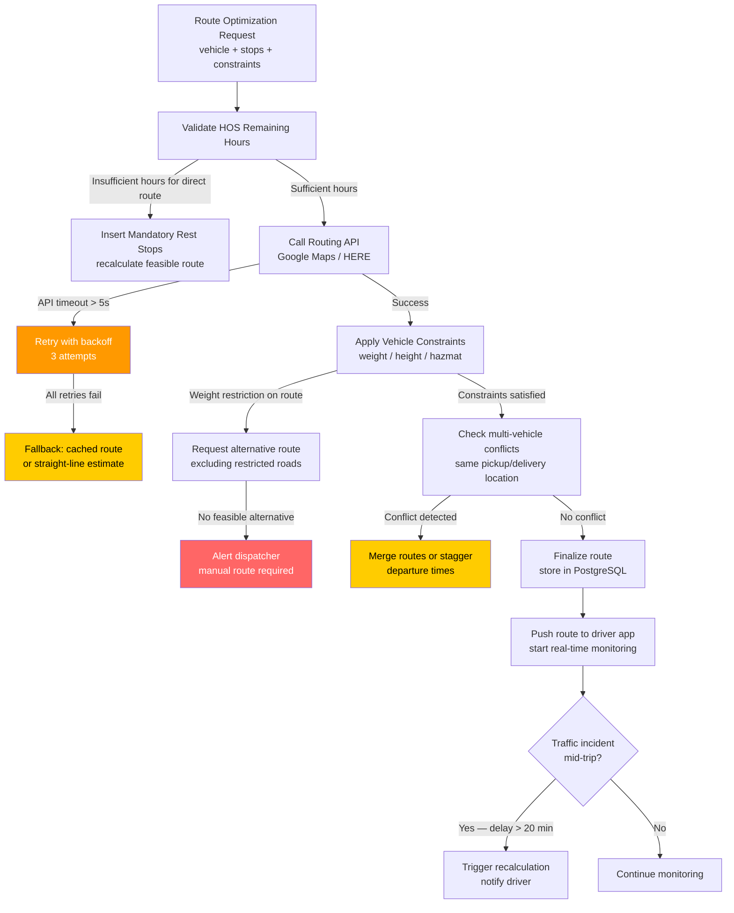

## Route Optimization Edge Cases

This file documents edge cases in the route optimization domain of the Fleet Management System, covering failures in external routing API integrations (Google Maps Platform, HERE Routing API), vehicle weight and restriction handling, mid-trip recalculation triggers, multi-vehicle dispatch conflicts, HOS-constrained routing, and toll cost reconciliation. Route optimization failures directly affect delivery SLAs, driver safety, fuel efficiency, and operational costs.

## Failure Detection and Recovery Flow

## EC-01: Route Optimization API Is Unavailable

**Failure Mode:** The Google Maps Platform Directions API or HERE Routing API returns HTTP 5xx errors, connection timeouts, or quota exhaustion errors (`OVER_DAILY_LIMIT`, `OVER_QUERY_LIMIT`) during a period of high route creation volume (e.g., morning dispatch rush). Route creation requests pile up and dispatchers are unable to assign trips.

**Impact:** Without route optimization, dispatchers cannot create accurate ETAs, fuel cost estimates, or delivery windows for customers. If fallback routing is not available, trips cannot be created at all, halting fleet operations. Quota exhaustion may last hours if the daily API quota has been consumed, preventing any new route creation for the remainder of the day.

**Detection:** The routing API client wraps each call in a circuit breaker (using `opossum` or a similar Node.js library) with a 5-second timeout. After 3 consecutive failures within a 30-second window, the circuit opens and routes all subsequent requests to the fallback handler. A `routing_api_unavailable` alert fires to PagerDuty. Prometheus metrics track `routing_api_error_rate` and `routing_api_latency_p99` per API provider, allowing detection of degradation before full outage.

**Mitigation:** The fallback handler checks the route cache in Redis (`route:cache:{origin_hash}:{destination_hash}:{vehicle_class}`) for a cached route from the previous 24 hours. If a cache hit is found, it is returned with a `source: cached` flag and a warning to the dispatcher that the route may not reflect current traffic conditions. If no cache hit is available, a straight-line distance is calculated using the Haversine formula, and a fixed `AVERAGE_ROAD_FACTOR` (1.3) is applied to estimate road distance, returning an approximate ETA.

**Recovery:** The circuit breaker enters half-open state after 60 seconds, sending a single probe request to the API. On success, the circuit closes and normal routing resumes. Cached routes used during the outage are tagged for recalculation once the API is available; a `RouteRefreshJob` processes the backlog of stale-cached routes. API quota exhaustion is mitigated by provisioning a secondary Google Maps API key with a separate quota, activated automatically by the circuit breaker as a hot standby.

**Prevention:** Distribute routing API calls across multiple API keys and both Google Maps and HERE providers, with load balancing weighted by current quota utilization. Implement a route pre-computation cache that proactively calculates common origin-destination pairs during off-peak hours (midnight–5 AM) so that morning dispatch can be served from cache even if the API is slow. Monitor daily quota consumption and alert at 70 % utilization to allow manual intervention before exhaustion.

---

## EC-02: Optimized Route Crosses Vehicle Weight or Height Restriction

**Failure Mode:** The routing API returns a route that includes a bridge with a posted weight limit of 15 tonnes, but the dispatched combination vehicle with loaded cargo weighs 22 tonnes. Alternatively, the route passes through an underpass with a 3.8 m height clearance while the vehicle has a 4.1 m total height. The routing API may not have current restriction data for all roads in its network, or the vehicle's weight/height parameters may not have been passed correctly to the API.

**Impact:** A vehicle that crosses a weight-restricted bridge risks structural damage to the bridge infrastructure, vehicle damage, driver injury, and significant legal liability. Overweight crossings are criminal offenses under most state bridge laws. Height restriction violations result in vehicle damage, cargo loss, road infrastructure damage, and potential fatal accidents if the collision occurs at speed.

**Detection:** Vehicle constraints (GVWR, axle weights, height, width, length, hazmat class) are stored in the `vehicles` table. The routing API request includes these constraints as parameters (`avoid=tolls|ferries|highways`, `vehicle.height`, `vehicle.weight` in Google Maps; `vehicle[height]`, `vehicle[weight]` in HERE). After route generation, a post-processing step queries the `road_restrictions` table (populated from FHWA bridge database and state DOT APIs) against each road segment in the route using a spatial join.

**Mitigation:** If a restriction is detected, the routing service automatically requests an alternative route with the restricted road segments added to the `avoid` parameter. Up to 3 alternative routes are requested. If all alternatives still contain restriction violations, the route is flagged as `manual_routing_required` and returned to the dispatcher with a visual overlay of the restricted segments on the map. The dispatcher must manually select a safe route or coordinate with the Fleet Manager to use a different vehicle.

**Recovery:** The driver app displays active route restrictions as a persistent map overlay for the assigned route, providing an in-cab reminder. If a driver deviates from the assigned route and approaches a restricted road (detected within 1 km by geofence proximity), the app generates a real-time warning with the restriction details and the nearest compliant detour. Deviation events are logged in `route_compliance_events` for post-trip analysis.

**Prevention:** Build vehicle constraint validation into the vehicle record creation workflow, requiring GVWR, axle configuration, height, and width to be entered before a vehicle can be assigned to trips. Maintain a local copy of the FHWA National Bridge Inventory and state DOT restriction databases, refreshed weekly, for offline restriction checking independent of routing API data quality. Require dispatchers to confirm vehicle weight with the current loaded weight (from weigh ticket or load manifest) before initiating route optimization.

---

## EC-03: Mid-Trip Traffic Incident Causes Route Recalculation

**Failure Mode:** A vehicle is 40 % through its assigned route when a major traffic incident (accident, road closure, severe weather) creates a delay that will push the ETA beyond the customer delivery window. The driver continues following the original route because the driver app has not received a recalculated route. The dispatcher observes the ETA slipping on the map but the recalculation trigger threshold has not been met.

**Impact:** Missed delivery windows trigger SLA penalties with customers. Drivers following a congested route consume more fuel and accumulate more idle-time hours. If the delay is severe enough to push the driver over their HOS on-duty window, the driver will be forced to stop before completing the delivery, leaving cargo undelivered and requiring emergency reassignment.

**Detection:** A `TripMonitoringService` subscribes to real-time traffic data via the routing API's traffic stream and evaluates the impact on each active trip's ETA every 5 minutes. If the revised ETA exceeds the original ETA by more than `RECALCULATION_TRIGGER_MINUTES` (default 20 minutes) or the delay will cause an HOS violation, a recalculation is triggered. The driver's current GPS position is used as the new route origin.

**Mitigation:** The recalculated route is pushed to the driver app as a `route_update` WebSocket message. The driver app displays a notification: "Traffic delay detected — route updated. New ETA: [time]." The dispatcher receives a simultaneous notification showing the old ETA, new ETA, and cause of delay. Customer delivery notifications are updated via the customer notification service with the revised ETA. If the revised ETA exceeds the delivery window, the customer notification includes an apology and a rescheduling option.

**Recovery:** If the recalculation produces a route that saves more than 15 minutes over the current route, the driver is prompted to accept the new route (with a 30-second auto-accept timeout for non-response). If the driver manually rejects the reroute (e.g., they have local knowledge of a better path), the rejection is logged and the dispatcher is notified. Trip ETA tracking continues on the driver's actual path using GPS dead-reckoning when off the planned route.

**Prevention:** Subscribe to traffic incident feeds (Google Maps Traffic, HERE Traffic, FHWA RITIS) with a webhook integration that proactively pushes incident notifications for geographic areas containing active trips, rather than polling. Pre-calculate 2–3 alternate route options at trip creation time for routes with historically high congestion probability, so that recalculation can serve from a pre-computed fallback rather than calling the routing API under time pressure.

---

## EC-04: Multiple Vehicles Assigned to the Same Pickup or Delivery Location Simultaneously

**Failure Mode:** The route optimizer assigns three vehicles to arrive at a customer warehouse within a 10-minute window for pickup. The warehouse has only one loading dock and enforces a strict appointment schedule. Two of the three vehicles will be turned away or forced to wait, burning driver hours and fuel while idling outside the facility.

**Impact:** Idle time while waiting for a dock reduces fleet utilization and burns fuel unnecessarily. Dock wait times that consume more than 2 hours push drivers closer to their HOS on-duty limits, potentially causing the trip to be incomplete. Customer relationships are strained when multiple vehicles arrive at an unscheduled time, disrupting the warehouse's labor allocation.

**Detection:** The route optimization pre-check queries the `delivery_appointments` table for the target location and validates that the requested arrival window does not conflict with existing vehicle appointment windows. A spatial query identifies all vehicles routed to locations within 500 m of the target within a 1-hour window. If more than `MAX_CONCURRENT_VEHICLES_PER_LOCATION` (configurable, default 1) vehicles are scheduled, a conflict is flagged.

**Mitigation:** On conflict detection, the optimizer applies one of two strategies based on the fleet configuration: (a) route merging — if two vehicles are picking up from the same location, the optimizer evaluates whether a single larger vehicle can consolidate the loads into one trip, reducing vehicles dispatched; or (b) time staggering — departure times are adjusted by 30-minute increments so that vehicles arrive sequentially within their appointment windows. The dispatcher receives a conflict summary with the proposed resolution.

**Recovery:** If vehicles have already departed before the conflict is detected (e.g., the third vehicle was added after the other two were dispatched), the `TripMonitoringService` notifies the dispatcher, who can contact one vehicle via in-app messaging to request a 30-minute hold at a nearby staging area. The staging location is suggested automatically based on GPS proximity and available truck parking near the destination.

**Prevention:** Integrate appointment scheduling directly into the route optimization constraints, so that the optimizer treats dock appointment slots as hard constraints rather than soft preferences. For customers with known dock capacity limitations, create a `location_capacity` record in the system specifying maximum concurrent vehicles and minimum inter-arrival spacing. The optimizer reads these constraints at route generation time and enforces them without dispatcher intervention.

---

## EC-05: Route Optimization Returns a Path That Violates Hours-of-Service Limits

**Failure Mode:** The route optimizer calculates a 9-hour route for a driver who has 7 hours of driving time remaining in their current 11-hour limit. The optimizer did not consult the driver's current HOS state before generating the route, or the HOS integration returned stale data. The dispatcher accepts the route without noticing the hours discrepancy.

**Impact:** If the driver departs on a 9-hour route with 7 hours of driving available, they will be forced to stop mid-route, potentially in an unsafe or inconvenient location. The delivery will be delayed and a relief driver or repositioning trip will be required. If the driver ignores the HOS limit and continues driving, they are in violation of FMCSA 49 CFR Part 395 with all associated regulatory and liability consequences.

**Detection:** The route optimization service queries the HOS engine for the assigned driver's remaining available hours before finalizing the route. The route's estimated driving duration (from the routing API) is compared against `driver.hos_remaining_driving_hours` and `driver.hos_remaining_on_duty_hours`. If the route duration exceeds either limit by more than a 10-minute tolerance buffer, the route is flagged as `hos_infeasible`.

**Mitigation:** When a route is `hos_infeasible`, the optimizer takes one of three actions: (1) insert mandatory rest stops at appropriate waypoints to split the trip across HOS boundaries, generating a multi-leg route that is compliant; (2) defer the trip to the driver's next available shift (after the required 10-hour rest) if the delay is operationally acceptable; or (3) suggest reassignment to a different driver who has sufficient hours available. The dispatcher receives all three options with their estimated impact on delivery ETA.

**Recovery:** If a driver is mid-route and projected to run out of hours before the destination, the `TripMonitoringService` calculates the closest safe stopping point (truck stop, rest area, authorized parking) where the driver can complete their mandatory rest. The route is updated in the driver app with the mandatory stop inserted, and the customer is notified of the revised delivery window. A relief driver is queued if available to continue the trip after the rest period.

**Prevention:** Make HOS remaining hours a first-class constraint in the route optimizer, not a post-generation validation step. The optimization function must receive `max_driving_hours` and `max_on_duty_hours` as input parameters and treat them as hard route length limits during optimization. Subscribe to real-time HOS updates from the driver mobile app so that the optimization engine always uses current hours, not a snapshot from trip planning time.

---

## EC-06: Toll Cost Calculation Mismatch

**Failure Mode:** The route optimizer estimates $42 in tolls for a planned route using toll data from the HERE Routing API. The actual toll charges processed through the fleet toll provider (e.g., PrePass, EZ Pass fleet account) total $67 for the same route. The discrepancy is caused by dynamic toll pricing, toll class misclassification for the vehicle axle configuration, or routing API toll data that is out of date.

**Impact:** Persistent toll underestimation skews trip profitability analysis, causing jobs to appear more profitable than they are. Inaccurate toll budgets in customer rate quotes can result in the fleet absorbing unexpected costs. Reconciliation failures between planned and actual tolls create accounting exceptions that require manual resolution, consuming finance team time. IFTA reports that include toll expenses may be inaccurate.

**Detection:** A `TollReconciliationJob` runs nightly, matching planned toll estimates from the `route_toll_estimates` table against actual toll charges from the toll provider API (ingested via webhook or daily file export). Discrepancies exceeding `TOLL_DISCREPANCY_THRESHOLD_PCT` (default 15 %) or `TOLL_DISCREPANCY_THRESHOLD_USD` (default $10) generate a `toll_mismatch_event` for Fleet Manager review. Prometheus tracks `toll_reconciliation_mismatch_count` and `toll_reconciliation_total_variance_usd`.

**Mitigation:** When a toll mismatch is detected, the trip's cost record is updated with the actual toll charge from the toll provider. The route's toll estimate accuracy score is updated in the `route_toll_accuracy` table, which is used to calibrate the estimation model. Patterns of consistent under- or over-estimation for specific corridors or vehicle classes trigger an API toll data refresh for those segments.

**Recovery:** A Fleet Manager can approve or dispute individual toll charges through the toll provider's fleet portal. Disputed charges that are resolved in the fleet's favor are credited back and the trip cost record is updated accordingly. For systematic mismatches (same corridor consistently wrong), the routing service is configured with a manual toll override (`toll_overrides` table) for that road segment, which takes precedence over the API-provided toll data until the provider data is corrected.

**Prevention:** Use the fleet's actual toll account class codes (based on vehicle axle count and class) when querying toll estimates from the routing API, rather than generic vehicle class approximations. Reconcile toll estimates against actuals monthly and publish accuracy metrics to the operations team. For high-value routes (toll estimates > $50), perform a manual toll verification against the toll authority's published rates before finalizing the customer rate quote.
