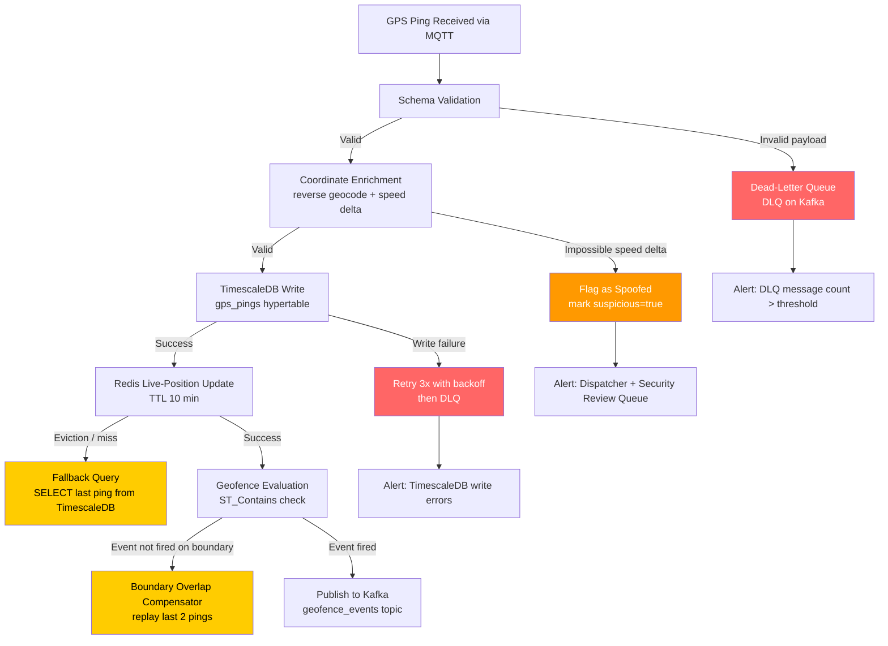

## Vehicle Tracking Edge Cases

This file documents edge cases in the GPS telemetry ingestion pipeline for the Fleet Management System. The pipeline receives MQTT pings from vehicle GPS devices, validates and enriches each payload, writes to TimescaleDB, updates the Redis live-position cache, and evaluates geofence rules. Failures at any stage can cause stale dispatcher maps, missed geofence alerts, incorrect mileage calculations, and compliance gaps in driver HOS records that depend on accurate position timestamps.

## Failure Detection and Recovery Flow

## EC-01: GPS Device Loses Signal in Tunnel or Underground Parking

**Failure Mode:** A vehicle enters a tunnel or underground parking structure and the GPS device stops emitting MQTT pings. The last known position remains in the Redis cache with a stale timestamp. Dispatchers see the vehicle frozen on the map at the tunnel entrance without any indication that contact has been lost.

**Impact:** Dispatchers cannot confirm vehicle location during delivery windows. If the vehicle was en route to an emergency response or time-critical delivery, operators may dispatch a second vehicle unnecessarily. HOS records that derive segment boundaries from GPS events will show an abnormally long dwell at the last ping location, skewing mileage and idle-time reports.

**Detection:** A background worker (`SignalLossMonitor`) queries Redis for all vehicles whose last ping timestamp is older than `GPS_SIGNAL_LOSS_THRESHOLD` (default 5 minutes, configurable per fleet). On detection, the worker writes a `gps_signal_lost` event to the `vehicle_status_events` Kafka topic and updates the vehicle status in PostgreSQL to `signal_lost`. A Prometheus counter `fleet_signal_loss_total` is incremented and a PagerDuty alert fires if more than 5 % of the active fleet loses signal simultaneously (indicating a broker or network issue rather than individual device failure).

**Mitigation:** The dispatcher map renders a distinct "signal lost" icon with an elapsed-time badge (e.g., "Last seen 8 min ago") instead of the frozen vehicle marker. Route ETAs for the vehicle are suspended and the dispatcher is prompted to contact the driver via in-app messaging or phone. The vehicle's last known position, heading, and speed are preserved in Redis with a `signal_lost: true` flag so that if the vehicle emerges and resumes pinging, the map transition is smooth.

**Recovery:** When the device re-establishes MQTT connectivity, the next valid ping clears the `signal_lost` flag automatically. The `SignalLossMonitor` publishes a `gps_signal_restored` event. Redis is updated with the new position and a fresh TTL. HOS log entries that fell in the gap are annotated with `position_source: last_known` so compliance reviewers can identify records that relied on inferred location.

**Prevention:** Configure GPS devices to buffer pings locally when connectivity is lost and replay them in chronological order once the connection resumes. Set the MQTT broker's `persistent_session: true` and `max_queued_messages: 500` per client to absorb brief outages. For fleets operating in known dead zones (specific tunnels, parking structures), pre-configure `expected_outage_zones` in the geofence database so the `SignalLossMonitor` suppresses false alerts for vehicles inside those polygons.

---

## EC-02: GPS Coordinates Are Spoofed or Invalid

**Failure Mode:** A GPS device emits pings with coordinates that are either structurally invalid (latitude outside −90 to 90, longitude outside −180 to 180) or physically impossible (a speed delta that would require the vehicle to have traveled 300 km in 30 seconds between two consecutive pings). Spoofed coordinates may originate from a tampered device firmware, a misconfigured device sending test data in production, or a deliberate attempt to falsify trip records.

**Impact:** Invalid coordinates corrupt mileage calculations, IFTA fuel tax reports, and geofence audit trails. If the spoofed position places a vehicle inside a restricted zone, false geofence alerts may trigger. Conversely, spoofed positions outside a required delivery geofence would falsely mark a delivery as incomplete. FMCSA audits that rely on GPS-corroborated HOS logs are compromised.

**Detection:** The enrichment step computes a `speed_delta_kmh` between the current ping and the previous ping using the Haversine formula and the elapsed time. A configurable `MAX_SPEED_DELTA_KMH` (default 200 km/h for standard trucks, 120 km/h for heavy haul) triggers a `suspicious: true` flag. Coordinate range validation rejects structurally invalid values before enrichment. A Kafka Streams anomaly detector also flags repeated identical coordinates at non-zero reported speed (device firmware freeze).

**Mitigation:** Flagged pings are written to TimescaleDB with `suspicious: true` and routed to a `suspicious_pings` Kafka topic. They are excluded from live dispatch views, mileage calculations, and geofence evaluations. A security review queue surfaces flagged devices to the Fleet Manager. The device's ping rate in the rate limiter is throttled to 1 ping/minute while under review to limit data pollution.

**Recovery:** A Fleet Manager can mark flagged pings as confirmed-invalid or confirmed-valid after manual review. Confirmed-invalid pings are soft-deleted (retained for audit with `deleted: true`). If the issue is a firmware misconfiguration, the device is remotely reconfigured via the MQTT management channel. IFTA and mileage reports are recalculated from the corrected dataset using the `reports.recalculate_vehicle_period` stored procedure.

**Prevention:** Firmware signing and OTA update verification prevent unauthorized firmware modifications. GPS devices should be configured with a maximum reported speed ceiling in hardware. A device enrollment process validates that newly provisioned devices emit valid test pings before being activated in production. TimescaleDB continuous aggregate views for mileage exclude `suspicious: true` pings by default.

---

## EC-03: High-Frequency Ping Flood from Malfunctioning Device

**Failure Mode:** A malfunctioning GPS device begins emitting pings at 1–10 Hz instead of the configured 1-per-30-seconds interval. At 10 Hz, a single device generates 36,000 pings per hour, compared to the normal 120. With 500 vehicles, even 1 % of devices malfunctioning simultaneously produces 1.8 million extra messages per hour, overwhelming the Kafka ingestion topic and degrading TimescaleDB write performance for the entire fleet.

**Impact:** TimescaleDB write latency increases, causing normal-rate vehicles to experience delayed position updates. Kafka consumer lag grows on the `gps_pings` topic, delaying geofence evaluations and HOS segment calculations. Redis memory consumption spikes if the enrichment pipeline caches per-device state at high frequency. MQTT broker CPU utilization rises, potentially causing broker instability that affects all connected devices.

**Detection:** A per-device rate limiter (implemented as a Redis sliding-window counter with key `rate:gps:{vehicle_id}`) enforces a configurable `MAX_PINGS_PER_MINUTE` (default 4, allowing for some network burst). When a device exceeds the threshold, a `rate_limit_exceeded` event is published to the `device_alerts` Kafka topic. A Prometheus gauge `fleet_device_ping_rate_exceeded` tracks the count of devices currently over threshold.

**Mitigation:** Excess pings from a rate-limited device are dropped at the MQTT ingestion layer before reaching Kafka. A circuit breaker (`DeviceCircuitBreaker`) opens after 100 consecutive rate-limit violations within a 5-minute window, routing all further pings from that device to a dead-letter queue. The Fleet Manager receives an in-app notification with the device ID and ping rate. An MQTT `DISCONNECT` command is sent to the device to force a reconnection and configuration reload.

**Recovery:** Once the device has been disconnected, the on-board technician team is notified to inspect or replace the GPS unit. The circuit breaker resets after a 30-minute cooldown if ping rates return to normal. Dead-letter queue messages are inspected; duplicate pings from the flood period are purged, retaining only the first ping per 30-second window to reconstruct a clean position history. Kafka consumer lag is monitored and consumer group scaling (`kubectl scale`) is triggered if lag exceeds 50,000 messages.

**Prevention:** GPS device firmware should enforce a minimum ping interval in hardware with a configurable floor of 10 seconds even if the server instructs a higher frequency. MQTT broker QoS level 0 (fire-and-forget) should be used for GPS pings to reduce broker memory pressure during floods. Device configuration profiles versioned in the device management service enforce correct intervals on enrollment and on every OTA update.

---

## EC-04: GPS Ping Arrives Out of Order

**Failure Mode:** Network latency, cellular handoffs, or device buffering causes GPS pings to arrive at the MQTT broker out of chronological order. A ping with timestamp `T-120s` arrives after a ping with timestamp `T`. The ingestion pipeline, processing messages in Kafka partition order, writes the late ping to TimescaleDB after the newer ping, creating a position history that jumps backward in time when queried.

**Impact:** Mileage calculations that iterate the TimescaleDB `gps_pings` hypertable in time order will double-count the segment between the late ping and its temporal neighbors. Speed delta calculations used for spoofing detection will falsely flag the late ping as an impossible speed change. Geofence entry/exit events derived from ordered position history may fire in the wrong sequence, producing compliance audit records that show a vehicle exiting a zone before entering it.

**Detection:** Each incoming ping is compared against the device's last-processed timestamp stored in Redis (`last_ts:{vehicle_id}`). If the incoming ping's timestamp is more than `LATE_PING_TOLERANCE_SECONDS` (default 60 seconds) behind the last-processed timestamp, it is classified as a late-arriving ping and tagged `out_of_order: true`. A Prometheus histogram `fleet_ping_latency_seconds` tracks the distribution of arrival delays.

**Mitigation:** Late-arriving pings are written to TimescaleDB with `out_of_order: true`. They are excluded from live dispatch position updates (the Redis cache is not overwritten with a stale position) but are retained for historical reconstruction. Mileage and speed-delta calculations use a `ORDER BY ping_timestamp` clause in SQL queries rather than relying on insertion order, so TimescaleDB's time-series partitioning naturally handles the reordering for batch analytics.

**Recovery:** A nightly `PingReorderJob` scans the previous 24 hours of `gps_pings` for any rows marked `out_of_order: true`, re-evaluates geofence events in the corrected temporal sequence, and updates the `vehicle_geofence_events` table. Mileage aggregates in the continuous aggregate views are refreshed by calling `call refresh_continuous_aggregate('vehicle_daily_mileage', ...)` for affected vehicle/date combinations. IFTA reports generated after the nightly job reflect the corrected data.

**Prevention:** GPS devices should use a local buffer with replay-in-order semantics: pings buffered during connectivity loss are transmitted in timestamp order, not transmission order. The MQTT ingestion service should implement a short reorder buffer (500 ms window) using a priority queue keyed on ping timestamp before publishing to Kafka, smoothing out minor network jitter without holding up real-time processing.

---

## EC-05: Vehicle Crosses Geofence Boundary but Event Is Not Fired

**Failure Mode:** A vehicle crosses the boundary of a geofence polygon at high speed or at a shallow angle, and the two consecutive GPS pings that bracket the crossing are both recorded as inside the geofence (or both outside), causing the `ST_Contains` boundary evaluation to miss the transition. This is an edge case of spatial sampling: the event is real but the sampled positions do not capture it.

**Impact:** Delivery confirmation geofences — where a vehicle must enter a customer site polygon to trigger a proof-of-delivery event — will fail silently. The driver's delivery will not be logged, requiring manual dispatcher intervention. Compliance geofences (e.g., "vehicle must not enter restricted zone X") may similarly miss violations. Downstream systems that subscribe to `geofence_events` (billing triggers, automated notifications, HOS segment boundaries) will not fire.

**Detection:** The geofence evaluator computes a `ST_Intersects(ping_segment_linestring, geofence_polygon)` test in addition to the point-in-polygon `ST_Contains` test, where `ping_segment_linestring` is the straight-line segment between the previous and current ping. A `segment_crossing: true` flag is set when the segment test fires but the point test does not, indicating a boundary graze that was missed by point sampling.

**Mitigation:** On `segment_crossing: true`, the evaluator fires a compensating geofence event with `crossing_type: inferred` and the interpolated crossing timestamp derived from linear interpolation along the segment. The event is published to the `geofence_events` Kafka topic with `confidence: inferred` metadata so consuming services can apply appropriate business logic (e.g., accepting inferred delivery confirmations with a supervisor review flag).

**Recovery:** A `GeofenceAuditJob` runs hourly, re-evaluating the last 2 hours of position history using the segment-intersection method for any geofences that have a `high_value: true` classification. Any missed events discovered are published as compensating events with the original inferred timestamp. Downstream billing and compliance consumers implement idempotent event handlers keyed on `vehicle_id + geofence_id + entry_timestamp` to avoid double-processing.

**Prevention:** Reduce the GPS ping interval from 30 seconds to 10 seconds for vehicles in proximity to high-value geofences (within 500 m of a geofence boundary, as detected by `ST_DWithin`). This adaptive sampling narrows the segment length and reduces miss probability. Define geofences with a configurable inward buffer (default 50 m) so that the effective detection zone is slightly larger than the business zone, compensating for GPS accuracy variance.

---

## EC-06: Live Position Cache in Redis Evicted Unexpectedly

**Failure Mode:** The Redis instance serving the live vehicle position cache is configured with a `maxmemory-policy` of `allkeys-lru`. During a period of elevated memory pressure (e.g., a geofence polygon cache warming up, or a session token storm), Redis evicts vehicle position keys before their 10-minute TTL expires. Dispatcher map requests that read from Redis find cache misses for some or all vehicles and either show blank positions or trigger a fallback database query storm.

**Impact:** If the fallback query is not rate-limited, a mass cache eviction event causes a thundering-herd query storm against TimescaleDB. A query storm of 500 concurrent `SELECT max(ping_timestamp), lat, lon FROM gps_pings WHERE vehicle_id = $1 GROUP BY vehicle_id` queries can saturate the connection pool and degrade write performance for the ingestion pipeline. Dispatchers experience a 5–30 second blackout of all vehicle positions on the map.

**Detection:** The `PositionCacheService` tracks a `cache_hit_ratio` Prometheus gauge. A drop below 90 % within a 1-minute window triggers a `CacheEvictionAlert`. The Redis `keyspace_notifications` channel is subscribed to for `expired` and `evicted` events on the `vehicle:position:*` key namespace. A separate Redis memory gauge `redis_used_memory_ratio` alerts at 80 % utilization to provide early warning before evictions begin.

**Mitigation:** The fallback path to TimescaleDB is wrapped in a singleflight/coalesce pattern: multiple concurrent requests for the same `vehicle_id` are deduplicated into a single database query, and the result is broadcast to all waiting callers. This limits fallback concurrency to one query per vehicle regardless of dispatcher count. The result is immediately re-inserted into Redis with a fresh TTL. A `cache:warming` flag in Redis prevents concurrent re-warm requests for the same key.

**Recovery:** A `CacheWarmJob` triggered by the `CacheEvictionAlert` iterates all active vehicles in PostgreSQL and pre-populates Redis position keys from the last TimescaleDB ping within 2 minutes. The warm-up query uses a single `SELECT DISTINCT ON (vehicle_id) ...` scan rather than per-vehicle queries to minimize database load. After warm-up, the cache hit ratio is validated before the alert is cleared.

**Prevention:** Allocate a dedicated Redis instance (or Redis Cluster namespace) for vehicle position data, isolated from session tokens and geofence polygon caches, so that memory pressure in one data domain cannot evict keys from another. Set `maxmemory-policy: volatile-lru` and ensure all vehicle position keys have explicit TTLs, preventing LRU eviction of keys that should be retained. Size the Redis instance to hold positions for `max_fleet_size * 2 KB` with a 50 % headroom buffer.
