# Architecture Diagram — Fleet Management System

## Overview

The Fleet Management System is built on a cloud-native, event-driven microservices architecture deployed on AWS EKS. Every service owns its data store, communicates asynchronously through Apache Kafka, and is independently deployable via Helm charts managed by ArgoCD. A Kong API Gateway provides the single entry point for all external consumers: the React web dashboard, the React Native driver app, third-party TMS integrations, and GPS/ELD hardware devices.

The architecture is designed to handle:
- **50,000+ GPS pings per second** from a global vehicle fleet
- **Sub-200ms WebSocket push latency** for live map updates
- **100% FMCSA ELD compliance** with tamper-evident HOS logs
- **99.9% uptime SLO** with automatic failover across two AWS regions

---

## Full System Architecture

```mermaid
graph TB
    subgraph "Clients"
        WebApp["React Dashboard\nFleet Manager / Dispatcher\n(Vite + TypeScript)"]
        MobileApp["React Native App\nDriver Mobile\n(iOS + Android)"]
        ELDDevice["GPS/ELD Hardware\nCellular MQTT\n(15-sec telemetry)"]
        ThirdParty["Third-Party TMS\nWebhook consumers\nREST API clients"]
    end

    subgraph "Edge & Entry"
        CloudFront["CloudFront CDN\nStatic assets + SPA\nEdge cache"]
        WAF["AWS WAF\nRate limiting\nGeo-block / IP allow-list"]
        ALB["Application Load Balancer\nTLS termination\nHTTP/2"]
        IoTCore["AWS IoT Core\nMQTT broker\nDevice cert auth"]
    end

    subgraph "API Gateway Layer"
        Kong["Kong API Gateway\nJWT auth, rate limiting\nRequest routing\nAPI key management"]
        WSGateway["WebSocket Gateway\nLive position push\nAlert broadcast\nRoom-based subscriptions"]
    end

    subgraph "Core Microservices"
        VehicleTrackingSvc["VehicleTrackingService (Go)\nGPS frame parsing\nTelemetry enrichment\nGeofence evaluation\n50k pings/sec"]
        MaintenanceSvc["MaintenanceService (Node)\nWork order lifecycle\nPredictive engine\nDVIR processing\nParts inventory"]
        DriverSvc["DriverService (Node)\nDriver profile CRUD\nHOS log management\nELD sync\nDriver scoring"]
        RouteSvc["RouteService (Node)\nVRP solver (OR-Tools)\nOSRM integration\nETA recalculation\nGeofence auto-create"]
        AlertingSvc["AlertingService (Node)\nRule evaluation\nCooldown dedup\nMulti-channel notify\nEscalation engine"]
        FuelSvc["FuelService (Node)\nTransaction ingestion\nTheft detection\nIFTA mileage calc\nFuel card sync"]
        ComplianceSvc["ComplianceSvc (Node)\nHOS violation detection\nIFTA report generation\nELD mandate enforcement"]
        ReportingSvc["ReportingSvc (Node)\nScheduled report jobs\nOn-demand analytics\nCSV / PDF / XLSX export"]
        AuthSvc["AuthService (Node)\nJWT issuance\nOAuth 2.0 / OIDC\nRBAC enforcement\nMulti-tenant isolation"]
        NotificationSvc["NotificationService (Node)\nFCM push (mobile)\nSMS via Twilio\nEmail via SES\nWebhook delivery"]
    end

    subgraph "Event Streaming"
        Kafka["Apache Kafka (AWS MSK)\n3-broker cluster\nkafka.m5.2xlarge\nTopics partitioned by vehicle_id"]
        KafkaTopics["Key Topics\n• prod.telemetry.gps.raw\n• prod.telemetry.gps.enriched\n• prod.alerts.triggered\n• prod.maintenance.work-order.updated\n• prod.operations.route.assigned\n• prod.compliance.hos.updated\n• prod.audit.events"]
    end

    subgraph "Data Stores"
        PostgreSQL["PostgreSQL 16 (RDS Aurora)\nPrimary OLTP database\nVehicles, Drivers, Trips\nGeofences, Alerts, Routes\nRow-level tenant security"]
        TimescaleDB["TimescaleDB\nGPS ping hypertable\nChunk: 1 hour\n90-day full resolution\n2-year hourly aggregates"]
        Redis["Redis 7 (ElastiCache)\nCluster mode\nLive positions (30s TTL)\nSession tokens\nRate limit counters\nGeofence breach state"]
        Elasticsearch["Elasticsearch 8\nDriver/vehicle full-text search\nMaintenance notes search\nIncident report search"]
        Redshift["Amazon Redshift\nAnalytics data warehouse\nFact tables: trips, fuel, maint\nBI & reporting queries"]
        S3["Amazon S3\nDVIR photos, dashcam clips\nInsurance documents\nGPS Parquet archives\nIFTA PDF exports"]
    end

    subgraph "External Services"
        MapboxAPI["Mapbox API\nMap tiles & geocoding\nReverse geocoding pings"]
        HEREApi["HERE Traffic API\nReal-time traffic feed\nIncident data"]
        FuelCardAPI["Fuel Card API\n(WEX / Comdata / Fleetcor)\nTransaction sync"]
        ELDProvider["ELD Provider API\n(Geotab / Samsara / KeepTruckin)\nCertified HOS data"]
        RoadsideAPI["Roadside Assistance API\n(NSD / Agero)\nBreakdown dispatch"]
        TwilioAPI["Twilio\nSMS notifications\nDriver phone alerts"]
        SESAPI["AWS SES\nTransactional email\nScheduled reports"]
    end

    subgraph "Infrastructure & Observability"
        Prometheus["Prometheus\nMetrics scraping\nSLO recording rules"]
        Grafana["Grafana\nService dashboards\nFleet ops dashboard"]
        Jaeger["Jaeger\nDistributed tracing\nKafka span correlation"]
        PagerDuty["PagerDuty\nOn-call alerting\nEscalation policies"]
        ArgoCD["ArgoCD\nGitOps deployment\nHelm chart sync"]
        Terraform["Terraform\nIaC for all AWS resources\nRemote state in S3"]
    end

    ELDDevice --> IoTCore
    IoTCore --> VehicleTrackingSvc
    WebApp --> CloudFront
    CloudFront --> WAF
    WAF --> ALB
    ALB --> Kong
    ALB --> WSGateway
    MobileApp --> Kong
    ThirdParty --> Kong

    Kong --> VehicleTrackingSvc
    Kong --> MaintenanceSvc
    Kong --> DriverSvc
    Kong --> RouteSvc
    Kong --> AlertingSvc
    Kong --> FuelSvc
    Kong --> ComplianceSvc
    Kong --> ReportingSvc
    Kong --> AuthSvc

    VehicleTrackingSvc --> Kafka
    MaintenanceSvc --> Kafka
    DriverSvc --> Kafka
    RouteSvc --> Kafka
    AlertingSvc --> Kafka
    FuelSvc --> Kafka
    ComplianceSvc --> Kafka

    Kafka --> KafkaTopics
    Kafka --> AlertingSvc
    Kafka --> NotificationSvc
    Kafka --> DriverSvc
    Kafka --> ReportingSvc

    VehicleTrackingSvc --> TimescaleDB
    VehicleTrackingSvc --> Redis
    MaintenanceSvc --> PostgreSQL
    DriverSvc --> PostgreSQL
    RouteSvc --> PostgreSQL
    AlertingSvc --> PostgreSQL
    FuelSvc --> PostgreSQL
    ComplianceSvc --> PostgreSQL
    ReportingSvc --> Redshift
    AuthSvc --> Redis
    VehicleTrackingSvc --> Elasticsearch

    WSGateway --> Redis

    VehicleTrackingSvc --> MapboxAPI
    RouteSvc --> HEREApi
    FuelSvc --> FuelCardAPI
    DriverSvc --> ELDProvider
    MaintenanceSvc --> RoadsideAPI
    NotificationSvc --> TwilioAPI
    NotificationSvc --> SESAPI

    MaintenanceSvc --> S3
    ComplianceSvc --> S3
    ReportingSvc --> S3

    Prometheus --> Grafana
    Grafana --> PagerDuty
    VehicleTrackingSvc --> Jaeger
    Kong --> Jaeger
```

---

## Service Responsibility Matrix

| Service | Primary Responsibility | Owns Database | Key Kafka Topics |
|---|---|---|---|
| VehicleTrackingService | GPS ingestion, geofence eval, live position cache | TimescaleDB, Redis | `telemetry.gps.*` |
| MaintenanceService | Work orders, DVIR, predictive maintenance, parts | PostgreSQL `maintenance_*` | `maintenance.work-order.*` |
| DriverService | Driver CRUD, HOS logs, ELD sync, driver scoring | PostgreSQL `drivers_*` | `compliance.hos.*` |
| RouteService | VRP optimization, route assignment, ETA calc | PostgreSQL `routes_*` | `operations.route.*` |
| AlertingService | Rule eval, cooldown, multi-channel notify | PostgreSQL `alerts_*` | `alerts.*` |
| FuelService | Fuel transactions, theft detection, IFTA mileage | PostgreSQL `fuel_*` | `fuel.*` |
| ComplianceService | HOS violation detection, IFTA report gen, ELD | PostgreSQL `compliance_*` | `compliance.*` |
| ReportingService | Scheduled reports, on-demand analytics | Redshift (read) | — |
| AuthService | JWT auth, RBAC, multi-tenant isolation | PostgreSQL `auth_*` | `auth.token.*` |
| NotificationService | FCM, SMS, email, webhooks | PostgreSQL `notifications_*` | Consumes `alerts.*` |

---

## Communication Patterns

### Synchronous (REST via Kong)
Used for: user-facing CRUD operations, report requests, authentication flows, device registration.

All REST calls traverse Kong, which validates the JWT, enforces per-tenant rate limits, and routes to the correct service replica using Kubernetes ClusterIP DNS.

### Asynchronous (Kafka Events)
Used for: GPS telemetry processing, alert fanout, HOS status propagation, report generation triggers, audit logging.

Kafka topics are partitioned by `vehicle_id` to preserve per-vehicle ordering guarantees. Consumer groups allow independent scaling of each downstream service without message loss.

### Real-Time Push (WebSocket)
The WebSocket Gateway maintains persistent connections to dashboard and mobile clients. Live vehicle positions are emitted from the VehicleTrackingService enriched-topic consumer to Redis pub/sub channels, which the WebSocket Gateway fans out to subscribed room members (one room per tenant).

---

## Technology Stack Summary

| Layer | Technology | Version | Rationale |
|---|---|---|---|
| GPS Ingestion | Go 1.22 | — | 50k pings/sec; low-latency binary parsing |
| Core Services | Node.js 20 + TypeScript + NestJS | — | Rich ecosystem, DI framework, shared types |
| Web Dashboard | React 18 + Vite + Mapbox GL | — | Component reuse, fast HMR, hardware-accelerated map |
| Driver App | React Native 0.74 (Expo 51) | — | Single codebase, offline-first, background location |
| Primary DB | PostgreSQL 16 (RDS Aurora) | — | ACID, PostGIS, row-level security |
| Time-Series DB | TimescaleDB 2.x | — | GPS hypertable, continuous aggregates |
| Cache | Redis 7 (ElastiCache Cluster) | — | Sub-ms live positions, session store |
| Event Bus | Apache Kafka 3.7 (MSK) | — | Durable ordered log, exactly-once GPS ingest |
| Search | Elasticsearch 8 | — | Full-text driver/vehicle search |
| Analytics DW | Amazon Redshift | — | Petabyte-scale fleet reporting |
| Orchestration | Kubernetes (EKS) | — | Auto-scaling GPS pods, GitOps deployments |
| IaC | Terraform 1.8 + Helm 3 | — | Reproducible multi-region infra |
