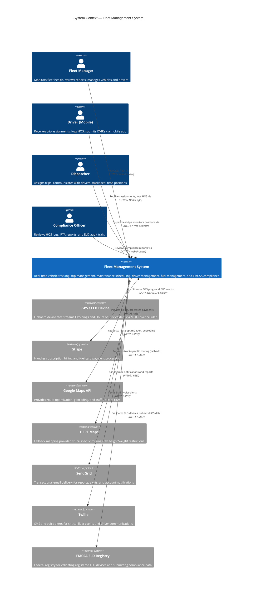

# C4 Context & Container Diagrams

## Overview

The Fleet Management System is a cloud-native, multi-tenant SaaS platform that enables logistics companies, transportation operators, and municipal fleets to manage vehicles, drivers, routes, maintenance schedules, and regulatory compliance from a single operational hub. It ingests real-time GPS telemetry from thousands of connected vehicles via MQTT, processes it through a stream-processing pipeline, and surfaces actionable intelligence to fleet managers, dispatchers, drivers, and compliance officers through web and mobile interfaces.

The system integrates with external mapping providers for route intelligence, payment processors for subscription and fuel-card billing, communication platforms for alert delivery, and regulatory bodies for ELD compliance verification. Its architecture is designed for horizontal scalability to handle fleets ranging from 10 to 50,000 vehicles, with strict data isolation between tenants enforced at the database row level.

---

## System Context Diagram

---

## Container Diagram

```mermaid
C4Container
    title Container Diagram — Fleet Management System

    Person(fleetManager, "Fleet Manager / Dispatcher / Compliance Officer", "Web users")
    Person(driver, "Driver", "Mobile app user")

    System_Boundary(fms, "Fleet Management System") {
        Container(webApp, "Web Application", "React + TypeScript", "Single-page app served via CloudFront; dashboard, maps, reports, admin")
        Container(mobileApp, "Mobile App", "React Native", "Driver app: trip feed, HOS logging, DVIR submission, messaging")
        Container(apiGateway, "API Gateway", "Kong", "Auth (JWT/OAuth2), rate limiting, request routing, TLS termination")

        Container(trackingService, "Tracking Service", "Node.js / TypeScript", "Ingests GPS telemetry via MQTT, maintains live positions, detects geofence/speed events")
        Container(tripService, "Trip Service", "Node.js / TypeScript", "Manages trip lifecycle: create, assign, start, end; calculates HOS impact")
        Container(maintenanceService, "Maintenance Service", "Node.js / TypeScript", "Schedules PMs, processes DVIRs, tracks service history")
        Container(driverService, "Driver Service", "Node.js / TypeScript", "Driver profiles, qualifications, scores, HOS enforcement")
        Container(fuelService, "Fuel Service", "Node.js / TypeScript", "Fuel transactions, MPG analytics, cost reporting")
        Container(complianceService, "Compliance Service", "Node.js / TypeScript", "ELD sync, IFTA reporting, document expiry, audit trail")
        Container(reportingService, "Reporting Service", "Node.js / TypeScript", "Generates fleet KPI reports, exports CSV/PDF, scheduled delivery")
        Container(alertService, "Alert Service", "Node.js / TypeScript", "Evaluates alert rules against Kafka events, emits alert records")
        Container(notificationService, "Notification Service", "Node.js / TypeScript", "Dispatches notifications via SendGrid and Twilio")

        ContainerDb(postgres, "PostgreSQL 15", "AWS RDS", "Operational data: vehicles, drivers, trips, maintenance, fuel records")
        ContainerDb(timescaledb, "TimescaleDB", "EC2 (self-managed)", "Time-series GPS pings, speed history, engine telemetry")
        ContainerDb(redis, "Redis 7", "AWS ElastiCache", "Live vehicle positions, session cache, rate-limit counters")
        ContainerDb(kafka, "Apache Kafka", "AWS MSK", "Event bus: GPS events, trip events, alert events, compliance events")
        Container(mqttBroker, "MQTT Broker", "AWS IoT Core", "Manages TLS device connections; bridges GPS/ELD streams into Kafka")
    }

    System_Ext(gpsEld, "GPS / ELD Device", "Onboard hardware")
    System_Ext(googleMaps, "Google Maps API", "External")
    System_Ext(sendgrid, "SendGrid", "External")
    System_Ext(twilio, "Twilio", "External")
    System_Ext(stripe, "Stripe", "External")
    System_Ext(fmcsa, "FMCSA ELD Registry", "External")

    Rel(fleetManager, webApp, "Uses", "HTTPS")
    Rel(driver, mobileApp, "Uses", "HTTPS")
    Rel(webApp, apiGateway, "API calls", "HTTPS / REST + WebSocket")
    Rel(mobileApp, apiGateway, "API calls", "HTTPS / REST")
    Rel(gpsEld, mqttBroker, "Publishes GPS pings", "MQTT over TLS")

    Rel(apiGateway, trackingService, "Routes telemetry queries", "HTTP/2")
    Rel(apiGateway, tripService, "Routes trip operations", "HTTP/2")
    Rel(apiGateway, maintenanceService, "Routes maintenance ops", "HTTP/2")
    Rel(apiGateway, driverService, "Routes driver ops", "HTTP/2")
    Rel(apiGateway, fuelService, "Routes fuel ops", "HTTP/2")
    Rel(apiGateway, complianceService, "Routes compliance ops", "HTTP/2")
    Rel(apiGateway, reportingService, "Routes report requests", "HTTP/2")

    Rel(mqttBroker, kafka, "Bridges device events", "Kafka Producer")
    Rel(trackingService, kafka, "Consumes GPS events, publishes alerts", "Kafka")
    Rel(trackingService, timescaledb, "Writes GPS pings", "TCP / SQL")
    Rel(trackingService, redis, "Updates live positions", "Redis SET")
    Rel(tripService, postgres, "Reads/writes trip data", "TCP / SQL")
    Rel(tripService, kafka, "Publishes TripStarted / TripEnded events", "Kafka")
    Rel(maintenanceService, postgres, "Reads/writes maintenance records", "TCP / SQL")
    Rel(driverService, postgres, "Reads/writes driver data", "TCP / SQL")
    Rel(alertService, kafka, "Consumes all domain events", "Kafka")
    Rel(alertService, postgres, "Writes alert records", "TCP / SQL")
    Rel(notificationService, kafka, "Consumes AlertCreated events", "Kafka")
    Rel(notificationService, sendgrid, "Sends emails", "HTTPS")
    Rel(notificationService, twilio, "Sends SMS", "HTTPS")
    Rel(complianceService, fmcsa, "Syncs ELD data", "HTTPS")
    Rel(reportingService, postgres, "Reads aggregated data", "TCP / SQL")
    Rel(reportingService, timescaledb, "Reads GPS history", "TCP / SQL")
    Rel(tripService, googleMaps, "Route optimization", "HTTPS")
    Rel(fuelService, stripe, "Processes payments", "HTTPS")
```

---

## Container Descriptions

| Container | Technology | Responsibility | Team Owner |
|---|---|---|---|
| Web Application | React 18, TypeScript, Vite | Fleet dashboard, live map, reports, admin panel, driver management UI | Frontend Team |
| Mobile App | React Native 0.73, Expo | Driver trip feed, HOS clock, DVIR forms, push notifications | Mobile Team |
| API Gateway | Kong 3.x on EKS | JWT validation, OAuth2, rate limiting, request routing, TLS termination | Platform Team |
| Tracking Service | Node.js 20, TypeScript | MQTT telemetry ingestion, GPS validation, live position cache, geofence/speed violation detection | Tracking Team |
| Trip Service | Node.js 20, TypeScript | Trip CRUD, lifecycle events, route calculation, HOS impact assessment | Dispatch Team |
| Maintenance Service | Node.js 20, TypeScript | PM scheduling by mileage/calendar, DVIR processing, service alert publishing | Maintenance Team |
| Driver Service | Node.js 20, TypeScript | Driver onboarding, CDL/medical cert tracking, HOS enforcement, scoring | Driver Team |
| Fuel Service | Node.js 20, TypeScript | Fuel card transactions, MPG computation, cost-per-mile analytics | Finance Team |
| Compliance Service | Node.js 20, TypeScript | ELD device sync with FMCSA, IFTA quarterly reports, document expiry monitor | Compliance Team |
| Reporting Service | Node.js 20, TypeScript | KPI report generation, PDF/CSV export, scheduled email delivery | Analytics Team |
| Alert Service | Node.js 20, TypeScript | Rule-based alert evaluation on Kafka stream, alert persistence | Platform Team |
| Notification Service | Node.js 20, TypeScript | Multi-channel notification dispatch (email, SMS, push) | Platform Team |
| PostgreSQL 15 | AWS RDS Multi-AZ | Operational relational data; tenants, vehicles, drivers, trips, maintenance | Data Team |
| TimescaleDB | EC2 r6g.2xlarge | Time-series GPS pings and telemetry; hypertable partitioned by `device_id, time` | Data Team |
| Redis 7 | AWS ElastiCache cluster | Live vehicle positions (TTL 90s), session tokens, Kafka offset cache | Platform Team |
| Apache Kafka | AWS MSK 3.6 | Ordered event log for all domain events; topics per aggregate type | Platform Team |
| MQTT Broker | AWS IoT Core | TLS device authentication, MQTT topic routing, Kafka bridge via IoT Rules | IoT Team |

---

## Key Architectural Decisions

| Decision | Choice | Alternatives Considered | Rationale |
|---|---|---|---|
| GPS ingestion protocol | MQTT via AWS IoT Core | HTTP polling, WebSocket, CoAP | MQTT is purpose-built for constrained IoT devices with unreliable cellular connections; QoS levels 1/2 guarantee delivery without client-side retry logic; AWS IoT Core manages millions of concurrent device connections with built-in TLS certificate auth |
| Time-series storage | TimescaleDB on EC2 | InfluxDB, Amazon Timestream, raw PostgreSQL | TimescaleDB extends PostgreSQL so existing query patterns and tooling apply; hypertable compression achieves 90–95% space reduction on aged GPS data; continuous aggregates replace expensive GROUP BY time-bucket queries on dashboards |
| Event bus | Apache Kafka (AWS MSK) | RabbitMQ, AWS SNS/SQS, Redis Streams | Kafka provides durable ordered log replay, which is critical for audit trails and replaying GPS data to reconstruct trips; consumer group semantics allow the Alert Service and Notification Service to process the same events independently; MSK removes Kafka operational burden |
| Multi-tenancy isolation | PostgreSQL row-level security (RLS) | Separate schema per tenant, separate database per tenant | RLS enforces tenant isolation at the database engine level, preventing cross-tenant data leakage even from application bugs; a single schema keeps migrations simple and avoids N-database connection pool fragmentation; performance impact is negligible with proper indexing on `tenant_id` |
| Live position cache | Redis (ElastiCache) | PostgreSQL materialized view, DynamoDB | Sub-millisecond reads for live map renders; a `HSET vehicle:{id} lat lon heading speed updated_at` pattern fits naturally in Redis hash; TTL of 90 seconds auto-expires stale positions without a cron job; ElastiCache cluster mode supports horizontal read scaling |
| Service mesh | Istio (sidecar) | Linkerd, AWS App Mesh, no mesh | mTLS between all services is mandatory for compliance; Istio provides circuit breaking, retries, and distributed tracing (Jaeger) without application code changes; service-to-service authorization policies are enforced at the proxy layer |
